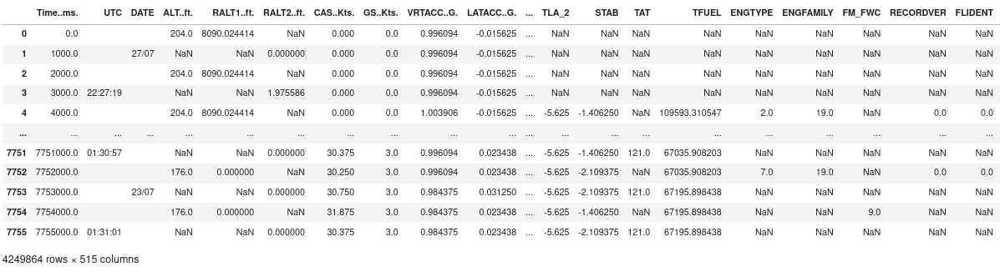
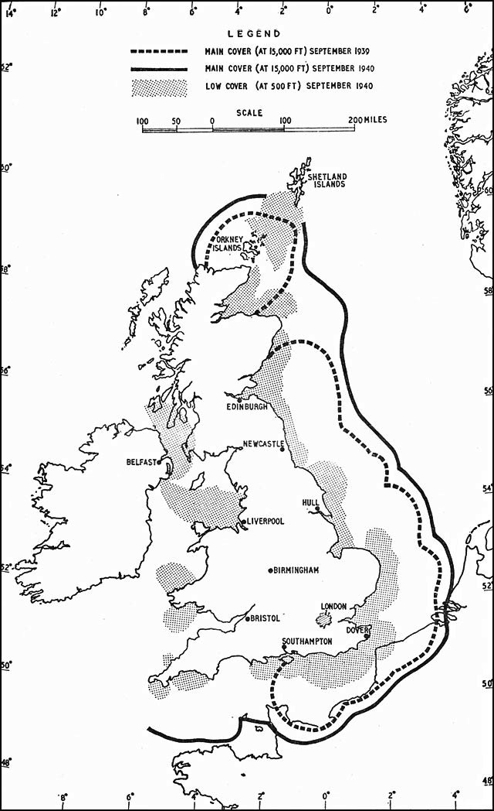

# Trajectories

A trajectory is a mathematical abstraction used to describe the evolution of a moving object with a finite list of parameters. The most common features in aviation include latitude, longitude, altitude, all indexed by time, with derived ones such as ground speed, track angle and vertical rate.
Depending on the application, some models would expect more features. For example, flight dynamics models could include pitch, roll and yaw angles, indicated airspeed, Mach number, etc.

This chapter describes several common formats for trajectories depending on available technology to record them. Associated data sources come with different licensing terms which must be kept in mind when developping or applying computing methods.

## Common formats for aircraft trajectory data

### Quick Access Recorders (QAR)

Aircraft carry an airborne flight recorder to provide quick access to raw flight data. Use cases for such data range from flight operational quality assurance (FOQA), post-ops analysis to improve flight safety or operational efficiency, system analysis for predictive or condition-based maintenance. QAR data typically contains over 2000 flight parameters.

::: { .infobox .info }
Trajectory records usually have a different sampling rate depending on the feature. IEEE354 defines a particular floating point number called `NaN` (not a number) useful for marking missing values. Integers usually do not have such equivalent, so it is common to find *saturated values* (255 for 8-bit integers) to mark missing values.
:::

Airlines, not manufacturers, own the data of the aircraft they operate. These days, manufacturers tend to sell cloud services to store and analyse data of the aircraft they sell.

### Radar tracks

Radars (stands for *Radio Detection and Ranging*) use radio waves to determine the distance and angle of objects. They were first introduced as part of the *Britannic Anti-Aircraft Defence System*: the first station was set up in 1937 and went operational in 1938. Radars have been used in civil aviation after the second World War.

Secondary Surveillance Radars (SSR) are able to communicate with aircraft they detect to *identify* them.

Based on the radar plots, computer systems usually produce tracks containing an identifier, a timestamp (in seconds since midnight on the picture below), latitude, longitude (commonly in degrees), altitude (commonly in ft). Groundspeed (in knots), vertical speed (in ft/mn) and track angle are easy to compute. Kalman filters are commonly applied to the raw output of radar tracks in order to produce a smooth trajectory.

::: { .infobox .info }
There is a common confusion in aviation between three designations for angles:

- the *track angle* represents the direction the aircraft is flying. It is the angle of the speed vector, ranging from 0 (North) to 360 degrees (90° for East, 270° for West);
- the *heading angle* represents the direction the nose the aircraft is pointing at;
- the *bearing angle* usually represents the direction of/to a static object, e.g. the bearing of a runway, or the bearing to a navigational point.
:::

ANSP (TODO define) own the data for the radar installations they operate.

### Mode A/C, ADS-B and Mode S

TODO Would intro by Junzi fit in here? or is too complicated?

## Metadata

A number of flight information is usually not directly accessible from settings recording aircraft trajectories. Metadata usually refers to any additional information enriching a trajectory.
Enriching trajectories with relevant information is usually a costly process, and access to such information can be complicated.

The most common identifier for aircraft in radar based technologies would be the identifier of the transponder: a six-digit hexadecimal identifier which classically identifies an aircraft. Useful metadata would include

| feature      | description                                   |
| ------------ | --------------------------------------------- |
| registration | The tail number of an aircraft, e.g. `F-HNAV` |
| typecode     | The aircraft type, e.g. `A321`                |
| age          |                                               |
| owner        |                                               |
| manufacturer |                                               |
| operator     |                                               |

::: {.infobox .todo}

- equivalence between N-codes and icao codes
- icao ranges per country, tail number patterns per country

:::

A call sign is an eight-character identifier used for communication with the ATC. General aviation commonly uses the aircraft registration (tail number) as a call sign; commercial flights use a unique identifier per route, starting with three letters identifying the airline operator, BAW for British Airways, AFR for Air France, etc. Call signs commonly refer to the mission operated by an aircraft, and this can help distinguish the original intention of an aircraft used for specific purposes.

For example, F-HNAV uses the CALIBRA call sign for VOR/ILS calibration operations, the JAMMING call sign during jamming investigation and a regular NAK call sign when commuting between airfields. Similarly, test flights operated by Airbus use an AIB call sign; Boeing uses a BOE call sign; ambulance helicopters often use explicit call signs: SAMU in France (stands for Urgent Medical Aid Service) and LIFEin many European countries. Australian firefighting operations use a specific call sign depending on the role of the aircraft during the operations: BMBR for fire bombing; SPTR for fire spotters; BDOG, bird dog, for fire attack supervisions (often subcontracted); and FSCN, firescan for remote sensing fire operations.

Metadata associated with callsigns (and posssibly dates) include:

| feature  | description                                      |
| -------- | ------------------------------------------------ |
| callsign | the ICAO code, e.g. `AFR82BY`                    |
| number   | the commercial IATA flight number, e.g. `AF6103` |
| ADEP     | aeroport of departure, e.g. `LFBO`               |
| ADES     | aeroport of destination, e.g. `LFPO`             |
| EOBT     | estimated off-block time                         |
| ETOT     | estimated take-off time                          |

## Flight plans

Example: N0441F340 FISTO5B FISTO UY156 PERIG UT210 TUDRA/N0426F280 UT158 AMB AMB9W

## Flight lists

### DDR2 `exp2`

The traffic demand file (exp2) can obtained from the EUROCONTROL’s Demand Data Repository
(DDR2) for a selected period of time (typically one day) and geographic area (e.g. FABEC).
The `exp2` includes, for each flight, basic information about the departure time,
the origin and destination airports, a unique flight identifier, the callsign,
the aircraft ICAO code (e.g. A320) and the requested flight level by the airspace user as
submitted in the flight plan.

### OSN Flight Table

::: {.infobox .tip}
Why not?
:::

## Flight trajectories

EUROCONTROL's Network Manager has devised different flight trajectories
formats in order to store and exchange information with the aviation community.

In the following sections we will cover the most known ones: M1 & M3 and SO6.

They are a mix of flight information and trajectory.

### Model 1 (M1 or *FTFM*)

The flight trajectory known as *Model 1*, *M1* or *Filed Tactical Flight Model (FTFM)* is a
mathematical model containing a point and airspace volume profile created in ETFMS for a flight.
This trajectory is first created when Flight Plan (FP) details, and any subsequent changes,
are received by the Network Operations of EUROCONTROL's
Network Manager^[Aircraft Operators (AO) willing to fly IFR flights in the Network Manager (NM)
area of responsibility are mandated to file the relevant Flight Plan to the Network Manager.
The aim of this centralised management of FP's in Europe is linked to one of the NM mandates, i.e.
the ability to detect imbalance between demand (willingness to fly by AO's) and
offer (ability to guarantee safety by ATC / airport capacity providing an adequate level of safety).
The NM provides the ACC's/airports to monitor the situation and implement measures to resolve
the overload (typically via departure delays or rerouting.)].

The M1 is a translation of a FP (especially Field 15) to a point profile, i.e. a
sequence of 4D positions (timestamp + longitude, latitude, altitude) plus relevant penetrated airspace ID's,
calculated taking into account the aircraft type performance (via BADA) and the environment restrictions
as published in the [Route Availability Document (RAD)][rad].

[rad]: https://www.nm.eurocontrol.int/RAD/ "Rote Availability Document (RAD)"

::: {.infobox .note}
TODO:

1. add CSV file with sample M1 data in `data/` folder
1. Add small sample of data frame for M1
2. Plot M1
:::

### Model 2 (M2 or *RTFM*)

### Model 3 (M3 or *CTFM*)

The flight trajectory known as *Model 3*, *M3* or *Current Tactical Flight Model (CTFM)* is an
updated version of the M1 model where the point/airspace profile is recalculated taking into account
surveillance data (*Correlated Position Reports* [CPR]^[CPRs are received by NM from ACC's,
they consist of surveillance data (callsign longitude, latitude, altitude, timestamp) paired
with flight plan info (aircraft type, ICAO 24-bit address)] or more recently
ADS-B position reports)
when these show a significant deviation from M1 (or M2 which is an M1-like
trajectory calculated in case of delayed flight).
The deviation considered is of 1 min in time, more than 400 feet in en-route phase,
more than 1000 feet in climb/descent phase or more than 10 NM laterally,
see 14.3.1 [@niarchakou_simonselva17].

::: {.infobox .note}
TODO:

1. add CSV file with sample M3 data in `data/` folder
1. Add small sample of data frame for M3
2. Plot M3 and M1/M3 overlapped to show the differences
:::

### SO6

### ALL_FT+

TODO this part could help?

Data for a trajectory refer typically to a point profile and can
include:

* flight ID / flight number / callsign
* sequence number
* timestamp
* position (longitude, latitude, altitude)
* position ID (i.e. published point ID)
* airspace ID
* (ground / vertical) speed

with timestamp and position as a minimum.
