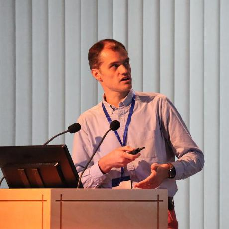

# Authors {.unnumbered}

[Xavier Olive](https://www.xoolive.org/)\
*Toulouse* 🇫🇷\
[xo\@example.com](mailto:xo@example.com){.email}

[Manuel Waltert](http://example.com/)\
*Winterthur* 🇨🇭\
[mw\@example.com](mailto:mw\@example.com){.email}

[Enrico Spinielli](http://example.com/)\
*Brussels* 🇧🇪\
[es\@example.com](mailto:es\@example.com){.email}

[Junzi Sun](http://example.com/)\
*Delft* 🇳🇱\
[js\@example.com](mailto:js@example.com){.email}

## Xavier Olive {.unnumbered}

Xavier Olive is a senior research scientist at [ONERA, the French Aerospace Lab](https://www.onera.fr/en), in Toulouse, and is affiliated with Université de Toulouse. He graduated from ISAE-SUPAERO and holds a PhD from Kyoto University as well as a French *habilitation à diriger des recherches* (HDR). His work focuses on data-driven methods and machine learning for aviation systems, including trajectory analysis and generation, anomaly detection, optimisation, predictive maintenance, environmental impact assessment, and the cybersecurity of aviation surveillance systems.

He is active in the open aviation data community and contributes to research infrastructure for reproducible aviation analysis. He is the main author of the open-source [traffic](https://traffic-viz.github.io/) [@traffic] Python library for trajectory and airspace analysis, contributes to the [OpenSky Network](https://opensky-network.org/) research ecosystem, and is also the author of [Programmation Python avancée](https://www.xoolive.org/python/) with Dunod editions.

## Manuel Waltert {.unnumbered}

Tincidunt orci hac accumsan vel odio convallis dictum sodales ac maecenas placerat rhoncus rutrum felis ut id placerat praesent ultrices himenaeos urna dictum pretium convallis erat venenatis tortor inceptos ut suscipit senectus malesuada.

## Enrico Spinielli {.unnumbered}

Tincidunt orci hac accumsan vel odio convallis dictum sodales ac maecenas placerat rhoncus rutrum felis ut id placerat praesent ultrices himenaeos urna dictum pretium convallis erat venenatis tortor inceptos ut suscipit senectus malesuada.

## Junzi Sun {.unnumbered}

Scelerisque metus nisi tristique eleifend diam neque dignissim leo dis purus felis a et sollicitudin nulla lobortis eleifend dapibus montes maecenas metus proin ultricies imperdiet litora ultrices pharetra mauris senectus neque potenti potenti duis?
