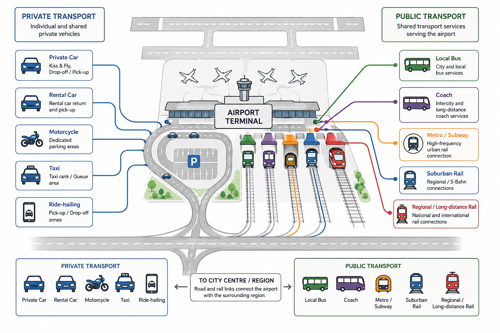

Aerodrome ground access comprises all transport infrastructure and services that connect an airport with its surrounding region. It enables passengers, employees, visitors, suppliers, and freight operators to travel between the airport and their origin or destination. Consequently, ground access forms the interface between the airport and the regional transport system.

At many airports, the quality of the ground access system is just as important for the overall passenger experience as the processes inside the terminal. Even a highly efficient passenger building cannot compensate for congested access roads, insufficient public transport, or inadequate parking facilities. Ground access therefore influences passenger satisfaction, airport attractiveness, and ultimately the competitiveness of an airport.

From an operational perspective, the ground access system must accommodate several user groups with different travel characteristics:

 * **Passengers**, arriving at and departing from the airport.
 * **Airport employees**, who commute to and from work, often during early morning or late-night hours.
 * **Visitors**, including people meeting or accompanying passengers.
 * **Commercial vehicles**, such as taxis, ride-hailing services, hotel shuttles, buses, and coaches.
 * **Service vehicles**, including catering, maintenance, cleaning, waste collection, fuel suppliers, and other airport logistics.

Each user group places different demands on the infrastructure. Passengers generally prioritise short travel times, reliability, and convenient access to the terminal, whereas employees often require affordable long-term parking or good public transport connections. Commercial and service vehicles require efficient circulation routes and dedicated loading or waiting areas.

The objective of airport ground access planning is therefore not simply to provide sufficient road capacity. Instead, it aims to create an integrated transport system that offers safe, reliable, and sustainable access while minimising congestion, environmental impacts, and conflicts between different transport modes.

## Transport modes
Airports are connected to their surrounding region by a combination of transport modes. Depending on airport size, geographical location, and national transport policy, different modes contribute to the overall accessibility of the airport. @fig-ground-access-overview illustrates the principal transport modes typically serving a modern airport.

The available transport modes can generally be divided into two categories:

 * **Private transport**, including private cars, rental cars, motorcycles, taxis, and ride-hailing services.
 * **Public transport**, including buses, coaches, metro systems, suburban railways, regional railways, and long-distance rail services.

Historically, airports relied primarily on private cars. As passenger numbers increased, however, road congestion, limited parking capacity, and environmental concerns encouraged airports to improve public transport accessibility. Today, many large international airports are directly connected to regional and national rail networks, while buses and coaches complement these services by connecting destinations that are not served by rail.

The relative importance of each transport mode depends strongly on the airport's catchment area, local transport infrastructure, and governmental transport policy. Airports located close to city centres often achieve high public transport shares, whereas airports in rural areas typically remain more dependent on private vehicles.

{#fig-ground-access-overview width=100%}

::: {.callout-note}
### Vision for airport ground access
Ground access planning aims to provide reliable access for all airport users while supporting sustainable regional mobility. This objective extends beyond the airport boundary and requires close coordination with regional transport authorities, municipalities, and infrastructure operators. Several planning principles have become widely accepted:

 * **Integration into the regional transport network.** Airports should not function as isolated transport hubs. Instead, they should be fully integrated into existing road and public transport systems to enable efficient multimodal journeys.
 * **Promotion of public transport.** Increasing the proportion of passengers and employees using public transport reduces road congestion, parking demand, and environmental impacts. Many airports therefore actively encourage rail and bus services through convenient terminal integration and frequent departures.
 * **Separation of traffic flows.** Passenger vehicles, buses, taxis, commercial traffic, service vehicles, pedestrians, and cyclists have different operational characteristics. Separating these flows wherever possible improves both safety and operational efficiency.
 * **Reliability.** Passengers generally place greater importance on predictable travel times than on minimum travel times. Ground access systems should therefore provide robust performance even during peak periods or incidents.
 * **Scalability.** Passenger demand usually grows over many decades. Ground access infrastructure should therefore be designed such that additional capacity can be provided without requiring complete reconstruction.

In recent decades, airports have also become important intermodal transport hubs. Rather than serving only air transport, many airports increasingly function as regional mobility centres where passengers can conveniently transfer between rail, metro, bus, taxi, bicycle, and air transport. This development reflects the growing importance of integrated transport planning and sustainable mobility.
:::

## Components of airport ground access

Although individual airports differ considerably in size and layout, most ground access systems consist of several recurring infrastructure components:

 * **Road access**: The road network forms the backbone of the airport ground access system. Regardless of the proportion of passengers using public transport, virtually every airport depends on an efficient road infrastructure to accommodate passengers, employees, commercial vehicles, and service traffic. Road access therefore remains one of the most important determinants of airport accessibility.
  Airport road systems are typically organised hierarchically. At the highest level, motorways or major arterial roads connect the airport to the regional and national road network. Closer to the terminal, these roads branch into dedicated airport access roads, which subsequently distribute traffic to terminal forecourts, parking facilities, rental car centres, cargo areas, maintenance facilities, and other airport functions.
  The road system must accommodate a wide range of vehicle types with different operational characteristics, including private cars, rental cars, taxis, scheduled buses and coaches, commercial delivery vehicles, airport service vehicles, or emergeny vehicles. Since these vehicle classes differ considerably in terms of vehicle size, stopping behaviour, and traffic patterns, careful road design is required to minimise conflicts and congestion.

* **Parking Facilities**: Parking facilities are an integral part of the airport ground access system. Although many airports actively promote public transport, private cars remain one of the dominant modes of airport access. Consequently, sufficient parking capacity must be provided for passengers, visitors, airport employees, and commercial users.
 Besides serving operational needs, parking also represents one of the largest sources of non-aeronautical revenue for many airports. Parking charges can account for a substantial share of an airport's commercial income and therefore influence both airport finances and land-use planning.

* **Rail-based access**: Rail-based transport has become one of the most important elements of modern airport ground access. Compared with road-based transport, rail systems generally offer higher transport capacity, often shorter and more reliable travel times, and lower environmental impacts per passenger. Consequently, many airports actively promote rail services as the preferred mode of access for passengers and employees.
 Depending on airport size and regional transport infrastructure, different rail systems may provide access to an airport, including metro systems, tram and light rail, suburban or commuter rail, regional rail, and high-speed rail. Large international airports frequently combine several of these systems. For example, an airport may be served simultaneously by a metro connecting the city centre, regional trains serving the surrounding region, and long-distance or high-speed trains connecting other metropolitan areas.
 The location of the railway station(s) has a major influence on passenger convenience. Ideally, the station(s) should be integrated directly into the passenger terminal, allowing passengers to transfer between train and terminal with minimal walking distance. If direct integration is not possible, the station should remain within comfortable walking distance. Remote railway stations generally require additional transport systems, such as automated people movers, shuttle buses, or trams, which increase travel time and reduce the attractiveness of rail transport.

## Performance indicators
The quality of an airport ground access system cannot be assessed solely by its physical infrastructure. Instead, airport planners and transport authorities rely on a range of **key performance indicators** that quantify the efficiency, capacity, reliability, and sustainability of the overall system. Among the most important indicators are the modal split, access time, access time reliability, and various environmental performance indicators. Together, these measures provide a comprehensive picture of how effectively the airport is connected to its surrounding region.

The **modal split** describes the proportion of airport users travelling by public transportation modes. Depending on the purpose of the analysis, the modal split may include only passengers or all airport users, including employees, visitors, and meeters and greeters. The modal split is one of the most important strategic indicators in airport planning because it directly influences road congestion, parking demand, infrastructure investment, and environmental impacts. Many airports therefore define long-term modal split targets as part of their sustainability strategies. Increasing the share of public transport generally results in lower road traffic, reduced parking demand, lower greenhouse gas emissions, improved air quality, and more efficient land use.

Another important indicator is the door-to-terminal travel time, also known as **access time**. This represents the total time required for a passenger to travel from the origin of the journey to the airport terminal. Passengers generally prefer short access times because they reduce the overall duration of the journey. However, access time alone does not fully describe the quality of a transport system.

For air travellers, **travel time reliability** is often even more important than the average travel time itself. Missing a flight can result in substantial financial costs, disrupted travel plans, and considerable inconvenience. Consequently, passengers often choose transport modes that provide predictable travel times, even if these are slightly longer on average. Rail-based transport typically offers higher reliability because trains operate on dedicated infrastructure that is largely unaffected by road congestion. In contrast, road-based transport is more susceptible to delays caused by congestion, traffic accidents, roadworks, or adverse weather conditions. For this reason, airports with well-developed rail connections frequently achieve often both higher public transport shares and higher passenger satisfaction.

**Environmental performance** has become an increasingly important consideration in airport planning. Ground access contributes significantly to the overall environmental footprint of an airport through greenhouse gas emissions, local air pollutants, noise, and energy consumption. Many airports therefore encourage the use of rail services, electric buses, zero-emission vehicle fleets, cycling infrastructure, and electric vehicle charging stations. These measures reduce environmental impacts while simultaneously improving the overall efficiency of the ground access system.

## List of Acronyms {.unnumbered}
