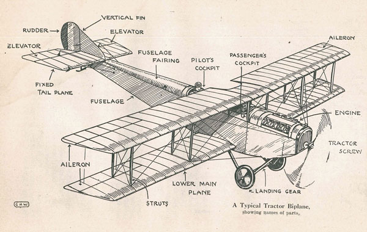
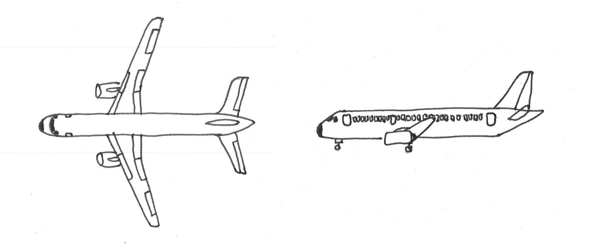
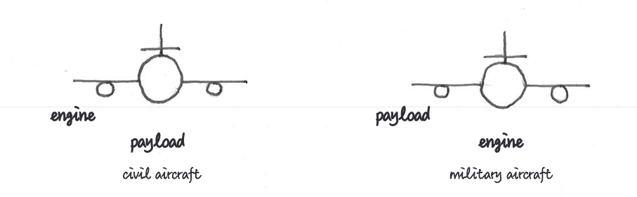
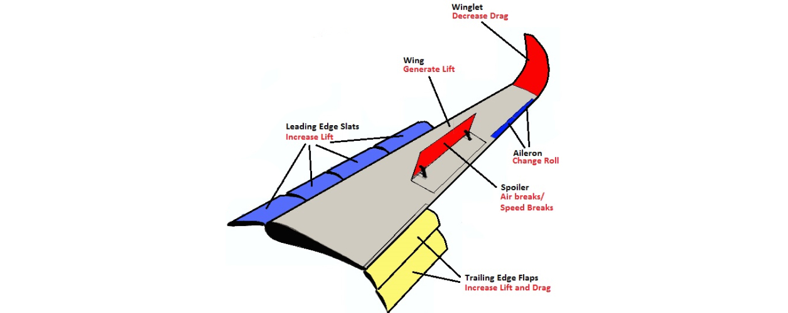
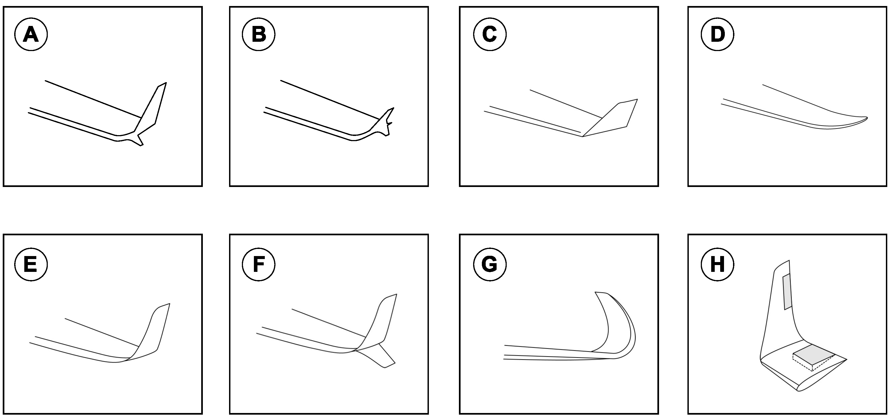
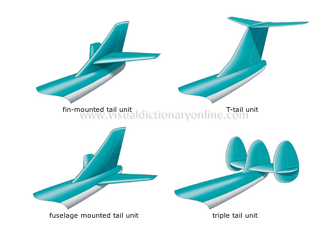
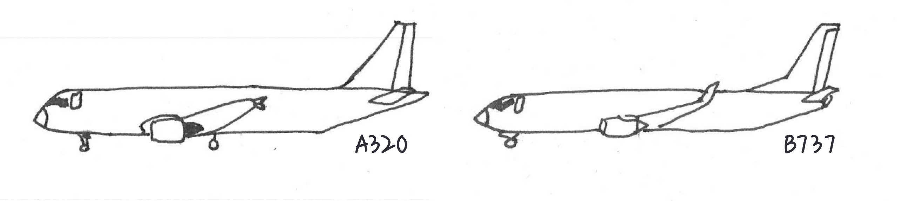
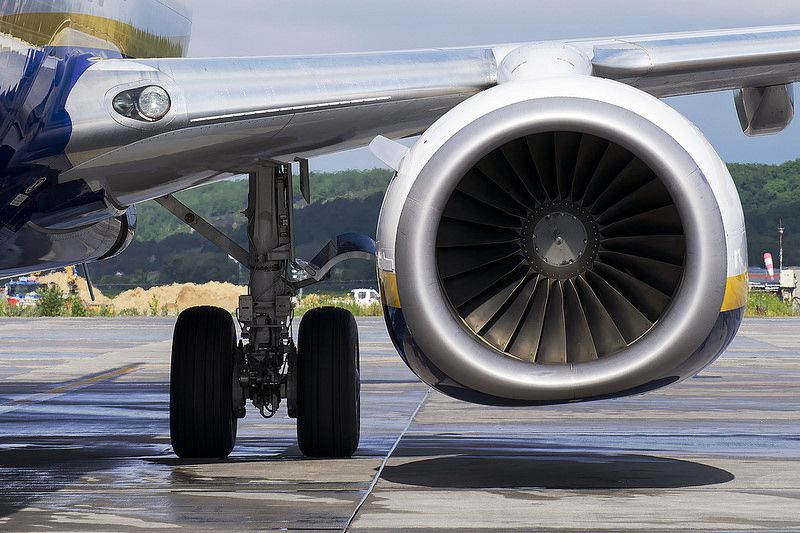

Aircraft consist of several key components that work together to enable flight. These can be broadly categorized into *structural components* and *propulsion systems*.

The primary structural components include:

- The fuselage, which houses the cockpit, passengers, and cargo;
- Wings that generate lift;
- Empennage (i.e., the tail section) for stability and control;
- Landing gear for ground operations

The propulsion system provides the necessary thrust for flight through various types of engines.

{#fig-aircraft-up-side}

Civil and military aircraft share these basic components but differ significantly in their design priorities. Civil aircraft are optimized for passenger comfort, fuel efficiency, and commercial viability, typically using turbofan engines for economical operation and carrying passengers or cargo as payload.

Military aircraft, conversely, are designed for specific mission requirements such as combat, surveillance, or transport, often featuring more powerful engines like turbojets or afterburning turbofans for greater speed and maneuverability. Their payload usually consists of weapons systems, specialized equipment, or troops rather than commercial passengers.
Aircraft consist of several key components that work together to enable flight.

{#fig-civil-military}

## Fuselage

The **fuselage** is the main body structure of an aircraft that houses the cockpit, passenger cabin, and cargo compartments. It serves as the central framework to which other major components such as wings, empennage, and landing gear are attached. Fuselages are designed to withstand various aerodynamic forces while maintaining structural integrity during flight operations. The cross-sectional shape is typically circular or oval to efficiently handle pressurization loads at altitude, though military aircraft may feature more complex shapes optimized for specific mission requirements. Modern commercial aircraft fuselages are primarily constructed from aluminum alloys or increasingly from composite materials like carbon fiber reinforced polymers (CFRP), which offer improved strength-to-weight ratios and corrosion resistance. The fuselage design must balance multiple factors including aerodynamic efficiency, structural strength, weight considerations, and internal space utilization.

## Wings

The **wings** are the primary surfaces that generate lift during flight. They are airfoil-shaped appendages extending from the sides of the fuselage, designed to create pressure differentials as air flows around them. Wings vary in design based on aircraft type and purpose, from the straight wings common on small aircraft to swept wings on commercial jets and delta wings on supersonic aircraft.

Wing components include **ailerons** for roll control, **flaps** and **slats** to modify lift characteristics during takeoff and landing, and **spoilers** (or airbrakes) to reduce lift and increase drag when needed[^1]. Modern wings also often feature *winglets* at their tips to reduce drag-inducing vortices and improve fuel efficiency. Wing construction typically uses aluminum alloys, though composite materials are increasingly common in newer aircraft designs for their superior strength-to-weight ratio and resistance to fatigue.

[^1]: Some aircraft, such as the Airbus A300, also use spoilers for roll control in addition to or instead of traditional ailerons, particularly at high speeds where aileron effectiveness may be reduced.

{#fig-wings}

## Winglets

**Winglets** are a familiar feature on the wingtips of modern commercial aircraft, playing a critical role in improving aerodynamic efficiency. These upward-swept extensions help reduce drag by weakening the wingtip vortices—spiraling air currents caused by pressure differences above and below the wing. By acting as barriers to this turbulent airflow, winglets cut fuel consumption, increase cruising range, and ultimately reduce operational costs.

Since their debut on the Boeing 747-400 in 1988, winglets have become standard on most new-generation airliners. Several types are now in common use, including:

(a) whitcomb winglets;
(b) tip fence;
(c) canted winglets (Boeing 747-400, Airbus A330 and A340);
(d) raked wingtips (Boeing 787 Dreamliner);
(e) blended winglets (Boeing 737 and 757);
(f) blended split winglets;
(g) sharklets (Airbus A320neo and A350);
(h) active winglets.

{#fig-winglets}

As technology advances, winglet designs continue to evolve, enabling airlines to retrofit older fleets and push fuel efficiency even further.

## Tail section

The **tail section** (empennage) consists of the horizontal and vertical stabilizers that provide stability and control during flight. The horizontal stabilizer controls pitch through movable elevators, allowing the aircraft to climb or descend. The vertical stabilizer (fin) includes the rudder, which enables yaw control for turning left or right. Together, these components ensure the aircraft maintains directional stability while allowing controlled maneuvers. Modern empennage designs use aluminum alloys or composite materials and may feature various configurations including T-tails, V-tails, or conventional arrangements depending on the aircraft's purpose and performance requirements.

{#fig-tail-section}

## Engines

**Engines** are the power plants that provide thrust for aircraft movement. Modern aircraft use various engine types including piston engines (common in small aircraft), turboprops (combining a gas turbine with a propeller for regional aircraft), turbofans (used in most commercial airliners for their efficiency at high speeds), and turbojets (primarily in military applications). Engine selection depends on the aircraft's intended purpose, with considerations for thrust requirements, fuel efficiency, operating altitude, and speed range. Most commercial aircraft use twin-engine configurations mounted either under the wings or at the rear of the fuselage, while some military aircraft feature embedded engines to reduce radar signature.

The introduction of turbojets and later turbofans revolutionized commercial aviation. The development of jet engines in the mid-20th century enabled aircraft to fly higher, faster, and more efficiently than propeller-driven predecessors. The first commercial jet airliner, the de Havilland Comet, entered service in 1952, followed by more successful designs like the Boeing 707 and Douglas DC-8. Turbofans, which emerged in the 1960s, provided better fuel efficiency and reduced noise compared to pure turbojets, enabling the growth of mass commercial air travel.

**Airframe and engine life cycles** are largely decoupled in modern aviation. While airframes are typically designed to last 25-30 years, engines have much shorter service intervals. Aircraft engines generally require major overhauls every 10,000-15,000 flight hours, with complete replacement often necessary after 3-5 major maintenance cycles. This decoupling allows airlines to replace or upgrade engines multiple times during an aircraft's operational lifetime.

**High bypass ratio engines** vary significantly in size, with the largest examples being truly massive. For perspective, the GE90-115B engine used on the Boeing 777-300ER has a fan diameter of 3.25 meters and can produce up to 115,000 pounds of thrust. The Rolls-Royce Trent XWB engines powering the Airbus A350 have a fan diameter of about 3 meters (118 inches). For comparison, the entire fuselage diameter of a Boeing 737 narrow-body aircraft could fit inside the intake of these larger engines.

:::{.callout-note title="Spinner spirals"}
Many aircraft engines feature distinctive spiral patterns painted on their spinners (the conical cover over the hub of the propeller). These spirals serve as a visual safety feature: when the propeller is spinning, the spiral creates a visual pattern that reminds ground personnel to keep clear.

Some patterns are distinctive marks of a manufacturer, such as the "G-swirl" for General Electric, the long spiral for Rolls-Royce, or the Pratt & Whitney's apostrophe.

{width=5cm}
{width=5cm}
{width=5cm}

:::

:::{.callout-note}
Most commercial aircraft use a **bleed air system**, which extracts compressed air from the engines to power various aircraft systems including cabin pressurization, air conditioning, and anti-icing. This high-temperature, high-pressure air is "bled" from the compressor stages of the engine before fuel is added. The Boeing 787 Dreamliner, however, introduced a significant innovation by implementing a "bleed-less" electrical architecture. Unlike conventional aircraft, the Dreamliner uses electrical compressors and pumps powered by generators on the engines instead of the traditional bleed air system.

This approach allows smaller, more efficient engines. A significant visual mark for the Dreamliner is a distinctive air intake on the fuselage that supplies air to the electrical compressors, replacing the traditional bleed air ports on the engines found on conventional aircraft.

{width=10cm}
:::

## Fuel storage

**Aircraft fuel** is primarily stored in the wings, utilizing the space between the front and rear wing spars to form integral fuel tanks. This location offers several advantages: it keeps the heavy fuel mass close to the aircraft's center of gravity, utilizes otherwise empty space, and as fuel is consumed, the reduced wing loading helps decrease structural stress. Modern commercial aircraft like the Boeing 747 and Airbus A380 may also incorporate additional fuel tanks in the horizontal stabilizer or dedicated sections of the fuselage for extended range operations. Most aircraft feature multiple, isolated fuel tanks with cross-feed systems to maintain balance and provide redundancy in case of pump failure or fuel system damage.

## Auxiliary power unit

The **Auxiliary power unit (APU)** is a small turbine engine typically located in the tail section of an aircraft that provides power independently of the main engines. It powers systems on the ground when main engines are off, provides bleed air for starting the main engines, and serves as a backup power source during flight. APUs allow aircraft to operate at airports without requiring external power or pneumatic sources, enabling air conditioning, lighting, and instrument operation even when the aircraft is parked with main engines shut down.

:::{.callout-note}
Many airports restrict APU usage due to environmental concerns, particularly noise and air pollution. These restrictions may limit APU operating times, especially during night hours or at gate positions where fixed ground power and pre-conditioned air are available. Major European airports such as Zurich, Frankfurt, and London Heathrow have implemented strict APU operating limitations to reduce emissions and noise in their sustainability efforts.
:::

## Landing gear

The **landing gear** (undercarriage) is the structural component that supports the aircraft when on the ground during taxiing, takeoff, and landing. It typically consists of wheels, shock absorbers, and retraction mechanisms (in most modern aircraft). The three main configurations are: tricycle (with a nose wheel and two main wheels), conventional/"taildragger" (with a tail wheel and two main wheels), and tandem (with wheels arranged along the centerline). Modern commercial aircraft use complex multi-wheel bogie systems to distribute weight across multiple tires. Landing gear must absorb landing impact forces, provide stability during ground operations, and in retractable systems, stow compactly during flight to reduce aerodynamic drag. The system also incorporates brakes for deceleration after landing and during taxi operations, as well as a steering mechanism (typically on the nose wheel) for directional control on the ground.

:::{.callout-note}
**Pushback operations** are a standard procedure at airports where aircraft are pushed backward from their gates by specialized tow vehicles before taxiing to the runway. This is necessary because most commercial aircraft cannot reverse under their own power. The pushback tug connects to the aircraft's nose landing gear via a towbar or towbarless system, and is controlled by ground crew in communication with the cockpit.

**Single engine taxiing** is a fuel conservation practice where aircraft taxi using only one engine instead of all engines, reducing fuel consumption by 20-40% during ground operations. While widely adopted, this practice requires consideration of factors like aircraft weight and weather conditions. More recently, electric taxiing systems have been developed, allowing aircraft to move on the ground using electric motors installed in the landing gear or using external tugs, further reducing emissions and noise at airports.
:::

:::{.callout-tip title="How many differences can you see between the Airbus A320 and the Boeing 737?"}

The A320 and 737 have several distinctive differences despite being similar-sized narrow-body aircraft:

- **Nose design**: The A320 has a more rounded nose cone compared to the 737's pointed profile
- **Landing gear height**: The 737 sits notably lower to the ground than the A320
- **Engine mounting**: On the A320, engines are attached with pylons that provide more clearance below them, while the 737's engines are mounted closer to the wing underside
- **Tail section**: The A320 features a more vertical stabilizer compared to the 737's slightly swept design
- **Winglet design**

:::

The 737's low ground clearance is particularly noteworthy: its engine nacelles have a distinctive flattened bottom section to maintain minimum required ground clearance, as shown in @fig-engine-b737.

{#fig-engine-b737 width=10cm}
