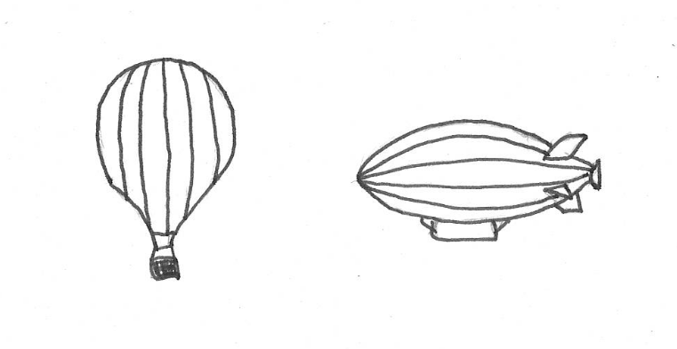
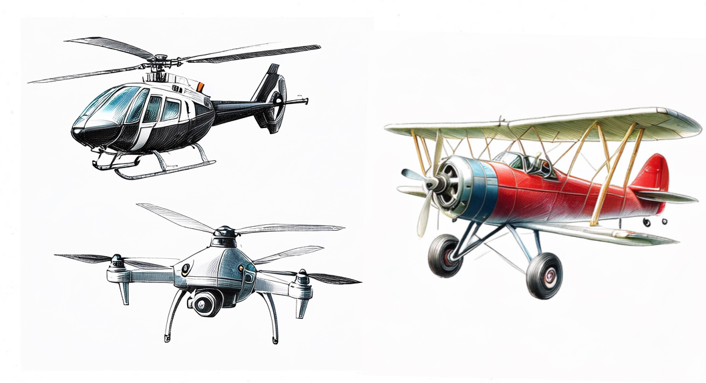

::: {.callout-warning}
## TODO for this page

This page now contains the aircraft classification and mission framing extracted from the former aircraft chapter. It needs a shorter mission-oriented rewrite and examples linking aircraft categories to data interpretation.
:::

## Aircraft categories

There exists a wide variety of air vehicles that can be grouped in broad categories. The \acr{ICAO} classifies "aircraft according to specified characteristics". The aircraft categorisation has relevance for the flight training and associated licensing, but also for the certification and operation of the aircraft in terms of equipment, operating capabilities and limits, and access to airspace. Aircraft can be broadly categorized into lighter-than-air and heavier-than-air vehicles.

**Lighter-than-air aircraft** include balloons and airships that achieve flight primarily through buoyancy, using gases like helium or hot air that are less dense than the surrounding atmosphere. These aircraft displace a volume of air greater than their own weight, creating lift without requiring forward motion or wing surfaces. While offering advantages such as low energy consumption, extended flight endurance, and near-silent operation, they typically have limited speed capabilities and are more susceptible to weather conditions compared to their heavier-than-air counterparts. Modern applications range from recreational hot air ballooning to advanced airships designed for surveillance, tourism, and cargo transport in remote areas.

{#fig-balloon-airship}

**Heavier-than-air aircraft** consist mostly of aeroplanes, i.e., engine-driven, fixed-wing aircraft that achieve flight by the reaction of the air flowing around the wing and creating lift. These aircraft generate either aerodynamic forces (for fixed-wing aircraft and rotorcraft) or direct engine thrust (for rockets) to counteract gravity. Unlike lighter-than-air vehicles, heavier-than-air aircraft require forward motion or powered lift to generate sufficient upward force. Heavier-than-air aircraf encompass a wide range of vehicle types including commercial airliners, military jets, helicopters, gliders, and modern unmanned aerial vehicles (UAVs). The category can be further subdivided based on wing configuration, propulsion system, and intended use, with each design optimized for specific performance characteristics such as speed, range, payload capacity, or maneuverability.

{#fig-heavier-than-air}

When speaking about aircraft categories, often the terms (aircraft) class and (aircraft) type crop up. An aircraft class is a sub-division within a category with a focus on design and performance. For example, single-engine and multi-engine piston engine aircraft. Aircraft type refers to the specific model of an aircraft, such as Boeing 737 or Airbus A320.

In this chapter we focus on conventional airplanes, i.e., powered heavier-than-air aircraft.

## Aircraft missions
