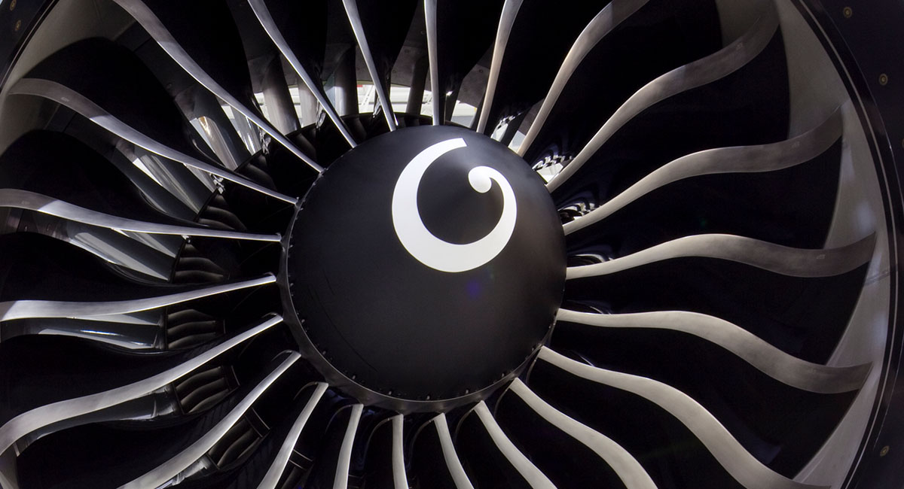
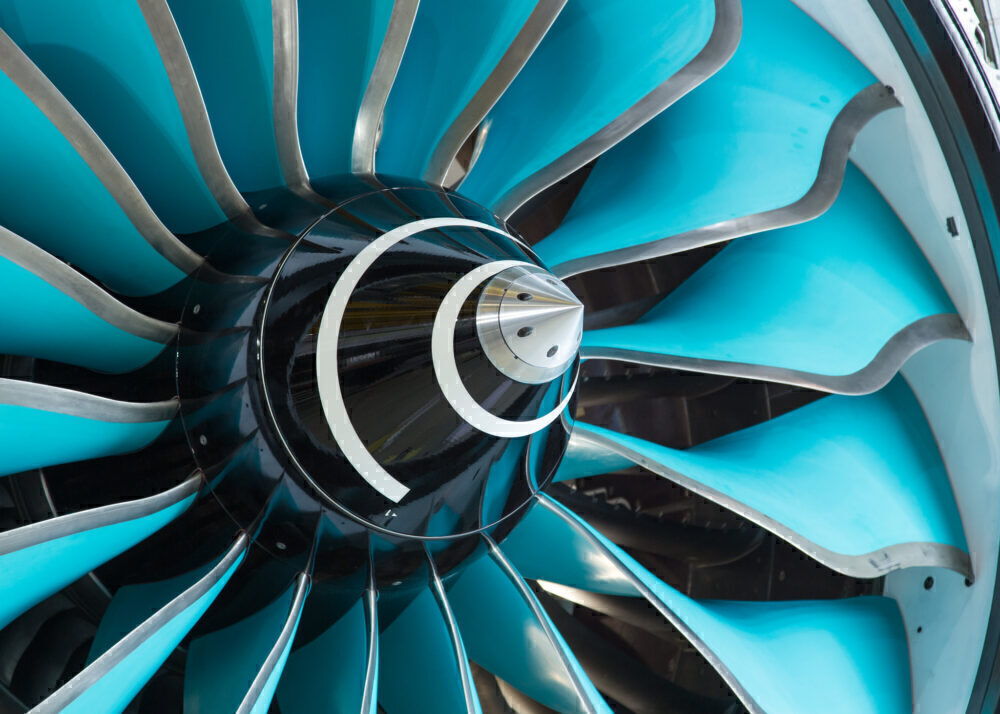

An aircraft propulsion system converts stored energy into thrust. The engine is its central component, but propulsion also involves an inlet, a propeller or fan, an exhaust, a fuel system, and the structures that connect these components to the airframe. The choice of propulsion system depends on the aircraft mission, operating speed, altitude, range, payload, and airport requirements.

This chapter introduces the propulsion systems most often encountered in civil aviation. The aim is not to describe engine design in detail, but to establish the concepts needed to interpret aircraft performance, fuel-flow, emissions, and operational data.

## From power to thrust

Thrust is produced by accelerating a mass of air backwards. A propeller does this with rotating blades outside the engine. A jet engine accelerates air through the engine and expels it through the exhaust. A turbofan combines both principles: most of its thrust is produced by the fan, while the gas-turbine core provides the power needed to drive it.

Engine **power** and **thrust** are related but distinct quantities. Piston engines and turboprops are commonly characterised by shaft power, whereas turbojets and turbofans are commonly characterised by thrust. The conversion from shaft power to useful thrust depends on propeller efficiency and airspeed. For this reason, engine ratings from different propulsion families should not be compared directly without considering how the power reaches the surrounding air.

## Main propulsion families

### Piston engines and propellers

Piston engines burn a mixture of fuel and air in cylinders. Their reciprocating motion turns a crankshaft connected to a propeller, either directly or through a reduction gearbox. They are common on light aircraft because they suit the required power range and can be relatively simple to operate and maintain.

The propeller blades act as rotating wings. Their pitch may be fixed or adjustable. A constant-speed propeller changes blade pitch to maintain a selected rotational speed as aircraft speed and engine load change.

### Turboprops

A turboprop uses a gas turbine to drive a propeller through a reduction gearbox. Most of the useful propulsive force comes from the propeller rather than from the turbine exhaust. Turboprops are well suited to regional operations and other missions flown at lower speeds, where a propeller can move a large mass of air efficiently.

Although a turboprop contains a gas turbine, it should not be treated as a small turbofan. The two systems produce thrust differently and have different speed ranges, operating characteristics, and noise signatures.

### Turbojets

A turbojet draws air through an inlet, compresses it, mixes it with fuel, and burns the mixture. The hot gas expands through a turbine and then leaves the nozzle at high speed. The turbine extracts enough energy to drive the compressor, while the remaining energy produces thrust through the exhaust jet.

Turbojets have a relatively small frontal area and can operate efficiently at high speeds. Their high exhaust velocity, however, makes them noisy and less fuel-efficient than modern turbofans at the subsonic speeds typical of commercial transport. Pure turbojets are therefore now uncommon in civil aviation.

### Turbofans

A turbofan adds a large fan ahead of the gas-turbine core. Part of the incoming air passes through the core, while the remainder bypasses it. The **bypass ratio** is the ratio between these two mass flows. A high-bypass turbofan accelerates a large mass of air by a smaller amount, which is generally more efficient and quieter at subsonic transport speeds than accelerating a smaller mass of air to a much higher velocity.

Most current commercial jet aircraft use high-bypass turbofans. Turbojets and low-bypass turbofans remain relevant where compact size or high-speed performance matters more than the efficiency sought in civil transport.

## How a turbofan works

Air entering a turbofan first passes through the fan. The bypass flow travels around the engine core and produces much of the thrust. Air entering the core then passes through several stages:

1. The **compressor** raises the pressure of the incoming air.
2. The **combustor** mixes compressed air with fuel and burns the mixture.
3. The **turbine** extracts energy from the hot gas to drive the compressor and fan.
4. The remaining gas leaves through the **exhaust**, contributing additional thrust.

The rotating assemblies are arranged on one or more concentric shafts, often called spools. Each spool connects compressor and turbine stages intended to rotate together. Engine instruments may therefore report several rotational speeds, such as $N_1$, $N_2$, or $N_3$, depending on the engine architecture.

### The Joule–Brayton cycle

The gas-turbine core can be described using the **Joule–Brayton cycle**, usually called the **Brayton cycle** in English. Its ideal closed-cycle representation has four processes:

1. **Compression:** pressure and temperature increase without an increase in entropy.
2. **Heat addition:** heat is added at constant pressure, representing combustion.
3. **Expansion:** hot gas expands through the turbine and produces shaft work.
4. **Heat rejection:** heat is removed at constant pressure and the working fluid returns to its initial state.

An aircraft engine is an open system rather than a closed cycle. It continuously draws in atmospheric air, adds fuel, and discharges combustion products through the exhaust. The turbine extracts enough work to drive the compressor and, in a turbofan, the fan. Energy remaining downstream of the turbine is converted into jet velocity by the nozzle.

The four thermodynamic processes should not be confused with the number of **engine stations**. @fig-brayton-cycle follows a simple turbojet through six locations:

| Station | Location |
|---|---|
| **amb** | undisturbed ambient flow |
| **2** | intake outlet and compressor inlet |
| **3** | compressor outlet |
| **4** | combustor outlet and turbine inlet |
| **5** | turbine outlet and nozzle inlet |
| **9** | nozzle outlet |

A turbojet is used here because it makes the core cycle easier to see. A turbofan adds the fan and bypass stream, but its gas-turbine core follows the same sequence. The controls change the flight Mach number, compressor pressure ratio, and turbine inlet temperature. The component selector compares an ideal calculation with one containing representative losses.

```{ojs}
//| echo: false
//| code-copy: false
viewof braytonParameters = Inputs.form({
  flightMach: Inputs.range([0, 0.9], {
    value: 0.8,
    step: 0.1,
    label: "flight Mach number"
  }),
  pressureRatio: Inputs.range([5, 25], {
    value: 12,
    step: 0.5,
    label: "compressor pressure ratio"
  }),
  turbineInletTemperature: Inputs.range([1200, 1800], {
    value: 1400,
    step: 10,
    label: "turbine inlet temperature (K)"
  }),
  componentModel: Inputs.select(["ideal components", "representative losses"], {
    value: "ideal components",
    label: "component model"
  })
})
```

```{ojs}
//| label: fig-brayton-cycle
//| fig-cap: "Open turbojet cycle on a temperature–entropy diagram. The six stations separate the intake, compressor, combustor, turbine, and nozzle."
//| echo: false
//| code-copy: false
{
  const gamma = 1.4;
  const R = 287.05;
  const cp = gamma * R / (gamma - 1);
  const exponent = (gamma - 1) / gamma;
  const lowerHeatingValue = 40e6;
  const ambientPressure = 101325;
  const ambientTemperature = 288.15;
  const flightMach = braytonParameters.flightMach;
  const pressureRatio = braytonParameters.pressureRatio;
  const turbineInletTemperature = braytonParameters.turbineInletTemperature;
  const withLosses = braytonParameters.componentModel === "representative losses";

  // The non-ideal values are illustrative, not values for a particular engine.
  const intakePressureRecovery = withLosses ? 0.98 : 1;
  const compressorEfficiency = withLosses ? 0.88 : 1;
  const combustorPressureRecovery = withLosses ? 0.95 : 1;
  const turbineEfficiency = withLosses ? 0.90 : 1;
  const nozzleEfficiency = withLosses ? 0.95 : 1;

  const entropy = (T, p) =>
    cp * Math.log(T / ambientTemperature) - R * Math.log(p / ambientPressure);
  const temperatureOnIsobar = (s, p) =>
    ambientTemperature * Math.exp((s + R * Math.log(p / ambientPressure)) / cp);
  const sample = (count, functionOfFraction) =>
    Array.from({length: count}, (_, index) =>
      functionOfFraction(index / (count - 1)));

  const freestreamFactor = 1 + (gamma - 1) * flightMach ** 2 / 2;
  const T2 = ambientTemperature * freestreamFactor;
  const idealDiffuserPressure = ambientPressure * freestreamFactor ** (gamma / (gamma - 1));
  const p2 = idealDiffuserPressure * intakePressureRecovery;

  const p3 = p2 * pressureRatio;
  const T3ideal = T2 * pressureRatio ** exponent;
  const T3 = T2 + (T3ideal - T2) / compressorEfficiency;

  const T4 = turbineInletTemperature;
  const p4 = p3 * combustorPressureRecovery;
  const fuelAirRatio = cp * (T4 - T3) / lowerHeatingValue;

  // Turbine work balances compressor work in this simple single-spool model.
  const T5 = T4 - (T3 - T2) / (1 + fuelAirRatio);
  const T5isentropic = T4 - (T4 - T5) / turbineEfficiency;
  const p5 = p4 * (T5isentropic / T4) ** (gamma / (gamma - 1));

  // The nozzle is assumed to be adapted, so its exit pressure is ambient.
  const T9isentropic = T5 * (ambientPressure / p5) ** exponent;
  const T9 = T5 - nozzleEfficiency * (T5 - T9isentropic);
  const exhaustVelocity = Math.sqrt(Math.max(0, 2 * cp * (T5 - T9)));
  const flightVelocity = flightMach * Math.sqrt(gamma * R * ambientTemperature);
  const exhaustMach = exhaustVelocity / Math.sqrt(gamma * R * T9);

  const state = (station, description, T, p) => ({
    station,
    description,
    T,
    p,
    s: entropy(T, p)
  });
  const states = [
    state("amb", "ambient flow", ambientTemperature, ambientPressure),
    state("2", "intake outlet", T2, p2),
    state("3", "compressor outlet", T3, p3),
    state("4", "turbine inlet", T4, p4),
    state("5", "turbine outlet", T5, p5),
    state("9", "nozzle outlet", T9, ambientPressure)
  ];
  const [ambientState, state2, state3, state4, state5, state9] = states;

  const intake = sample(30, (u) => {
    const T = ambientTemperature + u * (T2 - ambientTemperature);
    const pIdeal = ambientPressure * (T / ambientTemperature) ** (gamma / (gamma - 1));
    const p = pIdeal * (1 - u * (1 - intakePressureRecovery));
    return {T, p, s: entropy(T, p)};
  });
  const compression = sample(50, (u) => {
    const p = p2 * pressureRatio ** u;
    const Tideal = T2 * (p / p2) ** exponent;
    const T = T2 + (Tideal - T2) / compressorEfficiency;
    return {T, p, s: entropy(T, p)};
  });
  const combustion = sample(60, (u) => {
    const T = T3 + u * (T4 - T3);
    const p = p3 * (1 - u * (1 - combustorPressureRecovery));
    return {T, p, s: entropy(T, p)};
  });
  const expansion = sample(50, (u) => {
    const T = T4 + u * (T5 - T4);
    const Tisentropic = T4 - (T4 - T) / turbineEfficiency;
    const p = p4 * (Tisentropic / T4) ** (gamma / (gamma - 1));
    return {T, p, s: entropy(T, p)};
  });
  const nozzle = sample(50, (u) => {
    const p = p5 * (ambientPressure / p5) ** u;
    const Tisentropic = T5 * (p / p5) ** exponent;
    const T = T5 - nozzleEfficiency * (T5 - Tisentropic);
    return {T, p, s: entropy(T, p)};
  });

  const kineticPower = 0.5 * ((1 + fuelAirRatio) * exhaustVelocity ** 2 - flightVelocity ** 2);
  const specificThrust = (1 + fuelAirRatio) * exhaustVelocity - flightVelocity;
  const thermalEfficiency = kineticPower / (fuelAirRatio * lowerHeatingValue);
  const propulsiveEfficiency = kineticPower > 0
    ? flightVelocity * specificThrust / kineticPower
    : 0;
  const overallEfficiency = thermalEfficiency * propulsiveEfficiency;

  const entropyMaximum = Math.max(...states.map((d) => d.s));
  const xMax = Math.max(1250, entropyMaximum * 1.22);
  const yMax = Math.max(1600, T4 + 100);
  const blue = "#2474a6";
  const paleBlue = "#a9c4da";
  const isobar = (pressure) => sample(100, (u) => {
    const s = -80 + u * (xMax + 80);
    return {s, T: temperatureOnIsobar(s, pressure)};
  });
  const stateTitle = (d) =>
    `${d.station} · ${d.description}\nT = ${d.T.toFixed(0)} K\np = ${(d.p / 1e5).toFixed(1)} bar\ns = ${d.s.toFixed(0)} J/(kg·K)`;
  const stateLabels = [
    {s: ambientState.s - 18, T: ambientState.T - 38, label: "amb"},
    {s: state2.s + 25, T: state2.T + 28, label: "2"},
    {s: state3.s + 28, T: state3.T + 18, label: "3"},
    {s: state4.s + 28, T: state4.T + 18, label: "4"},
    {s: state5.s + 28, T: state5.T + 10, label: "5"},
    {s: state9.s + 28, T: state9.T - 18, label: "9"}
  ];

  const chart = Plot.plot({
    width: Math.min(width, 780),
    height: 500,
    marginTop: 28,
    marginRight: 38,
    marginBottom: 58,
    marginLeft: 72,
    style: {background: "transparent", fontSize: "12px"},
    x: {
      domain: [-80, xMax],
      label: "specific entropy, s (J/kg/K)",
      grid: true,
      nice: false
    },
    y: {
      domain: [200, yMax],
      label: "temperature, T (K)",
      grid: true,
      nice: false
    },
    marks: [
      Plot.line(isobar(ambientPressure), {
        x: "s", y: "T", stroke: paleBlue, strokeWidth: 1.2
      }),
      Plot.line(isobar(p3), {
        x: "s", y: "T", stroke: paleBlue, strokeWidth: 1.2
      }),
      Plot.line(intake, {x: "s", y: "T", stroke: blue, strokeWidth: 2.5}),
      Plot.line(compression, {x: "s", y: "T", stroke: blue, strokeWidth: 2.5}),
      Plot.line(combustion, {x: "s", y: "T", stroke: blue, strokeWidth: 2.5}),
      Plot.line(expansion, {x: "s", y: "T", stroke: blue, strokeWidth: 2.5}),
      Plot.line(nozzle, {x: "s", y: "T", stroke: blue, strokeWidth: 2.5}),
      Plot.dot(states, {
        x: "s", y: "T", r: 4.5, fill: blue, title: stateTitle
      }),
      Plot.text(stateLabels, {
        x: "s", y: "T", text: "label", textAnchor: "start",
        fill: "#253746", fontSize: 13, fontWeight: 600,
        halo: "white", haloWidth: 4
      }),
      Plot.text([{
        s: xMax - 30,
        T: yMax - 48,
        label: withLosses ? "representative component losses" : "ideal components"
      }], {
        x: "s", y: "T", text: "label", textAnchor: "end",
        fill: "#526b7d", fontSize: 12, fontWeight: 600
      }),
      Plot.frame({stroke: "#c8d1d8"})
    ]
  });

  const percent = (value) => `${(100 * value).toFixed(1)}%`;
  const summary = htl.html`<div style="display:flex; flex-wrap:wrap; gap:.6rem 1.5rem; justify-content:center; margin:.45rem 0 .2rem; color:#43596a; font-size:.9rem">
    <span><strong>thermal</strong> ${percent(thermalEfficiency)}</span>
    <span><strong>propulsive</strong> ${percent(propulsiveEfficiency)}</span>
    <span><strong>overall</strong> ${percent(overallEfficiency)}</span>
    <span><strong>fuel–air ratio</strong> ${(1000 * fuelAirRatio).toFixed(1)} g/kg</span>
    <span><strong>exhaust Mach</strong> ${exhaustMach.toFixed(2)}</span>
  </div>`;

  return htl.html`<div style="max-width:780px; margin-inline:auto">${chart}${summary}</div>`;
}
```

::: {.callout-note collapse="true" title="Model assumptions"}
The ideal setting treats the intake, compressor, turbine, and nozzle as isentropic and assumes no combustor pressure loss. With representative losses selected, the path moves to the right as entropy increases.

The illustrative assumptions are pressure recoveries of 0.98 in the intake and 0.95 in the combustor, together with efficiencies of 0.88 for the compressor, 0.90 for the turbine, and 0.95 for the nozzle. They are generic teaching values, not data for a particular engine.
:::

The outputs below the diagram separate three meanings of efficiency. **Thermal efficiency** measures how much fuel energy becomes additional kinetic energy in the jet. **Propulsive efficiency** measures how much of that jet power becomes useful propulsive work on the aircraft. **Overall efficiency** is the product of the two. These simplified values assume an adapted nozzle and omit installation effects, bypass flow, mechanical losses, and accessory power extraction. They should therefore be interpreted as model outputs rather than engine performance estimates.

The station layout and choice of controls are based on the ISAE-SUPAERO [interactive turbojet-cycle model](https://gitlab-pages.isae-supaero.fr/igthermo-44f0f7/joule_brayton/bokeh_tj.html). The cycle remains useful here because it explains why compressor pressure ratio, turbine temperature, fuel flow, and component losses appear in engine-performance data.

High-bypass turbofans can be very large. The GE90-115B used on the Boeing 777-300ER has a fan diameter of 3.25 metres and a rated thrust of up to 115,000 pounds-force. The Rolls-Royce Trent XWB used on the Airbus A350 has a fan diameter of about 3 metres. These dimensions affect ground clearance, nacelle shape, pylon design, and the position of the engine beneath the wing.

## Engine installation and aircraft design

Most current commercial jets have two engines mounted beneath the wings. This arrangement leaves more cabin space available, simplifies access for maintenance, and allows the wing structure to carry part of the engine load. Other aircraft use rear-mounted engines, engines above the wing, or engines integrated into the fuselage. Propeller aircraft may mount engines on the nose, wings, or rear fuselage.

Installation is a compromise. Designers must consider ground clearance, aerodynamic interference, structural loads, cabin noise, foreign-object ingestion, maintenance access, and behaviour after an engine failure. The flattened lower nacelle on some Boeing 737 variants is a visible example of the interaction between engine dimensions and the geometry of an existing airframe.

:::{.callout-note title="Spinner spirals"}
Many turbofan engines have a spiral painted on the spinner at the centre of the fan. The moving pattern helps ground personnel recognise that the engine is rotating and should not be approached. Spiral designs can also be associated with manufacturers, such as the General Electric "G-swirl", the long Rolls-Royce spiral, and the Pratt & Whitney apostrophe.

{width=5cm}
{width=5cm}
{width=5cm}
:::

## Thrust and operating conditions

The thrust available from an engine is not constant. It depends on engine setting, air density, temperature, altitude, airspeed, and the installation. Aircraft performance models therefore distinguish between operating conditions such as takeoff, climb, cruise, descent, and idle. The rated takeoff thrust printed for an engine is not the thrust produced throughout a flight.

Pilots and engine-control systems manage thrust differently across aircraft generations. On many modern aircraft, a full-authority digital engine control manages fuel flow and engine limits in response to a commanded thrust setting. Operational data may contain the command, measured engine parameters, or an estimate of thrust rather than a direct measurement of propulsive force.

## Fuel flow and engine data

Fuel flow changes substantially over a flight. It is high during takeoff and climb, lower during cruise, and close to idle during much of the descent. The relationship between fuel flow and thrust also changes with altitude, speed, temperature, and engine condition. A fuel or emissions estimate based only on flight time will therefore miss important differences between flight phases.

Common engine parameters include:

- fan or spool rotational speed, often expressed as $N_1$, $N_2$, or $N_3$;
- exhaust gas temperature or a related turbine temperature;
- fuel flow;
- oil pressure and temperature;
- vibration measurements;
- commanded or estimated thrust.

The available variables depend on the aircraft, engine, recording system, and access rights. Surveillance data such as ADS-B normally describe aircraft motion rather than internal engine state. Thrust and fuel flow must then be inferred with an aircraft-performance model.

## Bleed air and electrical systems

On many commercial aircraft, compressed air is extracted from the engine compressor before combustion. This **bleed air** supplies systems such as cabin pressurisation, air conditioning, anti-icing, and engine starting. Extracting air changes the engine operating condition, so the use of these systems can affect fuel consumption and available performance.

The Boeing 787 uses an electrically oriented, bleedless architecture for several functions traditionally supplied with engine bleed air. Electrically driven compressors provide cabin pressurisation, while generators driven by the engines supply the required electrical power. This changes how power is taken from the engines but does not remove the connection between aircraft-system demand and fuel consumption.

## Engines over the aircraft life cycle

Airframes and engines follow different maintenance schedules. Engines are removable modules and may be exchanged between aircraft while undergoing inspection, repair, or overhaul. Components within an engine also have their own life limits and maintenance requirements. Consequently, an aircraft registration does not always identify a single engine installation throughout the life of the airframe.

This distinction matters when combining fleet, maintenance, and performance data. Aircraft type alone may be insufficient because one airframe family can be certified with several engine families or variants. Engine variant, installation, age, and maintenance condition can all affect fuel use and measured performance.

## Connection with flight mechanics and performance data

For flight mechanics, propulsion supplies one of the four principal forces acting on the aircraft: thrust. The next chapter explains how thrust combines with lift, drag, and weight to determine motion.

Aircraft-performance models represent this relationship in more operational terms. They estimate available thrust and fuel flow for a given aircraft, flight phase, altitude, and speed. See [Flight mechanics](flight-mechanics.qmd) for the force balance and [Aircraft performance](../data_sources/aircraft-performance.qmd) for the associated data and modelling approaches.

## Glossary {.unnumbered}
