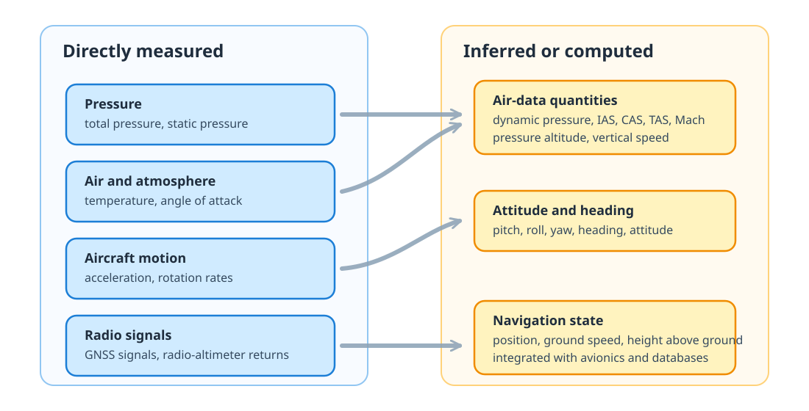
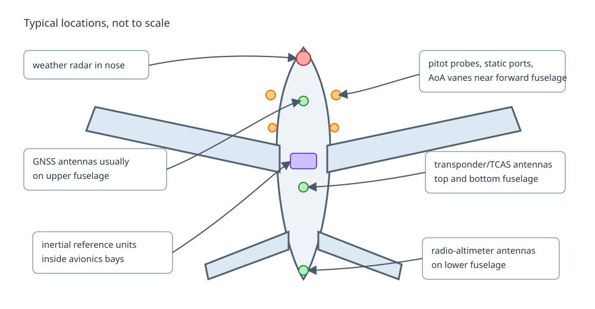

Aircraft instruments turn physical quantities into information that pilots, avionics, recorders, and surveillance systems can use. Some quantities are measured directly by sensors; others are computed by combining sensor measurements, aircraft configuration, navigation databases, or air-data models.

Speed definitions such as ground speed, true airspeed, calibrated airspeed, indicated airspeed, and Mach number are introduced in [Flight mechanics](flight-mechanics.qmd#speed-definitions). This page focuses on the instruments and systems that produce or use those quantities.

A useful first distinction is between **basic physical quantities** that can be sensed directly and **derived quantities** that are inferred from them.

{#fig-measured-inferred-quantities}

The border between measured and inferred is not always sharp. For example, barometric altitude is based on a pressure measurement, but it also depends on an altimeter setting and a model of the atmosphere.

## Basic instruments and sensors

The following instruments are the basic building blocks behind many cockpit indications and recorded parameters.

{#fig-aircraft-instruments-locations}

### Pitot probes

Pitot probes measure **total pressure**, sometimes called pitot pressure. They face into the airflow, usually on the forward fuselage or nose area, where the flow is expected to be representative and away from major disturbances.

Together with static pressure, pitot pressure is used to compute dynamic pressure. If $p_t$ is total pressure and $p_s$ is static pressure, the dynamic pressure is:

$$
q = p_t - p_s
$$

At low speed, where compressibility can be neglected, airspeed can be approximated from Bernoulli's relation:

$$
V \approx \sqrt{\frac{2q}{\rho}}
$$

where $\rho$ is air density. This is the basis for indicated airspeed, calibrated airspeed, Mach number, and true airspeed after the relevant corrections. A pitot probe is therefore a small external sensor with a large operational role: if it is blocked by ice, insects, water, maintenance covers, or other contamination, airspeed indications can become unreliable.

### Static ports

Static ports measure **ambient static pressure**. Unlike pitot probes, they are usually flush with the fuselage skin, often installed on both sides of the forward fuselage to reduce errors caused by sideslip or local flow asymmetry.

Static pressure is used to compute pressure altitude and vertical speed. It also provides the static-pressure reference needed to derive dynamic pressure from the pitot-static system. The measurement is sensitive to aircraft attitude, configuration, and local airflow around the fuselage, so aircraft-specific calibration is needed.

### Temperature probes

Temperature probes measure the air temperature outside the aircraft. Depending on the probe and correction applied, the measurement may be closer to total air temperature or outside/static air temperature.

Temperature is needed for air-data calculations, including true airspeed and Mach number. It is also used in engine monitoring and performance computations. The probe is mounted outside the fuselage in the airstream, but its reading still has to account for effects such as recovery factor, aircraft speed, and sensor heating.

### Angle-of-attack probes

Angle-of-attack sensors measure the local airflow angle relative to the aircraft. On many aircraft this is done with a small vane on the forward fuselage; other designs use differential-pressure probes.

Angle of attack is closely related to stall margin. It can feed stall warning systems, flight-envelope protection, speed management, and flight-control laws. The value is not always a perfect measurement of the wing angle of attack: it is measured locally near the sensor and then interpreted through aircraft-specific calibration.

### Gyroscopes and inertial sensors

Gyroscopes and accelerometers measure **angular rates** and **linear accelerations**. In modern aircraft they are packaged in inertial reference units, usually installed inside avionics bays rather than exposed on the fuselage.

Inertial sensors provide attitude, heading, acceleration, and short-term motion continuity. They are valuable because they do not depend on external radio or satellite signals. Their weakness is drift: over time, pure inertial estimates degrade and must be updated or bounded with GNSS, radio navigation, air-data, or other sources.

### Radio-altimeter antennas

Radio-altimeter antennas measure height above the surface directly below the aircraft by transmitting a radio signal and measuring its return. They are installed on the lower fuselage because they need a clear path toward the ground.

Radio altitude is especially important close to the ground. It supports automatic callouts, autoland functions, ground-proximity warning logic, and some approach and landing modes. Unlike barometric altitude, it is not referenced to a pressure surface or sea level: it is a local height above terrain below the aircraft.

## Transponder and TCAS

A **transponder** is both an identification device and a surveillance interface. It replies to secondary surveillance radar interrogations and, in Mode S and ADS-B capable installations, can provide richer information such as aircraft identity, pressure altitude, selected altitude, position, velocity, and status fields.

For data analysis, this is important: many surveillance fields are not measured by the radar itself. They are computed onboard, encoded by avionics, transmitted by the aircraft, received by ground or satellite systems, and then processed again by a data provider.

\acr{TCAS} monitors nearby transponder-equipped aircraft and can issue collision-avoidance alerts. It is an implementation of the \acr{ICAO} \acr{ACAS} standard.

- A \acr{TA} helps the crew visually or mentally identify potentially conflicting traffic.
- A \acr{RA} gives an avoidance manoeuvre. If both aircraft are suitably equipped, the advisories are coordinated between aircraft.

TCAS is therefore not a raw sensor like a pitot probe. It is a safety logic built from surveillance replies, relative geometry, closure rates, and certified alerting rules.

## GNSS receiver

A \acr{GNSS} receiver estimates position, velocity, and time from satellite signals. The antenna is typically on top of the fuselage so that it has a clear view of the sky.

GNSS-derived information is used by navigation displays, flight-management systems, ADS-B position broadcasts, and many recorded datasets. It is highly accurate in normal conditions, but it remains vulnerable to antenna masking, interference, jamming, spoofing, constellation geometry, and receiver filtering choices.

GNSS also illustrates an important distinction: the aircraft does not directly measure latitude and longitude. It measures radio signals from satellites, then solves for a navigation state.

## Flight management system

The \acr{FMS} combines several sources of information:

- the active flight plan and navigation database;
- aircraft performance assumptions;
- air-data and inertial information;
- GNSS and radio-navigation updates;
- crew-entered constraints and selections;
- autopilot and flight-director modes.

It computes guidance targets, predictions, fuel estimates, vertical profiles, and lateral path information. Many values shown in the cockpit or recorded in flight data are therefore not direct measurements. They are the result of filtering, prediction, database lookup, and aircraft-specific logic.

This matters when comparing planned and flown trajectories: the FMS may be following a managed vertical profile, a selected altitude, a speed constraint, or a tactical instruction entered by the crew.

## Other warning and aircraft systems

Several other systems combine measurements and models to support safe operation:

- **Weather radar** sends radio energy ahead of the aircraft and displays precipitation intensity. It helps crews avoid convective weather, but it does not directly measure turbulence or all hazardous weather.
- **Enhanced ground proximity warning systems** combine radio altitude, aircraft position, terrain databases, configuration, and flight path to warn against terrain conflict.
- **Stall-warning and envelope-protection systems** use angle of attack, configuration, load factor, and airspeed information to warn or prevent unsafe states.
- **Engine instruments** monitor parameters such as fan speed, exhaust gas temperature, fuel flow, oil pressure, vibration, and thrust-related quantities.
- **Fuel systems** monitor tank quantities, fuel temperature, transfer state, and sometimes centre-of-gravity management.
- **Environmental control systems** monitor cabin pressure, temperature, ventilation, and air quality.
- **Anti-icing systems** protect surfaces and probes where ice accumulation could affect aerodynamics or measurements.

For this reason, aviation datasets should be read with a systems view: every field has a sensor path, a processing path, and an operational purpose.

## Glossary {.unnumbered}
