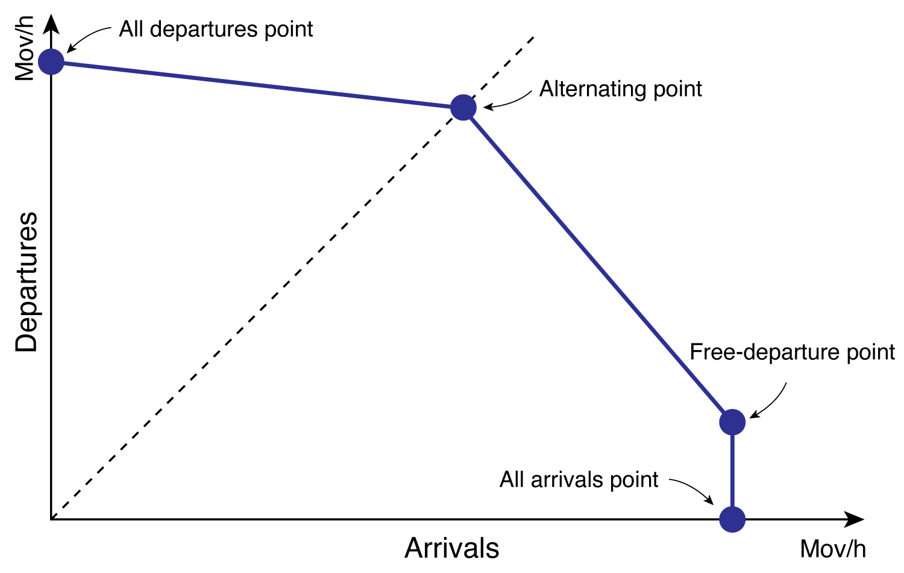
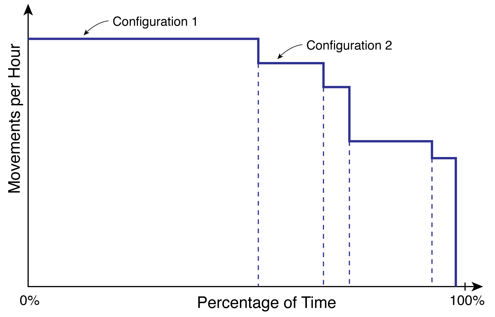
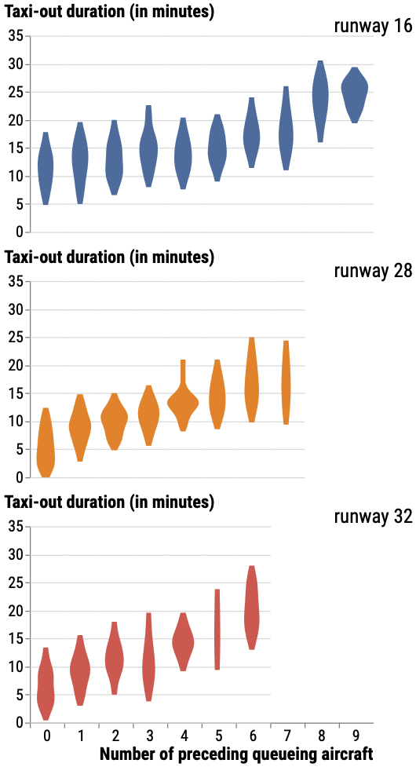

Capacity is a fundamental concept in engineering and operations management. In general, capacity describes the maximum amount of work, traffic, or demand that a system can accommodate during a specified period while maintaining an acceptable level of performance. Exceeding this capacity typically results in increased delays, reduced efficiency, and, in extreme cases, unstable system behaviour.

A distinction is commonly made between static and dynamic capacity. **Static capacity** refers to the theoretical maximum capacity determined solely by the physical characteristics of a system. For example, the number of aircraft stands at an airport or the number of security screening lanes in a terminal represent static capacity constraints. **Dynamic capacity**, in contrast, considers the actual operating conditions under which the system is used. Factors such as weather, equipment failures, maintenance activities, traffic composition, operational procedures, and human performance may significantly reduce the achievable capacity below its theoretical limit.

An airport consists of numerous interconnected subsystems, including the runway system, taxiway system, apron, passenger terminals, baggage handling facilities, and the surrounding airspace. Each of these subsystems possesses its own capacity, which may vary over time depending on operational conditions. Since aircraft,  passengers, baggage, etc. must pass through several of these subsystems during their journey, the overall airport capacity is constrained by the subsystem with the lowest capacity. The limiting component can change during the day. A runway may be the bottleneck in peak arrival periods, while security screening, border control, baggage reclaim, or stand availability may dominate at other times. Consequently, increasing the capacity of a single subsystem does not necessarily increase the capacity of the airport as a whole if another subsystem remains the limiting bottleneck.

## Runway capacity

Runways usually represent the primary capacity constraint at an airport because every arriving and departing aircraft must use the runway system. The **maximum throughput capacity** (sometimes also referred to as the **saturation capacity**) represents the highest number of aircraft movements that can theoretically be accommodated per unit time under continuously saturated demand while maintaining safe operations. It assumes that aircraft are continuously available for departure or arrival and that the runway is utilised as efficiently as possible. The maximum throughput capacity depends on numerous operational factors, including the runway configuration, the *aircraft mix* (i.e. the proportion of small, medium, and large aircraft), the *movement mix* (i.e. the proportion of arrivals and departures), wake turbulence separation minima, runway occupancy times, arrival and departure procedures, weather conditions, and air traffic control procedures. As such, it represents the physical and operational limit of the runway system and does not consider service quality criteria such as acceptable delay levels, queue lengths, or schedule reliability.

In practice, airports are rarely operated at their maximum throughput capacity. As traffic demand approaches this theoretical limit, even small operational disturbances can result in rapidly increasing delays, growing queues, and unstable operations. Consequently, airport planners and operators often use alternative capacity definitions that explicitly account for the desired **level of service (LoS)**. Depending on the operational objective, several capacity measures can be distinguished:

 * **Practical hourly capacity:** The practical hourly capacity is the maximum number of aircraft movements that can be accommodated while maintaining an acceptable level of service. Traditionally, the FAA defines this level of service as an average delay of approximately four minutes per aircraft movement. Although this threshold is widely used, other acceptable delay values may be adopted depending on national regulations or local operational objectives.
 * **Sustained capacity:** The sustained capacity describes the throughput that can be maintained continuously over an extended period without causing excessive congestion or unstable operations. In practice, it is often assumed to correspond to approximately 90% of the maximum throughput capacity, although no universally accepted definition exists.
 * **Declared capacity:** The declared capacity is the operational capacity officially published by the airport, usually in coordination with the air navigation service provider. It specifies the maximum number of arrivals, departures, or total aircraft movements that may be scheduled during a given period under specified operating conditions. Unlike the maximum throughput capacity, the declared capacity incorporates operational, environmental, regulatory, and service quality considerations. It forms the basis for *airport schedule coordination* and *slot allocation* and is therefore the capacity measure most frequently encountered in everyday airport operations.

### Capacity envelopes

The maximum throughput capacity introduced above is often expressed as a single value, for example 50 aircraft movements per hour. While this is sufficient for runways used exclusively for arrivals or departures, it is inadequate for mixed-mode operations, where arrivals and departures compete for access to the same runway. In such cases, the achievable throughput depends not only on the total number of movements, but also on the proportion of arrivals and departures.

To overcome this limitation, Gilbo @gilbo1993airport proposed describing runway capacity not as a single value but as the set of all feasible arrival–departure combinations that a runway system can sustain over a given period. Graphically, this set is represented by the **capacity envelope**.

The horizontal axis of a capacity envelope represents the number of arrivals per hour, while the vertical axis represents the number of departures per hour. Every point inside the envelope corresponds to a feasible operating condition, whereas combinations outside the envelope cannot be sustained by the runway system. The envelope itself forms the **Pareto frontier**, indicating the maximum achievable departure rate for every arrival rate, and vice versa, under a given runway configuration.

{#fig-capacity-envelope-single width=100%}

For a single-runway airport, four characteristic operating points can usually be identified on the envelope:

* **All-arrivals point:** The runway is used exclusively for arrivals. This point defines the maximum achievable arrival rate.
* **Free-departures point:** The arrival rate remains at its maximum while air traffic controllers exploit naturally occurring gaps between arriving aircraft to insert occasional departures. Since these departures do not reduce the arrival throughput, they are often referred to as *free departures*.
* **Alternating point:** This point typically represents a balanced movement mix of 50% arrivals and 50% departures.
* **All-departures point:** The runway is used exclusively for departures. This point defines the maximum achievable departure rate.

Some of these characteristic points, particularly the all-arrivals and all-departures points, can be estimated using analytical runway-capacity models. The complete envelope, however, generally requires either extensive historical operational data or detailed simulation models.

In practice, a separate capacity envelope exists for every combination of runway configuration and prevailing operating conditions. Weather plays a particularly important role. Under *visual flight rules (\acr{VFR})*, aircraft may operate with shorter separation distances, resulting in a larger capacity envelope. Under *instrument flight rules (\acr{IFR})*, larger separation minima reduce the achievable throughput, and the corresponding envelope is therefore smaller. At airports with multiple runway configurations, each configuration has its own characteristic capacity envelope. 

<!--Capacity Envelope Estimation-->
::: {.callout-note}
### Estimation of Capacity Envelope using Opensky Network Trajectory Data

A capacity envelope can be estimated empirically from historical arrival and departure counts, as documented by Gilbo @gilbo1993airport. 

The estimation begins with historical arrival and departure flight lists for the airport of interest, ideally covering at least one full year. The data are then aggregated into fixed time intervals, for example one-hour intervals. For each interval, the number of arrivals and departures is counted. Each interval therefore becomes one point in the arrival-departure plane, with arrivals on the horizontal axis and departures on the vertical axis.

Since many arrival-departure combinations occur repeatedly, the frequency of each combination can be determined. Combinations that occur frequently are interpreted as representative of normal operations, whereas combinations that occur only once or very rarely are treated with caution. Following Gilbo's approach, rare extreme observations are rejected before estimating the capacity envelope. The remaining observations are then used to identify the non-dominated points, that is, points for which no other observed point exists with both an equal or greater number of arrivals and an equal or greater number of departures.

These non-dominated points form the empirical frontier of the observed operational performance. Rather than using the absolute outermost frontier, a percentile-based envelope can be selected, for example an envelope that contains 95% or 99% of all observations. This produces a robust estimate of practical capacity that represents typical peak operations while remaining insensitive to isolated outliers. The resulting frontier can then be simplified for readability and plotted together with the observed arrival-departure combinations.

{#fig-capacity-envelope-trajectory width=100%}

@fig-capacity-envelope-trajectory illustrates the result for a full year of OpenSky Network flight-list data. The dense central cloud represents frequently observed operating conditions, while the more isolated points near the outer boundary correspond to rare high-throughput combinations. The estimated envelope encloses the main feasible operating region and indicates the approximate trade-off between arrivals and departures. In this example, the envelope suggests that the airport can sustain high departure rates when arrival demand is low, but that the achievable departure rate decreases as the number of arrivals increases.

The resulting envelope should always be interpreted in relation to the data used to estimate it. It reflects the runway configurations, weather conditions, demand patterns, operational restrictions, and data quality present in the historical sample. If these conditions vary strongly, separate envelopes should ideally be estimated for different runway configurations, weather categories, or operating concepts.
:::

### Capacity coverage charts

A *capacity envelope* describes the operational capability of a runway system for a certain **runway configuration**, i.e., the combination of runways that are assigned to arrivals and departures under a specific operating concept. In reality, airports rarely operate with only one runway configuration throughout the year. Changes in wind direction, visibility, cloud ceiling, runway maintenance, or other operational constraints often require airports to switch between different runway configurations, each of which has its own capacity envelope and corresponding throughput. 

It is therefore desirable to estimate not only the capacity of an individual runway configuration, but also the *overall capacity of the airport throughout an entire year*. This is the purpose of the **\acr{CCC}**. A \acr{CCC} combines the capacities of all runway configurations with the probability that each configuration occurs. The result is a graphical representation of the airport's capacity under varying operational conditions throughout the year. 

To construct a \acr{CCC}, the balanced operating point is first determined for each runway configuration. This corresponds to the point where arrivals and departures are approximately equally balanced (i.e. a movement mix of 50% arrivals and 50% departures). Next, historical operational data are used to determine how frequently each runway configuration is operated throughout the year. The balanced capacity associated with each configuration is then weighted by its probability of occurrence. Repeating this procedure for all runway configurations yields the \acr{CCC}.

{#fig-capacity-coverage-chart width=100%}

The horizontal axis of the \acr{CCC} represents the cumulative percentage of time for which a given runway throughput can be achieved, whereas the vertical axis indicates the corresponding hourly runway throughput. Each horizontal step corresponds to one runway configuration and its associated balanced capacity. The width of each step represents the proportion of time during which the corresponding runway configuration is operated, while the height indicates its balanced hourly throughput.

\acr{CCC}s are particularly useful for long-term airport planning because they provide considerably more information than a single capacity value. They indicate not only the maximum achievable throughput, but also the proportion of time during which this throughput can be expected. Airports whose \acr{CCC}s remain nearly horizontal experience only small capacity variations throughout the year. In contrast, airports with pronounced step-like charts exhibit substantial capacity fluctuations caused by changing runway configurations or weather conditions.

## Taxiway capacity

Although runways are the primary capacity constraint at most airports, the taxiway system can also become a significant bottleneck. Aircraft departing from their stands and aircraft arriving after landing share often the same network of taxiways. Congestion on this network increases taxi times, fuel consumption, emissions, and ultimately reduces the efficiency of airport operations. Taxiway capacity therefore describes the ability of the airport surface network to accommodate aircraft movements while maintaining acceptable taxi times and avoiding excessive queues.

Unlike runway capacity, taxiway capacity cannot easily be expressed as a single number of aircraft movements per hour. Instead, it is commonly assessed using operational performance indicators such as taxi times, queue lengths, aircraft densities, and traffic flows on individual taxiway segments. Among these measures, the **unimpeded taxi time** plays a particularly important role because it provides a reference against which observed taxi performance can be compared.

The unimpeded taxi time is the time an aircraft requires to taxi between its stand and the runway under ideal operating conditions, when congestion, adverse weather, and other operational disturbances are negligible. It therefore represents the baseline taxi time that can be expected for a particular route through the airport surface network. 

In reality, the observed taxi time is usually longer than the unimpeded taxi time because aircraft interact with one another while taxiing. Departing aircraft may have to wait behind slower aircraft, give way at intersections, or queue before entering the runway. Consequently, the observed taxi-out time can be regarded as the sum of three components:

- the **unimpeded taxi time**, representing taxiing under free-flow conditions,
- the **additional taxiway delay**, caused by interactions with other aircraft on the taxiway system, and
- the **runway queue delay**, representing the waiting time before take-off. 

Since the unimpeded taxi time cannot usually be observed directly, it is commonly estimated statistically. Following the approach proposed by Simaiakis and Balakrishnan @Simaiakis_Balakrishnan_2009, the observed taxi-out time is modelled as a function of the departure queue length using a simple linear regression model. The intercept of the regression corresponds to the estimated unimpeded taxi time, while the slope indicates the average increase in taxi-out time caused by each additional aircraft waiting for departure.

<!-- Unimpeded Taxi-Out Time -->
::: {.callout-note}
### Estimating the Unimpeded Taxi-Out Time from ADS-B Surface Trajectories

The estimation procedure is illustrated in @fig-taxi-out-time using ADS-B surface trajectory data collected at Zurich Airport by Olive et al. @olive2025assessing. The violin plots show the observed taxi-out times for departures from runways 16, 28, and 34 as a function of the departure queue length. The spread of each violin reflects the natural variability in taxi-out times caused by different parking positions, push-back durations, and operational conditions. A linear regression model is fitted to the observations for each runway. The intercept of the regression ($\hat{\beta}_0$) corresponds to the estimated **unimpeded taxi-out time**, while the slope ($\hat{\beta}_1$) represents the average increase in taxi-out time caused by each additional aircraft waiting in the departure queue.

{#fig-taxi-out-time width=75%}

| Parameter | Runway 16 | Runway 28 | Runway 34 |
|:----------|----------:|----------:|----------:|
| **Unimpeded taxi-out time $\hat{\beta}_0$ [min]** | **12.08** | **6.24** | **7.47** |
| Increase per additional aircraft $\hat{\beta}_1$ [min/aircraft] | 1.03 | 2.12 | 2.34 |
| $R^2$ | 0.199 | 0.398 | 0.302 |
: Estimated regression coefficients for the unimpeded taxi-out time model. Adapted from Olive et al. @olive2025assessing. {#tbl-unimpeded-times}

The estimated unimpeded taxi-out times differ considerably between the three runways. Runway 28 exhibits the shortest unimpeded taxi-out time (approximately 6.2 min) because it is located closest to the main terminal area, whereas runway 16 requires substantially longer taxi distances, resulting in an estimated unimpeded taxi-out time of approximately 12.1 min. The regression slopes indicate that each additional aircraft in the departure queue increases the expected taxi-out time by approximately 1.0 to 2.3 minutes, depending on the departure runway.
:::

Once the unimpeded taxi time has been estimated, it can be used as a baseline for evaluating airport surface performance. The difference between the observed taxi time and the unimpeded taxi time provides a direct measure of the additional delay caused by congestion. Consequently, airports often monitor unimpeded taxi times over time and compare them with observed taxi times to identify congestion, evaluate operational changes, and assess the effectiveness of measures intended to improve the efficiency of surface operations.

## List of Acronyms {.unnumbered}
