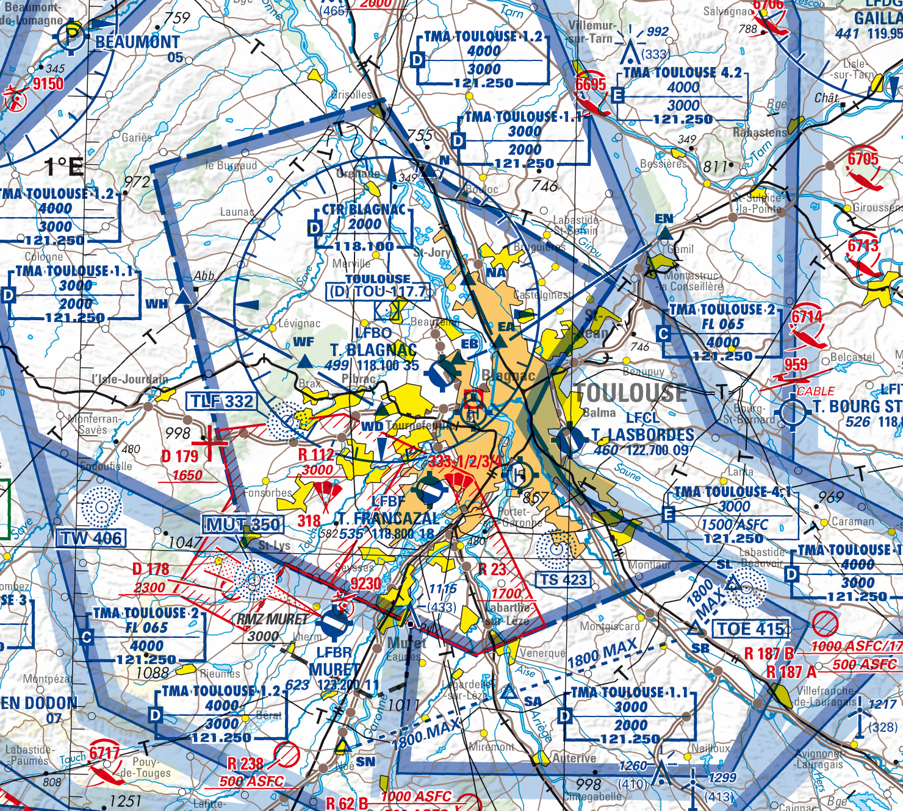

Air traffic services turn the institutional framework of air navigation into operational control. This page introduces the services provided to aircraft, the distinction between flight rules, the way separation is applied, and the flow-management mechanisms used when demand exceeds available capacity.

## Air Traffic Services

**\acr{ATS}** represent the core operational component of air traffic management, providing direct, real-time control and guidance of aircraft throughout all phases of flight. According to [ICAO Annex 11][Annex_11], ATS encompasses four distinct but interconnected services that work together to ensure the safe, orderly, and expeditious flow of air traffic.

The four main services provided under ATS are:

- [Air Traffic Control Service (ATC)](#air-traffic-control-service): The primary service responsible for preventing collisions between aircraft and between aircraft and obstacles on the maneuvering area, while optimizing air traffic operations for maximum efficiency
- [Flight Information Service (FIS)](#flight-information-service): Provides pilots with information useful for the safe and efficient conduct of flights
- [Alerting Service (ALRS)](#alerting-service): Notifies appropriate organizations regarding aircraft in need of search and rescue aid
- [Air Traffic Advisory Service](#air-traffic-advisory-service): Provides advice and information to aircraft operating in advisory airspace where ATC service is not available

[Annex_11]: https://www.bazl.admin.ch/dam/bazl/en/dokumente/Fachleute/Regulationen_und_Grundlagen/icao-annex/icao_annex_11_airtrafficservices.pdf.download.pdf/an11_cons.pdf

### Flight rules

To ensure that airspace is managed efficiently and effectively by ATC, flights are categorized according to the **flight rules** they follow. Flights operate under either **\acr{VFR}** or **\acr{IFR}**.

Flights under **Visual Flight Rules (VFR)** follow the principle of "see and avoid". Flight crews are responsible for maintaining visual separation from other aircraft and obstacles by looking outside the cockpit. VFR flights can only operate when meteorological conditions permit adequate visibility and cloud clearance. These conditions are referred to as **Visual Meteorological Conditions (VMC)**.

Flights under **Instrument Flight Rules (IFR)** rely on both their instruments and air traffic control for navigation and separation. Flight crews are not required to maintain visual separation to other aircraft, as ATC provides separation services between IFR flights. IFR flights can operate in lower visibility conditions, known as **Instrument Meteorological Conditions (IMC)**.
With the exception of **special VFR (SVFR)**[^1] operations, when an aircraft conducts VFR flights although VMC are not met, flights must operate under IFR in IMC.

Besides differentiating between VFR and IFR flights, controlled airspace is classified into specific **airspace classes** that define which types of flight may use the airspace, under which circumstances flights may enter this airspace, and which services are offered to aircraft in this airspace.

::: {#airspace-classes}

The International Civil Aviation Organization (ICAO) defines in [Annex 11][Annex_11] seven airspace classes, labeled A through G, with a fundamental distinction between **Controlled Airspace (Classes A-E)** where ATC provides services to aircraft, and **Uncontrolled Airspace (Classes F-G)** where no ATC services are provided.

Airspace classes differ in the type of flight allowed to enter and operate therein. While \acr{IFR} flights are allowed to operate in all airspace classes, VFR flights are prohibited from using airspace Class A. Moreover, flights require an **ATC clearance** to enter certain airspace classes. If a clearance is required, pilots must contact ATC and request clearance before entering the airspace. As such, IFR and (if applicable) VFR flights require an ATC clearance for airspace Classes A, B, C, and D. In airspace Class E, only IFR aircraft require a clearance, while VFR flights are exempt from this obligation.

[^1]: Special VFR (SVFR) flights are only allowed in controlled airspace, in which (i) the minimum visibility must be at least 1500m, (ii) ground must be visible at all times, and (iii) aircraft must be clear of clouds. Aircraft operating SVFR flights must be equipped as if they conducted an IFR flight.

| Airspace Class | Flight Types Allowed | ATC Clearance Required    |
|----------------|----------------------|---------------------------|
| A              | IFR only             | Yes (IFR)                 |
| B              | IFR and VFR          | Yes (both)                |
| C              | IFR and VFR          | Yes (both)                |
| D              | IFR and VFR          | Yes (both)                |
| E              | IFR and VFR          | Yes (IFR, SVFR), No (VFR) |
| F              | IFR and VFR          | No                        |
| G              | IFR and VFR          | No                        |

The airspace classes described above are established by the [Chicago Convention on International Civil Aviation](https://www.icao.int/publications/Documents/7300_cons.pdf) and are applicable to all states that have ratified this convention. However, this does not mean that every airspace class must be implemented by every state. Rather, each state has the flexibility to design its own airspace structure and determine which airspace classifications to apply within its sovereign territory.

For example, Italy uses airspace classes A, C, D, E, and G, while Germany, Austria, and Switzerland implement classes C, D, E, and G. In France, classes B and F are not utilized, and class A is restricted to the Paris region only. The French Upper Traffic Area, spanning from Flight Level (FL) 195 to FL 660, is designated as class C airspace: **\acr{ATC}** provides comprehensive services to all aircraft, ensuring separation between \acr{IFR} flights and between \acr{IFR} and \acr{VFR} flights. While \acr{VFR} flights are not separated from each other by \acr{ATC}, they do receive traffic information about other \acr{VFR} operations to enhance situational awareness.

:::

::: {.callout-tip}
##### A practical illustration

VFR pilots need VFR aeronautical maps for flight planning to identify controlled airspace requiring \acr{ATC} clearance, during flight for navigation and airspace awareness, and for training purposes. The following excerpt from an VFR aeronautical map shows controlled airspace around Toulouse, France.

{style="min-width: 60%; max-width: 500px; display: block; margin: 0 auto;"}

The major commercial airport is Toulouse-Blagnac, identified as LFBO. The **Control Zone (CTR)** extends from surface to 2,000 ft above mean sea level (AMSL) and is classified as class D airspace. The larger **Terminal Manoeuvring Area (TMA)** manages complex traffic flows with different airspace classes (C, D, and E) at various altitude levels.

VFR pilots operating from smaller airports, such as Toulouse-Lasbordes (LFCL) to the east of the city, use this map to identify altitude boundaries and airspace classifications. This information tells them where ATC clearances are required and what services are available. For example, pilots can see that from surface to 1,500 ft ASFC (above surface), they are operating below the TMA and do not interfere with Blagnac airport operations.

:::

### Air Traffic Control Service

**Air Traffic Control (ATC)** Service represents the most demanding and safety-critical component of air traffic services. Controllers work in specialized facilities using advanced surveillance systems (e.g., radar systems), communication equipment, and standardized procedures to maintain safe separation between aircraft while facilitating efficient traffic flow.

The fundamental principle of ATC is **separation assurance**, i.e., ensuring that aircraft maintain safe distances from each other at all times. Controllers achieve this through: **tactical separation**: real-time adjustments to aircraft paths, speeds, and altitudes to resolve conflicts; **strategic separation**: planned routing and timing to prevent conflicts from developing; or **contingency management**: immediate response to emergencies, equipment failures, or weather events.

::: {#separation}

ATC service is mandatory for all flights operating in controlled airspace, which includes airspace Classes A through E. The level of service provided varies depending on the airspace class and flight rules being followed.

| Airspace Class | Flight Rules | Separation provided                              |
|----------------|--------------|--------------------------------------------------|
| A              | IFR only     | Between all IFR flights                          |
| B              | IFR, VFR     | Between all flights                              |
| C              | IFR          | Between all flights                              |
| C              | VFR          | Between IFR and VFR flights                      |
| D              | IFR          | Between IFR flights                              |
| D              | VFR          | No separations (traffic information only)        |
| E              | IFR          | Between IFR flights                              |
| E              | VFR          | No separations (traffic information only)        |
| F              | IFR, VFR     | Between IFR flights, as far as practicable       |
| G              | IFR, VFR     | No separations                                   |

To prevent collisions between aircraft, ATC uses **separation minima**: specified minimum vertical and lateral distances that must be maintained between aircraft at all times. The specific separations provided depend on both the airspace class and the flight rules under which aircraft are operating.

Typical separation distances depend on the radar coverage and airspace type:

- **En-route airspace**: 10-20 nmi (long-range radar) or 5 nmi (European core area)
- **Terminal airspace**: 3 nmi near airports
- **Precision radar areas**: 2.5-2 nmi in airport proximity

In addition to lateral (horizontal) separation, controllers must also maintain **vertical separation** between aircraft. Standard vertical separation minima are:

- **1,000 feet** between aircraft below FL290 (Flight Level 290, approximately 29,000 feet)
- **2,000 feet** between aircraft at or above FL290 (reduced to 1,000 feet in RVSM airspace)

**Reduced Vertical Separation Minima (RVSM)** airspace allows 1,000 feet vertical separation between FL290 and FL410, increasing capacity and efficiency in busy airspace. Outside RVSM, the traditional 2,000 feet separation applies at these altitudes. For an aircraft to be permitted to enter and operate in RVSM airspace, its technical equipment must meet a number of requirements. Among other things, aircraft must be equipped with at least two independent altimeters, a secondary surveillance radar (SSR) transponder capable of reporting altitude, and an autopilot capable of maintaining the assigned flight level.
:::

ATC operates 24/7 across three distinct operational environments, each requiring specialized training and procedures:

**Aerodrome Control** manages aircraft operations at airports, divided into two specialized functions. **Tower Control** coordinates takeoffs, landings, and aircraft movements in the immediate airport vicinity. Tower controllers work from airport control towers with panoramic views of runways, taxiways, and surrounding airspace. **Ground Control** specifically manages aircraft and vehicle movements on taxiways, aprons, and other ground areas of the airport. At busy airports, ground controllers work separately from tower controllers to handle the complex coordination required for aircraft pushback, taxi operations, and ground support vehicle movements.

**Approach Control** handles aircraft during the critical transition phases between aerodrome and en-route operations. These controllers manage departing aircraft as they climb to cruising altitude and arriving aircraft as they descend for landing. Approach control typically covers airspace from the airport surface up to approximately 10,000-15,000 feet within a 20-50 mile radius of major airports.

**Area Control (En-route Control)** manages aircraft during the cruise phase of flight, typically above 18,000 feet and across vast geographical areas. Area controllers work in [area control centres](airspace-structure.qmd#area-control-centres), managing aircraft as they traverse airways and navigate between airports hundreds or thousands of miles apart.

Controllers usually work by pairs:

- The **executive controller**, or **tactical controller**, is primarily responsible for managing aircraft within the boundaries of the sector. Their main task is to ensure safe separation between aircraft in real time, using radar surveillance and direct radio communication with pilots. They issue clearances such as heading changes, altitude adjustments, or speed restrictions, responding dynamically to evolving situations such as unexpected traffic convergence, weather deviations, or aircraft requests. The tactical controller is the voice pilots hear most often during flight.

- The **planner controller**, or **coordinator**, is in constant communication with adjacent sectors, negotiating handovers and ensuring that aircraft are sequenced and spaced appropriately for entry into and exit from the controlled airspace. The planner controller anticipates potential conflicts before they enter the tactical window, helping to reduce workload for the executive controller and maintain an orderly flow of traffic. Depending on the specific traffic situation, these responsibilities can be handled by only one controller, who performs both the tasks assigned to the executive and planner controller. If needed, some tasks can also be delegated to a third controller, though this configuration is uncommon.

::: {.callout-tip}
# Controller responsibilities beyond separation

While separation assurance is the fundamental safety responsibility of air traffic controllers, their role extends far beyond maintaining safe distances between aircraft. Controllers actively **optimize operations** by sequencing traffic to maximize runway and airspace capacity. They provide **tactical guidance** such as speed adjustments, direct routings, and altitude optimizations to improve efficiency. Controllers also **communicate critical information** including weather updates, runway conditions, traffic advisories, and operational constraints. They **coordinate with multiple stakeholders** including pilots, other control positions, airline operations centers, and airport authorities. Finally, controllers **manage contingencies** such as weather deviations, equipment failures, medical emergencies, and irregular operations.

:::

### Flight Information Service

**Flight Information Service** represents a crucial informational component of air traffic services, providing pilots with essential data and advisories to support safe and efficient flight operations. Unlike ATC, which issues binding instructions and maintains separation responsibilities, FIS operates purely in an advisory capacity, disseminating information that pilots can use to make informed decisions about their flights.

FIS is universally available to all aircraft regardless of flight rules or airspace classification. Whether an aircraft operates under VFR or IFR, in controlled or uncontrolled airspace, pilots can access flight information services to enhance their situational awareness and operational safety.

<!--FIS controllers deliver services from various operational settings, adapting to local traffic demands and infrastructure. At busy airports with uncontrolled airspace, dedicated **\acrs{FISO}** may work from specialized facilities or airport towers. In remote or low-traffic areas, FIS may be integrated with other air traffic services or delivered through automated systems. These controllers primarily serve aircraft operating in uncontrolled airspace where no formal air traffic control service is available.-->

The service covers several categories of information critical to flight operations:

**Meteorological information**. FIS provides pilots with current weather observations, forecasts, and significant weather phenomena along their route. This includes surface weather reports (**METAR**), terminal aerodrome forecasts (**TAF**), area forecasts covering broader geographical regions, and significant meteorological information (**SIGMET**) warnings about hazardous weather conditions such as severe turbulence, thunderstorms, or volcanic ash. Information about wind conditions, visibility, precipitation, cloud coverage, temperature, and barometric pressure settings  helps pilots assess flight conditions and make routing decisions.

**Airfield and navigation information** keeps pilots informed about runway conditions, including surface contamination, construction activities, and temporary closures. The service also provides information about the runway in use, potential updates on wildlife hazards, particularly bird activity that may pose collision risks during takeoff and landing phases. The service also provides updates on the operational status of navigation aids, including **VOR**, **DME**, and **ILS** systems, alerting them to equipment outages that might affect their planned routes or approaches.

**Traffic information** services provide pilots with details about other aircraft operating in their vicinity when such information enhances safety awareness. Unlike ATC separation services, traffic information remains purely advisory and pilots retain full responsibility for maintaining their own separation from other aircraft and making appropriate collision avoidance decisions.

::: {.callout-tip}
#### Aerodrome Flight Information Service (AFIS)

At some smaller airports without full air traffic control services, **\acr{AFIS}** provides a specialized form of flight information service tailored to aerodrome operations. AFIS operators, working from airport control towers or dedicated facilities, provide pilots with essential information about aerodrome conditions, traffic movements, and local weather without issuing control instructions or clearances. AFIS typically operates at airports in uncontrolled airspace (Class F or G) where traffic volume justifies information services but not full air traffic control.
:::

**Operational information** covers a broad range of data affecting flight operations, including temporary airspace restrictions, military exercise areas, parachuting activities, and other special use airspace activations. Pilots also receive information about airport operational changes, such as modified operating hours or temporary service limitations.

**Emergency and safety information** includes \acrs{NOTAM} that deliver urgent operational updates, including obstacle alerts, airport construction impacts, or procedural modifications. FIS also distributes information regarding search and rescue activities, security-imposed airspace limitations, and other critical safety developments. A \acr{NOTAM} provides information essential to flight operations personnel. Unlike \acrs{AIP} that contain relatively stable information with extended validity periods known well in advance, \acr{NOTAM}s convey dynamic information that cannot be predicted sufficiently early for publication through other means.
As defined by [ICAO Annex 15][Annex_15], \acr{NOTAM} is defined as "a notice distributed by means of telecommunication containing information concerning the establishment, condition or change in any aeronautical facility, service, procedure or hazard, the timely knowledge of which is essential to personnel concerned with flight operations."

Modern FIS delivery increasingly incorporates digital systems alongside traditional voice communications. **Automatic Terminal Information Service (ATIS)** broadcasts provide standardized airport information on dedicated VHF frequencies, while digital data link systems can deliver weather and operational updates directly to aircraft systems. However, human operators remain essential for providing tailored information, interpreting complex situations, and responding to specific pilot requests.

[Annex_15]: https://www.bazl.admin.ch/dam/bazl/en/dokumente/Fachleute/Regulationen_und_Grundlagen/icao-annex/icao_annex_15_aeronauticalinformationservices.pdf.download.pdf/an15_cons.pdf

### Alerting Service

**Alerting Service** represents a critical safety net within air traffic services, designed to identify aircraft that may be in distress and initiate appropriate emergency response procedures. This service operates continuously, monitoring all flights within controlled airspace and maintaining vigilance for situations that might indicate an aircraft emergency.

The alerting service activates when specific conditions suggest an aircraft may require assistance. **Overdue aircraft** trigger alerts when they fail to arrive at their destination within a specified time after their estimated arrival, indicating potential navigation problems, fuel exhaustion, or other emergencies. **Communication failures** prompt alerting procedures when aircraft cannot establish or maintain required radio contact with air traffic control, suggesting equipment malfunctions or crew incapacitation. **Emergency signals** including distress calls, emergency transponder codes (such as 7700 for general emergency, 7600 for communication failure, or 7500 for hijacking/unlawful interference), or emergency locator transmitter activations immediately initiate alerting protocols.

The service employs a graduated response system with three escalating phases of emergency response. The **Uncertainty Phase (INCERFA)** activates when doubt exists about an aircraft's safety, such as when an aircraft is overdue by 30 minutes or fails to report at a mandatory reporting point. The **Alert Phase (ALERFA)** begins when apprehension exists for aircraft and occupant safety, typically when an aircraft is significantly overdue or reports serious operational difficulties. The **Distress Phase (DETRESFA)** initiates when reasonable certainty exists that an aircraft and its occupants face grave and imminent danger, such as confirmed emergency landings or ditching procedures.

Upon activation, the alerting service coordinates with **Search and Rescue Coordination Centers (RCC)** and other appropriate organizations to mobilize rescue resources. This coordination includes military and civilian aviation assets, maritime rescue services, ground-based emergency teams, and international rescue organizations when aircraft cross national boundaries. The service maintains detailed flight plan information and aircraft tracking data to provide rescue teams with accurate last-known positions, aircraft specifications, fuel endurance, and passenger manifests.

### Air Traffic Advisory Service

**Air Traffic Advisory Service** provides informational support to aircraft operating in designated advisory airspace where full air traffic control service is not available. This service fills a critical gap in areas where traffic density or infrastructure limitations make comprehensive ATC coverage impractical, yet aircraft still benefit from coordinated information sharing.

Advisory airspace typically covers remote regions, oceanic areas, or transitional zones between controlled airspace sectors. Unlike controlled airspace where ATC issues binding instructions and assumes separation responsibility, advisory airspace operates on an informational model where pilots retain full responsibility for navigation and collision avoidance while receiving valuable situational awareness data.

The service provides several categories of information to enhance flight safety. **Traffic information** alerts pilots to other known aircraft operating in the advisory area, including position reports, altitude information, and intended routes. **Weather updates** relevant to the advisory airspace help pilots make informed routing decisions and prepare for changing conditions. **Navigational advisories** may include information about the operational status of navigation aids or temporary restrictions affecting normal routing.

Controllers delivering advisory services coordinate with aircraft to collect and disseminate position reports, creating a shared operational picture that benefits all users of the airspace. When potential traffic conflicts are identified, controllers provide **suggested routing** or timing adjustments that pilots may choose to accept or modify based on their operational judgment.

Advisory service proves particularly valuable in oceanic and remote continental areas where radar coverage is limited or unavailable. In these regions, pilots rely heavily on procedural separation techniques and position reporting, making the information-sharing function of advisory service essential for maintaining situational awareness across vast distances.

The procedural nature of advisory service requires precise communication protocols and standardized reporting formats. Aircraft operating in advisory airspace typically follow established reporting points and time intervals, ensuring that traffic information remains current and actionable for all participants in the shared airspace.

## Air Traffic Flow Management

\acr{ATFM} focuses on optimizing traffic flows to prevent congestion and delays while maximizing the utilization of available airspace capacity. **Traffic flow analysis** involves monitoring and predicting traffic patterns to identify potential bottlenecks before they occur. When capacity is exceeded, **flow control measures** are implemented to manage traffic through restrictions such as ground delays or rerouting. **Collaborative decision making** ensures coordination with airlines and airports to minimize the impact of these measures on operations.

**Dynamic capacity management** represents a key operational component of ATFM, involving real-time adjustments to airspace configuration based on traffic demand and operational conditions. In high-traffic situations, sectors can be **split** into smaller units, each staffed by additional controllers to distribute workload and increase capacity. Conversely, during low-traffic periods, multiple small sectors may be **combined** into larger ones, optimizing controller utilization and reducing operational costs. This dynamic reconfiguration must also account for **restricted zones, military operations areas, and weather events**, all of which can require immediate adjustments to sector boundaries or traffic routing to maintain safety and efficiency.

Before a commercial flight departs, a [**flight plan**](<https://skybrary.aero/articles/flight-plan>) is filed with the intended route, requested levels, departure and destination aerodromes, estimated times, aircraft capabilities, and other operational details. For air traffic services, the flight plan is not just an administrative document: it is the basis for anticipating demand, checking route availability, coordinating sectors, and activating alerting procedures if the flight becomes overdue.

During operation, the filed route may be amended. Controllers can issue directs, headings, level changes, speed instructions, or reroutings to maintain separation, sequence traffic, avoid weather, or reduce delay. Flow-management units may also require rerouting or ground delay before departure when demand exceeds available capacity.

The published route structure itself—airways, waypoints, \acr{SID}, \acr{STAR}, and free-route concepts—is described in [Flight Information Regions and airspace structure](airspace-structure.qmd#route-and-airway-structure). In this chapter, the focus is on how those routes are used tactically and strategically by \acr{ATS} and \acr{ATFM}.

## Glossary {.unnumbered}
