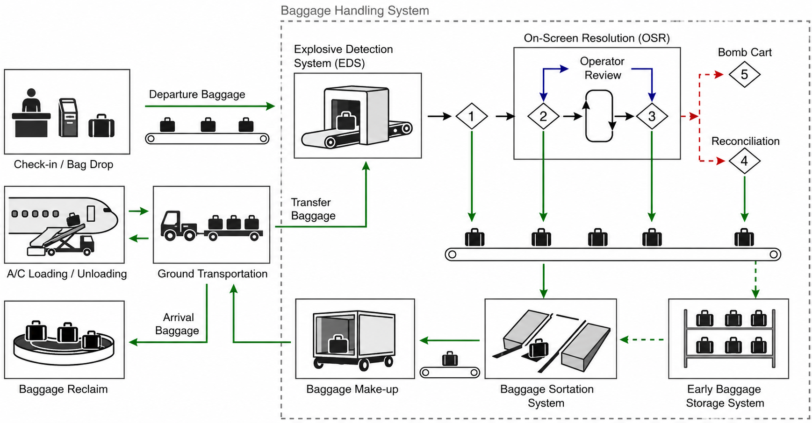

A **\acrfull{BHS}** is the integrated set of manual and automated equipment used to transport, screen, sort, store, and route checked baggage within an airport. It connects passenger-facing facilities, such as check-in, bag drop, and baggage reclaim, with airside processes such as aircraft loading, aircraft unloading, transfer baggage handling, and baggage make-up. The \acr{BHS} therefore forms a critical interface between passenger building operations, aviation security, apron operations, and aircraft turnaround, ensuring that checked baggage is transported efficiently between passenger processing areas, aircraft stands, transfer connections, and baggage reclaim.

The main purpose of a \acr{BHS} is to ensure that every checked bag reaches the correct aircraft, or the correct reclaim belt, safely and within the required time. This sounds simple, but in practice it is a demanding operational task. Bags enter the system at different times, they belong to different flights, they may need to be security screened, they may need to be stored temporarily, and they must eventually be delivered to the correct make-up position, baggage cart, unit load device, or reclaim belt. A disruption in the \acr{BHS} can delay aircraft departures, increase the number of mishandled bags, and reduce the quality of the passenger experience.

From a planning perspective, a \acr{BHS} is also important because it requires substantial space inside or below the passenger building. Conveyor belts, screening machines, sorting systems, early baggage storage, make-up positions, reclaim belts, and service roads must be integrated into the terminal layout. The design of the \acr{BHS} therefore has a direct influence on the vertical and horizontal organisation of passenger buildings.

{#fig-bhs-layout}

## Baggage flows
As illustrated in @fig-bhs-layout, a \acr{BHS} must handle three main baggage flows: **departure baggage**, **arrival baggage**, and **transfer baggage**.

**Departure baggage** belongs to local outbound passengers. These bags are accepted at check-in or at self-service bag drop, injected into the baggage handling system, security screened, sorted according to the outbound flight, and delivered to a make-up position. At the make-up position, bags are consolidated and loaded either into baggage carts or into unit load devices. They are then transported to the aircraft and loaded into the aircraft hold.

**Arrival baggage** follows the opposite direction. Bags are unloaded from the arriving aircraft, transported from the stand to the baggage reclaim area, and delivered to passengers via reclaim belts. The baggage reclaim system must provide sufficient belt frontage and circulation space so that passengers can wait for, identify, and collect their bags without excessive congestion.

**Transfer baggage** belongs to passengers connecting from one flight to another. These bags are unloaded from the inbound aircraft and routed through the \acr{BHS} to the outbound sorting and make-up process. Transfer baggage is particularly important at hub airports because it strongly influences the minimum connecting time. If transfer bags cannot be moved from the inbound flight to the outbound flight reliably within the available connection time, the connection may be operationally infeasible even if passengers can walk from gate to gate quickly enough.

Security screening requirements depend on the origin and security status of the baggage. Under the **one-stop security** concept, transfer baggage arriving from an airport with recognised equivalent security standards may be treated as already screened. In that case, it does not need to be re-screened at the transfer airport. Re-screening is required if the baggage originates from an airport without recognised equivalent security standards, or if the security integrity of the baggage cannot be guaranteed.

## Components of a baggage handling system
Although the exact configuration differs between airports, most baggage handling systems consist of several recurring subsystems. These include induction points at check-in or bag drop, conveyor systems, explosive detection systems, on-screen resolution stations, sorting equipment, make-up positions, baggage transport equipment, reclaim systems, and sometimes early baggage storage, see @fig-bhs-layout.

The individual components are not independent. The throughput of the \acr{BHS} is determined by the interaction of all subsystems. A high-capacity sorting system is of limited use if the screening system is the bottleneck. Similarly, sufficient screening capacity does not guarantee good performance if bags accumulate at make-up positions or if transfer routes are too long.

In the following, the most important components of a baggage handling system are described in more detail:

 * **Check-in and bag drop induction**: The baggage process starts when a checked bag is accepted into the system. This may happen at a conventional check-in counter, a staffed bag drop counter, an automatic bag drop, or an early bag drop facility. The bag is identified by a baggage tag, which links it to a passenger, a flight, and a destination. The tag allows the \acr{BHS} to route the bag through the system. 
  The induction area must interface with both the passenger process and the technical baggage system. From the passenger perspective, there must be sufficient queuing and circulation space. From the baggage perspective, the induction points must feed bags into the conveyor system at a rate that can be handled by downstream screening and sorting equipment.

 * **Conveyor system**: The conveyor system transports bags between the different components of the \acr{BHS}. It can include belt conveyors, vertical lifts, merges, diverters, tunnels, shafts, and recirculation loops. Conveyor layout is especially important in large passenger buildings where check-in, screening, sorting, make-up, reclaim, and aircraft interfaces may be located on different levels or in different parts of the building.
  Long conveyor distances increase travel time and system complexity. This is particularly relevant for transfer baggage because transfer time is limited. The conveyor system must therefore be designed not only for capacity, but also for travel time, reliability, access for maintenance, and redundancy in case individual components fail.

 * **Explosive detection and on-screen resolution:** Departure baggage, and some transfer baggage, must be security screened before it can be loaded onto an aircraft. This is carried out by **explosive detection systems** (\acr{EDS}). An \acr{EDS} scans checked baggage using advanced screening technology and automated image analysis. Its purpose is to detect explosives or other dangerous objects inside baggage.

::: {.callout-note}
The baggage screening process can be described as a sequence of levels:

1. **Level 1, automated screening:** Every bag is screened by the \acr{EDS}. If the automated system clears the bag, the screening process is complete and the bag continues through the \acr{BHS}. If the system cannot clear the bag, the bag is sent to the next level.
2. **Level 2, on-screen resolution:** A human operator reviews the screening image. This process is called **on-screen resolution** (\acr{OSR}). If the operator clears the bag, it continues through the system. If not, it proceeds to further inspection.
3. **Level 3, manual inspection:** The bag is physically opened and inspected by authorised personnel. If the bag is cleared, it may continue. If a prohibited or dangerous item is identified, further action is required.
4. **Level 4, reconciliation:** The bag is inspected in the presence of the passenger, or a formal reconciliation process is initiated. The purpose is to clarify the situation and decide whether the item can be removed, confiscated, or otherwise handled safely.
5. **Level 5, serious threat handling:** If the item is assessed as posing an immediate and serious threat, the bag is transferred to a bomb cart or other specialised containment procedure.
:::

 * **Baggage sorting**: After security screening, departing and transfer baggage must be assigned to the correct outbound flight. This is the task of the **baggage sorting system**. The sorting system reads the baggage tag, identifies the flight or make-up destination, and routes the bag to the appropriate make-up position.
  Sorting can be manual, semi-automated, or highly automated. Manual sorting requires comparatively little technical infrastructure, but it relies heavily on ground handling staff. It can be suitable for small airports or airports with low labour costs. Automated sorting systems require higher capital investment, but they can provide high throughput and reduce operational labour requirements. Important automated sorting technologies include:
     - **Tilt-tray sorters**, where bags are transported on trays that tilt at the appropriate location to discharge the bag.
     - **Cross-belt sorters**, where each carrier has a small belt that can move sideways to discharge the bag.
     - **Pusher or diverter systems**, where bags are moved from the main conveyor onto another belt or chute by a mechanical pusher.
  The choice of sorting technology depends on traffic volume, available space, required reliability, cost, and the degree of automation desired by the airport. Large airports usually require high-throughput automated sortation. Smaller airports may be able to operate with simpler and more manual systems.

 * **Make-up positions and transport to the aircraft**: After sorting, bags are delivered to **make-up positions**. A make-up position is the location where bags for an outbound flight are collected and prepared for loading. The bags are then loaded either onto baggage carts or into unit load devices. Three common types of make-up systems can be distinguished:
     - **Chute systems:** Bags are delivered via gravity-fed chutes to the make-up area. Chutes are often used in automated systems. A single flight may be assigned to one or more chutes depending on aircraft size and baggage volume.
     - **Lateral systems:** Bags are delivered on lateral conveyor belts. Like chute systems, laterals are often assigned to specific flights and allow a relatively automated consolidation process.
     - **Carousel systems:** Bags for several flights may be delivered to the same carousel. Ground handling staff must then manually separate bags and load them onto the correct cart or into the correct container. Carousel systems can provide good capacity, but they require more manual sorting at the make-up position.

   Once bags have been consolidated, they must be transported from the make-up area to the aircraft. For narrow-body aircraft, bags are often transported loose on baggage carts or dollies and loaded using belt loaders. For wide-body aircraft and some high-volume operations, bags may be loaded into **\acr{ULD}**. \acr{ULD}-based handling can reduce loading time and improve turnaround performance, but it requires appropriate container loaders, dollies, storage space, and compatible aircraft.

 * **Arrival baggage and baggage reclaim**: Arrival baggage is unloaded from the aircraft and transported to the baggage reclaim area. The reclaim system must provide sufficient capacity for the expected arrival baggage flow. Capacity depends not only on the number of bags, but also on belt frontage length, passenger circulation space, the number of simultaneous arrivals, and the time profile of baggage delivery.
  A reclaim belt must provide enough accessible frontage so that passengers can wait, identify their bags, and remove them safely. Wide-body aircraft usually require longer belt frontage than narrow-body aircraft because the number of bags is larger. Additional circulation space is required between belts so that passengers can move with trolleys and luggage without blocking other passengers.
  Arrival baggage also influences the layout of customs facilities and arrivals halls. At international airports, passengers usually collect their baggage before passing through customs. The baggage reclaim area must therefore connect naturally to customs and then to the public arrivals hall, while still maintaining the required separation between restricted-access and public-access areas.

 * **\acr{EBS}**: An \acr{EBS} system is used when bags enter the \acr{BHS} long before they are needed for make-up. This can happen when passengers check in very early, use evening-before check-in, or drop off baggage several hours before departure.
  The \acr{EBS} acts as a temporary buffer. Bags are stored until they are released back into the baggage handling process at the appropriate time. This prevents early bags from occupying make-up positions too soon and helps smooth the demand placed on downstream sorting and make-up facilities.
  Different \acr{EBS} concepts exist. Some systems use automated storage and retrieval technology, while others use simpler lane storage or conveyor-based buffers. The main design parameters are storage capacity, retrieval throughput, insertion throughput, reliability, and required floor space. Typical \acr{EBS} throughput rates are relatively low, often around 100 to 200 bags per hour. This must be taken into account because the \acr{EBS} itself can become a bottleneck if too many bags need to be retrieved within a short time window.

## Integration into passenger buildings
The \acr{BHS} can be integrated into a passenger building in different ways. A common distinction is between **ground-level integration** and **underground integration**.

With ground-level integration, the \acr{BHS} is located on the same general level as many passenger and apron processes. This solution is often cheaper and easier to construct, especially at smaller airports. However, it can create conflicts with passenger flows, service roads, technical rooms, and arrivals processes. In single-level terminals, the \acr{BHS} may have to be routed around passenger circulation areas or through constrained spaces.

With underground integration, major parts of the \acr{BHS} are located below the passenger building. This frees valuable terminal floor area for passenger functions and commercial uses. It can also help separate baggage flows from passenger flows. However, underground construction is expensive and technically complex. It requires shafts, tunnels, lifts, access routes for maintenance, fire safety provisions, and structural design that accommodates heavy equipment.

Large and complex passenger buildings often use multi-level baggage systems. Check-in may be located on an upper level, while screening and sortation take place below. Make-up positions may be located at apron level, reclaim belts may be placed on a passenger-accessible arrivals level, and transfer baggage routes may run through tunnels or technical corridors. This vertical distribution can improve operational separation, but it increases conveyor length, travel time, installation cost, and maintenance complexity.

The \acr{BHS} is therefore not a secondary technical system that can be added after the passenger building has been designed. It is a key driver of the passenger building layout. Its space requirements, structural loads, conveyor routes, maintenance access, and operational interfaces must be considered from the earliest planning stages.

## Glossary {.unnumbered}
