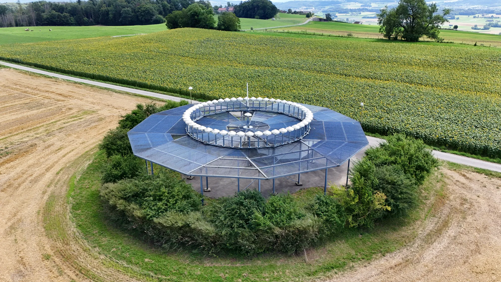

Conventional radio navigation relies on ground stations and airborne receivers. These systems shaped the structure of airways, terminal procedures, and instrument approaches for decades. Many are now being rationalised as [satellite navigation](satellite-navigation.qmd) becomes dominant, but they remain important as operational references, approach aids, and backups to \acr{GNSS}.

## Non-Directional Beacon (NDB)

The \acr{NDB} is a ground-based transmitter that radiates a simple, omnidirectional signal in the low and medium frequency bands, typically between **$190$ and $535~\mathrm{kHz}$**. In some regions, operation extends to higher frequencies, but the majority of aeronautical \acr{NDB} are confined to this internationally allocated band. \acr{NDB} are channelized at $1$ or $2~\mathrm{kHz}$ intervals, and each beacon is identified by a short Morse code identifier transmitted in the **$400–1020~\mathrm{Hz}$ audio band**.

An \acr{NDB} works in conjunction with the aircraft’s \acr{ADF}. The \acr{ADF} needle points toward the beacon, giving the pilot a bearing relative to the aircraft’s heading. When combined with the aircraft’s magnetic compass, this provides a magnetic bearing to or from the station. Because the system only provides a direction, without distance, pilots often use \acr{NDB} in combination with other navigation aids or time–distance calculations.

The system is technically straightforward, based on the physical properties of a loop antenna, but subject to a number of errors. These include **night effect**, caused by ionospheric reflections after sunset; **coastal refraction**, where signals bend as they cross shorelines; and **terrain or structural interference**, which can distort the bearing. Lightning and precipitation static can also disturb reception. Under good conditions the expected accuracy is **about $\pm 5^\circ$**, but actual errors can be considerably greater.

Coverage depends strongly on transmitter power and the conductivity of the ground or sea path. Locator \acr{NDB} (L) near airports typically have a range of $15$ to $25~\mathrm{nm}$, while larger en-route \acr{NDB} can reach $50~\mathrm{nm}$ or more.

For decades \acr{NDB} were widely used for en-route navigation, non-precision approaches, and as locator beacons associated with the [\acr{ILS}](#instrument-landing-system-ils). In most operational environments, however, \acr{NDB} are regarded as a legacy aid in the process of being phased out.

## VHF Omnidirectional Range (VOR)

The \acr{VOR} is a ground-based azimuth navigation aid that gives an aircraft its magnetic bearing from a station. It became one of the foundations of conventional airways, terminal procedures, and non-precision approaches after the Second World War.

\acr{VOR} operates between **$108.0$ and $117.95~\mathrm{MHz}$**, with part of the lower band shared with [\acr{ILS}](#instrument-landing-system-ils) localizers. Each station transmits a reference signal and a variable signal; the phase difference between them encodes the radial on which the aircraft lies. The station also transmits a short Morse-code identifier, normally repeated at regular intervals.

Because \acr{VOR} is a \acr{VHF} line-of-sight system, coverage depends on altitude and terrain. At cruising altitude a station may be usable out to around $200~\mathrm{nm}$, but local siting matters. Reflections from terrain, buildings, or wind turbines can introduce multipath errors, and directly overhead the station there is a cone of silence where no reliable bearing is available.

Two main designs are used. A \acr{CVOR} produces the variable signal with a rotating directional pattern, while a \acr{DVOR} synthesises the rotation electronically with a circular antenna array. \acr{DVOR} is less sensitive to site-dependent errors and generally gives more stable bearing information.

Operationally, a single \acr{VOR} radial provides lateral guidance. Combined with [\acr{DME}](#distance-measuring-equipment-dme), a VOR/DME site gives both azimuth and slant-range distance; two radials from different stations can also be used to fix position. This made \acr{VOR} central to airways, \acr{SID}, \acr{STAR}, and many non-precision approaches.

The standard total system accuracy is about **$\pm 4^\circ$**, adequate for conventional navigation but not for modern \acr{RNP} specifications. As aviation moves toward \acr{GNSS}-based \acr{PBN}, many states are reducing their VOR networks while preserving a \acr{MON} as a backup in case of satellite-navigation outages.

{#fig-vor-zue width=600px}

::: {.callout-tip}
### See also

- [Flight inspections](../case_studies/flight-inspections.qmd) for how VOR and other navigation aids are checked in practice
- [Decode VOR signals](../case_studies/decode-vor.qmd) for a simple example of how to receive and decode VOR signals with a software-defined radio

:::

## Distance Measuring Equipment (DME)

\acr{DME} is a ground-based aid that gives the aircraft its distance from a station. It operates in the \acr{UHF} band between **$960$ and $1215~\mathrm{MHz}$** and is usually paired with a \acr{VOR} or an [\acr{ILS}](#instrument-landing-system-ils). In a paired installation, selecting the \acr{VOR} or localizer frequency also selects the associated \acr{DME} channel.

The system uses an **interrogator–transponder** principle. The aircraft sends coded pulse pairs to the ground station; the station replies after a fixed delay; and the airborne equipment computes distance from the round-trip travel time. \acr{DME} channels use different pulse-pair spacings, commonly 12 microseconds for X channels and 36 microseconds for Y channels.

Several aircraft can use the same station at the same time because each interrogator transmits with a slightly irregular, pseudo-random timing pattern. The receiver then looks for replies that match its own pattern and ignores the rest. This correlation process lets a single \acr{DME} transponder interleave replies for many users without assigning a separate frequency to each aircraft.

::: {.callout-tip}
### Slant range effect

\acr{DME} measures **slant range**: the straight-line distance between aircraft and station, not the horizontal ground distance. The difference is usually negligible far from the beacon, but it becomes visible close to the station and at high altitude. An aircraft directly over a \acr{DME} station, for example, will still indicate a distance roughly equal to its height above the station.
:::

\acr{DME} accuracy is high for conventional navigation: \acr{ICAO} specifies about **$\pm 0.2~\mathrm{NM}$ plus $5\%$ of distance**. Coverage is broadly line-of-sight, as for other high-frequency radio aids, and the system is relatively robust against many forms of interference.

Operationally, \acr{DME} adds range information to otherwise angular aids. VOR/\acr{DME} gives both radial and distance from one site, \acr{ILS}/\acr{DME} gives distance along the final approach, and networks of \acr{DME} stations can also support area navigation. This makes \acr{DME} one of the conventional aids most likely to remain in service as a backup and complement to \acr{GNSS}.

::: {.callout-note}
### From VOR radials to DME/DME positioning

As many \acr{VOR} stations are slowly decommissioned, conventional navigation is shifting from station-centred angular guidance toward distance-based positioning. In a **DME/DME** solution, the aircraft measures its range from two or more \acr{DME} stations with known coordinates. The intersection of these distance circles gives the aircraft position, much like a two-dimensional form of trilateration. Modern flight management systems can use this automatically as an area-navigation sensor, either as a complement to \acr{GNSS} or as a fallback when satellite navigation is unavailable.
:::

## Instrument Landing System (ILS)

The \acr{ILS} is the most widely used precision approach aid in aviation. It provides both lateral and vertical guidance to enable safe landings in conditions of reduced visibility. An \acr{ILS} consists of three main components:

- the **\acr{LOC}** for lateral guidance,
- the **\acr{GS}** for vertical guidance, and, historically,
- **marker beacons** for range information.

The \acr{LOC} operates in the frequency band between **$108.10$ and $111.95~\mathrm{MHz}$**, using only odd $100~\mathrm{kHz}$ channels to avoid interference with the \acr{VOR}. It provides lateral guidance by transmitting two overlapping lobes with $90~\mathrm{Hz}$  and $150~\mathrm{Hz}$ modulation. The aircraft determines whether it is left or right of the runway centerline by comparing these signals. Coverage typically extends $25~\mathrm{NM}$ within $\pm 10^\circ$ of the centerline and $17~\mathrm{NM}$ within $\pm 10^\circ$.

{#fig-ils-fra width=600px}

The \acr{GS} operates between **$329$ and $335~\mathrm{MHz}$**, automatically paired with the tuned \acr{LOC} frequency. It provides vertical guidance by transmitting overlapping signals above and below the desired glide path. The standard descent angle is about $3^\circ$, with coverage extending $10~\mathrm{NM}$ up to $1.75^\circ$ above and $0.45^\circ$ below the nominal path.

{#fig-ils-tls width=500px}

<!--{#fig-ils-ams width=600px}-->

In the past, **marker beacons** operating at $75~\mathrm{MHz}$ provided range information along the approach path (outer, middle, and inner markers). Today, many of these have been decommissioned and replaced by \acr{DME}, which gives more flexible and accurate distance information.

\acr{ILS} performance is defined in terms of **categories**, which correspond to different minima:

| Category     | Decision Height (DH)                                   | Runway Visual Range (RVR) |
|--------------|--------------------------------------------------------|---------------------------|
| **CAT I**    | Not lower than $200~\mathrm{ft}$                       | $\geq 550~\mathrm{m}$     |
| **CAT II**   | Not lower than $100~\mathrm{ft}$                       | $\geq 300~\mathrm{m}$     |
| **CAT IIIa** | Below $100~\mathrm{ft}$ or no DH                       | $\geq 200~\mathrm{m}$     |
| **CAT IIIb** | No DH                                                  | $\geq 75~\mathrm{m}$      |
| **CAT IIIc** | No DH (zero visibility operations, not implemented)    | No limit                  |

<!-- DH & RVR -->
::: {.callout-note}
#### Decision Height and Runway Visual Range

**Decision Height (DH)** is the height above the runway touchdown zone at which, during a precision approach, the pilot must decide whether sufficient visual reference is available to continue the approach. If the required visual reference has not been established, a missed approach must be initiated.

**Runway Visual Range (RVR)** is the horizontal distance over which a pilot on the runway centreline can see the runway surface markings or the lights delineating the runway or its centreline. RVR is expressed in metres (or feet).
:::

The \acr{ILS} provides extremely high accuracy, with typical deviations at threshold within $±25~\mathrm{m}$ laterally and $±7.5~\mathrm{m}$ vertically for CAT I, and tighter tolerances for CAT II/III operations.

The system has clear advantages: it is a mature, proven technology, certified worldwide, and capable of supporting landings in very low visibility. However, it also has limitations. It is expensive to install and maintain, requires extensive protected areas free from obstacles to prevent multipath interference, and can only serve one approach direction per runway. Buildings, terrain, or even large aircraft near the antennas can cause signal distortions.

::: {.callout-tip}
### Critical and Sensitive Areas

\acr{ILS} signals are highly precise but easily disturbed by obstacles and moving objects:

- **Critical area**: the region around the \acr{LOC} and \acr{GS} antennas where no movement of aircraft or vehicles is allowed when the \acr{ILS} is in use.
- **Sensitive area**: a wider zone where movements are restricted during low-visibility operations (CAT II/III).

**Implication for aviation**: Airports must protect \acr{ILS} installations with strict ground movement procedures. Pilots may be instructed to hold short of critical areas to ensure the integrity of guidance for arriving traffic.
:::

Although the \acr{ILS} remains the global standard for precision approaches, future developments are moving toward satellite-based landing systems. [\acr{GBAS}](#gbas-landing-system-gls) and \acr{GLS} offer the potential for flexible, high-precision approaches without the need for dedicated \acr{ILS} installations at each runway end. Nevertheless, the \acr{ILS} is expected to remain in service for the foreseeable future, especially at major airports where high traffic density demands robust precision guidance.

::: {.callout-note}
### From ILS beams to satellite-based approaches

The same transition is visible for precision approaches. \acr{ILS} gives excellent guidance, but each runway direction needs its own localizer and glide-slope installation, with protected areas that constrain airport operations. Newer systems move the reference from fixed radio beams to the aircraft position itself. With **\acr{GLS}**, a local \acr{GBAS} station monitors \acr{GNSS} signals, broadcasts corrections and integrity information, and lets the aircraft fly an approach path computed from corrected satellite positioning. One ground installation can therefore support several runway ends and more flexible approach geometries. In practice, \acr{ILS} and \acr{GLS} will coexist for a long time: \acr{ILS} remains the trusted baseline for low-visibility operations, while \acr{GLS} offers a path toward less infrastructure per approach and more adaptable procedures.
:::

## Precision approach systems

Precision approach systems provide coupled lateral and vertical guidance to touchdown, supporting low-visibility operations. Historically, this role has been fulfilled by the \acr{ILS}. Modern alternatives use satellite navigation with local or wide-area augmentation to deliver equivalent performance at lower infrastructure cost and with more flexible procedure design. In this section we discuss the \acr{ILS}, the \acr{GBAS}-based landing system (\acr{GLS}), and the microwave landing system (MLS). For the \acr{GLS} and the [MLS](#microwave-landing-system-mls), we highlight how they compare with \acr{ILS}.

### GBAS Landing System (GLS)
The \acr{GLS} represents the satellite-based successor to the \acr{ILS}. At its core is the \acr{GBAS}, an installation at the airport that continuously monitors \acr{GNSS} signals using a precisely surveyed antenna array. From these measurements, \acr{GBAS} calculates real-time corrections and transmits them to aircraft via a \acr{VDB}. The flight management system applies these corrections to the onboard \acr{GNSS} position and generates precision approach guidance that is equivalent to that of the \acr{ILS}.

A single \acr{GBAS} installation can support a large number of approach procedures to multiple runway ends, a major advantage over \acr{ILS}, which requires separate installations for each direction. This allows airports to design flexible approach paths, including curved or offset trajectories, to mitigate noise or terrain constraints. \acr{GLS} procedures appear in the cockpit as selectable approaches, much like an \acr{ILS}, but they are flown using the corrected \acr{GNSS} position rather than a localizer and glide slope beam.

Operationally, \acr{GLS} is already certified for Category I minima at several airports, with Category II and III capability in advanced development. The system also reduces the size of the critical and sensitive areas that must be protected from multipath interference, increasing operational efficiency on the ground. However, \acr{GLS} is dependent on the availability and integrity of \acr{GNSS}, making it necessary to retain conventional \acr{ILS} installations as a resilient backup. For these reasons, \acr{GBAS} and \acr{GLS} are seen not as an immediate replacement of \acr{ILS} but as a gradual complement, with the potential to become the principal precision approach system as equipage and confidence grow.

### Microwave Landing System (MLS)
The Microwave Landing System was developed in the late twentieth century as a successor to the \acr{ILS}, intended to overcome its limitations in multipath susceptibility and fixed approach geometry. Operating in the microwave band between $5031$ and $5091~\mathrm{MHz}$, MLS employs time-referenced scanning beams to provide precise azimuth and elevation guidance, together with back-azimuth signals for missed approaches. The system is complemented by a precision \acr{DME}, which delivers highly accurate slant-range distance measurements.

Unlike \acr{ILS}, which confines aircraft to a narrow corridor aligned with the runway, MLS offers wide capture angles and flexible approach geometries. It can support curved and segmented approaches, a capability that was particularly attractive for airports with terrain constraints or complex runway layouts. Technically, MLS was capable of supporting Category III minima, with better resistance to multipath and fewer restrictions on protected areas compared to \acr{ILS}.

Despite these advantages, the large-scale deployment of MLS never materialized. The cost of replacement, combined with ongoing improvements to \acr{ILS} siting and signal processing, and the rapid development of \acr{GNSS}-based augmentation systems, meant that civil aviation authorities worldwide largely retained \acr{ILS} as the standard. Today, MLS remains in use only in niche environments, including certain military applications and specialized civil operations. In most of the world, it is considered a transitional technology that was overtaken by the parallel emergence of satellite-based precision approach systems such as \acr{GLS}.

## Glossary {.unnumbered}
