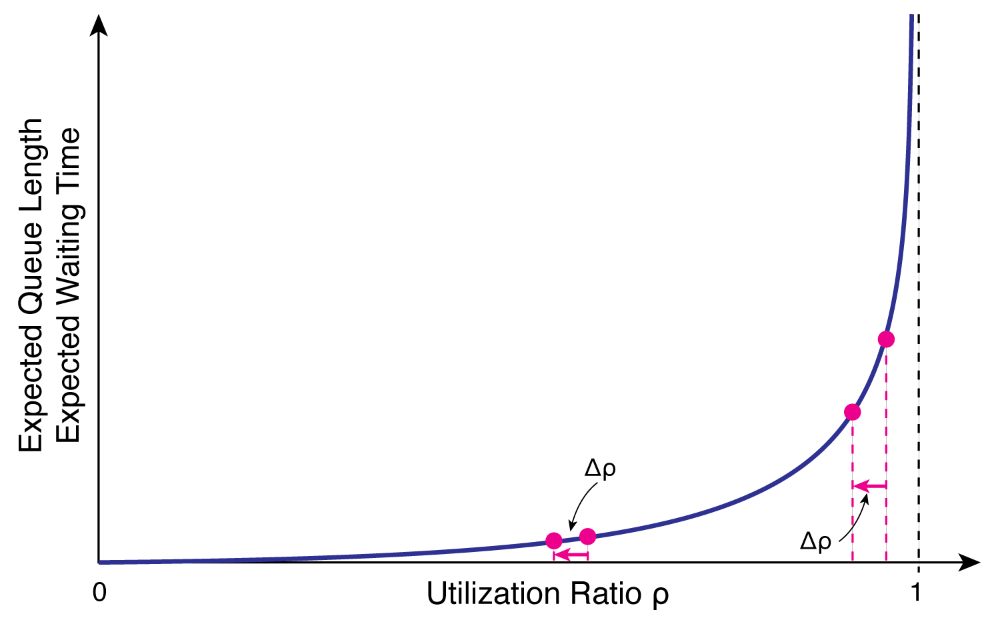

Demand management balances demand for airport resources with available capacity. It is needed because airlines, passengers, aircraft, gates, runways, and ground handlers all compete for constrained time and space.

## Queueing systems

Almost every subsystem of an airport can be viewed as a **queueing system**. Aircraft waiting for departure, passengers at security screening, baggage moving through a baggage handling system, or vehicles entering airport parking facilities all compete for limited processing resources.

A simple queueing system consists of two basic **elements**: a **queue** and one or more **servers**. The queue provides a waiting area for entities (e.g. aircraft, passengers, or baggage) whenever all servers are occupied, while the servers provide the service required to process the entities.

In addition, every queueing system is characterised by two **processes**. The **arrival process** describes how entities enter the system, whereas the **service process** specifies how they are processed by the servers before leaving the system. The rate at which entities enter the system is described by the *arrival rate* $\lambda$, whereas the average number of entities that can be processed by a single server per unit time is given by the *service rate* $\mu$. For a queueing system consisting of $c$ parallel servers, the **utilization ratio** is defined as

$$
\rho = \frac{\lambda}{c\mu},
$$

where $\rho$ expresses the proportion of the available service capacity that is being utilised. A value of $\rho = 0.5$ indicates that the system operates at 50% of its capacity, while $\rho = 1$ corresponds to a fully utilised system. In practice, queueing systems should generally operate below full utilisation, as random fluctuations in the arrival and service processes may otherwise lead to rapidly increasing queues and delays.

<!-- Hockey Stick Curve -->
::: {.callout-note}
### The hockey stick curve

One might intuitively expect that delays increase approximately linearly as the utilization ratio increases. In reality, this is not the case. For many queueing systems operating under normal conditions, the *expected waiting time* $E[W_q]$ and the *expected queue length* $E[L_q]$ increase approximately in proportion to

$$
E[W_q],\,E[L_q] \propto \frac{1}{1-\rho}.
$$

As the utilization ratio $\rho$ approaches one, the denominator becomes increasingly small, causing both the expected waiting time and the expected queue length to increase rapidly. This characteristic non-linear relationship is commonly referred to as the **hockey stick curve** because of its distinctive shape.

{#fig-hockey-stick width=100%}

The utilization ratio can approach one in three different ways:

 * **Increasing the arrival rate ($\lambda$):** More aircraft, passengers, or baggage enter the system while the available processing capacity remains unchanged.
 * **Decreasing the service rate ($\mu$):** The servers require more time to process each entity, for example due to adverse weather, equipment failures, or reduced staffing levels.
 * **Decreasing the number of servers ($c$):** The available processing capacity is reduced, for example when a runway is closed for maintenance, security lanes are temporarily unavailable, or baggage screening equipment is taken out of service.

In all three cases, the utilization ratio increases towards one. As a result, queues and waiting times increase disproportionately, even if the underlying change in demand or capacity is relatively small. Conversely, reducing the utilization ratio has a much greater effect when the system is already operating close to its capacity than when it is lightly loaded. For example, reducing the utilization ratio from 0.95 to 0.90 can substantially reduce queues and delays, whereas the same reduction from 0.55 to 0.50 has only a minor effect. This non-linear behaviour explains why even relatively small reductions in demand can lead to significant improvements in airport performance during congested periods.
:::

## Implications of the hockey stick curve for airport delay

The hockey stick curve has important implications for the planning and operation of airports. Although a runway, security checkpoint, baggage handling system, or other airport subsystem may theoretically be capable of operating at its maximum throughput capacity, continuously operating close to this limit (i.e., close to a utilization ratio of $\rho = 1$) is generally undesirable. 

At high utilization levels, even small disturbances can lead to rapidly increasing queues and delays. Such disturbances occur continuously during airport operations. Examples include aircraft arriving slightly ahead of schedule, passengers requiring additional screening time, adverse weather conditions, equipment failures, or temporary reductions in staffing levels. While these events may individually appear insignificant, their effects accumulate when the utilization ratio is already high. As a result, waiting times increase disproportionately and queues may continue to grow long after the original disturbance has disappeared.

For airports, this behaviour has several important consequences. Increased waiting times at one subsystem often propagate throughout the airport because most operational processes are interconnected. For example, long departure queues may delay aircraft push-back, which in turn increases stand occupancy and can delay arriving aircraft waiting for a parking position. Similarly, congestion at security screening may delay passengers reaching their departure gates, potentially delaying the boarding process and the subsequent aircraft departure.

The hockey stick curve therefore explains why airports are generally not designed or operated at their theoretical maximum throughput capacity. Instead, airport operators intentionally maintain a certain amount of spare capacity to absorb the inevitable fluctuations in demand and service rates that occur during normal operations. This is reflected in the distinction between the **maximum throughput capacity**, which represents the theoretical limit of the system, and the **practical** or **declared capacity**, which incorporates acceptable levels of delay and operational robustness (see Section on [Airport Capacity](airport-capacity.qmd)).

Maintaining spare capacity, however, is only one part of the solution. During peak periods, demand may still exceed the available capacity. In such situations, airports seek to manage demand in a way that minimizes delays and preserves stable operations. The methods used to achieve this objective are collectively referred to as **demand management** and are discussed in the following section.

## Demand management

Whenever traffic demand approaches or exceeds the practical capacity of an airport, airport operators have two fundamental options. They can either *increase the available capacity* or *manage the demand* placed on the existing infrastructure. Since expanding airport infrastructure typically requires substantial investments, lengthy planning procedures, and often faces environmental or political constraints, increasing capacity is usually only a long-term solution. In contrast, **demand management** can often be implemented much more quickly and therefore represents one of the most important tools for mitigating airport congestion.

Demand management comprises all operational, administrative, and economic measures that aim to keep demand compatible with the available airport capacity. Rather than attempting to maximise the number of aircraft movements at all times, the objective is to maintain a stable operating state in which delays remain predictable and the airport can recover quickly from disturbances. In other words, demand management seeks to keep the airport operating in the relatively flat part of the hockey stick curve, where small fluctuations in demand have only a limited impact on delays.

Depending on the planning horizon and the underlying cause of the capacity constraint, demand management measures can generally be grouped into three categories:

 * **Administrative demand management:** At permanently capacity-constrained airports, the number of scheduled aircraft movements is limited through airport slots. Airlines may only operate flights for which a slot has been allocated, ensuring that scheduled demand remains compatible with the airport's declared capacity. Schedule coordination is therefore the primary administrative tool for balancing demand and capacity.

 * **Operational demand management:** Temporary reductions in airport or airspace capacity are often managed through \acrfull{ATFCM} measures. In Europe, this is typically achieved by introducing an \acr{ATFM} regulation, whereby the \acr{EUROCONTROL} Network Manager assigns \acrfull{CTOT} to affected flights. Delaying aircraft at their departure airport rather than allowing them to queue in the air reduces fuel consumption, emissions, and controller workload while maintaining a safe and orderly traffic flow.

 * **Economic demand management:** Airports may influence airline behaviour through differentiated airport charges. Higher landing fees during peak periods and lower charges during off-peak periods encourage airlines to redistribute flights more evenly throughout the day, thereby reducing congestion during the busiest periods.

In practice, major airports rarely rely on only one type of demand management measure. Instead, they combine administrative, operational, and economic approaches to ensure that traffic demand remains compatible with the declared airport capacity while maintaining an acceptable level of service for airlines and passengers.

<!--
## Glossary {.unnumbered}
-->
