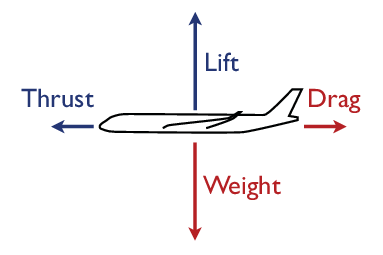
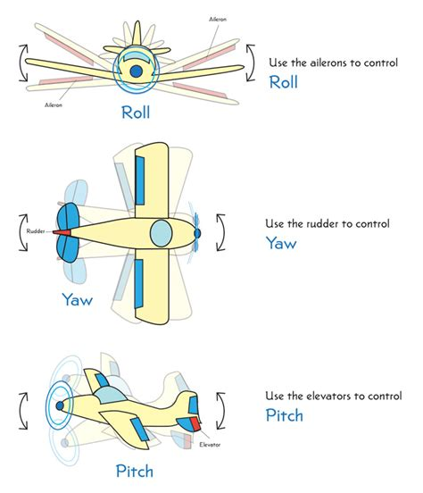
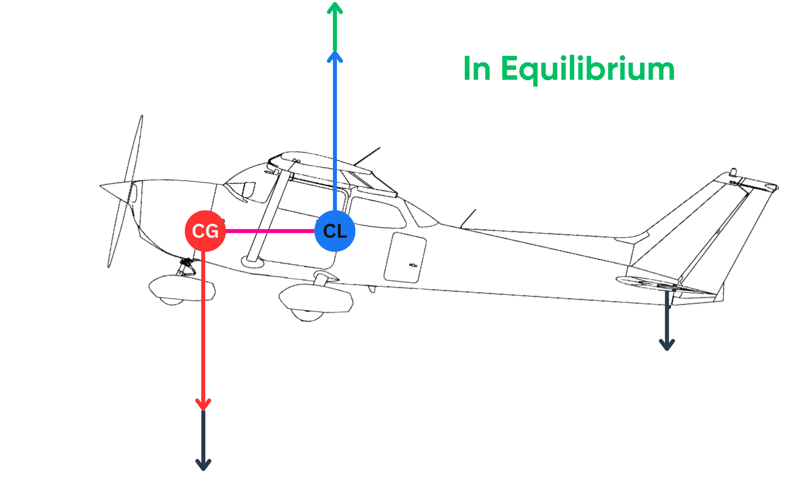

Flight mechanics explains why an aircraft can fly, how it manoeuvres, and why its motion is constrained by speed, mass, atmosphere, and configuration. We introduce here the basic concepts helpful for understanding aircraft performance and behaviour.

## Forces in flight

The movement of an aircraft is governed by four main forces:

- **Lift** acts approximately upward and is generated primarily by the wings as air flows around them. For a given aircraft configuration, lift depends on airspeed, air density, wing area, and angle of attack.

- **Weight** acts downward and is caused by the aircraft mass: structure, payload, passengers, cargo, and fuel.

- **Thrust** acts in the direction produced by the propulsion system. In most flight phases it is approximately forward.

- **Drag** acts opposite to the aircraft motion through the air. It includes parasite drag from the shape of the aircraft and induced drag associated with producing lift.

In straight and level, unaccelerated flight, these forces are in balance: lift equals weight, and thrust equals drag. During climb, descent, acceleration, deceleration, or turns, the balance changes and part of the available force or energy is used to change speed, altitude, or direction.

{#fig-equilibrium}

A useful first-order expression for lift is:

$$
L = \frac{1}{2}\rho V^2 S C_L
$$

where $\rho$ is air density, $V$ is true airspeed, $S$ is wing area, and $C_L$ is the lift coefficient. This equation explains why the same aircraft must fly faster when it is heavier, why performance changes with altitude, and why aircraft configuration matters during takeoff and landing.

## Speed definitions

Before discussing manoeuvres and limits, we need to distinguish the different speeds used in aviation. Aircraft interact with the air mass, while observers and surveillance systems often measure motion over the ground.

- the **ground speed** is the speed of the aircraft over the Earth surface;\
  The ground speed is the speed that matters for navigation and trajectory reconstruction, but it is affected by wind and is not directly related to aerodynamic forces.

- the **true airspeed (\acr[style=long-short,first_use=false]{TAS})** is the speed of the aircraft relative to the surrounding air mass;\
  The true airspeed is the speed that matters for aerodynamic forces, but it is not directly measured. It is derived from indicated airspeed and local air density.

- the **indicated airspeed (\acr[style=long-short,first_use=false]{IAS})** is the cockpit speed derived from dynamic pressure, before all corrections. It reflects aerodynamic loads and stall margin better than ground speed;
- the **calibrated airspeed (\acr[style=long-short,first_use=false]{CAS})** is the indicated airspeed corrected for instrument and position errors;
- the **Mach number** is the ratio of \acr[style=long-short,first_use=false]{TAS} to local speed of sound.

At low altitude and low speed, these quantities may be close enough to feel interchangeable. At cruise altitude, they are very different. A jet may have a high true airspeed and ground speed while maintaining a much lower indicated airspeed because the air is less dense.

```{mermaid}
flowchart LR

  TAS["<b>True airspeed (TAS)</b><br><i>relative to air</i>"]:::airspeed
  Wind["<b>Wind</b><br><i>air mass motion</i>"]:::external
  GS["<b>Ground speed</b><br><i>relative to Earth</i>"]:::ground

  Rho["Air density"]:::external
  A["Speed of sound"]:::external
  Dyn["<b>Dynamic pressure</b><br><i>pitot system</i>"]:::pressure
  CAS["<b>Calibrated airspeed (CAS)</b><br><i>corrected pressure speed</i>"]:::cockpit
  IAS["<b>Indicated airspeed (IAS)</b><br><i>cockpit display</i>"]:::cockpit
  Mach["<b>Mach number</b><br><i>TAS / speed of sound</i>"]:::mach

  TAS --> GS
  Wind --> GS

  TAS --> Dyn
  Rho --> Dyn
  Rho --> A
  Dyn --> CAS
  CAS --> IAS
  TAS --> Mach
  A --> Mach

  classDef context fill:#f8f9fa,stroke:#adb5bd,color:#343a40,stroke-width:1px;
  classDef airspeed fill:#d0ebff,stroke:#1c7ed6,color:#0b3558,stroke-width:2px;
  classDef ground fill:#d3f9d8,stroke:#2f9e44,color:#0b3d1c,stroke-width:2px;
  classDef pressure fill:#fff3bf,stroke:#f08c00,color:#5f3700,stroke-width:2px;
  classDef cockpit fill:#ffe3e3,stroke:#e03131,color:#5c1111,stroke-width:2px;
  classDef mach fill:#e5dbff,stroke:#7048e8,color:#26114d,stroke-width:2px;
  classDef external fill:#e9ecef,stroke:#868e96,color:#343a40,stroke-width:1.5px;
```


## Attitude and control axes

Aircraft attitude is described around three rotational axes:

- **Pitch**: nose-up or nose-down motion, controlled mainly by elevators or stabilators;
- **Roll**: rotation around the longitudinal axis, controlled mainly by ailerons and sometimes spoilers;
- **Yaw**: nose-left or nose-right motion, controlled mainly by the rudder.

{#fig-pitch-roll-yaw}

These controls change aerodynamic forces rather than simply pointing the aircraft like a car. For example, pulling back on the control column usually increases pitch attitude and angle of attack; if airspeed and configuration allow, lift increases and the aircraft may climb or reduce its descent rate.

## Stability and centre of gravity

Aircraft must be controllable but also stable enough to be flown safely. A key concept is the position of the **centre of gravity** relative to the aerodynamic forces acting on the aircraft.

{#fig-centering}

If the centre of gravity is too far forward, the aircraft becomes nose-heavy and may require excessive elevator authority, especially during takeoff and landing. If it is too far aft, the aircraft may become difficult to recover from pitch disturbances. Loading systems therefore check that passengers, cargo, and fuel keep the centre of gravity within certified limits throughout the flight.

Modern fly-by-wire aircraft may be designed with reduced natural stability to improve efficiency or manoeuvrability. In that case, computers continuously command small control-surface movements to maintain handling qualities that would be difficult or impossible to maintain manually.

## Turns and load factor

A level turn is not produced by yaw alone. The aircraft first banks; the lift vector tilts, and its horizontal component curves the flight path. Because only the vertical component of lift supports the weight, the aircraft must generate more total lift in a level turn than in straight flight.

The load factor $n$ is the ratio between lift and weight:

$$
n = \frac{L}{W}
$$

In a coordinated level turn with bank angle $\phi$:

$$
n = \frac{1}{\cos \phi}
$$

A 60-degree bank therefore requires a load factor of 2: the aircraft and occupants experience twice their weight. This matters for trajectory analysis because tighter turns require higher bank angles, larger lift, and often more energy. It also matters for stall speed, which increases with load factor.

## Stall and angle of attack

A stall occurs when the wing exceeds its critical angle of attack. It is not primarily a question of flying too slowly in ground-speed terms; it is a question of the airflow separating from the wing because the angle of attack is too high. Speed is still important because, for a given weight and configuration, lower airspeed requires a higher lift coefficient and therefore a higher angle of attack.

The approximate stall speed relationship is:

$$
V_S = \sqrt{\frac{2W}{\rho S C_{L\max}}}
$$

This shows several important effects:

- a heavier aircraft stalls at a higher speed;
- lower air density increases the true airspeed required to generate the same lift;
- flaps and slats increase $C_{L\max}$ and reduce stall speed;
- manoeuvres increase the effective weight through load factor, raising stall speed by approximately $\sqrt{n}$.

This is why aircraft fly with high-lift devices extended during takeoff and landing, and why steep turns close to the ground leave little margin.

## Flight envelope

The **flight envelope** is the region in which an aircraft can be operated safely. It is bounded by aerodynamic, structural, propulsion, and operational limits. The exact envelope depends on aircraft type, mass, configuration, altitude, and atmospheric conditions.

Typical limits include:

- a **low-speed boundary**, where stall or insufficient control authority becomes limiting;
- a **high-speed boundary**, where compressibility, structural loads, flutter, or maximum operating speed become limiting;
- **load-factor limits**, which define how much positive or negative acceleration the structure can sustain;
- **altitude and thrust limits**, where climb performance decreases as air density and engine capability change.

For data analysis, the envelope is a useful sanity check. A reconstructed trajectory that implies impossible climb rates, extreme turn rates, or speeds outside a plausible range is usually a sign of data error, unit confusion, or an inappropriate model assumption.

## Connection with aircraft performance data

Flight mechanics provides the physical concepts; aircraft performance models turn those concepts into usable parameters and equations. The aircraft-performance chapter introduces point-mass models, BADA, OpenAP, kinematic speed schedules, dynamic thrust and drag models, fuel flow, and flight-envelope constraints.

See [Aircraft performance](../data_sources/aircraft-performance.qmd) for the data-source and modelling side of these concepts.

## Glossary {.unnumbered}
