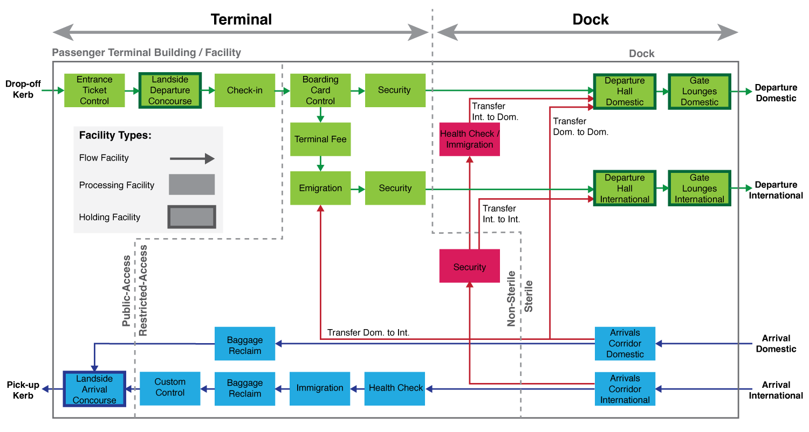
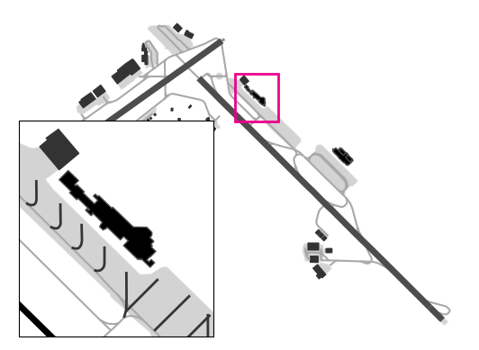
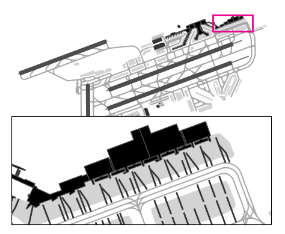
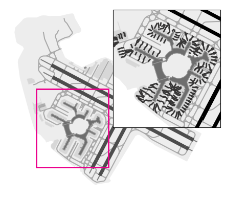
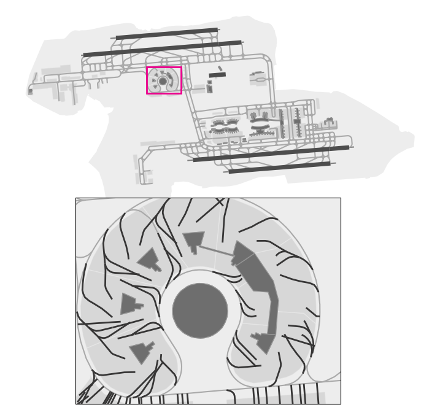
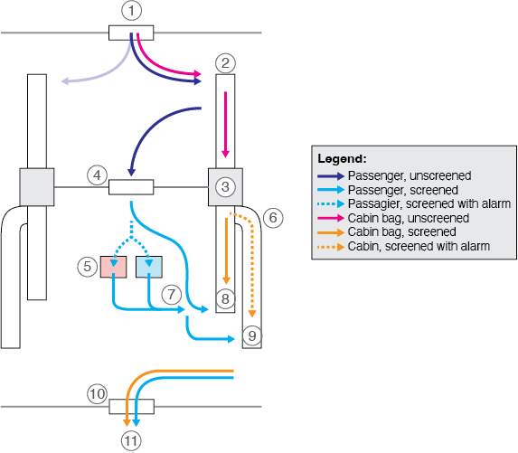
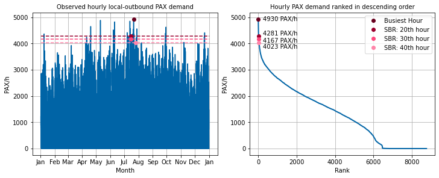
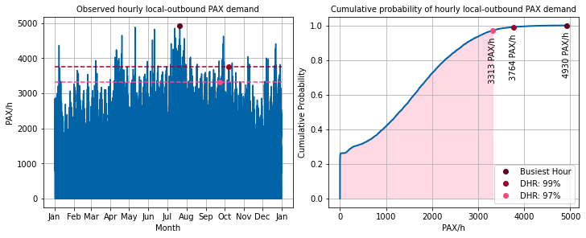

## Passenger buildings and passenger flows
Passenger buildings form the interface between the **ground access system** and the **airside** of an aerodrome. On the landside, passengers arrive or depart by rail, metro, bus, taxi, private car, bicycle, or on foot. On the airside, the passenger building connects passengers and baggage to aircraft stands, aprons, and the wider air transport system. The main planning task is therefore to enable a safe, efficient, and understandable transition between urban transport, passenger processing facilities, and aircraft operations.

{#fig-pax-processes width=100%}

Three basic **passenger flows** are distinguished in passenger buildings. **Local-outbound passengers** start their air journey at the airport and move from ground access through the departure process towards the gate. **Local-inbound passengers** end their air journey at the airport and move from the aircraft through the arrival process towards ground access. **Transfer passengers** neither start nor end their journey at the airport; they connect from one flight to another and therefore move between arrival and departure facilities within the passenger building. These flows may share parts of the building, but in many cases they must be physically separated for security, border-control, or operational reasons.

In a simplified view, a passenger building can be divided into a **terminal** and a **dock**. The terminal contains the facilities that connect the building to ground access, for example departure halls, check-in areas, baggage reclaim areas, and arrivals halls. The dock is the airside-related part of the passenger building and provides access to aircraft stands and gates. In many airports, the dock is located in the sterile part of the building, meaning that passengers have already passed security screening before entering it.

A second important distinction is made between **public-access**, **restricted-access**, **non-sterile**, and **sterile** areas. Public-access areas can be entered by passengers, visitors, meeters and greeters, airport staff, and other users of the airport. Restricted-access areas are reserved for passengers and authorised staff. Within restricted-access areas, the non-sterile area contains passengers or staff who have not yet passed security screening, whereas the sterile area contains only persons and items that have been security checked. Passenger buildings must be designed so that screened and unscreened passengers cannot mix. If such mixing occurs, screened passengers are normally considered unscreened again and would need to pass through security screening once more.

<!--Functional facility types-->
::: {.callout-tip}
### Functional facility types
The many individual spaces inside a passenger building can be grouped into three generic facility types. This distinction is useful because each facility type is dimensioned differently and creates different operational constraints.

* **Flow facilities** allow passengers to move from one part of the passenger building to another. Examples include corridors, passageways, stairs, escalators, lifts, and moving walkways. The main design objective is to provide sufficient width and intuitive routing so that passengers can move without congestion or confusion.

* **Processing facilities** are facilities where passengers, baggage, or documents are actively processed. Examples include check-in counters, baggage drop facilities, boarding pass control, security screening, immigration, emigration, baggage reclaim, and customs. These facilities are often bottlenecks because their capacity depends on the number of processors and the average service time per passenger.

* **Holding facilities** are areas where passengers spend time between process steps. Examples include departure lounges, gate holdrooms, retail areas, airline lounges, and arrivals halls. For these facilities, the main design question is how much space and seating should be provided for the expected number of occupants.

The design of passenger buildings is therefore not only a matter of architectural form. It also requires an understanding of passenger demand, process sequences, space requirements, waiting times, and the operational separation of different passenger groups.
:::

### Required building space
Passenger buildings are space-intensive because they must accommodate passenger flows, baggage flows, processing facilities, waiting areas, retail areas, offices, technical rooms, and building services. For early planning stages, two rough estimation approaches are commonly used.

First, the required building area can be estimated from the **design hour load** (\acr{DHL}). The \acr{DHL} describes the number of passengers expected during a representative busy design hour. It should not be confused with the absolute maximum demand, because designing for the absolute maximum would lead to excessive infrastructure that is unused for most of the year. @tbl-terminal-space-dhl provides indicative space requirements as a function of the terminal type.

| Type of passenger building            | Approximate space requirement         |
|:--------------------------------------|--------------------------------------:|
| Simple low-fare terminal              | 8 to 15 m² per \acr{DHL} passenger    |
| Domestic terminal                     | 20 to 25 m² per \acr{DHL} passenger   |
| Domestic and international terminal   | 30 m² per \acr{DHL} passenger         |
| International terminal                | 35 m² per \acr{DHL} passenger         |
| Major international gateway terminal  | 50 m² per \acr{DHL} passenger         |
: Approximate passenger building space requirements based on \acr{DHL} {#tbl-terminal-space-dhl}

Second, the required building area can be approximated from the annual passenger volume. As a rule of thumb, a passenger building requires approximately 8,000 to 12,000 m² of building area per million passengers per annum (\acr{MPPA}). For example, an airport handling 10 \acr{MPPA} would therefore require approximately 80,000 to 120,000 m² of passenger building area. This method is useful for early benchmarking but is not suitable for the detailed dimensioning of individual facilities such as check-in, security screening, baggage reclaim, or gate holdrooms.

::: {.callout-tip}
#### Example: Rough terminal space estimate
Assume that an international terminal is designed for a \acr{DHL} of 1000 passengers. Using the indicative value of 35 m² per \acr{DHL} passenger, the required building area is

$$
A = 1000 \cdot 35\,\text{m}^2 = 35000\,\text{m}^2.
$$

If only the annual demand is known, an airport handling 10 \acr{MPPA} would roughly require

$$
A = 10 \cdot (8000 \text{ to } 12000)\,\text{m}^2 = 80000 \text{ to } 120000\,\text{m}^2.
$$
:::

### Stakeholder requirements
Passenger buildings must satisfy the requirements of several stakeholder groups. These requirements are not always aligned, which makes passenger building design a trade-off between passenger service quality, airline efficiency, regulatory compliance, commercial revenue, and construction or operating costs.

**Passengers** require a building that is easy to understand, comfortable, safe, and efficient. Important design aspects include short walking distances, clear signage, sufficient space, short waiting times, good indoor climate, intuitive wayfinding, accessibility for passengers with reduced mobility, and appropriate facilities such as toilets, seating, restaurants, shops, child play areas, and lounges. Different passenger groups may have different needs. Business passengers may value short walking distances and lounges, leisure passengers may require more assistance and more space for baggage, and passengers with reduced mobility need barrier-free access, lifts, and support services.

Passenger buildings must also support the separation of **domestic**, **international**, **Schengen**, and **Non-Schengen** passengers where required. In the Schengen context, Schengen passengers can usually travel without systematic border control, whereas Non-Schengen passengers must pass immigration or emigration. The building must therefore prevent passenger groups with different border-control status from mixing. This often requires duplicated corridors, lounges, retail areas, and gate areas, which increases both cost and operational complexity.

**Transfer passengers** create additional requirements. For a hub airport, the building must enable short and reliable connections between flights. The \acrfull{MCT} represents the shortest connection time that an airport and its airline partners can offer for a given transfer type. A short \acr{MCT} increases the number of possible connections in a banked hub operation and therefore improves the attractiveness of the airport for transfer traffic. However, short \acr{MCT} values require compact layouts, short walking distances, efficient security and border-control processes, and fast baggage transfer systems.

| Origin        | Destination   | Typical minimum connecting time   |
|---------------|---------------|----------------------------------:|
| Domestic      | Domestic      | 35 to 45 min                      |
| Domestic      | International | 35 to 45 min                      |
| International | Domestic      | 45 to 60 min                      |
| International | International | 45 to 60 min                      |
: Typical minimum connecting time values {#tbl-mct-values}

**Airlines** require passenger buildings that support their business model. Hub-and-spoke airlines need short transfer routes for passengers and baggage, reliable transfer processes, and sufficient facilities for premium passengers. Point-to-point and low-cost airlines, by contrast, often prioritise low infrastructure costs, simple passenger processes, short aircraft turnaround times, and efficient use of stands and gates. The layout of the dock influences aircraft taxi distances, pushback complexity, baggage transfer distances, and the number of aircraft that can be handled at contact stands.

**Airport operators and owners** focus on cost, revenue, operational continuity, and expandability. Capital expenditures (\acr{CAPEX}) arise from the construction of the building, baggage handling systems, passenger boarding bridges, building services, and other fixed infrastructure. Operational expenditures (\acr{OPEX}) include maintenance, cleaning, utilities, staffing, and the operation of technical systems. Passenger buildings should therefore provide sufficient capacity and service quality, but avoid excessive over-design.

At the same time, passenger buildings generate non-aeronautical revenues. Retail, restaurants, lounges, offices, advertising, and parking can contribute substantially to airport income. For this reason, commercial areas are often placed in locations where passengers have already completed stressful process steps, for example immediately after security screening for departing passengers or before baggage reclaim for arriving passengers. In these areas passengers are usually calmer and more willing to spend time and money.

**Governmental agencies**, such as border police, customs, and security authorities, impose strict requirements on passenger buildings. Their processes are not primarily designed to maximise throughput, but to ensure safety, security, and legal compliance. As a result, they often create capacity constraints and require dedicated spaces, queuing areas, offices, inspection rooms, and physical separation between passenger flows.

## Passenger building configurations
When designing the docks of passenger buildings, airport planners can choose from several idealised configurations. The most important are the simple, linear, pier, satellite, and transporter configurations. In practice, most large airports combine several of these concepts, resulting in hybrid configurations. The selected configuration strongly influences walking distances, aircraft taxi distances, apron layout, contact stand availability, \acr{CAPEX}, \acr{OPEX}, passenger wayfinding, transfer performance, and future expandability.

### Simple configuration
The **simple configuration** consists of a terminal building without a dock. Aircraft are parked on an apron in front of or near the passenger building, and passengers usually walk to the aircraft or are transported by bus. Baggage and cargo are moved between the terminal and the aircraft by ground handling equipment.

Simple configurations are suitable for airports with low traffic volumes. They are relatively easy to understand, cheap to build, and easy to expand sideways. Aircraft may be parked in angled nose-in or nose-out positions, allowing them to arrive and depart under their own power without pushback. However, the concept becomes inefficient at higher traffic volumes because service road traffic increases, passenger exposure to weather may be high, and the level of service is limited compared with contact gates.

{#fig-config-simple width=100%}

### Linear configuration
The **linear configuration** extends the simple concept by adding a dock directly connected to the terminal. Aircraft are typically parked nose-in along the building and passengers board through passenger boarding bridges. Linear docks may be straight or curved, and stands may be located on one or both sides of the building.

Linear configurations provide direct access between the passenger building and aircraft and are relatively simple to operate. However, the space between aircraft and the building can be limited, which may complicate pushback operations, ground handling, and service road circulation. The landside forecourt may also become constrained because the terminal frontage is stretched along the dock.

{#fig-config-linear width=100%}

### Pier configuration
The **pier configuration**, also called a finger configuration, consists of a central terminal with one or more linear extensions projecting into the apron. Aircraft stands are located on both sides of the pier, which allows efficient use of building frontage and apron space. Piers may be straight, Y-shaped, or T-shaped.

Pier concepts are common at medium and large airports because they provide many contact stands in a compact arrangement. However, long walking distances can occur, especially when gates are located far from the terminal core. Ground operations between adjacent piers can also become difficult if the courtyard between them is narrow. Extensions are not always straightforward because the pier may be constrained by taxiways, runways, stands, or other buildings.

{#fig-config-pier width=100%}

### Satellite configuration
In the **satellite configuration**, the dock is physically separated from the main terminal. Passengers reach the satellite by an underground walkway, automated people mover (\acr{APM}), or other internal transport system. Aircraft stands can be arranged around the satellite, which can create short walking distances within the satellite itself.

Satellite configurations are well suited to hub airports because large numbers of contact stands can be provided away from the terminal core. Transfers within the same satellite may be efficient, but transfers between different satellites can require long walking distances or additional transport systems. Expanding an existing satellite may be possible if space is available, but constructing additional satellites and connecting them to the main terminal is expensive.

{#fig-config-satellite width=100%}

### Transporter configuration
The **transporter configuration** uses a passenger terminal without direct dock access to aircraft. Passengers are transported to and from aircraft by buses or other mobile transporters. This provides high operational flexibility because terminal expansion and stand expansion are less tightly coupled. Remote stands can be added without extending the passenger building itself.

The main disadvantage is passenger service quality. Many passengers perceive bus boarding as less comfortable than boarding via a jet bridge. Transport times between terminal and aircraft may also increase total passenger travel time and may negatively affect \acr{MCT}. In addition, a transporter concept creates additional vehicle movements on the apron and requires sufficient curb space for buses at terminal and stand locations.

### Hybrid configuration
Most real passenger buildings are **hybrid configurations**. They combine elements of simple, linear, pier, satellite, and transporter concepts. Hybrid layouts often result from airport growth over several decades. As demand changes and new constraints appear, airports extend existing facilities, add new docks, build remote stands, or connect satellite buildings. Hybrid concepts can be highly flexible, but they may also create complex passenger routes and operational interfaces.

### Frontage length
The **frontage length** of a dock determines how many contact stands can be arranged along the building. The required length depends on the aircraft code letter and the clearance required between adjacent stands. @tbl-stand-frontage summarises typical stand widths and clearances.

| Code Letter | Width of stand | Clearance between stands |
|:-----------:|---------------:|-------------------------:|
| C           | 36 m           | 4.5 m                    |
| D           | 52 m           | 7.5 m                    |
| E           | 65 m           | 7.5 m                    |
| F           | 80 m           | 7.5 m                    |
: Typical stand width and clearance values for frontage length estimation {#tbl-stand-frontage}

For a dock with $n$ stands of the same code letter, the required frontage length is approximately

$$
L = n \cdot w + (n-1) \cdot c,
$$

where $w$ is the stand width and $c$ is the clearance between adjacent stands. The clearance is counted only between stands, not at the two ends of the dock.

::: {.callout-tip}
#### Example: Frontage length
The frontage length of a dock with 10 Code C stands is

$$
L = 10 \cdot 36\,\text{m} + 9 \cdot 4.5\,\text{m} = 400.5\,\text{m}.
$$

For a mixed dock with 3 Code E stands and 8 Code C stands, the frontage length is

$$
L = 3 \cdot 65\,\text{m} + 2 \cdot 7.5\,\text{m} + 7.5\,\text{m} + 8 \cdot 36\,\text{m} + 7 \cdot 4.5\,\text{m} = 537\,\text{m}.
$$

The 7.5 m clearance between the Code E and Code C group is required because the larger clearance applies between adjacent stands of different size categories.
:::

### Required number of gates and stands
The required number of gates or stands depends on the design hour demand and the operational reserve required to handle fluctuations. For large airports with an hourly stand demand $d > 10$, the demand can be approximated as a Poisson process. A simple estimate for the required number of stands $S$ is

$$
S = d + \sqrt{d}.
$$

The term $\sqrt{d}$ represents an operational backup of approximately one standard deviation. This reserve helps the airport handle demand variability and reduces the probability that all stands are occupied during the design hour.

The required number of stands is also influenced by **dedication**. In a common-use system, stands can be assigned flexibly to different airlines. In a dedicated system, certain stands are reserved for one airline or alliance. Dedication reduces flexibility and therefore increases the total number of stands required. For example, six airlines each requiring five stands generally need more total backup capacity than one common-use pool with the same total demand of 30 stands, because variability must be absorbed separately in each dedicated sub-system.

## Passenger building facilities
Passenger buildings consist of a sequence of facilities through which local outbound, local inbound, and transfer passengers move. The exact sequence differs between airports, countries, and regulatory environments. Nevertheless, typical process chains can be described for departing, arriving, and transferring passengers.

### Facilities for departing passengers
The departure process starts at the interface between ground access and the passenger building and ends at the gate or aircraft stand. The main facilities used by departing passengers are the departure concourse, check-in and baggage drop, boarding pass control, security screening, emigration, departure hall or retail area, and the gate.

#### Departure concourse
The **departure concourse**, also referred to as the departure hall, is the first major space encountered by passengers and visitors entering the passenger building. It should be open, unobstructed, accessible, and easy to understand. Its main functions are passenger orientation, circulation, public waiting, and access to check-in or baggage drop facilities. It usually also contains public facilities such as toilets, information desks, airline offices, handling-agent offices, ticketing desks, and commercial areas.

A well-designed departure concourse reduces passenger stress by providing good visibility, natural light, clear signage, and sufficient space for passengers with baggage. At some airports, the departure concourse is also used to separate passengers from visitors. For example, in some countries only passengers with valid tickets may enter the terminal building, while meters and greeters remain outside the controlled entrance area.

#### Check-in and baggage drop
At **check-in** and **baggage drop**, departing passengers receive or confirm their boarding pass, check travel documents where required, print baggage tags, and inject checked baggage into the baggage handling system (\acr{BHS}). Traditional check-in counters, where staff perform the entire process, have increasingly been replaced by self-service kiosks and automated baggage drop facilities. This development increases productivity and can reduce congestion, but it also changes the space and technology requirements of the check-in hall.

The check-in process typically includes passenger identification, baggage weighing, overweight baggage payment, baggage tag printing, baggage tagging, boarding pass issuing, and baggage injection into the \acr{BHS}. Oversized baggage, such as skis, bicycles, or strollers, is usually handled at an \acrfull{OOG} counter. Since passengers at check-in often carry multiple bags, generous queuing and circulation areas are required.

Three common check-in layouts are used in practice:

* **Linear flow-through layouts** guide passengers through the facility in one direction. Passengers enter the queue at one end, proceed to the counters, and leave at the other end. This layout reduces crossing flows, but the connection between baggage drop counters and the \acr{BHS} can be challenging.

* **Linear uninterrupted layouts** typically use a single queue leading to several counters. The queue equalises waiting times because passengers are assigned to the next available counter. However, passenger movements after processing may interfere with passengers still waiting or being served.

* **Island-type layouts** group counters into islands. They can be well connected to the \acr{BHS}, often through ramps or vertical baggage transport. However, they require substantial floor space because queuing areas and circulation corridors must be provided between islands.

#### Boarding pass control
The **boarding pass control** separates the public-access part of the passenger building from the restricted-access part. At many European and North American airports, it is located between check-in and security screening. Passengers scan their boarding pass at an automated gate, or pass through a staffed checkpoint, to prove that they are entitled to enter the restricted area. In some countries, boarding pass control is located before entering the passenger building itself.

#### Security screening
**Security screening** connects the non-sterile area with the sterile area of the passenger building. Its objective is to prevent prohibited items and unauthorised persons from entering secured areas. At the same time, the process should cause as little inconvenience as possible to passengers. This creates a design trade-off between security, throughput, passenger comfort, staffing, and space requirements.

Security screening may be designed as a **centralised** or **decentralised** facility. In a centralised layout, all passengers pass through one large security checkpoint. This can be efficient in terms of staffing, equipment, and flexibility, but it creates a large concentration of passengers and a potential single point of failure. In a decentralised layout, several smaller checkpoints are distributed throughout the building, for example close to gate areas or for specific passenger flows. This can reduce the impact of failures and allow flow-specific measures, but it usually requires more equipment and staff.

{#fig-siko-processes width=100%}

As illustrated in @fig-siko-processes, a generic security screening process consists of the following steps:

1. passenger preparation and queueing,
2. divesting, where passengers place baggage, jackets, laptops, liquids, and other items on trays,
3. cabin baggage screening,
4. passenger screening,
5. possible passenger pat-down,
6. selection of baggage requiring search,
7. waiting for screened baggage,
8. passenger composure,
9. baggage search and recomposure, and
10. exit from the checkpoint.

Because passengers must move from an unscreened to a screened status, the facility must be strictly one-directional. The layout of a security screening facility must prevent screened passengers from coming into contact with unscreened passengers, staff, or objects.

#### Emigration
Departing international passengers may have to pass **emigration**, where state authorities verify that passengers and crew are properly documented and are allowed to leave the territory. Similar to security screening, emigration facilities must maintain the physical segregation of checked and unchecked passenger groups. Airport operators usually have limited control over this process, as it is operated by governmental agencies.

In the Schengen Area, the Entry/Exit System (\acr{EES}) affects the planning of immigration and emigration facilities for third-country nationals. \acr{EES} requires infrastructure such as biometric enrolment stations, automated kiosks, staffed counters, information points, and additional queuing areas. As processing times for some passenger groups may increase, the system must be considered in capacity calculations and layout planning.

#### Departure hall, retail area, and lounges
After security screening, passengers enter the **departure hall**, **departure lounge**, or retail area. This part of the building should provide a calm, open, and clearly organised environment. Since passengers have completed the most stressful process steps, this area is often well suited for retail, restaurants, airline lounges, transfer desks, and other commercial or service functions.

Important services in the departure hall include seating, flight information displays, toilets, help desks, passenger service centres, airline lounges, concessions, child play areas, entertainment facilities, and religious facilities. From a planning perspective, the departure hall must be large enough for passengers waiting for their gates to be announced while also providing direct and intuitive routes towards gates.

#### Gates
The **gate** is the final facility in the departure process. It consists of a waiting area, circulation space, boarding control, and the interface to the aircraft. Three basic gate types can be distinguished. At **contact gates**, passengers board through a passenger boarding bridge. At **bus gates**, passengers board a bus that takes them to a remote stand. At **walk-on gates**, passengers walk across the apron to the aircraft.

Contact gates provide high passenger comfort and protect passengers from weather, but passenger boarding bridges are expensive and therefore justified mainly at airports with sufficient traffic volume. Bus and walk-on gates require less fixed infrastructure and provide more stand-allocation flexibility, but passengers usually perceive them as a lower level of service.

### Facilities for arriving passengers
Arriving passengers move from the aircraft or stand through arrival corridors, immigration where required, baggage reclaim, customs, and the arrivals hall.

#### Arrival corridors
**Arrival corridors** connect aircraft stands or gates with the arrival facilities. They should provide intuitive guidance, sufficient width, natural light where possible, and short walking distances. Since passengers may be tired after a flight and may be unfamiliar with the airport, clear signage and simple route choices are particularly important.

Arrival corridors also have an important segregation function. Depending on the airport layout and regulatory environment, domestic, international, Schengen, Non-Schengen, screened, and unscreened passenger flows may need to be separated. In addition, transfer passengers may branch off from the arrival corridor towards transfer security, immigration, or departure gates.

#### Immigration
Arriving international passengers who enter the country pass through **immigration**. The process verifies whether passengers are properly documented and have the right to enter the territory. Like emigration, immigration is usually provided by state authorities and may create capacity constraints in the passenger building. The introduction of automated gates and biometric systems can improve throughput but also requires additional space, technical infrastructure, and queuing areas.

#### Baggage reclaim
After immigration, arriving passengers proceed to **baggage reclaim**, where they collect checked baggage. In Europe, transfer passengers usually do not need to reclaim baggage when transferring between flights, provided the baggage is through-checked. In some countries, such as the United States, international transfer passengers may be required to collect and recheck their baggage.

Baggage reclaim halls require considerable space because baggage belts are long and passengers need space to wait, circulate, and use baggage trolleys. As a rule of thumb, a narrow-body aircraft requires approximately 40 m of baggage belt frontage, while a wide-body aircraft may require approximately 70 m. In addition to standard belts, airports must provide \acr{OOG} reclaim facilities for items such as bicycles, skis, strollers, or other bulky baggage.

Typical baggage reclaim facilities include closed-loop carousels, linear belts, L-shaped belts, T-shaped belts, U-shaped belts, and free roller conveyors. Additional facilities often include lost baggage offices, toilets, trolley parking, seating, onward travel information, customs access, and sometimes concessions.

#### Customs
After collecting baggage, international passengers pass through **customs**. The main objective of customs is not maximum passenger throughput, but effective enforcement and compliance. Customs areas must therefore provide sufficient space for passenger flows, inspection tables, X-ray equipment, offices, storage areas for seized goods, and specialised facilities such as rooms for canine units.

Many international airports use a three-channel customs system:

* **Green channel:** for passengers who have nothing to declare. By choosing this channel, passengers make a legal declaration that they are not carrying goods exceeding duty-free allowances or restricted items.

* **Blue channel:** for passengers arriving from another EU Customs Union member state who have no goods requiring declaration. This channel is specific to the EU customs context.

* **Red channel:** for passengers who have goods to declare, regardless of origin. This includes goods exceeding allowances, restricted goods, or commercial merchandise.

#### Arrivals hall
The **arrivals hall** is the public area where arriving passengers leave the restricted-access part of the passenger building and enter the ground access system. It should be welcoming, easy to understand, and sufficiently spacious. It usually provides access to public transport, taxis, car parks, rental cars, toilets, information desks, and sometimes retail or food and beverage facilities.

In addition to arriving passengers, the arrivals hall must accommodate **meeters and greeters**, who wait for passengers. This creates specific congestion risks near the exit from customs or baggage reclaim. A common design measure is to place a low barrier or room divider in front of the exit, forcing arriving passengers to turn left or right and preventing meeters and greeters from blocking the door.

### Transfer passengers
Transfer passengers do not have a single dedicated process sequence. Their route depends on the origin and destination of the connecting flights, the security status of the origin airport, the border-control status of the passenger, and local airport procedures. Depending on these factors, transfer passengers may proceed directly to the departure gate, pass transfer security, pass immigration or emigration, or move through dedicated transfer corridors.

For airport planning, transfer passengers are important because they influence \acr{MCT}, walking distances, baggage transfer times, security screening demand, border-control demand, and the required separation of passenger flows. In hub airports, compact and intuitive transfer routes are essential for airline network performance.

## Level of service and design demand
Passenger buildings are designed for a target **level of service** (\acr{LoS}). The \acr{LoS} describes the quality that passengers should experience under design conditions. Two main \acr{LoS} dimensions are relevant: space and time.

 * **Spatial \acr{LoS}** describes the amount of space available per passenger in a facility. It is relevant for holding facilities, processing facilities, and flow facilities. Too little space creates congestion, stress, and poor passenger experience. Too much space may be comfortable, but it leads to excessive construction and operating costs. 
 
 * **Temporal \acr{LoS}** describes acceptable waiting times and is mainly relevant for processing facilities such as check-in, security screening, immigration, emigration, baggage reclaim, and customs.

Airport planners should avoid both under-design and over-design. Under-designed facilities create long queues, high passenger stress, and unreliable processes. Over-designed facilities provide more space or capacity than needed, which increases cost and may leave large areas unused outside peak periods. If optimal values cannot be achieved, slight over-design is often preferable to suboptimal design because poor service quality may quickly affect operations, passenger satisfaction, and airline reliability.

### Design hour load
Demand in passenger buildings varies strongly over time. It varies within the hour, over the day, over the week, over the season, and across years. Furthermore, different facilities experience their peaks at different times. For example, the departure peak at check-in may occur before the peak at security, and the peak of arriving passengers may occur at a different time than the peak of departing passengers. The combined terminal peak is therefore not simply the sum of the largest departure and arrival peaks.

For this reason, facilities are usually dimensioned for the **design hour load** (\acr{DHL}). The \acr{DHL} represents a busy but not extreme demand level. It aims to provide balanced capacity: sufficient infrastructure for high-demand periods, but not excessive infrastructure that would only be fully used during the absolute maximum hour of the year.

Three approaches can be used to determine the \acr{DHL}: (i) the **approximation method**,  (ii) the **\acr{SBR}** method, and  (iii) the **\acr{DHR}** method.

The **approximation method** estimates the \acr{DHL} directly from the annual passenger demand,  as shown in @tbl-dhl-approximation. The annual traffic volume is translated into a corresponding design hour load using an empirical look-up table. The method is straightforward to apply and requires only the annual passenger volume. However, because it is based on empirical observations from existing airports, it does not account for local conditions such as the temporal distribution of demand or the presence and intensity of peak periods.

| Annual passenger demand | Approximate \acr{DHL} as share of annual passengers |
|-------------------------|----------------------------------------------------:|
| 0.5 to 1 \acr{MPPA}     | 0.05%                                               |
| 1 to 10 \acr{MPPA}      | 0.04%                                               |
| 10 to 20 \acr{MPPA}     | 0.035%                                              |
| More than 20 \acr{MPPA} | 0.03%                                               |
: Approximate design hour load from annual passenger demand {#tbl-dhl-approximation}

::: {.callout-tip}
#### Example: Approximation of design hour load
Assume that a passenger facility is expected to handle 11.288 \acr{MPPA}. Since the annual demand lies between 10 and 20 \acr{MPPA}, the approximate \acr{DHL} is 0.035% of annual demand:

$$
DHL = 11.288 \text{MPPA} \cdot 10^6 \cdot 0.00035 \approx 3951\,\text{PAX/h}.
$$
:::

The **\acr{SBR}** method requires hourly passenger demand observations covering an entire year. The hourly demand values are sorted in descending order, and the \acr{DHL} is defined as the demand during the 20th, 30th, or 40th busiest hour of the year. The selected rank depends on local operational preferences and demand characteristics. Airports with pronounced peak demand often choose values closer to the 20th busiest hour, whereas airports with more evenly distributed demand, such as large hub airports, frequently adopt values closer to the 40th busiest hour. For example, Zurich Airport uses the 20th busiest hour, while Amsterdam Schiphol Airport uses the 40th busiest hour. 

@fig-sbr illustrates the procedure. The left-hand side shows the observed hourly passenger demand over one year. On the right-hand side, the same observations are sorted from the busiest to the least busy hour. The \acr{SBR} is then obtained by selecting the passenger demand corresponding to the chosen ranked hour (e.g., the 20th, 30th, or 40th busiest hour).

{#fig-sbr width=100%}

The **\acr{DHR}** method also uses hourly passenger-flow data. Instead of ranking the observations, planners calculate the \acrfull{ECDF} of the hourly demand. The \acr{DHL} is then defined as the hourly demand corresponding to a selected cumulative probability, typically 97% or 99%. Airports with highly peaked demand generally choose higher percentiles, whereas airports with more evenly distributed demand often use lower percentiles.

@fig-dhr illustrates this concept. The left-hand side shows the observed hourly passenger demand over one year. The right-hand side presents the corresponding ECDF. The selected percentile (e.g., 97% or 99%) determines the passenger demand adopted as the design hour load.

{#fig-dhr width=100%}

## Glossary {.unnumbered}
