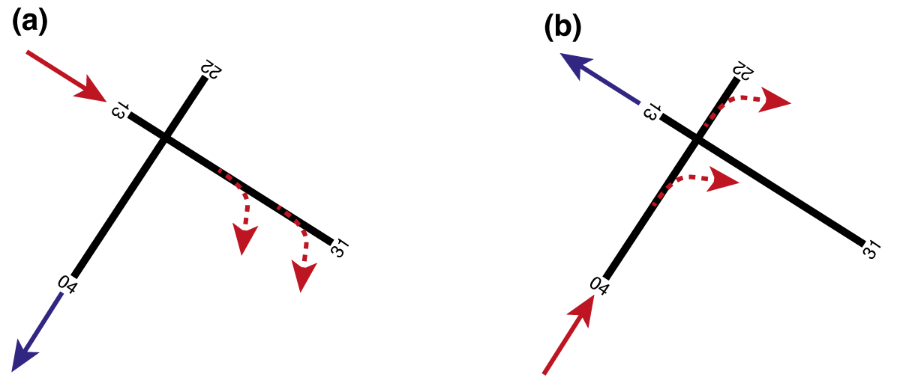
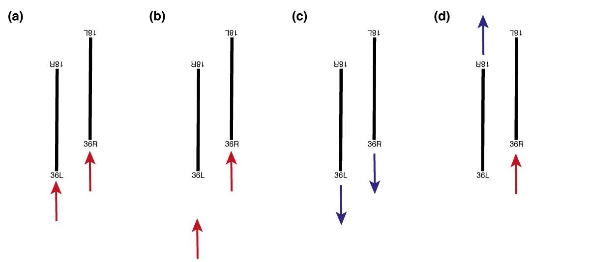
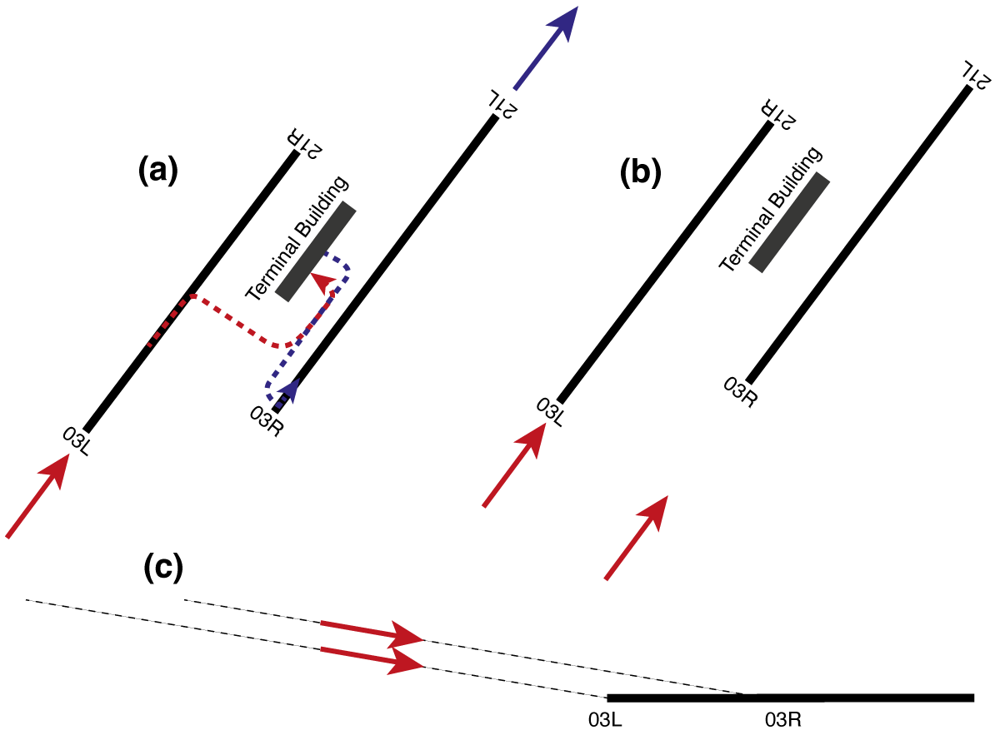
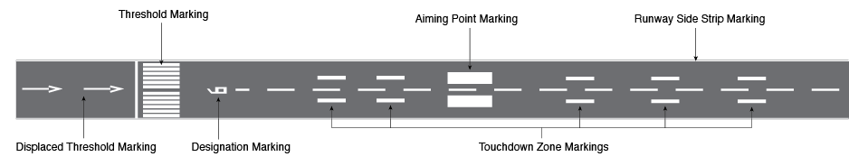
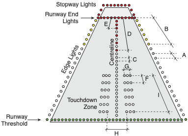
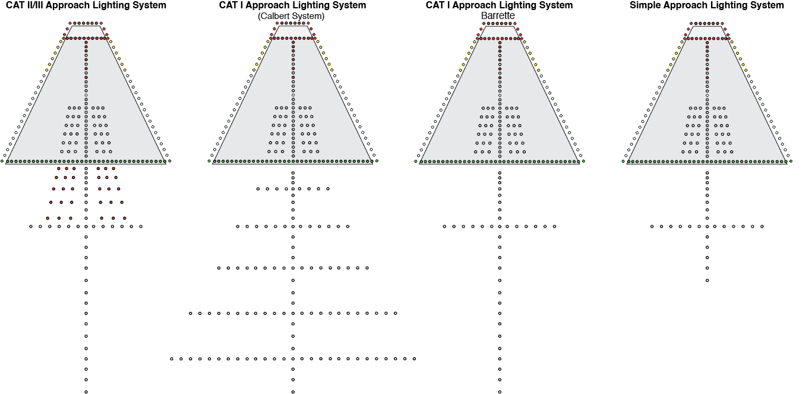
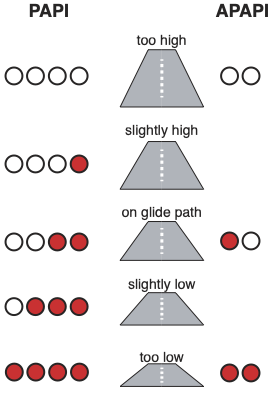

## Runway geometry and design
In CS ADR-DSN, runways are defined rectangular areas of a land aerodrome prepared for the landing and take-off of aircraft. In terms of their geometric properties, a runway can be characterized by its width, length, orientation, and longitudinal and transverse slopes.

The **width** of a runway, as defined in CS ADR-DSN.B.045, is measured between the outside edges of the runway. The required width of a runway depends on both the Aerodrome Code Number (see Table @tbl-arc-number) and the Outer Main Gear Wheel Span (\acr{OMGWS}) of the critical aircraft (Table @tbl-rwy-width). The \acr{OMGWS} is the distance between the outer edges of the main landing gear wheels of the critical aircraft.  

| Aerodrome Code Number | \acr{OMGWS} < 4.5 m | 4.5 m ≤ \acr{OMGWS} < 6 m | 6 m ≤ \acr{OMGWS} < 9 m | 9 m ≤ \acr{OMGWS} < 15 m |
|:---------------------:|--------------------:|--------------------------:|------------------------:|-------------------------:|
| 1                     | 18 m                | 18 m                      | 23 m                    | –                        |
| 2                     | 23 m                | 23 m                      | 30 m                    | –                        |
| 3                     | 30 m                | 30 m                      | 30 m                    | 45 m                     |
| 4                     | –                   | –                         | 45 m                    | 45 m                     |
: Runway width (CS ADR-DSN.B.045) {#tbl-rwy-width}

The **slope** of a runway is specified both longitudinally and transversely. The **longitudinal slope** refers to the slope of the runway along its longitudinal axis. The average longitudinal slope of a runway is determined *"by dividing the difference between the maximum and minimum elevation along the runway centre line by the runway length"* (CS ADR-DSN.B.060). Additionally, CS ADR-DSN.B.060 specifies the maximum longitudinal slope which must not been exceeded in any portion of the runway. Finally, airport designers must ensure that the change in slope between two consecutive portions of the runway is below a certain value. The applicable values for the average longitudinal slope, maximum longitudinal slope, and the maximum longitudinal slope change, which all depend on the aerodrome code number (see Table @tbl-arc-number), are summarized in Table @tbl-rwy-lgnt-slope

| Aerodrome Code number | Average longitudinal slope | Maximum longitudinal slope | Maximum longitudinal slope change | 
|:---------------------:|---------------------------:|---------------------------:|----------------------------------:|
| 1                     | 2%                         | 2%                         | 2%                                |
| 2                     | 2%                         | 2%                         | 2%                                |
| 3                     | 1%                         | 1.5%                       | 1.5%                              |
| 4                     | 1%                         | 1.25%                      | 1.5%                              |
: Longitudinal slope of runways (CS ADR-DSN.B.060 & ADR-DSN.B.060) {#tbl-rwy-lgnt-slope}

 The **transverse slope** describes how a runway is sloped along its width to allow efficient drainage of rainwater. In practice, two different profile types of transverse slopes are used. *Chambered* profiles have their highest point at the centre of the runway, allowing water to drain to both sides of the runway, while the *single crossfall* profiles have thei highest elevation at one edge of the runway, allowing water to drain in the direction of the other edge. On runways of airports with an aerodrome code letter of A and B, see Table @tbl-arc-letter, the transverse slope must be between 1% and 2% according to CS ADR-DSN.B.080, on airports with an aerodrome code letter of C to F the transverse slope must be between 1% and 1.5%.

According to CS ADR-DSN.B.035, the **length** of a runway is to be sized in such a way that the operational requirements of the critical aeroplane for which the runway is designed can be met. To support safe take-off and landing operations, each runway is assigned four **declared distances** that define the distances available for different phases of aircraft operation:

 * **Take-off Run Available (\acr{TORA}):** \acr{TORA} is the length of runway available for the aircraft to accelerate along the ground until lift-off. It is the paved runway distance used during the take-off roll and forms the basis for all other declared take-off distances.

 * **Take-off Distance Available (\acr{TODA}):** \acr{TODA} is the maximum distance available to complete a take-off. It consists of the \acr{TORA} plus the length of a **clearway (CWY)**, if one exists. A clearway is an obstacle-free area beyond the runway that an aircraft may overfly during its initial climb after becoming airborne. Because of the clearway, \acr{TODA} is always equal to or greater than the \acr{TORA}.

 * **Accelerate-Stop Distance Available (\acr{ASDA}):** \acr{ASDA} is the distance available for an aircraft to accelerate to the decision speed (V₁) and, if necessary, reject the take-off and stop safely. It consists of the \acr{TORA} plus the length of a **stopway (SWY)**, if one is provided. A stopway is a prepared surface beyond the runway that is designed to support an aircraft during a rejected take-off. Consequently, \acr{ASDA} is always equal to or greater than the \acr{TORA}.

 * **Landing Distance Available (\acr{LDA}):** \acr{LDA} is the length of runway available for the landing roll after touchdown. Unlike the take-off distances, the \acr{LDA} begins at the landing threshold. If a **displaced threshold** is present, the area before the threshold may be used for take-off but not for landing, reducing the available landing distance. As a result, the \acr{LDA} is often shorter than the \acr{TORA}.

The **orientation** of a runway describes its magnetic direction along its length. For example, a runway running in a north-south direction has an orientation of 360° or 180°, while a runway running in a west-east direction has an orientation of 090° or 270°. To enable pilots and air traffic controllers to identify runways unambiguously, each runway is given a **designator**. To this end, two-digit numbers are used as designators, e.g. 27, 07, 15, etc., which designate the nearest one-tenth of magnetic direction of a runway when viewed from the direction of approach. 

<!--Runway Designator-->
::: {.callout-tip}
#### Runway designator example
If a pilot taxis onto runway 15 and aligns the aircraft so that its nose points in the direction of the other end of the runway, the aircraft's magnetic compass will indicate a value of 150° +/-5°. At airports with two parallel runways, the designator is supplemented with the letter "L" for "left" and "R" for "right". At airports with three parallel runways, the designator of the runway in the middle is supplemented with the letter "C" for "centre".

{#fig-designation-runway}
::: 

The orientation of airport runways is influenced by several factors, including prevailing wind conditions, surrounding terrain, environmental considerations, and interactions with nearby airports. Among these, wind is generally the most important factor, as aircraft are normally operated into the wind whenever possible. A headwind increases the airflow over the wings without increasing the aircraft’s ground speed, thereby improving aircraft performance during take-off and landing. Conversely, a strong crosswind can make these manoeuvres significantly more demanding and may exceed the certified crosswind limits of an aircraft. To minimise crosswind conditions, airport planners analyse long-term meteorological records describing the local wind speed and direction. Based on these data, the runway orientation is selected such that the crosswind component, i.e. the component of the wind acting perpendicular to the runway centreline, remains within acceptable limits for as much of the time as possible. This is quantified by the **usability factor**, which represents the percentage of time during which the operation of a runway is not restricted by crosswind. According to GM1 ADR-DSN.B.015, a runway is generally considered to be optimally oriented if it achieves a usability factor of at least 95%.

Although wind is the primary criterion, it is not the only consideration when determining the orientation of a runway. Airport planners must also account for the surrounding topography to ensure safe flight operations. Innsbruck Airport (LOWI), for example, is located in a narrow Alpine valley where the terrain largely dictates the runway orientation and the associated arrival and departure procedures. Environmental aspects must likewise be considered. Whenever possible, runways are aligned to reduce the exposure of sensitive areas, such as residential neighbourhoods, schools, or hospitals, to aircraft noise and emissions. Finally, in regions with a high density of airports, such as London, New York, or Los Angeles, runway orientations are also selected to minimise operational interactions and conflicts between neighbouring airports.

There are no prescriptive requirements regarding the **number** of runways an aerodrome must provide. In general, the greater the number of runways, the higher the potential capacity of the aerodrome. However, additional runways also increase construction and maintenance costs and require more complex air traffic management, taxiway systems, and ground operations. Consequently, aerodrome planners seek to achieve the required capacity with the minimum feasible number of runways.

The **layout** of an aerodrome runway system depends on how many runways are available at a site as well as how they are arranged and oriented in relation to each other. While in practice the runway systems of most aerodromes are unique, in theory a distinction is made between the following generic aerodrome layout types:

* **Single runway**: As the name suggests, aerodromes with a single runway layout have a single runway, as is the case, for example, for the airports of London Gatwick (EGKK), Geneva (LSGG), Luxembourg (ELLX), or San Diego International (KSAN). Thanks to the existence of a single runway, the single runway layout is the moste simple one, as no dependencies between runways exist. Consequently, the one runway can be optimally utilised by air traffic control, which in practice leads to single runway aerodromes having a remarkably high capacity. Indeed, depending on the aircraft mix at the aerodrome (i.e., the percentage of large aircraft vs. smaller aircraft utilising the aerodrome), single runway aerodromes can handle up to 98 aircraft movements per hour under visual flight conditions according to FAA Advisory Circular 150/5060-5. Under instrument flight conditions, up to 59 aircraft movements per hour are realistic. However, single runway layouts also comes with certain disadvantages. For instance, taxi distances can be long at single runway aerodromes, as the terminal(s), dock(s) and thus also the stands for the aircraft are often located at one of the two runway ends (e.g. at London Gatwick). Moreover, aircraft operations at single runway aerodromes can also be affected by weather conditions resulting in crosswind situations. In such cases, no other, differently oriented runways are available on which lower crosswind components would result. Finally, an incident or even an emergency on the runway of a single runway airport leads to the entire flight operation having to be suspended. The same can also happen if certain maintenance work has to be carried out on the single runway.

* **Open-V** or **open-L runways**: Airports that have an open-V or open-L runway layout have more than one runway, which have different alignments and do not cross at any point. In open-L layouts, the runways are perpendicular to each other, while in open-V layouts the angle between the runways is less or more than 90°. An example of an open-L layout can be found in Rome Fiumicino (LIRF), while Dublin Airport (EIDW) has an open-V layout. One of the advantages of open-V and open-L layouts is the circumstance that the capacity of the aerodrome can be substantially higher than with a single runway layout. According to FAA Advisory Circular 150/5060-5, aerodromes with an open-L or open-V layout can carry out up to 150 aircraft movements per hour under visual flight conditions and 59 movements under instrument flight conditions. Besides that, the aerodrome is less restricted with regard to crosswinds and, thanks to the availability of a second runway, incidents, accidents or maintenance on one runway do not lead to the complete closure of the airport. However, since the runways do not have the same orientation, aerodromes with an open-V or open-L layout have a greater land consumption. Furthermore, the expansion of the apron, terminals and docks may be limited by the runways. Moreover, incidents in the apex between the runways of airports with an open-V and open-L layout can lead to a strong impact on flight operations.

* **Intersecting** or **crossing runways**: At aerodromes with an intersecting or crossing runway layout, the runways physically intersect. A good example of an airport where the intersecting runways are arranged at 90° to each other is New York LaGuardia (KLGA), while the intersecting runways at Hamburg (EDDH) or Basel-Mulhouse (LFSB) airports, for example, have an angle not equal to 90°. At airports with intersecting runways, they can never be operated independently, which increases the complexity for air traffic control. Likewise, the capacity of the aerodromes depends on which pister to land on, which runway to take off on and where the intersection between the runways is located. To illustrate this, consider two runway configurations for New York LaGuardia Airport as shown in Figure @fig-capacity-crossing-runway. In configuration (a), the aircraft land on runway 13 and take off on runway 22. Consequently, both a taking-off and a landing aircraft have "quickly" passed the intersection point between the two runways, which means that after a take-off or landing clearance has been granted on one runway, the other runway can be used again by other aircraft relatively quickly. In configuration (b), on the other hand, in which aircraft land on runway 04 and take off on runway 31, the intersection point is relatively far away. In this configuration, once a take-off or landing clearance is given on one runway, air traffic control has to wait a "long time" until the other runway can be used again. Consequently, the capacity of the airport is higher under configuration (a) than under configuration (b). In addition to these effects of crossing runways on airport capacity, there is the further complication that incidents and accidents at the crossing point can lead to the suspension of all flight operations at the airport.

{#fig-capacity-crossing-runway}

* **Parallel runways** and **multiple parallel runways** are characterised by runways which are parallel to each other. If an airport has two parallel runways, it is called a parallel runway system. However, if more than two runways are parallel, it is called a multiple parallel runway system. For the operation of parallel runways, two geometric properties illustrated in figure @fig-distances-parallel-runway are important, namely (i) the separation distance between two parallel runways and (ii) the stagger between parallel runways. The separation distance describes how far apart the centrelines are between two parallel runways, while the stagger distance describes how far apart the thresholds of the parallel runways are in the direction of the longitudinal runway axis.

{#fig-distances-parallel-runway}

First, let us look at how the separation distance affects the operation of parallel instrument runways, which are runways that allow for operations under instrument flight conditions. According to CS ADR-DSN.B.055, the minimum separation distances between parallel runways defined in table @tbl-parallel-rwy-distance must be maintained so that the modes of operation illustrated in @fig-mode-operation-parallel-runway can be performed.

| Mode of operation               | Minimum required separation distance |
|---------------------------------|-------------------------------------:|
| Indepedent parallel approaches  | 1035m                                |
| Dependent parallel approaches   | 915m                                 |
| Independent parallel departures | 760m                                 |
| Segregated parallel operations  | 760m                                 |
: Minimum required separation distance between parallel instrument runways according to CS ADR-DSN.B.055. {#tbl-parallel-rwy-distance}

Mode of operation *independent parallel approaches* refers to an operational concept in which air traffic control can operate parallel runways independently of each other for approaching traffic. This means that landings on one runway do not lead to operational restrictions for arriving aircraft on the other runway, and vice versa. For independent parallel approaches to be possible, the centrelines of the parallel runways must be at least 1035m apart, which is the case at Munich Airport (EDDM) or London Heathrow (EGLL), for example. Because the runways can be operated independently of each other, such airports have capacities of up to 120 aircraft movements per hour under instrument flight conditions according to FAA Advisory Circular 150/5060-5. At airports where parallel instrument runways are at least 915m apart, *dependent parallel approaches* can be flown. This refers to simultaneous approaches on two parallel runways where air traffic control must ensure certain radar separation minima between the approaching aircraft. Since in this case the operation on one runway affects the operation on the other runway (and vice versa), the theoretically possible capacity of such runway systems is approximately 75 movements per hour. Consequently, the maximum capacity of aerodromes were only dependent parallel approaches can be flown is significantly lower than at airports with independent parallel runway systems. Parallel runway systems separated by at 760m allow for *independent parallel departures* and *segregated parallel operations*. While the former allows air traffic controllers to consider the runways independent from each other for departing traffic, the latter allows for the operation of one runway solely for arrivals and the other one exclusively for departures.

{#fig-mode-operation-parallel-runway}

At some aerodromes with independent parallel runways, the thresholds are displaced, as can be seen in   @fig-staggered-parallel-runway. In technical jargon, this is referred to as staggered runways. Staggered runways can have a positive impact on airport operations by allowing shorter taxiing distances for aircraft and additional vertical separation of approaching aircraft. The influence of staggered parallel runways on taxi distances can be illustrated using the example of Athens Airport, as shown in @fig-staggered-parallel-runway (a). If aircraft land on runway 03R (red dashed line) or take off on runway 03L (blue dashed line), the average taxiing distance is shorter than if runway 03R were used for take-offs and 03L for landings. The effect of the stagger on the vertical separation of approaching aircraft is illustrated in @fig-staggered-parallel-runway (b) and (c): If the glide path angles of the approaches to the parallel runways are identical, two simultaneously approaching aircraft are not at the same altitude since the thresholds of the runways are displaced.

{#fig-staggered-parallel-runway}

### Adjacent areas
The term *adjacent areas* refers to the land immediately bordering a runway, which is prepared and graded to reduce the risk of damage to aircraft, for instance in the event of a runway excursion. In the following, we discuss several types of adjacent areas, including (i) runway shoulders, (ii) runway strips, (iii) runway end safety areas (\acr{RESA}), (iv) engineered materials arrestor systems (\acr{EMAS}), as well as (v) clearways and stopways. Figure @fig-adjacentAreas summarizes the location and extent of the adjacent areas described. Note that the dimensions shown are not to scale.

{#fig-adjacentAreas}

* A **runway shoulder** is an area adjacent to the edge of runway (i.e. left and right of the runway), which serves as a transition between the paved runway and the adjacent surface. According to *CS ADR-DSN.B.125*, a runway shoulder "should be so constructed as to mitigate any hazard to an aircraft running off the runway or stopway or to avoid the ingestion of loose stones or other objects by turbine engines". The design requirements placed on runway shoulders depend on the aerodrome code letter of the airport. For aerodromes with a code letter from A to C, runway shoulders are not required. However, for aerodromes with a code letter from D to F, shoulders are required if the \acr{OMGWS} of the critical aircraft exceeds 9m.  

* The **runway strip** is an area specifically designed and constructed to "reduce the risk of damage to an aircraft accidentally running off the runway, to protect aircraft flying over it during take-off or landing, and to enable safe use by rescue and firefighting (RFF) vehicles" (*CS~ADR-DSN.B.150*). The surface of the runway strip does therefore not need to be paved, but rather be prepared to allow safe operations of RFF vehicles. In addition, a runway strip must remain free of obstacles to prevent aircraft from colliding with them. Objects essential for air navigation or safety purposes, e.g., meteorological instruments, PAPI lights, runway lighting, or ILS antennae, may be installed, but they must be as low-profile as possible and frangible, i.e., designed to break or bend upon impact so as to minimize the risk of damage to an aircraft. The runway strip is further subdivided into the so-called *graded portion* and a *non-graded portion*.  
The *graded portion* is intended to serve in the event of an aeroplane running off the runway, while the *non-graded portion* is to be kept obstacle-free in order to protect low-flying aircraft in case of a missed approach.

* The safety objective of the **Runway End Safety Area (\acr{RESA})** is to "minimise risks to aircraft and
their occupants when an aeroplane overruns or undershoots a runway" (*CS ADR-DSN.C.210*). In this context, an **undershoot** describes the incident in which an aircraft touches down too early, as was the case with [British Airways Flight 38](https://en.wikipedia.org/wiki/British_Airways_Flight_38). In contrast, an **overrun** is an incident during which an aircraft is not capable of coming to a full stop on the runway and therefore runs beyond its end. An example of a runway overrun is [Miami Air Flight 293](https://en.wikipedia.org/wiki/Miami_Air_International_Flight_293). A \acr{RESA} is mandatory for runways with aerodrome code numbers 3 and 4, and for instrument runways with code numbers 1 and 2. In terms of dimensions, a \acr{RESA} must be at least twice the width of the runway (recommended is the width of the graded portion of the strip) and have a minimum length of 90m. However, the regulations recommend a length of 240m.

An **Engineered Material Arrestor System (\acr{EMAS})** may be installed in cases where space at runway ends is limited, e.g., at runway ends located directly adjacent to rivers or bodies of water. An \acr{EMAS} is an arresting system “consisting of high-energy absorbing materials of specific strength, which will reliably and predictably crush under the weight of an aircraft” (*CS ADR-DSN.C.236*). \acr{EMAS} installations are increasingly used in practice. A notable example can be found at Zurich Airport at the end of runway 28. Here, the \acr{EMAS} is located just before the River Glatt to mitigate the risk of a runway overrun, which could otherwise have catastrophic consequences. There are different \acr{EMAS} designs, but in most cases they consist of modular foamed-concrete blocks. When an aircraft enters an \acr{EMAS}, these blocks crush under the aircraft’s weight, resulting in rapid but controlled deceleration. According to the regulation (*CS ADR-DSN.C.236*), an \acr{EMAS} must be designed to stop the critical aircraft, at maximum take-off weight (MTOW) or at 80% of maximum landing weight (MLW), from a runway exit speed of 70kt without causing structural damage to the aircraft. In terms of dimensions, the width of an \acr{EMAS} must be at least equal to the runway width. No specific regulatory requirement exists for the length of an \acr{EMAS}, as this depends on the type of \acr{EMAS} product used, i.e., block design and materials used, as well as the operating conditions of the associated runway.

* **Clearways** and **stopways** are also considered adjacent areas, which must always remain free of obstacles. Their installation is optional, as there is no regulatory requirement for airports to provide them. A clearway extends the Take-Off Distance Available (\acr{TODA}) and begins at the end of the Take-Off Run Available (TORA). It may be located over land or water, but in all cases it must be readily accessible to rescue and firefighting (RFF) units. In contrast, a stopway extends the Accelerate-Stop Distance Available (\acr{ASDA}). Its surface must be capable of supporting the weight of an aircraft without causing structural damage.

### Runway markings and lighting
Runways at airports must be equipped with appropriate markings and lighting. In a first step, we will address the most important types of markings. In a second step, we will consider both the most important types of runway lighting and approach lighting.

#### Runway markings
Runway markings are designed to provide pilots with orientation and guidance during take-off, landing, and taxiing. They serve both an instructional function and an informational one. Runway markings are safety critical. For this reason, they are designed to be highly visible to the human eye through the use of distinct colors and strong contrast. As a rule of thumb: Runway markings are typically white, while markings on taxiways, turnpads, or stands are generally yellow.

{#fig-runway-marking-overview}

In the following, we discuss the most important types of runway markings, which are also depicted in Figure @fig-runway-marking-overview for better reference:

* The **runway designation marking** provides a visual indication of the runway designation. Located at each runway threshold, it consists of a two-digit number that may be supplemented by a letter 'L', 'R', or 'C' in the case of parallel runways.

* The **threshold marking** indicates the point at which the full strength of the runway pavement begins, meaning from this point onward the surface can support the full load of aircraft. These markings consist of white longitudinal stripes painted across the runway. Because their appearance resembles the keys of a piano, threshold markings are colloquially referred to as *piano keys*. According to *CS ADR-DSN.L*, the exact placement of threshold markings (i.e., the distance from the physical end of the runway), as well as the dimensions of the stripes (length and width) and their number, are strictly regulated. Moreover, the required number of stripes depends on the runway width.

* **Displaced threshold markings** are used when the runway threshold is not located at the very beginning of the runway but is displaced further down. They are typically introduced for two main reasons: (i) they may be required when obstacles, such as buildings or trees, are present in the approach path, making it unsafe to land at the start of the runway; and (ii) they are often implemented temporarily during construction works, in which case the threshold can later be restored to its original position.  Note, the threshold markings on a runway with displaced threshold are identical to those on a standard runway without displacement. The actual displacement is indicated by a series of white arrows painted on the runway, pointing towards the displaced threshold.

* The **centerline marking** indicates the middle of the runway. It consists of a dashed white line aligned with the runway direction, extending between the two runway designation markings. Centerline markings are required on all paved runways.  

* The **side strip marking** provides pilots with a clear indication of where the runway ends and the runway shoulder begins. It consists of a continuous white line. Side strip markings are mandatory for precision approach runways and optional for non-precision and non-instrument runways.  

* **Aiming point markings** and **touchdown zone markings** guide pilots during approach to identify the correct area of the runway for touchdown. The **aiming point marking**, which consists of two solid white rectangles, indicates the point on the runway where pilots should ideally aim to touch down. It is required on runways where both the aerodrome code number is 2, 3, or 4, and an instrument approach is provided. On runways equipped with a PAPI system (described later), the aiming point corresponds to the origin of the PAPI lights. On runways without PAPI lights, the location of the aiming point is determined by the landing distance available (LDA). The **touchdown zone markings** indicate the permissible touchdown area of a runway. They consist of pairs of white bars placed symmetrically along the runway. These markings are mandatory on runways offering a precision approach, while for non-precision or non-instrument runways they are only required at aerodromes with a code number of 3 or 4. The number of bar pairs used to mark the touchdown zone depends on the LDA.

#### Runway lights
Runway lights, like runway markings, provide orientation and guidance for pilots, particularly under poor visibility conditions (e.g., fog), during twilight, and at night. For this reason, runway lighting is safety-critical. In this section, we address three main aspects of runway lighting: (i) an overview of the requirements for the electrical systems that power the lights, (ii) the different types of runway lighting, and (iii) the approach lighting systems commonly used in practice.

::: {.callout-tip}
### Types of runway lights

Two types of lights are installed on runways: *inset lights* and *elevated lights*. 

**Inset lights** are embedded into the pavement and must be designed to withstand the weight of aircraft taxiing over them as well as very high temperatures (e.g., in summer, when heated pavement and continuous lamp operation cause additional heat buildup inside the fixture).  

**Elevated lights**, on the other hand, must not exceed a height of 0.36 meters and must be frangible, meaning that they are designed to break or bend when struck by an aircraft. This ensures that aircraft do not sustain structural damage in the event of a collision with a light.

:::

Because runway lighting is safety-critical, the runway cannot be used in conditions of poor visibility, twilight, or darkness if the lights fail. To ensure availability, runway lights are powered by both a primary and a secondary electrical circuit. Moreover, a continuous monitoring system supervises the functionality of all runway lights and triggers an alarm in the event of lamp failure. If the primary power supply fails, the system automatically switches to the secondary circuit to keep the lights operational. Regulations specify strict time limits for this switchover, which are particularly short on runways supporting precision approaches, thereby imposing demanding requirements on both the hardware and the monitoring software.

Several different types of runway lights are used in practice. The main types are as follows:
 
* **Runway edge lights** indicate the boundary between the runway and the runway shoulder, serving the same function as side stripe markings. Runway edge lights are mandatory on all runways intended for night operations, on precision approach runways, and on any runway where take-offs are conducted with a runway visual range (RVR) of less than 800 meters during the day. Runway edge lights are white, except for the last third of the runway in the direction of landing, where they are yellow. On instrument runways they are spaced 60 meters apart, while on non-instrument runways the spacing is 100 meters.  
  
* **Runway centerline lights** are installed along the centerline of the runway, although in practice they may be offset laterally by up to 60 cm. This offset prevents aircraft positioned on the exact centerline from rolling continuously over the lights, which could create distracting noise for the flight crew. Centerline lights are required on runways equipped for non-precision approaches where daytime take-offs are permitted with an RVR of less than 400 meters. The lights are spaced at 15-meter intervals and are normally white; in the last 900 meters of the runway they alternate red and white, and in the final 300 meters they are entirely red. This color coding provides pilots with a visual cue as they approach the runway end.  
 
* **Touchdown zone lights**, similar to touchdown zone markings, indicate the area where aircraft are expected to touch down. They are mandatory on CAT II and CAT III runways. The lights are arranged in so-called *barrettes*, i.e., groups of three lights, symmetrically placed on either side of the runway centerline. The touchdown zone lighting extends 900 meters from the threshold into the runway.  

* **Runway treshold lights** mark the beginning of the runway and are green in color. **Runway end lights** mark the end of the runway and are displayed as a red bar. If a stopway is provided, it is also delineated with red lights.

{#fig-rwyLights}

#### Approach lights 
To guide pilots in the final approach, approach lights provide arriving aircraft with guidance and orientation under poor visibility conditions, at twilight, and at night. They are installed in the area preceding the runway threshold, with different configurations depending on the type of approach supported (i.e., CAT I, II, III, or visual approaches). 

{#fig-rwyApprLights} 

In particular, approach lighting systems give pilots information about their spatial position (e.g., roll angle of the aircraft relative to the runway) and their distance to the threshold. The most commonly used approach lighting systems in practice include:
 
* A **simple approach lighting** system is installed on runways with non-instrument approaches that have a code letter of 3 or 4, as well as on non-precision approach runways.  

* **Precision approach CAT lighting** systems are used on runways supporting CAT I precision approaches. Two configurations exist: the *Calvert* system and the *Barrett centerline* system. Both feature an extended centerline and crossbars. In the Calvert system, distance is indicated by five crossbars that increase in width with distance from the threshold. In the Barrett centerline system, all lights are arranged in *barrettes*, i.e., groups of three lights. The single crossbar in this system is located 300 meters from the threshold. Often, Barrett systems also include so-called *running rabbits*—white lights that sequence along the centerline towards the threshold, providing dynamic guidance to pilots.

* A **precision approach CAT II/III lighting** system is used on runways supporting CAT II or III precision approaches. The lighting system is essentially identical to that of CAT I. The key difference is that the first 300 meters of the extended centerline consist of barrettes, with two additional rows of red barrettes installed laterally on either side.

#### Precision approach path indicator (PAPI) lights
Precision Approach Path Indicator, commonly referred to as PAPI, provides pilots on final approach with visual information about the aircraft’s position relative to the nominal glide path. In simple terms, the PAPI system tells the flight crew whether they are too high, too low, or correctly aligned with the intended glide slope. 

This information is conveyed by four horizontally aligned light units, which can appear either red or white. If all four lights are red, the aircraft is too low; two white and two red indicate that the aircraft is on the correct glide path; and four white lights mean the aircraft is too high. PAPI lights are typically installed on the left side of the runway (as seen from the approach direction). In the “on glide path” configuration (two white, two red), the two red lights are positioned on the side closest to the runway.

At some aerodromes, an *Abbreviated PAPI* (APAPI) is used. An APAPI consists of only two lights, but the operating principle is the same: two white lights mean “too high,” two red lights mean “too low,” and one white plus one red light indicates that the aircraft is on the glide path. 

{#fig-PAPI}

### Obstacles
In addition with the geometric standards associated with the design of runways, there are specific requirements concerning the protection of airspace around aerodromes to provide for the safe navigation of aircraft to and from the airport. In this context, we have to differentiate between (i) requirements aiming for the obstacle-free construction of visual and instrument flight procedures, as covered for instance in ICAO Document 8169 (PANS-OPS), as well as (ii) obstacle limitation surfaces (OLS) und obstacle free zones (OFZ) for a particular runway and its intended operations. OLS and OFZ  are covered in ICAO Annex 14 and EASA CS ADR-DSN. While OLS aim at protecting aircraft in flight from fixed (whether temporary or permanent), OFZ protect aircraft from both fixed and mobile objects. In the following, we will discuss the various OLS and OFZ types that must be taken into account in airport planning and airport operations. We will then address the issue of how OLS and OFZ must be dimensioned in accordance with CS ADR-DSN.

#### Obstacle limitation surfaces (OLS)
An **Obstacle Limitation Surface (OLS)** is a set of imaginary, three-dimensional planes established around an aerodrome to define the limits to which fixed objects (e.g., buildings, trees, lamp posts, etc.) may project into the airspace. These OLS protect aircraft on take-off, during climb-out, and in the final phase of the approach-to-land manoeuvre from colliding with fixed obstacles.

There are various different OLS types, each of which has a specific function, which we discuss in more detail in the following: 

* The **inner horizontal surface** is a horizontal plane located above the aerodrome, centered on the runway, and extending in a circular shape with a defined radius. Its safety objective is to protect landing aircraft during a *circle-to-land* maneuver from fixed obstacles. In this procedure, an aircraft approaches one runway direction, then flies a circling pattern before landing in the opposite direction. Such procedures are typically used at airports located in valleys, such as Innsbruck.
 
* The **conical surface** has the safety objective, similar to the inner horizontal surface, of facilitating safe visual maneuvering in the vicinity of the aerodrome (*CS ADR-DSN.H.415*).

* The **approach surface** has the safety objective *"to protect an aircraft during the final approach to the runway by defining the area that should be kept free from obstacles to protect an aeroplane in the final phase of the approach-to-land manoeuvre"* (*CS ADR-DSN.H.425*). The approach surface consists of several sections: The first and second sections are inclined, whereas the horizontal section is level. Furthermore, the approach surface has a conical shape: at the elevation of the runway strip it is as wide as the strip itself, then gradually diverges outward.

* The **take-off climb surface** protects aircraft during the take-off and climb-out phases from fixed obstacles (*CS ADR-DSN.H.435*). Unlike approach surfaces, the take-off climb surface consists of a single inclined section in the vertical plane. At ground level, its width corresponds to that of the runway strip, gradually diverging with altitude until a specified maximum width is reached, beyond which it remains constant.  

* The **transitional surface** defines the limits of the area available along the runway for buildings, structures, or natural obstacles (*CS ADR-DSN.H.430*). The transitional surface lies between the approach and take-off climb surfaces along the runway strip.

#### Obstacle free zones (OFZ)
Obstacle Free Zones (OFZ) are only required on runways with Category II and III (CAT II/III) approaches. As these approaches place higher demands on safety levels and navigation accuracy, OFZs are used to (i) impose higher obstacle clearance requirements, and (ii) to protect aircraft not only from fixed obstacles but also from mobile ones, e.g., aircraft taxiing on the ground at an airport.  

For example, OFZs ensure that aircraft taxiing on the ground cannot enter the critical and sensitive areas of the instrument landing system, which can lead to a degradation of signal quality and thus a reduction in navigation accuracy.  

In practice, the following three different OFZ types are used:  

* The **inner approach surface:** is directly adjacent to the runway strip and is a rectangular area that protects aircraft on final approach for CAT II or CAT III approaches from fixed and mobile obstacles.  

* The **inner transitional surface** has the same function as the transitional surface: it protects aircraft from objects located along the runway. Unlike the transitional surface, the inner transitional surface is closer to the runway and also protects aircraft from mobile objects. Due to the requirements of the inner transitional surface in particular, runways with CAT II/III approaches usually have two holding points per taxiway instead of just one holding point, as is common with non-precision and CAT I runways. The holding point further away from the runway centreline is used for CAT II/III operations, while the closer holding point is used for all other types of operations.

* The **balked landing surface** serves to protect aircraft that perform a go-around during a CAT II/III approach from fixed and mobile obstacles. The balked landing surface is therefore located on the opposite side of the runway from the approach.

## Glossary {.unnumbered}
