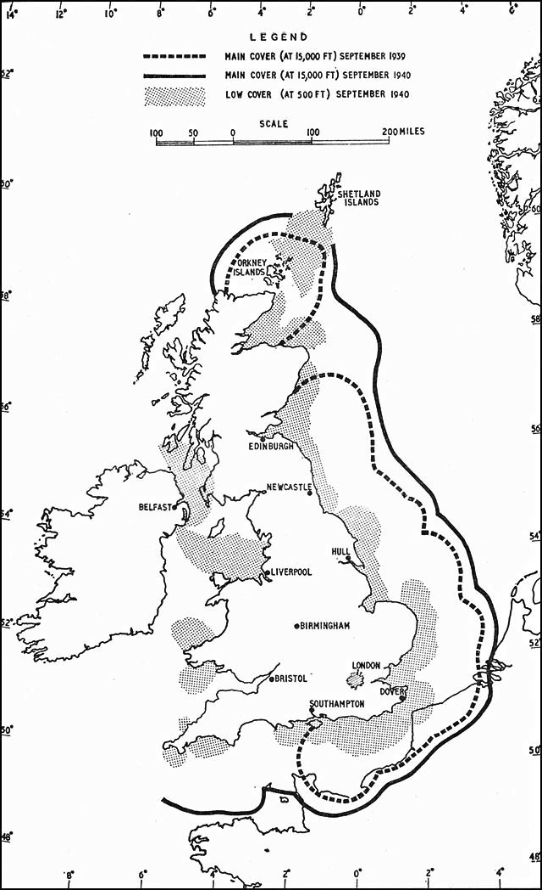
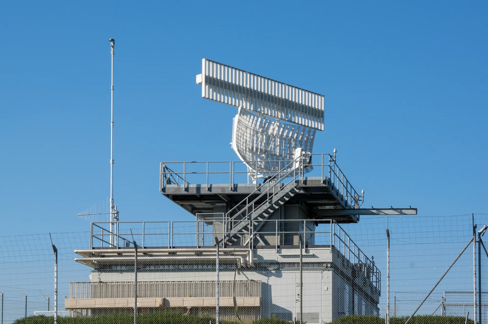

Surveillance systems allow air traffic services to build and maintain a traffic picture. Some systems detect aircraft independently, while others rely on equipment on board the aircraft. Modern surveillance is therefore layered: primary surveillance radar, secondary surveillance radar, Mode S, ADS-B, ADS-C, and multilateration complement each other for coverage, accuracy, redundancy, and operational context.

## Primary Surveillance Radar

The basic idea of radar is to use radio waves to detect objects at a distance. The physical basis was established in the nineteenth century, when electromagnetic waves were predicted and then demonstrated, but aviation radar became operational during the Second World War. The term **RAdio Detection And Ranging (RADAR)** reflects the two essential functions: detecting a target and measuring its distance.

<!-- {#fig-radar-ww2 width=40%} -->

In civil aviation, **\acr{PSR}** is the non-cooperative form of radar surveillance. The ground antenna transmits short, high-power pulses, usually in the **S-band or L-band**, and listens for the small fraction of energy reflected by aircraft. The time between transmission and echo gives the **range**, while the rotating antenna gives the **azimuth** of the target.

Because \acr{PSR} relies only on reflected energy, it can detect aircraft without requiring any working equipment on board. This makes it valuable as a safety net when a transponder fails, is switched off, or when an unknown target enters controlled airspace.

Its performance depends on transmitted power, wavelength, antenna design, target radar cross-section, terrain, weather echoes, and ground clutter. Processing is therefore needed to separate aircraft from unwanted returns such as precipitation, birds, or reflections from fixed objects. Despite the growth of cooperative surveillance, \acr{PSR} remains useful in terminal areas and as a resilient backup to \acr{SSR} and \acr{ADS-B}.

## Secondary Surveillance Radar

{#fig-ssr-palaiseau width=600px}

**\acr{SSR}** is the cooperative counterpart to \acr{PSR}. Instead of listening for a weak reflection from the aircraft skin, the ground station interrogates the aircraft transponder on **1030 MHz**, and the transponder replies on **1090 MHz**. This active reply is stronger and easier to process, giving controllers a more reliable surveillance picture in controlled airspace.

The information depends on the transponder mode. **Mode A** returns the four-digit *squawk code* assigned by air traffic control. **Mode C** adds pressure altitude, allowing the controller display to show the aircraft in three dimensions. These modes made \acr{SSR} the basis of cooperative radar surveillance, but they also have limits: the code space is small, replies can overlap in dense traffic, and the system depends on a functioning transponder.

{#fig-asr-zrh width=600px}

## Mode S SSR

**Mode S** extends \acr{SSR} by making interrogations selective. Each aircraft has a globally unique 24-bit \acr{ICAO} address, so a ground station can address one aircraft rather than asking every transponder in range to reply. This reduces garbling, limits unnecessary replies, and improves performance in busy airspace.

Mode S also supports richer data exchange. In addition to identity and altitude, it can carry aircraft parameters used by air traffic control and collision-avoidance systems such as \acr{TCAS}. Its unsolicited broadcasts, known as **squitters**, are especially important: extended squitters provide the technical basis for \acr{ADS-B}. In this sense, Mode S is both an improved form of secondary radar and a bridge toward broadcast-based surveillance.

## ADS-B

A more recent development is [**\acr{ADS-B}**](../data_sources/adsb-mode-s-decoding.qmd). Unlike \acr{PSR} or \acr{SSR}, \acr{ADS-B} does not rely on ground radar interrogations. Instead, the aircraft automatically broadcasts its own position, identification, altitude, and velocity, typically twice per second. The position is determined by the onboard GNSS receiver, making the system highly accurate.

The name itself summarizes its features: it is **automatic**, requiring no input from pilot or controller; it is **dependent**, as it relies on [satellite navigation data](satellite-navigation.qmd); it provides **surveillance** by delivering a continuous stream of situational information; and it is a **broadcast**, with data openly transmitted for reception by any suitably equipped ground station or aircraft.

Two service levels are distinguished. **\acr{ADS-B} Out** refers to the transmission of information by an aircraft and is now mandatory in Europe and the United States for most aircraft above 5.7 tons MTOW or capable of flying faster than 250 knots. **\acr{ADS-B} In** allows aircraft to receive this information from others, enabling advanced applications such as in-flight traffic displays or future self-separation concepts.

\acr{ADS-B} offers clear advantages: high positional accuracy, low infrastructure costs compared to radar, and near-global coverage through ground receivers and satellite constellations. However, it also introduces challenges. It is critically dependent on GNSS signals, requires universal equipage to be fully effective, and raises concerns about spoofing, jamming, and data integrity. Nevertheless, \acr{ADS-B} is a central pillar of modern surveillance strategies, complementing radar while paving the way toward trajectory-based air traffic management.

## ADS-C

[**\acr{ADS-C}**](../data_sources/adsc-data.qmd) is closely related to \acr{ADS-B} but follows a different operational concept. Instead of broadcasting continuously, \acr{ADS-C} is based on an agreement, or contract, between the aircraft and an air traffic control unit. Through this contract, the aircraft is required to transmit position and other data at predefined intervals, upon request, or when certain events occur.

There are three main contract types. A **periodic contract** sends reports at regular time intervals, often every five minutes, which has largely replaced traditional HF voice position reports in oceanic airspace. A **demand contract** allows ATC to request specific data outside the periodic cycle. Finally, an **event contract** automatically generates a message when predefined conditions are met, such as a level deviation, waypoint crossing, or unexpected climb or descent.

\acr{ADS-C} is particularly important in non-radar environments, such as the North Atlantic, polar regions, or remote continental areas. It enables controllers to maintain situational awareness and apply reduced separation standards even without radar coverage. Unlike \acr{ADS-B}, which broadcasts openly, \acr{ADS-C} uses protected datalink channels such as [\acr{VDL} or satellite links](communication-systems.qmd#data-communications), providing a more selective and secure flow of information.

## Multilateration

A complementary cooperative technology used in both en-route and airport environments is **\acr{MLAT}**. This system determines an aircraft’s position by measuring the difference in the time of arrival of a transponder signal at multiple ground stations. The signals used can be standard \acr{SSR} replies or \acr{ADS-B} transmissions, meaning that no additional airborne equipment is required beyond a conventional transponder.

By combining the timing information from several receivers, the aircraft’s location can be triangulated with high precision. Multilateration has proven particularly effective for **surface movement surveillance** at airports, where it can track aircraft and vehicles on runways and taxiways with greater accuracy than radar. It also serves as a cost-effective alternative or complement to traditional radar in terminal areas and can enhance redundancy in the wider surveillance network.

Because \acr{MLAT} derives position independently from signal timing, it is a useful check on aircraft-reported data. It can detect inconsistencies when an aircraft broadcasts a false or erroneous position, and it remains valuable during [\acr{GNSS} jamming or spoofing](satellite-navigation.qmd#operational-use-and-limitations) because it does not rely on the aircraft navigation solution. \acr{MLAT} also works with transponders that reply to \acr{SSR} or Mode S interrogations but do not broadcast their own position, making it an important layer between classical radar and \acr{ADS-B}.

## Glossary {.unnumbered}
