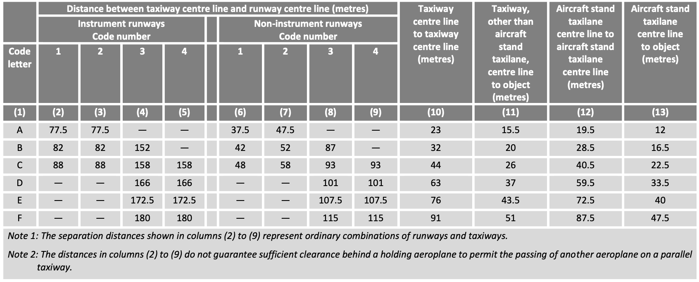

## Taxiways

Taxiways are built to ensure the safe and efficient movement of aircraft on the ground, linking stands to runways and vice versa. Their design follows a set of fundamental principles aimed at safety, clarity, and long-term usability.  

Wherever possible, taxiways should be straight. If curves are necessary, they must have radii that aircraft can realistically follow, with additional pavement areas (*fillets*) provided to accommodate the main landing gear. Equally important is a simple and intuitive layout that enables clear taxi routes, prevents pilot confusion, and ensures air traffic control instructions remain straightforward.  

Taxiways must also be designed with expandability in mind. Systems should allow for later extensions without major reconstruction, supporting phased airport growth. For instance, from an initial layout for 20,000–30,000 annual movements to one accommodating 150,000–250,000 movements.  

Sustainability is another key principle: taxi routes should be as short as possible to reduce fuel consumption and environmental impact.  

Above all, safety is paramount. Ideally, taxiways should be fully visible from the control tower, giving controllers a clear overview of ground operations. Runway crossings should be avoided; if unavoidable, they should intersect at right angles (90°), providing optimal visibility for flight crews (similar to road junctions). Designers are also encouraged to prevent the formation of *hotspots*, areas where pilot error is more likely. A well-known example was Zurich Airport’s Taxiway H1, a rapid exit from Runway 14 that could lead aircraft directly onto the apron around Dock E at high speed. To mitigate the risk, part of Taxiway H1 was closed, reducing the chance of potential incursions.  

Where hotspots cannot be fully eliminated, they are marked on aerodrome taxi charts and often accompanied by explanatory notes that describe the specific hazard.  

### Taxiway types
At aerodromes, several different taxiway types are distinguished. These taxiway types serve different functions, which we will discuss in more detail below.

* **Aircraft Stand Taxilane:**  
  An aircraft stand taxilane is a taxiway located on the apron, intended solely to provide access to aircraft stands. To maintain efficiency on cul-de-sac aircraft stand taxilanes, no more than five stands per side should be connected to such taxilanes, as excessive stand numbers may cause congestion. For example, an aircraft being pushed back and starting its engines may block part of the taxilane for 3–5 minutes, during which other aircraft cannot pass.  

* **Apron Taxiway:**  
  An apron taxiway is part of the taxiway system located on an apron, providing a through-route across the apron but not direct access to stands (which is the function of taxilanes). At some airports, apron taxiways are designed to accommodate different aircraft codes simultaneously — for example, central portions may support larger Code E aircraft, while adjacent sections are restricted to Code C aircraft. This allows Code C aircraft to cross or pass each other, improving apron traffic flow.  

* **Rapid Exit Taxiway (\acr{RET}):**
  \acr{RET} are taxiways connected to a runway at an acute angle of 25° to 45°, designed to enable aircraft to vacate the runway at relatively high speeds after landing. Their main purpose is to minimize the average *runway occupancy time* (\acr{ROT}) of arriving aircraft, i.e., the time an aircraft remains on the runway after touchdown. Since only one aircraft can occupy a runway at a given moment, a runway's throughput (i.e., the number of aircraft movements it can handle per unit time) depends on how quickly aircraft clear the runway.

* **Perimeter Taxiway:**  
  A perimeter taxiway runs around the ends of runways to avoid runway crossings. They are usually built at large airports. By eliminating runway crossings, perimeter taxiways decouple runway operations (arrivals and departures) from crossing traffic, improving throughput and safety by reducing runway incursion risks. However, perimeter taxiways require significant space and are costly compared to simple runway crossings.  

* **Bypasses:**  
  A bypass is a widened section of taxiway allowing aircraft to overtake or cross one another. Bypasses enable air traffic controllers to adjust departure sequences, which helps optimize airspace usage. They are also sometimes used for engine run-up checks or altimeter checks.  

* **Holding Positions / Holding Points:**  
  Holding positions are designated areas before runways where departing aircraft wait for clearance to line up. Ideally, holding positions are arranged at 90° to the runway to give pilots maximum visibility of both the runway and the approach corridor. However, angled holding positions allow departing traffic to line up more quickly, reducing occupancy times and increasing runway capacity. Parallel holding positions along the runway further allow overtaking and give controllers more flexibility in sequencing departures.  

  The required distance from the runway holding position to the runway centerline depends on the aerodrome code number and runway type. On runways with CAT II/III approaches, requirements are the most stringent, as obstacle free zones (OFZ) and ILS critical/sensitive areas must be respected.  

  The table below summarizes the prescribed distances between the runway holding position and the runway centerline. For example, on a Code 4 runway with a CAT I approach, the required distance between the holding position and the runway centerline is 90 m.  

  | Type of Runway      | Code 1 | Code 2 | Code 3 | Code 4 |
  |---------------------|--------|--------|--------|--------|
  | Non-instrument      | 30 m   | 40 m   | 75 m   | 75 m   |
  | Non-precision       | 40 m   | 40 m   | 75 m   | 75 m   |
  | CAT I Approach      | 60 m   | 60 m   | 90 m   | 90 m   |
  | CAT II/III Approach | --     | --     | 90 m   | 90 m   |
  | Take-off Runway     | 30 m   | 40 m   | 75 m   | 75 m   |
  : Required distance from holding position to runway centerline (CS ADR-DSN.D.340) {#tbl-holdingPosition}

### Dimensioning of taxiways
When designing taxiways, particular challenges arise in the layout of curved taxiway segments and their required minimum radii, the provision of taxiway shoulders and strips, as well as the definition of separation distances between taxiway centerlines and adjacent objects. 

The **minimum curve radius** $r_{\text{min}}$ of a taxiway depends on the maximum permitted taxi speed $v_{\text{max}}$, as shown in the following equation:  

$$
r_{\text{min}} = \frac{v_{\text{max}}^{2}}{g \cdot f}
$$

where $g = 9.81 \,\text{m/s}^2$ is the gravitational acceleration, and $f = 0.133$ is the maximum allowable lateral load factor.

### Dimensioning of taxiways

The **minimum curve radius** $r_{\text{min}}$ of a taxiway depends on the maximum permitted taxi speed $v_{\text{max}}$:

$$
r_{\text{min}} = \frac{v_{\text{max}}^{2}}{g \cdot f}
$$

where $g = 9.81 \,\text{m/s}^2$ and $f = 0.133$.

::: {.taxi-radius-box}
<label for="speedSlider"><strong>Maximum taxi speed:</strong></label>

<input id="speedSlider" type="range" min="5" max="50" value="25" step="1">

  25 kt

  Minimum curve radius:  
  <strong>68.1 m</strong>

<svg id="taxiwaySvg" viewBox="0 0 500 320">
  <path id="taxiwayOuter" fill="none" stroke="#777" stroke-width="52"/>
  <path id="taxiwayInner" fill="none" stroke="#999" stroke-width="38"/>
  <path id="centerline" fill="none" stroke="#f1c40f" stroke-width="3"/>
  <line id="radiusLineX" stroke="#333" stroke-width="1.5" stroke-dasharray="5 5"/>
  <line id="radiusLineY" stroke="#333" stroke-width="1.5" stroke-dasharray="5 5"/>
  <circle id="radiusCenter" r="5" fill="#111"/>
  <text id="radiusLabel" font-size="18" fill="#333"></text>
</svg>
:::

The **width** of a taxiway, together with its shoulders and strips, is specified in *CS ADR-DSN.D* (see Table @tbl-twy-dims). The required dimensions depend on the \acr{OMGWS} of the critical aircraft. For example, for a Code C aircraft (such as the A320, B737, or A220), the taxiway must have a width of 15 m, the shoulders a width of 25 m, and the strip a width of 52 m. Note that all dimensions refer to edge-to-edge measurements.  

| Code Letter | OMGWS     | Taxiway | Shoulder       | Strip |
|-------------|-----------|---------|----------------|-------|
| A           | < 4.5 m   | 7.5 m   | not required   | 31 m  |
| B           | 4.5–6 m   | 10.5 m  | not required   | 40 m  |
| C           | 6–9 m     | 15 m    | 25 m           | 52 m  |
| D           | 9–15 m    | 23 m    | 34 m           | 74 m  |
| E           | 9–15 m    | 23 m    | 38 m           | 87 m  |
| F           | 9–15 m    | 23 m    | 44 m           | 102 m |
: Taxiway Dimensions (CS ADR-DSN.D) {#tbl-twy-dims}

**Taxiway Shoulders** are mandatory on taxiways designed for critical aircraft with code letters C, D, E, and F. In these cases, both straight and curved sections of the taxiway must be provided with shoulders. The primary safety objective of a shoulder is to ensure a smooth transition between the full-strength taxiway pavement and the adjacent surface, thereby minimizing the risk of engine damage (e.g., from ingesting loose stones), preventing erosion along the pavement edge, and allowing Rescue and Fire Fighting (RFF) vehicles to operate if required. The shoulder surface must be designed to withstand the occasional passage of an aircraft wheel, although full-strength pavement (i.e., concrete) is not mandatory.  

The safety objective of the **Taxiway Strip** is to minimize hazards that may arise if an aircraft inadvertently veers off the taxiway. For this reason, fixed obstacles are not permitted within the taxiway strip. Taxiway strips must be provided for all taxiway types except aircraft stand taxilanes.  

**Minimum separation distances** in the context of taxiways define the minimum required spacing between the taxiway centerline and other features such as runways, parallel taxiways, aircraft stand taxilanes, fixed objects, or parked aircraft. Separation distances depend on the code letter of the critical aircraft for which the taxiways are designed, and to some extent also on the taxiway type. In general, larger aircraft and taxiways where higher taxi speeds are permitted require greater separation distances than smaller aircraft or low-speed taxilanes.  Taxi speed plays a key role, as even minor lapses in pilot attention at higher taxi speeds can lead to larger deviations from the taxiway centerline. For this reason, taxiways intended for higher-speed operations are designed with larger separation distances to provide an additional safety margin.  

::: {.callout-tip}
### Minimum taxiway separation distances required in practice

Figure [fig-minSepDistTWY] provides an overview of the minimum separation distance requirements for taxiways. These requirements depend primarily on the code letter of the critical aircraft and, in cases where runways are involved, also on the aerodrome code number and the type of runway (instrument vs. non-instrument). To determine the minimum separation distances, the figure differentiates between the following five cases:

1. *Distance between taxiway centerline and runway centerline* specifies the minimum required distance between the centerline of a runway and the centerline of a parallel taxiway. A distinction is made between instrument runways (which are subject to more stringent requirements) and non-instrument runways. In addition, the required distance depends on the aerodrome code number.  

2. *Taxiway centerline to taxiway centerline* defines the minimum required separation between the centerlines of two parallel taxiway segments.  

3. *Taxiway, other than aircraft stand taxilane, centerline to object* specifies the minimum required distance between the centerline of a taxiway (excluding aircraft stand taxilanes) and fixed objects such as buildings, light masts, or other infrastructure.  

4. *Aircraft stand taxilane centerline to aircraft stand taxilane* specifies the minimum required distance between two aircraft stand taxilanes, and by implication, also the distance between adjacent stands.  

5. *Aircraft stand taxilane centerline to object* specifies the minimum required distance between the centerline of an aircraft stand taxilane and fixed objects such as buildings, light masts, or passenger boarding bridges.  

{#fig-minSepDistTWY}

As an example, consider an aerodrome with code number 4, an instrument runway, and a critical aircraft of category E. In this case, the minimum required separation between the runway and taxiway centerlines is 172.5 m. Similarly, for two parallel taxiways designed for Code C aircraft, the minimum required centerline-to-centerline separation is 44 m. If these requirements cannot be met in practice, reclassification may be necessary. 

:::

### Marking of taxiways
Markings on taxiways, runway turnpads, and stands are generally painted yellow to ensure high contrast, making them easy for flight crews to read and interpret unambiguously.
In the following, we discuss the taxiway marking types most commonly used in practice, namely centerline markings, side stripe markings, runway holding positions, and mandatory instruction markings:

* **Centerline marking** Provide pilots with continuous guidance between the runway and the stand, and vice versa.  
They are generally painted in yellow and consist of a continuous line approximately 20 centimeter wide. At some airports, centerlines are color-coded on apron areas (e.g., apron taxiways) to improve clarity. For example, at Frankfurt Airport, color coding allows certain taxiways to be used either by one Code E/F aircraft or simultaneously by two Code C aircraft, thereby reducing potential capacity bottlenecks on apron taxiways.

* **Side Stripe Markings** indicate the boundary between the load-bearing and the non-load-bearing portions of a taxiway. In other words, they show flight crews where aircraft may safely taxi (where the pavement has sufficient strength to support the aircraft) and where they must not taxi. A side stripe marking consists of a pair of yellow lines, each line approximately 15 cm wide and separated by 15 cm. To enhance visibility and interpretation for flight crews, additional stripes are sometimes placed on the non-load-bearing side. This precaution helps prevent pilots from inadvertently taxiing onto non-load-bearing areas or over nearby surface irregularities such as channels or ditches.

* **Runway Holding Position Markings** indicate the point at which flight crews must stop their aircraft before entering a runway. Without explicit clearance from air traffic control (\acr{ATC}), crews are not permitted to cross runway holding position markings. Holding positions are defined and designed to protect the runway from incursions (i.e., the unauthorized entry or crossing of a runway by flight crews) and to safeguard the critical and sensitive areas of the Instrument Landing System (\acr{ILS}) from interference caused by taxiing aircraft. 
  
  In practice, two different patterns are used for marking holding positions: *Pattern A* and *Pattern B*. Both are painted in yellow. *Pattern A* is always applied, while *Pattern B* is used only at runway entries of CAT I/II/III runways with two or more holding positions. In such cases, the marking closest to the runway is drawn in *Pattern A*, while all additional holding position markings are drawn in *Pattern B*. *Pattern A* allows flight crews to determine on which side of the marking the runway is located: the dashed line always faces the runway side, while the solid line faces away from the runway. In this way, *Pattern A* is read similarly to centerlines in road traffic.

* **Enhanced Taxiway Centerline Markings** are often applied in the area leading up to runway holding positions to increase flight crews’ situational awareness of the proximity of a runway. These markings are not mandatory but are implemented on a voluntary basis. Studies have shown that enhanced centerline markings contribute positively to reducing the risk of runway incursions. Enhanced Taxiway Centerline Markings consist of dashed lines placed on either side of the standard centerline marking.

* **Mandatory Instruction Markings** are painted on the pavement in front of a holding point when the taxiway is wider than 60 m or when signage cannot be installed. These markings consist of white lettering on a red background.

### Lighting of taxiways
Taxiway Lighting has the same purpose as taxiway markings, but lighting provides additional support to pilots, particularly at night, during twilight, and in poor visibility. Below, we describe a series of taxiway lights that are commonly used in practice. These include centerline lights, edge lights, stop bar lights, and no-entry bar lights.

* **Taxiway Centerline Lights** are green lights that provide flight crews with centerline guidance under low-visibility conditions. In the area before reaching a runway, the lights alternate between green and yellow to raise pilots' situational awareness of the approaching runway. The installation of taxiway centerline lights is not mandatory but optional.  

* **Taxiway Edge Lights** are blue lights installed along the edges of taxiways. In contrast to taxiway centerline lights, the installation of edge lights is mandatory. 
  
  At some airports, taxiway edge lights are replaced with taxiway edge *markers*. Markers are passive light sources that reflect blue when illuminated by aircraft landing lights. The main reason for using markers is to mitigate the so-called *sea of blue effect*, which occurs when many blue lights are installed close together, making it difficult for the human eye to distinguish individual light sources [CASB, 1987].  

* **Stop Bar Lights & No-Entry Bar Lights** are red lights arranged in a bar formation, clearly indicating to pilots that they must not taxi beyond this line. Stop bars are installed both at runway holding positions and at critical intersections within the taxiway system where two taxiways cross.  

  Stop bar lights can be either *unidirectional* or *bidirectional*. Unidirectional lights are commonly used at runway holding positions: the red lights are visible only when approaching the runway from the taxiway. When viewed from the opposite direction, i.e., when vacating the runway across a unidirectional stop bar, pilots will not see the red lights (in most cases, green lights are displayed instead). Bidirectional stop bar lights, by contrast, are visible in both directions of movement.  

  Stop bar lights are actively controlled by air traffic control. When a flight crew receives clearance to enter or line up on the runway, the controller can deactivate the stop bar, or switch it from red to green, providing the pilots with a clear visual confirmation that they are authorized to proceed.

### Signage of Taxiways
Taxiway signs are part of the *taxi guidance system* and assist pilots in safely navigating an aerodrome. Signs must be installed so that they cannot be struck by aircraft, and they are required to be *frangible*, meaning that they will collapse or break if hit, preventing structural damage to the aircraft.  

A distinction is made between instruction signs and information signs. **Instruction Signs** are easily recognizable by their red background with white lettering. They are used to identify runways and holding positions, as well as to mark no-entry points where access to a runway is prohibited. If a runway entry is located at the runway end, the instruction sign shows only a single runway designation. In this case, taxiing onto the runway leads directly onto the indicated runway. If the runway entry is not at the end of the runway, the sign displays both runway designations.

At holding positions of *CAT I, II, and III* runways, the approach category corresponding to the holding point is also displayed. Where multiple holding positions exist (e.g., for aerodromes with CAT II or CAT III operations), each holding position is marked with the corresponding category.  

**Information Signs** are subdivided into *Location Signs* and *Direction Signs*.  

* **Location Signs** have a black background with yellow lettering and indicate the taxiway on which the aircraft is currently located.  
* **Direction Signs**, with a yellow background and black lettering, provide directional guidance at intersections.  

## Aprons and stands
In the following, we first examine different apron categories and their functions, as well as apron design principles. We then turn to stands, discussing their types, operational requirements, and associated infrastructure.

### Aprons
According to EASA CS ADR DSN, an apron is defined as an area on an aerodrome designated for the loading and unloading of aircraft. This includes the handling of passengers, mail, baggage, and cargo. In addition, aprons are used for refueling, maintenance, cleaning, potable water supply, catering services, and other ground-handling operations.  

::: {.callout-tip}
### Apron categories
Various apron categories are used at airports (Note: not all categories are used at all airports). The most important categories are as follows:

* **Passenger Terminal Aprons**  
  Located near passenger terminals and concourses. They are specifically designed for the handling of passengers and baggage. Passenger terminal aprons typically include *contact stands* (directly adjacent to terminal buildings and usually equipped with passenger boarding bridges) as well as *open stands* (also called *remote stands*), where passengers are transported to the aircraft by bus or walk across the apron.  

* **Remote Parking Aprons**  
  Used when aircraft remain on the ground for an extended period. Since it is economically inefficient to occupy stands at passenger terminal aprons for long-term parking, aircraft are relocated to remote aprons.  

* **General Aviation Aprons**  
  Serve general aviation aircraft and are typically located in areas of the airport where general aviation operators are based.  

* **Cargo Terminal Aprons**  
  Specifically designed for the handling of dedicated cargo flights.  

* **Service Aprons**  
  Found in the vicinity of aircraft maintenance facilities, provided such operations exist at the aerodrome.  

* **Isolated Aprons**  
  Perhaps the least known category. Almost every airport has at least one isolated apron, located far from critical infrastructure such as runways, terminals, or navigation facilities. They are used in emergency or threat situations (e.g., a bomb threat on board an aircraft) to safely and efficiently neutralize the hazard. The exact location of isolated aprons is usually not disclosed publicly but is well known to an airport’s emergency response units.  
:::

*EASA CS ADR DSN* and *ICAO DOC 9157* recommend a series of **safety, security, and design principles** for aprons. First, aprons should be designed to allow the *simultaneous movement* of aircraft and ground vehicles. Unauthorized access by third parties must be prevented; hence, aprons are typically fenced and strictly controlled areas. From an operational perspective, apron design should aim to provide optimal and short taxi routes for aircraft in order to minimize delays. The goal is to reduce the time aircraft spend taxiing with engines running, thereby limiting environmental impacts. Whenever possible, each origin–destination pair (i.e., stand to runway, and vice versa) should have more than one available taxi route. This redundancy allows air traffic to reroute in case of congestion.  

Where feasible, and if desired by the airport operator or handling agents, it is recommended to provide *fixed installations* for fueling and electrical power supply (e.g., underground fuel dispensers or ground power outlets embedded in the apron pavement), as well as an adequate integration of the baggage handling system into apron processes. However, such fixed infrastructure is typically expensive and therefore only economically justified at larger airports. Finally, a crucial design principle is that aprons must be planned with *expandability* in mind. Ideally, apron areas should be developed in modular units so that future airport expansions are not constrained by initial design choices.  

An apron consists not only of stands but also of several other components. To enable aircraft to taxi to and from the stands, *apron stand taxilanes* are used, while *apron taxiways* facilitate the circulation of taxiing aircraft within the apron area. For parking, pilots follow *lead-in lines*, and when departing from stands under their own power, flight crews use *lead-out lines*. These lines are painted in yellow and carefully designed to ensure that aircraft following them do not collide with fixed objects surrounding the stands, e.g., buildings, light poles. In addition, aprons are equipped with *service roads* for ground vehicles.  

### Stands
In the following, we take a closer look at aircraft stands. Specifically, we will examine different stand types, the required dimensions for stands, as well as clearance requirements.

#### Types of stands
Broadly, two main types of stands are distinguished: *contact stands* and *remote/open stands*.  

* **Contact stands** are directly connected to a passenger terminal building, allowing passengers to board and disembark the aircraft via a jet bridge. Since passengers can move directly between the terminal and the aircraft, contact stands are generally preferred by passengers and perceived as offering higher service quality.  

  To ensure precise aircraft positioning on stands, different lead-in guidance systems are used in practice:  

  - *Docking Guidance Systems* automatically detect whether an approaching aircraft is aligned with the lead-in line and measure its lateral deviation. In addition, the system continuously monitors the aircraft’s distance to the designated stop point. Both pieces of information are displayed to pilots on a digital display, enabling them to taxi onto the stand independently.  
  - *Marshallers* are ground staff who guide aircraft onto stands using illuminated wands. Based on standardized hand signals, they provide pilots with clear instructions for parking.  
  - *Azimuth Guidance for Nose-In Stands (\acr{AGNIS})* is a hybrid between a docking guidance system and a marshaller. AGNIS consists of two components: the azimuth guidance unit, which indicates whether the aircraft is aligned with the centerline, and the stop information system, which shows how far the aircraft must taxi to reach the stop point. Both systems function mechanically, using parallax and shutters that make certain display elements visible only from specific angles.  

  The main disadvantage of contact stands is that aircraft typically cannot depart under their own power and instead require a pushback. In this process, a tug repositions the aircraft onto the taxiway so that engines can be started. Pushback operations are complex and require experienced personnel. They also frequently block adjacent taxiways during the maneuver.  

* **Remote stands** are not directly connected to passenger buildings. Instead, passengers either walk to these stands or are transported by bus. Remote stands may be equipped with lead-in guidance systems (mainly at large airports), or aircraft may be guided by marshallers. In other cases, pilots rely exclusively on painted lead-in lines, often combined with a stop line on the pavement, positioned so that it is clearly visible from the cockpit.  

  In addition to the distinction between contact and remote stands, stands can also be categorized by the way aircraft are positioned:  

  - **Angled / Nose-In & Nose-Out Stands** allow aircraft to taxi onto the stand under their own power and depart the stand without requiring a pushback. These are common at airports with lower traffic volumes.  
  - **Parallel Stands** are aligned parallel to the terminal building. They are simple to lay out and do not require pushbacks, but they need more space and may create issues related to jet blast and equipment storage.  
  - **Taxi-In & Push-Out Stands** are the most common worldwide. Although they require a pushback, they use space efficiently, integrate well with passenger terminals, and ensure safe operations.  
  - **Multiple Aircraft Ramp System (\acr{MARS}) Stands** are designed to accommodate different aircraft size categories on the same apron area. They offer flexibility but introduce operational complexity because the allocation of positions depends heavily on the aircraft already parked.  

#### Stand dimensions
The **geometric dimensions** required for aircraft stands depend on the code letter of the critical aircraft (Code A to F), and in particular on the maximum wingspan within each category.  

| Code Letter | Example A/C Type | Width of Stand | Length of Stand | Clearance |
|-------------|------------------|----------------|-----------------|-----------|
| A           | Learjet 45       | 15 m           | 17.88 m         | 3 m       |
| B           | CRJ9             | 24 m           | 36.3 m          | 3 m       |
| C           | B727             | 36 m           | 46.7 m          | 4.5 m     |
| D           | MD11             | 52 m           | 61 m            | 7.5 m     |
| E           | A346             | 65 m           | 75.4 m          | 7.5 m     |
| F           | A748             | 80 m           | 76.3 m          | 7.5 m     |
: Stand Dimensions (CS ADR-DSN.D) {#tbl-stand-dims}

In addition to wingspan, the maximum aircraft **length** is also important in determining the required size of a stand. For example, for Code C aircraft, it is recommended to base the design on the Boeing 727, implying that Code C stands should be at least 46.7 m long.  

The table also specifies the required **clearance** between adjacent stands. For two adjacent Code C stands, a clearance of 4.5 m is required, while for two adjacent Code D, E, or F stands, the clearance must be at least 7.5 m.

## List of Acronyms {.unnumbered}
