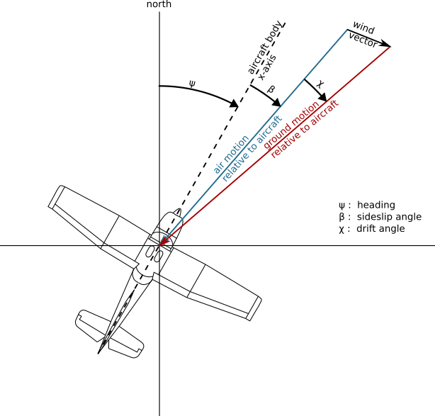

::: {.callout-warning}
## TODO for this page

This is extracted from the flight tracking chapter. It should be shortened to focus on raw-to-decoded ADS-B/Mode S concepts and then connected to the Open Aviation rs1090 notebook.
:::

## ADS-B

\acr{ADS-B} is probably one of the most well-known source of aircraft trajectories, popularized by famous websites such as [Flightradar24](https://www.flightradar24.com) or [The OpenSky Network](https://www.opensky-network.org). It is a surveillance technology designed to allow aircraft to broadcast their flight state periodically without the need for interrogation.

The word *automatic* refers to the fact that no inputs from controllers or pilots are required. The word *dependent* indicates this technology depends on information from other onboard systems, such as air data systems and navigation systems.


:::{.callout-important}
Messages do not contain any timestamp information. Timestamps are usually appended by the receiver of the messages, based on the reception time (and not the time of emission by the aircraft).
:::

Information broadcast in \acr{ADS-B} messages contains, in addition to a unique [24-bit transponder code](#aircraft-information), named `icao24` in examples below:

- *identification information*: the *callsign* (an 8-character *non-unique* identifier of the mission or the route of the aircraft) and the wake vortex category;
- *positional information*: latitude and longitude in degrees (encoded in \acr{CPR} format), barometric altitude (converted to ISA equivalent), and GPS altitude in feet;
- *velocity information*: track angle in degrees, ground speed in knots, vertical rate in feet per minute;
- *uncertainty information* around the position and the velocity of the aircraft.

Positional and velocity information is computed by the aircraft based on GNSS and inertial navigation systems of the aircraft.


:::{.callout-warning}
There is a common confusion in aviation between three designations for angles:

- the **track angle** represents the direction the aircraft is flying. It is the angle of the speed vector, ranging from 0 (North) to 360 degrees (90° for East, 270° for West);
- the **heading angle** represents the direction the nose the aircraft is pointing at;
- the **bearing angle** usually represents the direction of/to a static object, e.g., the bearing of a runway, or the bearing to a navigational point.




:::

:::{.callout-note}
## A note about callsign identifiers

A callsign is an eight-character identifier used for communication with the \acr{ATC}.

General aviation commonly uses the aircraft registration (tail number) as a callsign; commercial flights use a (often unique) identifier per route, starting with three letters identifying the airline operator, `BAW` (*pronounce "speedbird"*) for British Airways, `AFR` for Air France, etc.

Outside commercial aviation, the callsign commonly refers to the mission operated by an aircraft, and this can help distinguish the original intention of an aircraft used for specific purposes.

For example, aircraft `F-HNAV` uses the `CALIBRA` callsign for flight inspection and \acr{VOR}/\acr{ILS} calibration operations, the `JAMMING` callsign during jamming investigation and a more regular `NAK` callsign when commuting between airfields.

Similarly, test flights operated by Airbus use an `AIB` callsign; Boeing uses a `BOE` callsign; ambulance helicopters often use explicit callsigns: `SAMU` in France (stands for *Urgent Medical Aid Service*) and `LIFE` in many European countries.

Australian firefighting operations use a specific callsign depending on the role of the aircraft during the operations: `BMBR` for firebombing; `SPTR` for fire spotters; `BDOG`, *bird dog*, for fire attack supervisions (often subcontracted); and `FSCN`, fire scan for remote sensing fire operations.
:::

Even though all information is not available at each timestamp, tabular data (csv) is a common format to represent trajectory data. In this example, the `icao24` code `7c4779` matches a Qantas Boeing B747 registered as `VH-OEJ`.

```{ojs}
//| echo: false
import { Flight } from "@xoolive/traffic-js"
```

```{ojs}
//| echo: false
qantas747 = Flight.fromSample("qantas747")
qantas747.table()
```

This tabular information can easily be represented on a map, or as a regular plot for non-geographical features.

```{ojs}
//| echo: false
{
  const container = yield htl.html`<div style="height: 400px;">`;
  const map = L.map(container, { scrollWheelZoom: false });
  const layer = L.geoJSON(
    qantas747.resample(d3.timeSecond.every(5)).feature()
  ).addTo(map);
  map.fitBounds(layer.getBounds(), { maxZoom: 7 });
  L.tileLayer(
    "https://{s}.basemaps.cartocdn.com/rastertiles/voyager_labels_under/{z}/{x}/{y}.png",
    {
      attribution:
        "© <a href=https://www.openstreetmap.org/copyright>OpenStreetMap</a> contributors"
    }
  ).addTo(map);
}
```

---

```{ojs}
//| echo: false
Plot.plot({
  marks: [
    Plot.line(qantas747.data, {
      x: "timestamp",
      y: "altitude",
      stroke: "steelblue",
    })
  ],
  x: {
    tickFormat: d3.utcFormat("%H:%M"),
    label: "timestamp (UTC)"
  },
  y: {
    label: "altitude (in feet)"
  },
  marginLeft: 50,
  width,
  height: 200,
  grid: true
})
```


:::{.callout-note}
## What *broadcasting* means

The letter "B" in ADS-B means *broadcast*: aircraft broadcast messages at the same rate regardless of ground equipments and infrastructure, even if no aircraft or receiver is within range. Aircraft broadcast ADS-B data even over oceans, poles, or deserted areas.

Recently, "Space-based ADS-B" has been implemented so that a constellation of low-altitude satellites attempts to receive and decode ADS-B messages from aircraft in the troposphere and forward positional information to ground-based stations. There have been high expectations around this technology which is expected to revolutionize traditional air traffic management over areas such as the North-Atlantic Ocean, controlled by Shannon (Ireland) and Gander (Canada) \acr{ACC}s.
:::


:::{.callout-tip}
A lot of details about the contents of ADS-B messages, Mode S data and their decoding is detailed in a different book, *The 1090 Megahertz Riddle* @sun1090.
:::

## Mode S

The **\acr{SSR}**, also known as the \acr{ATCRBS}, was designed to provide air traffic controllers more information than what is provided by the primary radar. The secondary radar can be installed separately or installed on top of the primary radar. It uses a different radio frequency to actively interrogate the aircraft and receive information transmitted by the aircraft.

The \acr{SSR} transmits interrogations using the 1030 MHz radio frequency and the aircraft transponder transmits replies using the 1090 MHz radio frequency. In the early design of SSR, two civilian communication protocols (Mode A and Mode C) were introduced. Mode A and Mode C respectively allow the \acr{SSR} to continuously interrogate the **identity (squawk code)** and the **altitude** of an aircraft. The **squawk code** in Mode A is a unique 4-octal digit code given by air traffic controllers to aircraft in their \acr{FIR} for identification. The altitude in Mode C refers to the barometric altitude obtained from the aircraft’s air data system.

:::{.callout-tip}
Some squawk codes are reserved for particular emergency situations:

- `7500` for hijacking situations;
- `7600` for radio failures;
- `7700` for general emergencies @opensky20.
:::

**Mode S (Mode Select Beacon System)** was designed by Lincoln Laboratory at Massachusetts Institute of Technology in the 1970s. Based on different iterations of hardware and software design in the 1980s, the implementation of Mode S in air traffic control began in the 1990s. Since then, Mode S has become one of the main sources for aircraft surveillance.

The main characteristic of Mode S is its **selective interrogation**, which allows the \acr{SSR} to interrogate different information from different aircraft separately.  Unlike the limited number (4096) of unique identification codes in Mode A communication, the Mode S transponder is identified by a [24-bit transponder code](#aircraft-information), which can support up to $2^{24} =$ 6,777,216 unique addresses.

:::{.callout-important}
As Mode S consists in selective interrogation, it is strongly dependent on ground infrastructure around. Mode S messages are only sent in reply to an interrogation, therefore **no such data can be expected from an aircraft out of range of an SSR**, over the ocean, poles or deserted areas.
:::

The Mode S uplink signal contains parameters that indicate which information is desired by the air traffic controller. Many \acr{DF}s are described in the Mode S protocol in order to reply to such information:

-  **Altitude and identity replies (DF 4/5)** are rough equivalents to Mode A/C protocols;

-  **All-call reply (DF 11)** is the reply sent by Mode S compliant transponders to queries addressed to Mode A/C capable transponders. It contains the [24-bit transponder code](#aircraft-information), the transponder capabilities @sun20capab, and the interrogator identifier;

-  **ACAS short and long replies (DF 0/16)**: **Airborne Collision Avoidance System (ACAS)** is a system designed to reduce the risk of mid-air collisions and near mid-air collisions between aircraft. In particular **Resolution Advisories (RA)** generate particular messages (DF16) which can be used to find about past RA alerts @opensky19.\
   Details of the protocol are described [here](https://mode-s.org/decode/content/mode-s/4-acas.html).

-  **Comm-B, with altitude and identity replies (DF 20/21)**: this protocol supports a large number of different types of messages, defined by **BDS (Comm-B Data Selector)** codes. **Mode S Enhances Surveillance (EHS)** accounts for a handful of BDS codes of particular interests:
   - **BDS 4,0 -- Selected vertical intention**, with information about *selected altitude* in the autopilot, barometric pressure setting, and *navigation modes*;
   - **BDS 5,0 -- Track and turn report**, with information about the *roll angle*, *true track angle rate* and *\acr{TAS}* in addition to ground speed and true track angle information also defined in \acr{ADS-B};
   - **BDS 6,0 -- Heading and speed report**, with information about *magnetic heading* of the aircraft, *\acr{IAS}*, *barometric altitude rate* and *inertial vertical velocity* (in feet per minute)

Coupling BDS 5,0 (for the \acr{TAS}, the true track angle and the ground speed -- the two last entries are also present in ADS-B) with BDS 6,0 (for magnetic heading) and can be used to recompute the apparent wind seen by the aircraft.\
[Magnetic declination](earth.html#magnetic-declination) must be taken into account.

:::{.callout-tip}
\acr{ADS-B} messages also belong to the Mode S protocol, in the **\acr{ES}** category (BDS 0,5 through to 0,9). Only \acr{ES} messages (ADS-B) are broadcast, i.e., they are not the result of \acr{SSR} interrogations.
:::

 @sun1090](../../images/mode_s_services.png)
