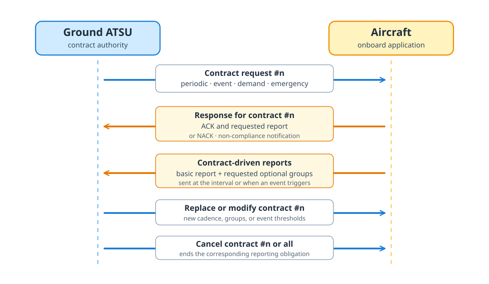

**\acr{ADS-C}** is surveillance by agreement. An aircraft does not broadcast the same report to every receiver in range. Instead, an \acr{ATSU} establishes a contract with the aircraft over datalink. That contract determines when the aircraft reports and which groups of information it includes.

Like \acr{ADS-B}, ADS-C is **automatic** because the reports do not have to be composed by the crew, and **dependent** because their contents come from onboard navigation and aircraft systems. The final letter describes the important difference: ADS-B is a **broadcast**, while ADS-C is an **addressed exchange** between an aircraft and a ground unit.

```{ojs}
//| echo: false
//| code-copy: false
datalinkWasm = import(new URL("../../media/wasm/datalink-wasm/datalink_wasm.js", document.baseURI).href).then(async (module) => {
  await module.default({ module_or_path: new URL("../../media/wasm/datalink-wasm/datalink_wasm_bg.wasm", document.baseURI).href });
  if (module.run) module.run();
  return module;
})

function decodeArinc622(raw, direction) {
  try {
    return { ok: true, value: datalinkWasm.decode_arinc622(raw, direction) };
  } catch (error) {
    return { ok: false, error: String(error?.message ?? error) };
  }
}

function adscHumanLabel(key) {
  const labels = {
    requested_groups: "Requested groups",
    events: "Event triggers",
    temperature_c: "Temperature",
    tcas_ok: "TCAS",
    nav_redundancy_ok: "Navigation redundancy",
    position_accuracy_code: "Position accuracy",
    noncompliant_tag: "Non-compliant group",
    noncompliance_notification: "Non-compliance notification",
    wind_direction_true_degrees: "True wind direction"
  };
  if (labels[key]) return labels[key];
  // Technical identifiers kept verbatim in their conventional casing.
  if (key === "icao24" || key === "callsign") return key;
  // Acronyms restored to uppercase after title-casing.
  const uppercased = String(key)
    .replace(/_/g, " ")
    .replace(/\b\w/g, (letter) => letter.toUpperCase());
  return uppercased
    .replace(/\bEta\b/g, "ETA")
    .replace(/\bTcas\b/g, "TCAS");
}

// Unit suffixes stripped from the field name and rendered (dimmed) after the
// value. Checked longest/most-specific first so that e.g. `_ft_per_min` wins
// over `_ft`. A key may carry at most one unit.
ADSC_UNITS = [
  ["ft_per_min", "ft/min"],
  ["true_degrees", "°"],
  ["seconds_past_hour", "s"],
  ["degrees", "°"],
  ["seconds", "s"],
  ["secs", "s"],
  ["ft", "ft"],
  ["nm", "nm"],
  ["kt", "kt"],
  ["temperature_c", "°C"],
  ["mhz", "MHz"],
  ["khz", "kHz"]
];

function adscUnitAndLabel(key) {
  // Latitudes and longitudes carry an implicit degree unit; keep the full
  // field name as the label (so "next_latitude" stays "Next Latitude").
  if (
    key === "latitude" || key === "longitude"
    || key.endsWith("_latitude") || key.endsWith("_longitude")
  ) {
    return { unit: "°", label: key };
  }
  for (const [suffix, unit] of ADSC_UNITS) {
    if (key === suffix || key.endsWith("_" + suffix)) {
      const stripped = key.endsWith("_" + suffix) ? key.slice(0, -(suffix.length + 1)) : key;
      return { unit, label: stripped || key };
    }
  }
  return { unit: "", label: key };
}

function adscFormatNumber(value) {
  // Always format with a dot regardless of the browser locale, then drop
  // trailing zeros (280.8105 stays, 466.5000 -> 466.5).
  return value.toFixed(4).replace(/\.?0+$/, "");
}

function adscLeafParts(key, nodeValue) {
  const { unit, label } = adscUnitAndLabel(key);
  if (nodeValue === null) return { label, value: "—", unit: "" };
  if (typeof nodeValue === "boolean") return { label, value: nodeValue ? "yes" : "no", unit: "" };
  if (typeof nodeValue === "number") {
    return { label, value: Number.isInteger(nodeValue) ? String(nodeValue) : adscFormatNumber(nodeValue), unit };
  }
  // Humanize snake_case identifiers such as "report_interval"; leave
  // callsigns, registrations, and hex addresses untouched.
  if (typeof nodeValue === "string" && /^[a-z][a-z0-9_]*$/.test(nodeValue)) {
    return { label, value: adscHumanLabel(nodeValue), unit: "" };
  }
  return { label, value: String(nodeValue), unit };
}

function adscSvgBlock(value, direction = "uplink") {
  const ns = "http://www.w3.org/2000/svg";
  const width = 900;
  const gap = 10;
  const directionLabel = direction === "downlink" ? "downlink" : "uplink";

  const element = (name, attributes = {}, text = null) => {
    const node = document.createElementNS(ns, name);
    for (const [key, attributeValue] of Object.entries(attributes)) {
      node.setAttribute(key, attributeValue);
    }
    if (text !== null) node.textContent = text;
    return node;
  };

  const wrapWords = (text, maxCharacters = 26) => {
    const lines = [];
    for (const word of String(text).split(/\s+/)) {
      const current = lines[lines.length - 1];
      if (!current || current.length + word.length + 1 > maxCharacters) lines.push(word);
      else lines[lines.length - 1] = `${current} ${word}`;
    }
    return lines;
  };

  const makeTree = (label, nodeValue, depth = 0) => {
    if (nodeValue === null || typeof nodeValue !== "object") {
      const parts = adscLeafParts(label, nodeValue);
      const valueLines = label === "reason" && parts.value.length > 26
        ? wrapWords(parts.value)
        : null;
      return {
        type: "leaf",
        label: parts.label,
        value: parts.value,
        valueLines,
        unit: parts.unit,
        depth,
        height: valueLines ? 34 + valueLines.length * 15 : 34
      };
    }

    const isArray = Array.isArray(nodeValue);
    const normalizedLabel = String(label).toLowerCase();
    // Non-compliance `groups` is an array of { noncompliant_tag, ... }; render
    // each entry as just the tag name, full-width, rather than an "Item N"
    // object block squeezed into a grid cell.
    const isNoncomplianceGroups = isArray && nodeValue.length > 0 && nodeValue.every(
      (item) => item && typeof item === "object" && !Array.isArray(item) && "noncompliant_tag" in item
    );
    // The 3-column grid suits uplink requested groups and event triggers,
    // along with the top-level downlink report cards. Nested non-compliance
    // groups stack full-width within their parent.
    const gridLabels = new Set(["requested_groups", "events"]);
    if (directionLabel === "downlink") gridLabels.add("ads-c payload");
    const isCardGrid = isArray && gridLabels.has(normalizedLabel);
    const isEventGrid = isArray && normalizedLabel === "events";
    const isPayloadArray = isArray && normalizedLabel === "ads-c payload";
    const entries = isNoncomplianceGroups
      ? nodeValue.map((item) => [item.noncompliant_tag, ""])
      : isArray
      ? nodeValue.map((item, index) => {
          if (item && typeof item === "object" && !Array.isArray(item)) {
            const itemEntries = Object.entries(item);
            if (itemEntries.length === 1) return itemEntries[0];
          }
          if (typeof item === "string" && (isEventGrid || isPayloadArray)) {
            return [item, {}];
          }
          if (isCardGrid && typeof item === "string") return [item, "requested"];
          return [`Item ${index + 1}`, item];
        })
      : Object.entries(nodeValue);
    const children = entries.map(([key, child]) => makeTree(key, child, depth + 1));
    const gridColumns = isCardGrid ? 3 : 1;
    const rows = isCardGrid
      ? Array.from({ length: Math.ceil(children.length / gridColumns) }, (_, row) =>
          children.slice(row * gridColumns, (row + 1) * gridColumns))
      : [];
    const childrenHeight = isCardGrid
      ? rows.reduce((total, row) => total + Math.max(...row.map((child) => child.height)), 0)
        + Math.max(0, rows.length - 1) * gap
      : children.reduce((total, child) => total + child.height, 0)
        + Math.max(0, children.length - 1) * gap;
    const height = 42 + childrenHeight + 12;

    return {
      type: isArray ? "array" : "object",
      label,
      count: isArray ? nodeValue.length : null,
      children,
      gridColumns,
      depth,
      height
    };
  };

  const drawTree = (tree, x, y, nodeWidth, parent) => {
    if (tree.type === "leaf") {
      parent.append(element("rect", {
        x, y, width: nodeWidth, height: tree.height, rx: 7, class: "adsc-svg-leaf"
      }));
      parent.append(element("text", {
        x: x + 12, y: y + (tree.valueLines ? 19 : 22), class: "adsc-svg-key"
      }, adscHumanLabel(tree.label)));
      const valueText = element("text", tree.valueLines
        ? { x: x + 12, y: y + 40, class: "adsc-svg-value" }
        : { x: x + nodeWidth - 12, y: y + 22, class: "adsc-svg-value", "text-anchor": "end" }
      );
      if (tree.valueLines) {
        tree.valueLines.forEach((line, index) => {
          valueText.append(element("tspan", {
            x: x + 12,
            dy: index === 0 ? 0 : 15
          }, line));
        });
      } else if (tree.label === "icao24") {
        valueText.append(element("tspan", { class: "adsc-svg-dim" }, "0x"));
        valueText.append(element("tspan", {}, tree.value));
      } else {
        valueText.append(element("tspan", {}, tree.value));
        if (tree.unit) {
          // Degree-family units (°, °C) attach with no space; others get one.
          const unitText = tree.unit.startsWith("°") ? tree.unit : ` ${tree.unit}`;
          valueText.append(element("tspan", { class: "adsc-svg-dim" }, unitText));
        }
      }
      parent.append(valueText);
      return;
    }

    parent.append(element("rect", {
      x, y, width: nodeWidth, height: tree.height, rx: 10,
      class: `adsc-svg-node adsc-svg-depth-${Math.min(tree.depth, 3)}`
    }));
    parent.append(element("text", {
      x: x + 14, y: y + 25, class: "adsc-svg-heading"
    }, adscHumanLabel(tree.label)));
    if (tree.type === "array") {
      parent.append(element("text", {
        x: x + nodeWidth - 14, y: y + 24,
        class: "adsc-svg-count", "text-anchor": "end"
      }, `${tree.count} ${tree.count === 1 ? "item" : "items"}`));
    }

    let childY = y + 42;
    if (tree.gridColumns > 1) {
      const innerWidth = nodeWidth - 24;
      const columnWidth = (innerWidth - gap * (tree.gridColumns - 1)) / tree.gridColumns;
      for (let start = 0; start < tree.children.length; start += tree.gridColumns) {
        const row = tree.children.slice(start, start + tree.gridColumns);
        const rowHeight = Math.max(...row.map((child) => child.height));
        row.forEach((child, column) => {
          drawTree(
            { ...child, height: rowHeight },
            x + 12 + column * (columnWidth + gap),
            childY,
            columnWidth,
            parent
          );
        });
        childY += rowHeight + gap;
      }
    } else {
      for (const child of tree.children) {
        drawTree(child, x + 12, childY, nodeWidth - 24, parent);
        childY += child.height + gap;
      }
    }
  };

  const payloadTree = makeTree(
    "ADS-C payload",
    value?.payload?.adsc ?? value?.payload ?? value,
    0
  );
  const payloadY = 142;
  const height = payloadY + payloadTree.height + 20;
  const svg = element("svg", {
    viewBox: `0 0 ${width} ${height}`,
    role: "img",
    "aria-label": `Decoded ADS-C ${directionLabel} message`,
    class: "adsc-json-svg"
  });
  svg.append(element("title", {}, `Decoded ADS-C ${directionLabel} message`));
  svg.append(element("desc", {},
    "A nested-box representation of the ARINC 622 envelope and decoded ADS-C payload."));

  const style = element("style");
  style.textContent = `
    .adsc-json-svg { width: 100%; height: auto; display: block; font-family: IBM Plex Sans, system-ui, sans-serif; }
    .adsc-svg-background { fill: var(--bs-body-bg, #fff); stroke: var(--bs-border-color, #d0d7de); }
    .adsc-svg-title { fill: var(--bs-body-color, #20242a); font-size: 21px; font-weight: 600; }
    .adsc-svg-subtitle, .adsc-svg-meta-label, .adsc-svg-count { fill: var(--bs-secondary-color, #68717d); }
    .adsc-svg-subtitle { font-size: 12px; }
    .adsc-svg-meta-card, .adsc-svg-leaf { fill: var(--bs-body-bg, #fff); stroke: var(--bs-border-color, #d0d7de); }
    .adsc-svg-meta-label { font-size: 10px; font-weight: 600; letter-spacing: .08em; }
    .adsc-svg-meta-value { fill: var(--bs-body-color, #20242a); font-size: 15px; font-weight: 600; }
    .adsc-svg-node { stroke: var(--bs-border-color, #d0d7de); stroke-width: 1; }
    .adsc-svg-depth-0 { fill: color-mix(in srgb, var(--bs-primary, #18bc9c) 10%, var(--bs-body-bg, #fff)); }
    .adsc-svg-depth-1 { fill: color-mix(in srgb, var(--bs-info, #3498db) 9%, var(--bs-body-bg, #fff)); }
    .adsc-svg-depth-2 { fill: var(--bs-tertiary-bg, #f8f9fa); }
    .adsc-svg-depth-3 { fill: var(--bs-secondary-bg, #ecf0f1); }
    .adsc-svg-heading { fill: var(--bs-body-color, #20242a); font-size: 14px; font-weight: 600; }
    .adsc-svg-count { font-size: 11px; }
    .adsc-svg-key { fill: var(--bs-secondary-color, #68717d); font-size: 12px; }
    .adsc-svg-value { fill: var(--bs-body-color, #20242a); font: 600 12px ui-monospace, SFMono-Regular, Menlo, Consolas, monospace; }
    .adsc-svg-dim { fill: var(--bs-secondary-color, #9aa0a6); font-weight: 400; }
  `;
  svg.append(style);
  svg.append(element("rect", {
    x: 0.5, y: 0.5, width: width - 1, height: height - 1, rx: 13, class: "adsc-svg-background"
  }));
  svg.append(element("text", { x: 20, y: 30, class: "adsc-svg-title" },
    `Decoded ADS-C ${directionLabel}`));
  svg.append(element("text", { x: 20, y: 50, class: "adsc-svg-subtitle" },
    "ARINC 622 envelope"));

  const metadata = [
    ["ATSU address", value?.atsu_address ?? "—"],
    ["Application", value?.imi ?? "—"],
    ["Aircraft registration", value?.registration ?? "—"]
  ];
  const cardGap = 12;
  const cardWidth = (width - 40 - cardGap * 2) / 3;
  metadata.forEach(([label, metadataValue], index) => {
    const x = 20 + index * (cardWidth + cardGap);
    svg.append(element("rect", {
      x, y: 68, width: cardWidth, height: 56, rx: 8, class: "adsc-svg-meta-card"
    }));
    svg.append(element("text", { x: x + 12, y: 87, class: "adsc-svg-meta-label" }, label.toUpperCase()));
    svg.append(element("text", { x: x + 12, y: 109, class: "adsc-svg-meta-value" }, String(metadataValue)));
  });

  drawTree(payloadTree, 20, payloadY, width - 40, svg);
  return htl.html`<div class="adsc-svg-output">${svg}</div>`;
}

function adscDirectionError(error, direction = "uplink") {
  const detail = String(error ?? "Unknown decoder error").replace(/^Error:\s*/, "");
  const directionLabel = direction === "downlink" ? "downlink" : "uplink";
  return htl.html`<div role="alert" style="border:1px solid var(--bs-danger, #dc3545); border-left-width:4px; border-radius:.55rem; padding:.8rem 1rem; background:color-mix(in srgb, var(--bs-danger, #dc3545) 8%, var(--bs-body-bg, #fff)); color:var(--bs-body-color, #212529)">
    <strong style="display:block; margin-bottom:.2rem">Could not decode this as an ADS-C ${directionLabel}.</strong>
    <span style="font-family:ui-monospace, SFMono-Regular, Menlo, Consolas, monospace; font-size:.84em">${detail}</span>
  </div>`;
}

adscUplinkError = (error) => adscDirectionError(error, "uplink")
```

## ADS-C message structure

ADS-C is carried over [\acr{VDL} Mode 2](datalink-acars-message-sources.qmd#vdl2-and-network-paths), [\acr{HFDL}](datalink-acars-message-sources.qmd#radio-bearers), or [\acr{SATCOM}](datalink-acars-message-sources.qmd#radio-bearers) depending on the region and the datalink availability. The ground unit can request periodic reports, event reports, or demand reports. The aircraft can also send emergency reports if it is in distress.

This makes ADS-C particularly useful over oceanic and remote regions. Observations are much less frequent than ADS-B positions, but they may include information that a usual ADS-B trajectory does not provide: the aircraft's predicted route, air- and earth-referenced motion, wind, and temperature.

Here we begin with the [ARINC 622 application text](datalink-acars-message-sources.qmd#arinc-622-envelopes) extracted from the ACARS message.  The Interline Message Identifier (IMI) selects the application carried by the common wrapper: `ADS` selects ADS-C.

::: {.acars-decode-card}
**ARINC 622 ADS envelope**

<div class="acars-textline"><span class="acars-field-control">/</span><span class="acars-field-station">BDOCAYA</span><span class="acars-field-control">.</span><span class="acars-field-kind">ADS</span><span class="acars-field-control">.</span><span class="acars-field-reg">A7-ANR</span><span class="acars-field-text">073759D0C997088B86BC1F0D377770C71C488B805B38E698AB9AC88B80</span><span class="acars-field-crc">A626</span></div>

<div class="acars-legend">
<span class="legend-control">separators</span>
<span class="legend-station">ATSU address</span>
<span class="legend-kind">IMI</span>
<span class="legend-reg">registration</span>
<span class="legend-text">application payload</span>
<span class="legend-crc">16-bit CRC</span>
</div>
:::

Similar messages can be sent from the ground and from the aircraft. The ground sends contract requests, and the aircraft sends reports. The same ARINC 622 envelope is used in both directions, but the application payload is interpreted differently depending on whether it is an uplink or a downlink.

## Contract messages

Ground-to-air messages establish, change, or cancel contracts, while air-to-ground messages acknowledge those requests and return surveillance reports.


{#fig-adsc-contract-exchange}

## Contract requests

Four operational categories are commonly distinguished:

- a **periodic contract** requests that the aircraft send reports at a regular interval, optionally including additional groups of information.
  In that case, the contract contains a **report interval** in seconds, determining the cadence of periodic base reports. Then, requested groups are mapped to a **modulus**: if a group is requested with a modulus of 5, we expect to receive it every 5 messages, i.e. every 5 × report interval seconds. If the modulus is 0, the group is requested only once.
- an **event contract** requests that the aircraft send reports when a specified condition occurs, such as a lateral deviation (a lateral threshold in nm), vertical-speed change (a threshold in feet per minute), altitude range (floor and ceiling values, in ft) or waypoint change;
- a **demand contract** requests that the aircraft send a single report in response to a ground request; and
- an **emergency periodic contract** requests that the aircraft send recurring reports under emergency reporting conditions.

A contract has a number so that requests, acknowledgements, and cancellations can be associated. The aircraft can accept a request, reject it, or indicate that it cannot supply particular report groups or parameters. Ground systems can cancel one contract or all active contracts, and emergency reporting has its own cancellation indication.

The following uplink messages are examples of contract requests, that are interactively decoded below. *You may also copy and paste your own ARINC 622 envelope into the input field to see how it is interpreted.*


```{ojs}
//| echo: false
//| code-copy: false
adscSampleButtonStyles = htl.html`<style>
.adsc-sample-buttons {
  display: flex;
  flex-wrap: wrap;
  gap: .45rem;
  margin: .25rem 0 .75rem;
}
.adsc-sample-buttons button {
  border: 1px solid var(--bs-border-color, #d0d7de);
  border-radius: 999px;
  background: var(--bs-body-bg, #fff);
  color: var(--bs-body-color, #24292f);
  padding: .35rem .75rem;
  font: inherit;
  line-height: 1.2;
  cursor: pointer;
}
.adsc-sample-buttons button.active {
  background: var(--bs-primary, #2c7fb8);
  border-color: var(--bs-primary, #2c7fb8);
  color: #fff;
}
.adsc-envelope-input {
  display: block;
  width: 100%;
  margin: .3rem 0 1.25rem;
}
.adsc-envelope-input input {
  box-sizing: border-box;
  width: 100%;
  border: 1px solid var(--bs-border-color, #d0d7de);
  border-radius: .65rem;
  background: var(--bs-body-bg, #fff);
  color: var(--bs-body-color, #24292f);
  padding: .7rem .85rem;
  font: .92rem/1.35 Inconsolata, ui-monospace, SFMono-Regular, Menlo, Consolas, monospace;
  transition: border-color .15s ease, box-shadow .15s ease;
  margin-bottom: .5rem;
}
.adsc-envelope-input input:hover {
  border-color: color-mix(in srgb, var(--bs-primary, #2c7fb8) 55%, var(--bs-border-color, #d0d7de));
}
.adsc-envelope-input input:focus {
  outline: 0;
  border-color: color-mix(in srgb, var(--bs-primary, #2c7fb8) 55%, var(--bs-border-color, #d0d7de));
}
.adsc-sample-note {
  margin: -.15rem 0 .7rem;
  color: var(--bs-secondary-color, #68717d);
  font-size: .9em;
}
</style>`
```

```{ojs}
//| echo: false
//| code-copy: false
adscSamples = [
  "/UPGCAYA.ADS.B-324P07020BCD0D010E0110014BAA",
  "/MGQCAYA.ADS.ET-AUQ07290B8E0C000D000E01100011000F011500010144",
  "/OAKODYA.ADS.N2645U0805140A28E574",
  "/ANCATYA.ADS.N704GT07000BC80C000D010E0110000F011500010801140A288520",
  "/DKRCAYA.ADS.EC-NUL0202CA70",
  "/PIKCPYA.ADS.ET-ARE019D77"
]
```

```{ojs}
//| echo: false
//| code-copy: false
adscSampleButtons = (samples, label = "Select ADS-C uplink sample") => {
  let current = 0;
  const form = htl.html`<div class="adsc-sample-buttons" role="group" aria-label=${label}>
    ${samples.map((_, index) => htl.html`<button type="button" data-index=${index}>Sample ${index + 1}</button>`)}
  </div>`;
  const setValue = (index, notify = true) => {
    current = index;
    for (const button of form.querySelectorAll("button")) {
      button.classList.toggle("active", +button.dataset.index === current);
    }
    if (notify) form.dispatchEvent(new Event("input", { bubbles: true }));
  };
  Object.defineProperty(form, "value", {
    get: () => current,
    set: (index) => setValue(+index, false)
  });
  form.addEventListener("click", (event) => {
    const button = event.target.closest("button");
    if (button) setValue(+button.dataset.index);
  });
  setValue(0, false);
  return form;
}
```

```{ojs}
//| echo: false
//| code-copy: false
viewof selectedAdscSampleIndex = adscSampleButtons(adscSamples)
```

```{ojs}
//| echo: false
//| code-copy: false
selectedAdscSample = adscSamples[selectedAdscSampleIndex] ?? adscSamples[0]
```

```{ojs}
//| echo: false
//| code-copy: false
viewof adscEnvelope = {
  const control = Inputs.text({ value: selectedAdscSample });
  control.classList.add("adsc-envelope-input");
  control.style.width = "100%";
  const input = control.querySelector("input");
  if (input) {
    input.style.width = "100%";
    input.setAttribute("aria-label", "ADS-C uplink ARINC 622 envelope");
    input.setAttribute("spellcheck", "false");
  }
  return control;
}
```

```{ojs}
//| echo: false
//| code-copy: false
adscDecoded = decodeArinc622(adscEnvelope, "uplink")
```

```{ojs}
//| echo: false
//| code-copy: false
adscDecoded.ok
  ? adscSvgBlock(adscDecoded.value)
  : adscUplinkError(adscDecoded.error)
```

## Contract reports

Before surveillance groups appear, the aircraft may answer a contract request or report a problem with it:

- an **acknowledgement (ACK)** identifies the contract number that the aircraft has accepted. It may appear alone or at the beginning of a message that also contains the first requested report;
- a **negative acknowledgement (NAK)** identifies the rejected request and gives a reason code. Some reasons also carry the octet or tag that caused the rejection;
- a **non-compliance notification** identifies requested groups or individual parameters that the aircraft cannot supply. It distinguishes an unrecognised group, an unavailable group, and unavailable parameters within an otherwise supported group; and
- **cancel emergency mode** indicates that emergency reporting has ended.

These responses are operational data in their own right. A missing group following a non-compliance notification, for example, is an explicitly reported limitation rather than ordinary missing data.


After any contract response, the remainder of an ADS-C downlink is a sequence of report groups. A message may contain one group, but several are often combined, and the ones that recur depend on what the contract requested.

The **basic report** is the heart of ADS-C surveillance: latitude, longitude, altitude, a time stamp expressed as seconds past the current hour, navigation-redundancy status, a position-accuracy code, and a TCAS health bit. It is the group most contracts expect on every periodic report, and the same packed state reappears, with a different leading tag, whenever an event triggers transmission.

Alongside the basic state, a report commonly carries identity and intent:

- **identity**: the aircraft **callsign** and the **airframe identification** carrying the 24-bit ICAO address, which join the registration already present in the envelope;
- **route and projections**: the **predicted route** (next and next-next waypoints with altitudes and an ETA), an **intermediate projection** (a state at a time/track offset), and a **fixed projection** (an absolute future position). These describe intent at the time of the report rather than the route eventually flown.
- **motion and environment**: **earth-reference data** (track, ground speed, vertical rate), **air-reference data** (true heading, Mach, vertical rate), and **meteorological data** (true wind direction, wind speed, and temperature).

The time in a basic or event report is expressed as seconds past the current hour, not as a complete timestamp. It must be anchored using surrounding message metadata. Event reports reuse the basic-report state but retain the event type that caused transmission.


The following downlink sample messages are examples of contract reports collected from the [OpenSky ADS-C dataset](https://doi.org/10.5281/zenodo.14659997), that are interactively decoded below. *You may also copy and paste your own ARINC 622 envelope into the input field to see how it is interpreted.*

The samples cover contract responses, ordinary and emergency surveillance, identity, route intent, projections, motion, meteorology, and an event report. In practice, basic reports and predicted routes are common, whereas emergency and lateral-deviation reports are rare


```{ojs}
//| echo: false
//| code-copy: false
adscReportSamples = [
  {
    raw: "/FUKJJYA.ADS.HL87010716B9138FDE0946EBB81F16007863D928E0106017177C037438C94708AA0D16C16B8E38C9470083182D8355554947000E63B8CE00040F63A9A540045A49",
    summary: "Basic report with intermediate and fixed projections, predicted route, and both earth- and air-reference data."
  },
  {
    raw: "/CCUCAYA.ADS.A6-BNC0301070B0B0A0CA048C99D2297170B88B1FC2188CA04AD0C154134C338200D0B14DA0B6088CA005B0B63BA00F508CA000E65110340040F64F9A740041013143EAC1189653AB2C1",
    summary: "A rich report combining acknowledgement, surveillance, identity, fixed projection, route, motion, meteorology, and airframe identity."
  },
  {
    raw: "/BNECAYA.ADS.DQ-FAI0304B147",
    summary: "Acknowledgement only: contract 4 was accepted."
  },
  {
    raw: "/ALGCAYA.ADS.ET-AWM0401069CA4",
    summary: "Negative acknowledgement with its request and reason values."
  },
  {
    raw: "/PIKCPYA.ADS.G-XLEL0607253D3F652546D4CF641DEA92",
    summary: "Cancellation of emergency mode followed by a basic report."
  },
  {
    raw: "/KULCAYA.ADS.A7-AMI14059612197B8A02F5401F0D04656A2B274A02463B0332DA3637CA02403238",
    summary: "Waypoint-change event report accompanied by the aircraft's predicted route."
  },
  {
    raw: "/PIKCPYA.ADS.F-HMIL092127DFDA9048CB54981F0C197274C038200E54D0D1BFE4AFA3",
    summary: "Emergency basic report with flight identification and earth-reference data."
  },
  {
    raw: "/SEZCAYA.ADS.HZ-ARC03010501010B4007F8D93908C88946C9519F0DF8E391086689470027FA7190FA510947000E6E60F30000AD7C",
    summary: "Acknowledgement and non-compliance notification followed by basic, predicted-route, and earth-reference groups."
  }
]
```

```{ojs}
//| echo: false
//| code-copy: false
viewof selectedAdscReportIndex = adscSampleButtons(
  adscReportSamples,
  "Select ADS-C downlink sample"
)
```

```{ojs}
//| echo: false
//| code-copy: false
selectedAdscReportSample = adscReportSamples[selectedAdscReportIndex] ?? adscReportSamples[0]
```

```{ojs}
//| echo: false
//| code-copy: false
htl.html`<p class="adsc-sample-note"><strong>Sample ${selectedAdscReportIndex + 1}.</strong> ${selectedAdscReportSample.summary}</p>`
```

```{ojs}
//| echo: false
//| code-copy: false
viewof adscReportEnvelope = {
  const control = Inputs.text({ value: selectedAdscReportSample.raw });
  control.classList.add("adsc-envelope-input");
  control.style.width = "100%";
  const input = control.querySelector("input");
  if (input) {
    input.style.width = "100%";
    input.setAttribute("aria-label", "ADS-C downlink ARINC 622 envelope");
    input.setAttribute("spellcheck", "false");
  }
  return control;
}
```

```{ojs}
//| echo: false
//| code-copy: false
adscReportDecoded = decodeArinc622(adscReportEnvelope, "downlink")
```

```{ojs}
//| echo: false
//| code-copy: false
adscReportDecoded.ok
  ? adscSvgBlock(adscReportDecoded.value, "downlink")
  : adscDirectionError(adscReportDecoded.error, "downlink")
```

## Sources of data

The OpenSky dataset used above came from Classic Aero traffic relayed through geostationary **Inmarsat satellites**. Aircraft transmit to a satellite in L-band, and the satellite-to-ground downlink can then be observed in C-band. A suitably located and pointed satellite station can therefore observe aircraft across a large satellite footprint, rather than only those near a local VHF or ADS-B receiver.


```{ojs}
//| echo: false
topojson = require("topojson-client@3")
```

```{ojs}
//| echo: false
countries = fetch("https://cdn.jsdelivr.net/npm/world-atlas@2/countries-110m.json")
  .then((response) => response.json())
  .then((atlas) => topojson.feature(atlas, atlas.objects.countries))
```

::: {#fig-adsc-inmarsat-coverage fig-cap="Inmarsat geostationary ocean-region coverage that carries ADS-C over oceanic and remote airspace. Each shaded footprint is the operational edge of coverage of one satellite, named for its ocean region."}

```{ojs}
//| echo: false
{
  const regions = [
    { region: "Inmarsat-4 F3", lon: -98, color: "#4e79a7" },
    { region: "Inmarsat-3 F5", lon: -54, color: "#59a14f" },
    { region: "Inmarsat-4 AF1", lon: 25, color: "#e15759" },
    { region: "Inmarsat-6 F1", lon: 84, color: "#d67195"},
    { region: "Inmarsat-4 F2", lon: 143.5, color: "#f28e2b" }
  ];
  const coverageRadius = 70;
  const graticule = d3.geoGraticule().step([20, 20])();
  const coverage = (lon) => d3.geoCircle().center([lon, 0]).radius(coverageRadius)();
  const plotWidth = Math.min(width, 760);
  const plot = Plot.plot({
    width: plotWidth,
    height: plotWidth / 2 + 40,
    projection: { type: "equal-earth" },
    marks: [
      Plot.geo({ type: "Sphere" }, { fill: "#eaf3f8", stroke: "#6c8ba0" }),
      Plot.geo(graticule, { stroke: "#c7d6dd", strokeWidth: 0.5 }),
      Plot.geo(countries, { fill: "#f1efe7", stroke: "#9aa6ad", strokeWidth: 0.4 }),
      ...regions.map((region) =>
        Plot.geo(coverage(region.lon), {
          fill: region.color,
          fillOpacity: 0.18,
          stroke: region.color,
          strokeWidth: 1.2
        })
      ),
      Plot.text(regions, {
        x: "lon",
        y: 6,
        text: "region",
        fill: (d) => d.color,
        stroke: "white",
        strokeWidth: 2.5,
        paintOrder: "stroke",
        fontWeight: 600,
        fontSize: 12
      })
    ]
  });
  return plot;
}
```

:::


ADS-C can also be carried through the **Iridium satellite network**. Unlike Inmarsat's geostationary satellites, Iridium's low-Earth-orbit satellites move continuously and provide polar coverage. Iridium is therefore an important alternative bearer for high-latitude and oceanic communications.

Finally, ADS-C may also be observed on HF and VDL2 channels, or through aggregators such as [airframes.io](https://airframes.io). These sources contain more reports over continental areas, including near airports. Because those areas are generally well covered by ADS-B, ADS-C is often a lower priority there.


## Uses and limitations

ADS-C supports several forms of analysis:

- reconstructing sparse oceanic and remote trajectories;
- examining event-triggered surveillance observations;
- studying changes in onboard route intent;
- comparing predicted and subsequently flown paths;
- comparing intent with filed routes and [CPDLC clearances](cpdlc-data.qmd);
- comparing reported wind and temperature with weather models;
- studying reporting cadence and contract configuration.

These uses depend on what the source retained. Several limitations must remain explicit:

- public reception is incomplete and bearer-dependent;
- reports are sparse and contract-dependent;
- message direction may be missing from processed feeds;
- a predicted position is not a clearance or a guarantee of the path flown;

## Glossary {.unnumbered}
