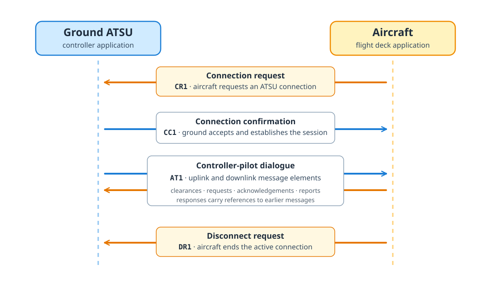

\acr{CPDLC} is structured text communication between controllers and pilots. It carries clearances, requests, acknowledgements, contact instructions, route clearances, and position reports. For data analysis, CPDLC answers a question that surveillance data ([ADS-B](adsb-mode-s-decoding.qmd) and even [ADS-C](adsc-data.qmd)) cannot answer: what did the controllers ask the crew to do, and how did the crew respond?

The operational background is introduced in [communication systems](../background/communication-systems.qmd). This chapter focuses on CPDLC as a data source: message paths, session structure, decoded elements, examples, and caveats.

```{ojs}
//| echo: false
//| code-copy: false
datalink = import(new URL("../../media/js/datalink-ojs.js", document.baseURI).href)
  .then((module) => module.makeDatalinkHelpers({ htl, Inputs }))

decodeArinc622 = datalink.decodeArinc622

function cpdlcHumanLabel(key) {
  const labels = {
    atsu_address: "ATSU address",
    catalog_name: "Element",
    cpdlc_payload: "CPDLC payload",
    elements: "Message elements",
    flight_level: "Flight level",
    msg_id: "Message ID",
    msg_ref: "Message reference",
    icao_unit_name: "ATC unit",
    vhf_khz: "VHF frequency",
    hf_khz: "HF frequency",
    feet_per_minute: "Vertical rate",
    direction_degrees: "Direction",
    ground_speed_knots: "Ground speed"
  };
  if (labels[key]) return labels[key];
  if (/^[ud]M\d/.test(String(key))) return String(key);
  return String(key)
    .replace(/_/g, " ")
    .replace(/\b\w/g, (letter) => letter.toUpperCase())
    .replace(/\bIcao\b/g, "ICAO")
    .replace(/\bEta\b/g, "ETA");
}

function cpdlcFormatNumber(value) {
  return value.toFixed(4).replace(/\.?0+$/, "");
}

function cpdlcLeafParts(key, value) {
  if (value === null) return { value: "—", unit: "" };
  if (typeof value === "boolean") return { value: value ? "yes" : "no", unit: "" };
  if (typeof value !== "number") return { value: String(value), unit: "" };
  if (key === "flight_level") return { value: `FL${value}`, unit: "" };
  if (key === "mach") return { value: (value / 100).toFixed(2), unit: "" };
  if (key === "nm") return { value: String(value), unit: "nm" };
  if (key === "vhf_khz") return { value: (value / 1000).toFixed(3), unit: "MHz" };
  if (key === "hf_khz") return { value: String(value), unit: "kHz" };
  if (key === "knots" || key === "ground_speed_knots") return { value: String(value), unit: "kt" };
  if (key === "feet_per_minute") return { value: String(value), unit: "ft/min" };
  if (key === "celsius") return { value: String(value), unit: "°C" };
  if (key.includes("latitude") || key.includes("longitude") || key.includes("degrees") || key === "true" || key === "magnetic") {
    return { value: Number.isInteger(value) ? String(value) : cpdlcFormatNumber(value), unit: "°" };
  }
  return { value: Number.isInteger(value) ? String(value) : cpdlcFormatNumber(value), unit: "" };
}

function cpdlcPhrase(element) {
  return (element?.fragments ?? []).map((fragment) => {
    if (fragment?.text !== undefined) return fragment.text;
    if (fragment?.value !== undefined) return `[${cpdlcHumanLabel(fragment.value).toLowerCase()}]`;
    return "";
  }).join("").trim();
}

function cpdlcSvgBlock(value, direction = "uplink") {
  const ns = "http://www.w3.org/2000/svg";
  const width = 900;
  const gap = 10;
  const directionLabel = direction === "downlink" ? "downlink" : "uplink";
  const summary = value?.payload?.cpdlc?.[directionLabel];

  const element = (name, attributes = {}, text = null) => {
    const node = document.createElementNS(ns, name);
    for (const [key, attributeValue] of Object.entries(attributes)) node.setAttribute(key, attributeValue);
    if (text !== null) node.textContent = text;
    return node;
  };

  const wrapWords = (text, maxCharacters = 70) => {
    const lines = [];
    for (const word of String(text).split(/\s+/)) {
      const current = lines[lines.length - 1];
      if (!current || current.length + word.length + 1 > maxCharacters) lines.push(word);
      else lines[lines.length - 1] = `${current} ${word}`;
    }
    return lines;
  };

  const elementBodyBlocks = (messageElement) => {
    const body = messageElement.body ?? {};
    const bodyEntries = Object.entries(body);
    if (bodyEntries.length !== 1) return body;
    const [bodyKey, bodyValue] = bodyEntries[0];
    const placeholderKeys = new Set((messageElement.fragments ?? [])
      .map((fragment) => fragment?.value)
      .filter(Boolean));
    if (placeholderKeys.has(bodyKey)) return body;
    if (!bodyValue || typeof bodyValue !== "object" || Array.isArray(bodyValue)) return body;
    return bodyValue;
  };

  const displayPayload = {
    header: summary?.header ?? {},
    elements: (summary?.elements ?? []).map((messageElement) => ({
      __cpdlcElementTag: messageElement.catalog_name ?? `Element ${messageElement.id}`,
      phrase: cpdlcPhrase(messageElement) || "No phrase text",
      ...elementBodyBlocks(messageElement)
    }))
  };

  const isTimestampObject = (nodeValue) => {
    if (!nodeValue || typeof nodeValue !== "object" || Array.isArray(nodeValue)) return false;
    const keys = Object.keys(nodeValue);
    return keys.includes("hour") && keys.includes("minute") && keys.every((key) => ["hour", "minute", "second"].includes(key));
  };

  const gridFieldValue = (label, nodeValue) => {
    if (nodeValue !== null && typeof nodeValue === "object" && !isTimestampObject(nodeValue)) return nodeValue;
    const value = label === "ground_speed_knots" && typeof nodeValue === "number"
      ? { __cpdlcDisplayValue: String(nodeValue), __cpdlcDisplayUnit: "kt" }
      : nodeValue;
    return { value };
  };

  const visibleEntries = (nodeValue) => Object.entries(nodeValue)
    .filter(([key, child]) => key !== "__cpdlcElementTag" && child !== null && child !== undefined)
    .flatMap(([key, child]) => (
      key === "latitude_longitude" && child && typeof child === "object" && !Array.isArray(child)
        ? Object.entries(child).filter(([, value]) => value !== null && value !== undefined)
        : [[key, child]]
    ));

  const arrayEntry = (item, index) => {
    if (item && typeof item === "object" && !Array.isArray(item)) {
      if ("type" in item && "value" in item) {
        const label = item.type === "LatitudeLongitude" ? "" : String(item.type);
        return [label, item.value];
      }
      const entries = Object.entries(item);
      if (entries.length === 1) return entries[0];
      const label = item.name ?? item.catalog_name ?? item.fix ?? item.value ?? `Entry ${index + 1}`;
      return [String(label), item];
    }
    return [String(item), {}];
  };

  const makeTree = (label, nodeValue, depth = 0) => {
    if (nodeValue && typeof nodeValue === "object" && !Array.isArray(nodeValue)) {
      if ("__cpdlcDisplayValue" in nodeValue) {
        return {
          type: "leaf", label, value: nodeValue.__cpdlcDisplayValue,
          unit: nodeValue.__cpdlcDisplayUnit ?? "", valueLines: null, depth, height: 34
        };
      }
      if (isTimestampObject(nodeValue)) {
        const hh = String(nodeValue.hour).padStart(2, "0");
        const mm = String(nodeValue.minute).padStart(2, "0");
        const ss = nodeValue.second === undefined ? "" : `:${String(nodeValue.second).padStart(2, "0")}`;
        return { type: "leaf", label, value: `${hh}:${mm}${ss}`, unit: "UTC", depth, height: 34 };
      }
      if (label === "speed" || label === "rate") {
        const entries = visibleEntries(nodeValue);
        if (entries.length === 1) {
          const [valueKey, value] = entries[0];
          const flattenSpeed = label === "speed" && valueKey === "knots";
          const flattenRate = label === "rate" && valueKey === "feet_per_minute";
          if ((flattenSpeed || flattenRate) && (value === null || typeof value !== "object")) {
            const parts = cpdlcLeafParts(valueKey, value);
            return {
              type: "leaf", label: flattenRate ? valueKey : label,
              value: parts.value, unit: parts.unit, valueLines: null, depth, height: 34
            };
          }
        }
      }
    }
    if (nodeValue === null || typeof nodeValue !== "object") {
      const parts = cpdlcLeafParts(label, nodeValue);
      const valueLines = label === "phrase" || (typeof nodeValue === "string" && nodeValue.length > 60)
        ? wrapWords(parts.value)
        : null;
      return {
        type: "leaf", label, value: parts.value, unit: parts.unit, valueLines, depth,
        height: valueLines ? 34 + valueLines.length * 15 : 34
      };
    }

    const isArray = Array.isArray(nodeValue);
    const isElementArray = isArray && label === "elements";
    const isElementCard = !isArray && nodeValue.__cpdlcElementTag;
    const isRouteClearance = !isArray && label === "route_clearance";
    const gridLabels = new Set(["position_report", "route_information"]);
    const isPayloadGrid = gridLabels.has(String(label));
    const gridWrapChildren = isElementCard || isPayloadGrid || isRouteClearance;
    const rawEntries = isElementArray
      ? nodeValue.map((item, index) => [item.phrase ?? `Element ${index + 1}`, Object.fromEntries(Object.entries(item).filter(([key]) => key !== "phrase"))])
      : isArray
      ? nodeValue.map((item, index) => arrayEntry(item, index))
      : visibleEntries(nodeValue);
    const routeInformationEntry = isRouteClearance
      ? rawEntries.find(([key]) => key === "route_information")
      : null;
    const entries = isRouteClearance
      ? rawEntries.filter(([key]) => key !== "route_information")
      : rawEntries;
    const children = entries.map(([key, child]) => makeTree(
      key,
      gridWrapChildren ? gridFieldValue(key, child) : child,
      depth + 1
    ));
    const fullChildren = routeInformationEntry
      ? [makeTree(routeInformationEntry[0], routeInformationEntry[1], depth + 1)]
      : [];
    const isHeader = label === "header";
    const titleless = label === "" || label === "latitude_longitude";
    const headingLines = isElementCard ? wrapWords(label, 42) : [label];
    const columns = titleless
      ? 1
      : isElementCard || isPayloadGrid || isRouteClearance
      ? Math.min(3, Math.max(1, children.length))
      : isHeader
      ? Math.min(3, Math.max(1, children.length))
      : 1;
    const rows = columns > 1
      ? Array.from({ length: Math.ceil(children.length / columns) }, (_, row) => children.slice(row * columns, (row + 1) * columns))
      : [];
    const childrenHeight = columns > 1
      ? rows.reduce((total, row) => total + Math.max(...row.map((child) => child.height)), 0) + Math.max(0, rows.length - 1) * gap
      : children.reduce((total, child) => total + child.height, 0) + Math.max(0, children.length - 1) * gap;
    const fullChildrenHeight = fullChildren.reduce((total, child) => total + child.height, 0)
      + Math.max(0, fullChildren.length - 1) * gap;
    const titleHeight = titleless ? 12 : isElementCard ? 44 + Math.max(0, headingLines.length - 1) * 16 : 42;
    const separatorHeight = children.length && fullChildren.length ? gap : 0;
    return {
      type: isArray ? "array" : "object", label, count: isArray ? nodeValue.length : null,
      children, fullChildren, columns, depth, headingLines, titleHeight, titleless,
      elementTag: isElementCard ? nodeValue.__cpdlcElementTag : null,
      height: titleHeight + childrenHeight + separatorHeight + fullChildrenHeight + 12
    };
  };

  const drawTree = (tree, x, y, nodeWidth, parent) => {
    if (tree.type === "leaf") {
      parent.append(element("rect", { x, y, width: nodeWidth, height: tree.height, rx: 7, class: "cpdlc-svg-leaf" }));
      parent.append(element("text", { x: x + 12, y: y + (tree.valueLines ? 18 : 22), class: "cpdlc-svg-key" }, cpdlcHumanLabel(tree.label)));
      if (tree.valueLines) {
        const text = element("text", { x: x + 12, y: y + 39, class: "cpdlc-svg-long-value" });
        tree.valueLines.forEach((line, index) => text.append(element("tspan", { x: x + 12, dy: index === 0 ? 0 : 15 }, line)));
        parent.append(text);
      } else {
        const text = element("text", { x: x + nodeWidth - 12, y: y + 22, class: "cpdlc-svg-value", "text-anchor": "end" });
        text.append(element("tspan", {}, tree.value));
        if (tree.unit) {
          const unitText = tree.unit.startsWith("°") ? tree.unit : ` ${tree.unit}`;
          text.append(element("tspan", { class: "cpdlc-svg-dim" }, unitText));
        }
        parent.append(text);
      }
      return;
    }

    parent.append(element("rect", { x, y, width: nodeWidth, height: tree.height, rx: 10, class: `cpdlc-svg-node cpdlc-svg-depth-${Math.min(tree.depth, 3)}` }));
    if (tree.elementTag) {
      const badgeWidth = Math.min(210, Math.max(86, tree.elementTag.length * 7.4 + 20));
      parent.append(element("rect", {
        x: x + nodeWidth - badgeWidth - 12, y: y + 10, width: badgeWidth, height: 24, rx: 8,
        class: "cpdlc-svg-element-badge"
      }));
      parent.append(element("text", {
        x: x + nodeWidth - 22, y: y + 26, class: "cpdlc-svg-element-tag", "text-anchor": "end"
      }, tree.elementTag));
      const headingText = element("text", { x: x + 14, y: y + 25, class: "cpdlc-svg-heading cpdlc-svg-phrase" });
      tree.headingLines.forEach((line, index) => {
        headingText.append(element("tspan", { x: x + 14, dy: index === 0 ? 0 : 16 }, line));
      });
      parent.append(headingText);
    } else if (!tree.titleless) {
      parent.append(element("text", { x: x + 14, y: y + 25, class: "cpdlc-svg-heading" }, cpdlcHumanLabel(tree.label)));
      if (tree.type === "array") parent.append(element("text", { x: x + nodeWidth - 14, y: y + 24, class: "cpdlc-svg-count", "text-anchor": "end" }, `${tree.count} ${tree.count === 1 ? "element" : "elements"}`));
    }

    let childY = y + tree.titleHeight;
    if (tree.columns > 1) {
      const innerWidth = nodeWidth - 24;
      const columnWidth = (innerWidth - gap * (tree.columns - 1)) / tree.columns;
      for (let start = 0; start < tree.children.length; start += tree.columns) {
        const row = tree.children.slice(start, start + tree.columns);
        const rowHeight = Math.max(...row.map((child) => child.height));
        row.forEach((child, column) => drawTree({ ...child, height: rowHeight }, x + 12 + column * (columnWidth + gap), childY, columnWidth, parent));
        childY += rowHeight + gap;
      }
    } else {
      for (const child of tree.children) {
        drawTree(child, x + 12, childY, nodeWidth - 24, parent);
        childY += child.height + gap;
      }
    }
    for (const child of tree.fullChildren ?? []) {
      drawTree(child, x + 12, childY, nodeWidth - 24, parent);
      childY += child.height + gap;
    }
  };

  const payloadTree = makeTree("cpdlc_payload", displayPayload);
  const payloadY = 142;
  const height = payloadY + payloadTree.height + 20;
  const svg = element("svg", {
    viewBox: `0 0 ${width} ${height}`, role: "img",
    "aria-label": `Decoded CPDLC ${directionLabel} message`, class: "cpdlc-json-svg"
  });
  svg.append(element("title", {}, `Decoded CPDLC ${directionLabel} message`));
  svg.append(element("desc", {}, "A nested-box representation of an ARINC 622 envelope and its decoded CPDLC message elements."));
  const style = element("style");
  style.textContent = `
    .cpdlc-json-svg { width: 100%; height: auto; display: block; font-family: IBM Plex Sans, system-ui, sans-serif; }
    .cpdlc-svg-background { fill: var(--bs-body-bg, #fff); stroke: var(--bs-border-color, #d0d7de); }
    .cpdlc-svg-title { fill: var(--bs-body-color, #20242a); font-size: 21px; font-weight: 600; }
    .cpdlc-svg-subtitle, .cpdlc-svg-meta-label, .cpdlc-svg-count { fill: var(--bs-secondary-color, #68717d); }
    .cpdlc-svg-subtitle { font-size: 12px; }
    .cpdlc-svg-meta-card, .cpdlc-svg-leaf { fill: var(--bs-body-bg, #fff); stroke: var(--bs-border-color, #d0d7de); }
    .cpdlc-svg-meta-label { font-size: 10px; font-weight: 600; letter-spacing: .08em; }
    .cpdlc-svg-meta-value { fill: var(--bs-body-color, #20242a); font-size: 15px; font-weight: 600; }
    .cpdlc-svg-node { stroke: var(--bs-border-color, #d0d7de); stroke-width: 1; }
    .cpdlc-svg-depth-0 { fill: color-mix(in srgb, var(--bs-primary, #18bc9c) 10%, var(--bs-body-bg, #fff)); }
    .cpdlc-svg-depth-1 { fill: color-mix(in srgb, var(--bs-info, #3498db) 9%, var(--bs-body-bg, #fff)); }
    .cpdlc-svg-depth-2 { fill: var(--bs-tertiary-bg, #f8f9fa); }
    .cpdlc-svg-depth-3 { fill: var(--bs-secondary-bg, #ecf0f1); }
    .cpdlc-svg-heading { fill: var(--bs-body-color, #20242a); font-size: 14px; font-weight: 600; }
    .cpdlc-svg-phrase { font-size: 13px; }
    .cpdlc-svg-element-badge { fill: var(--bs-body-bg, #fff); stroke: var(--bs-primary, #2c7fb8); stroke-width: 1; }
    .cpdlc-svg-element-tag { fill: var(--bs-primary, #2c7fb8); font: 700 11px ui-monospace, SFMono-Regular, Menlo, Consolas, monospace; }
    .cpdlc-svg-count { font-size: 11px; }
    .cpdlc-svg-key { fill: var(--bs-secondary-color, #68717d); font-size: 12px; }
    .cpdlc-svg-value, .cpdlc-svg-long-value { fill: var(--bs-body-color, #20242a); font: 600 12px ui-monospace, SFMono-Regular, Menlo, Consolas, monospace; }
    .cpdlc-svg-dim { fill: var(--bs-secondary-color, #9aa0a6); font-weight: 400; }
  `;
  svg.append(style);
  svg.append(element("rect", { x: 0.5, y: 0.5, width: width - 1, height: height - 1, rx: 13, class: "cpdlc-svg-background" }));
  svg.append(element("text", { x: 20, y: 30, class: "cpdlc-svg-title" }, `Decoded CPDLC ${directionLabel}`));
  svg.append(element("text", { x: 20, y: 50, class: "cpdlc-svg-subtitle" }, "FANS-1/A over an ARINC 622 envelope"));

  const metadata = [
    ["ATSU address", value?.atsu_address ?? "—"],
    ["Application", value?.imi ?? "—"],
    ["Aircraft registration", value?.registration ?? "—"]
  ];
  const cardGap = 12;
  const cardWidth = (width - 40 - cardGap * 2) / 3;
  metadata.forEach(([label, metadataValue], index) => {
    const x = 20 + index * (cardWidth + cardGap);
    svg.append(element("rect", { x, y: 68, width: cardWidth, height: 56, rx: 8, class: "cpdlc-svg-meta-card" }));
    svg.append(element("text", { x: x + 12, y: 87, class: "cpdlc-svg-meta-label" }, label.toUpperCase()));
    svg.append(element("text", { x: x + 12, y: 109, class: "cpdlc-svg-meta-value" }, String(metadataValue)));
  });
  drawTree(payloadTree, 20, payloadY, width - 40, svg);
  return htl.html`<div class="cpdlc-svg-output">${svg}</div>`;
}

function cpdlcDirectionError(error, direction = "uplink") {
  return datalink.errorBlock(error, { application: "CPDLC", direction });
}

cpdlcFansCatalog = fetch(new URL("../../data/cpdlc_fans.json", document.baseURI).href)
  .then((response) => response.json())

cpdlcAtnCatalog = fetch(new URL("../../data/cpdlc_atn.json", document.baseURI).href)
  .then((response) => response.json())

function cpdlcMessageTable(catalog, direction, standard = "FANS-1/A") {
  const rows = (catalog?.[direction] ?? []).map((entry) => ({
    id: `${direction === "uplink" ? "uM" : "dM"}${entry.id}`,
    name: entry.name,
    template: entry.template ?? "—"
  }));
  return htl.html`<div class="cpdlc-standard-table">
    <p class="cpdlc-standard-count"><strong>${standard} ${direction}</strong>: ${rows.length} message elements</p>
    <table>
      <thead><tr><th>ID</th><th>Name</th><th>Template</th></tr></thead>
      <tbody>${rows.map((row) => htl.html`<tr>
        <td><code>${row.id}</code></td>
        <td><code>${row.name}</code></td>
        <td>${row.template}</td>
      </tr>`)}</tbody>
    </table>
  </div>`;
}

function cpdlcCatalogComparison(fans, atn, direction) {
  const fansById = new Map((fans?.[direction] ?? []).map((entry) => [entry.id, entry]));
  const atnById = new Map((atn?.[direction] ?? []).map((entry) => [entry.id, entry]));
  const ids = [...new Set([...fansById.keys(), ...atnById.keys()])].sort((a, b) => a - b);
  const rows = ids
    .map((id) => ({ id, fans: fansById.get(id), atn: atnById.get(id) }))
    .filter((row) => !row.fans || !row.atn || row.fans.name !== row.atn.name || row.fans.template !== row.atn.template);
  return htl.html`<div class="cpdlc-standard-table cpdlc-standard-table-compact">
    <p class="cpdlc-standard-count"><strong>FANS-1/A and ATN B1 ${direction} differences</strong>: ${rows.length} element IDs differ or exist in only one catalog</p>
    <table>
      <thead><tr><th>ID</th><th>FANS-1/A</th><th>ATN B1</th></tr></thead>
      <tbody>${rows.map((row) => htl.html`<tr>
        <td><code>${direction === "uplink" ? "uM" : "dM"}${row.id}</code></td>
        <td>${row.fans ? htl.html`<code>${row.fans.name}</code><br>${row.fans.template ?? "—"}` : "—"}</td>
        <td>${row.atn ? htl.html`<code>${row.atn.name}</code><br>${row.atn.template ?? "—"}` : "—"}</td>
      </tr>`)}</tbody>
    </table>
  </div>`;
}
```

## Structured pilot/controller communication

\acr{CPDLC} tries to **put structure around controller/pilot communication**. A voice exchange is flexible but difficult to analyse after the fact. A CPDLC message instead chooses one or more standard message elements and fills typed fields: a level, a fix, a frequency, a route clearance, a time, a weather-deviation distance, or a free-text field when the standard phrase set is not enough.

This does **not** make CPDLC **a complete operational truth source**. It records what was transmitted through a datalink path visible to the dataset, not every clearance the aircraft received. But when it is available, it links naturally with trajectories, [ADS-C reports](adsc-data.qmd), flight plans, and the broader datalink context introduced in [Datalink and ACARS message sources](datalink-acars-message-sources.qmd). The operational background remains in [communication systems](../background/communication-systems.qmd).

::: {.callout-warning}
### CPDLC tells us what, not why

A decoded CPDLC exchange tells us what the controller or crew transmitted. **It does not, by itself, tell us why that exchange took place**. The underlying cause may be traffic, weather, workload, a preceding voice conversation, a company instruction, a change in the flight plan, or an operational circumstance that is absent from the dataset. A message that requests a climb does not prove why the climb was requested; a route change does not reveal which constraint caused it. CPDLC should therefore be joined with trajectories, weather, flight plans, surveillance, and other operational sources rather than treated as an explanation on its own.

**The absence of a message is equally ambiguous**: the exchange may have occurred through another channel or may simply be missing from the feed.
:::

CPDLC usually appears through one of two protocol paths:

- **FANS-1/A over ACARS/ARINC 622**: a text envelope with an [ARINC 622](datalink-acars-message-sources.qmd#arinc-622-envelopes) IMI such as `AT1`, plus an aircraft registration and packed CPDLC payload. This is the most common path for oceanic and long-haul traffic, including satellite, HF, and VDL-carried ACARS paths.
- **ATN B1 over VDL Mode 2**: a VDL2/AVLC frame carrying X.25, CLNP, COTP, ULCS, ATN B1, and finally CPDLC. This is the most common path for continental VDL2 environments, especially where ATN B1 CPDLC is deployed, e.g. continental Europe.

The decoded message element may look similar in both cases, but the surrounding evidence is different. With FANS-1/A, the ARINC 622 wrapper tells us about the ATSU address, IMI, registration, and direction. With ATN B1, the lower-layer stack gives aircraft and ground-station addresses, transport/session state, and the ATN application PDU.

FANS-1/A CPDLC uses a connection model around the `AT1` application messages:

{#fig-cpdlc-session-lifecycle}

The control IMIs (`CR1`, `CC1`, `DR1`) explain which facility is connected and when the session begins or ends. The `AT1` messages carry the controller-pilot dialogue. ATN B1 has a different lower-layer session context, but the same analytical point holds: the application message is easiest to interpret when the surrounding connection and transport state are retained.

```{ojs}
//| echo: false
//| code-copy: false
cpdlcSampleButtons = (samples, label) =>
  datalink.sampleButtons(samples, label)
```

## Structure of uplink messages

An uplink is a ground-to-air message. It may instruct the crew to climb, descend, maintain speed, contact a new unit, follow or load a route, squawk a code, report a condition, or answer a pilot request.

The following table shows the FANS-1/A uplink message elements. Each element has a unique ID, a name, and a template for the phrase text. The template shows the standard phrase structure, with placeholders for the typed fields.

```{ojs}
//| echo: false
//| code-copy: false
cpdlcMessageTable(cpdlcFansCatalog, "uplink", "FANS-1/A")
```

The examples below are examples of FANS-1/A uplink messages. *You may also copy and paste your own ARINC 622 envelope into the input field to see how it is interpreted.*

```{ojs}
//| echo: false
//| code-copy: false
cpdlcUplinkSamples = [
  {
    short: "Climb",
    raw: "/REKCAYA.AT1.D-AALOE25F5D2D14CAA103954021EF",
    summary: "Climb to and maintain FL370, followed by a request to report level at FL370.",
  },
  {
    short: "Direct to",
    raw: "/YQXD2YA.AT1.N723AN20D85E9284A906346B20E742",
    summary: "Proceed direct to the fix TAFFY.",
  },
  {
    short: "Contact center",
    raw: "/FUKJJYA.AT1.HL8572242EBD9D52E9C69E0383C08CED",
    summary: "Contact KSFO Center on the HF frequency 10048 kHz.",
  },
  {
    short: "Route clearance",
    raw: "/NYCODYA.AT1.EC-OHYA2978894102991614C206AC004A0009AB4B114002126D5893E982AD1698499069CBAA1294F9D4E4C7358B9600A14CAD1CD6CC1884A956950AB1CD6CC18848F3E9D6931CD6CC1884A7569439F1CD6CC1884A13E9D3B2123D283569B522B4A7D5A915048834D0428B1672087220CE8F1625300D4DC",
    summary: "A route-change clearance to LEBL, with oceanic coordinates, named fixes, airways, and a traffic reason.",
  },
  {
    short: "Deviation",
    raw: "/YQXE2YA.AT1.D-ABYAE19D01C252131511980657F00572",
    summary: "Cleared to deviate up to 20 nm right of route, rejoin by 48°N 50°W, and report back on route.",
  },
  {
    short: "Squawk",
    raw: "/YQXD2YA.AT1.N209UA20BF8ADEF160D167",
    summary: "Set transponder code 6130.",
  },
  {
    short: "Block altitude",
    raw: "/FUKJJYA.AT1.9V-SJHA3D12D87B2A99682D32A9968D7F0",
    summary: "Maintain the block FL370 to FL390 and report reaching that block.",
  }
]
```

```{ojs}
//| echo: false
//| code-copy: false
viewof selectedCpdlcUplinkIndex = cpdlcSampleButtons(cpdlcUplinkSamples, "Select CPDLC uplink sample")
```

```{ojs}
//| echo: false
//| code-copy: false
selectedCpdlcUplink = cpdlcUplinkSamples[selectedCpdlcUplinkIndex] ?? cpdlcUplinkSamples[0]
```

```{ojs}
//| echo: false
//| code-copy: false
htl.html`<p class="cpdlc-sample-note"><strong>${selectedCpdlcUplink.short}.</strong> ${selectedCpdlcUplink.summary}</p>`
```

```{ojs}
//| echo: false
//| code-copy: false
viewof cpdlcUplinkEnvelope = datalink.envelopeInput({
  value: selectedCpdlcUplink.raw,
  ariaLabel: "CPDLC uplink ARINC 622 envelope"
})
```

```{ojs}
//| echo: false
//| code-copy: false
cpdlcUplinkDecoded = decodeArinc622(cpdlcUplinkEnvelope, "uplink")
```

```{ojs}
//| echo: false
//| code-copy: false
cpdlcUplinkDecoded.ok
  ? cpdlcSvgBlock(cpdlcUplinkDecoded.value, "uplink")
  : cpdlcDirectionError(cpdlcUplinkDecoded.error, "uplink")
```

## Structure of downlink messages

A downlink is an air-to-ground message. It may acknowledge an uplink, reject it, request a new clearance, report the aircraft's current state, send a position report, or provide free text. These messages are often the bridge between a trajectory change and the crew's request or response.

The table below shows the FANS-1/A downlink message elements. Each element has a unique ID, a name, and a template for the phrase text. The template shows the standard phrase structure, with placeholders for the typed fields.

```{ojs}
//| echo: false
//| code-copy: false
cpdlcMessageTable(cpdlcFansCatalog, "downlink", "FANS-1/A")
```

The examples below are captured FANS-1/A downlinks. They range from short responses to pilot requests, free text, route data, and a detailed position report.

```{ojs}
//| echo: false
//| code-copy: false
cpdlcDownlinkSamples = [
  {
    short: "WILCO",
    raw: "/USADCXA.AT1.N338RS65975CA30055AD",
    summary: "The crew accepts the referenced instruction.",
  },
  {
    short: "Weather deviation",
    raw: "/SGNGWXA.AT1.9M-MTI22595706C4C0FD29",
    summary: "Request a weather deviation up to 20 nm left of route.",
  },
  {
    short: "Position report",
    raw: "/RGNCAYA.AT1.9V-SMJ2080AE0C3D9F3B950A55A93C02B2A82548B0A7D6026253AB369D51A8469205EC54013DCF8245A7127D400F95408F51",
    summary: "A full position report at FL370, including estimates, speed, temperature, wind, track, heading, and reported-waypoint fields.",
  },
  {
    short: "Compound request",
    raw: "/USADCXA.AT1.N580DTA0C4F0C584AF069CB9F04E501050C12BCC9716982DE9",
    summary: "Request direct to WASKO and a climb to FL350 due to weather, followed by free text.",
  },
  {
    short: "Assigned route",
    raw: "/YEGE2YA.AT1.N618UP2B5DEA8A3BB974E246A106743413B324CCA6C5ACB42A45A54D9CA9262CB9814DA800B2001372962DC004DE000BC00137A003040042549F5A0C409524C59730A0499368458AA41912A498B2E61C732250A91695321901129CB8B3A9E0",
    summary: "The aircraft reports its assigned route from KSDF to PANC, including runway, approach, coordinates, and named fixes.",
  },
  {
    short: "Free text",
    raw: "/FUKJJYA.AT1.B-LXA24C38510C2A1CC8B069209F19057B04B2D",
    summary: "Free-text report: CLEAR OF WX.",
  }
]
```

```{ojs}
//| echo: false
//| code-copy: false
viewof selectedCpdlcDownlinkIndex = cpdlcSampleButtons(cpdlcDownlinkSamples, "Select CPDLC downlink sample")
```

```{ojs}
//| echo: false
//| code-copy: false
selectedCpdlcDownlink = cpdlcDownlinkSamples[selectedCpdlcDownlinkIndex] ?? cpdlcDownlinkSamples[0]
```

```{ojs}
//| echo: false
//| code-copy: false
htl.html`<p class="cpdlc-sample-note"><strong>${selectedCpdlcDownlink.short}.</strong> ${selectedCpdlcDownlink.summary}</p>`
```

```{ojs}
//| echo: false
//| code-copy: false
viewof cpdlcDownlinkEnvelope = datalink.envelopeInput({
  value: selectedCpdlcDownlink.raw,
  ariaLabel: "CPDLC downlink ARINC 622 envelope"
})
```

```{ojs}
//| echo: false
//| code-copy: false
cpdlcDownlinkDecoded = decodeArinc622(cpdlcDownlinkEnvelope, "downlink")
```

```{ojs}
//| echo: false
//| code-copy: false
cpdlcDownlinkDecoded.ok
  ? cpdlcSvgBlock(cpdlcDownlinkDecoded.value, "downlink")
  : cpdlcDirectionError(cpdlcDownlinkDecoded.error, "downlink")
```

## ATN B1 CPDLC specificities

ATN B1 CPDLC is carried through the VDL2/ATN stack rather than through an ACARS/ARINC 622 envelope. The standards catalogs are close but not identical: many message IDs have the same operational meaning, while some names and field types differ. For example, ATN B1 commonly uses `level` terminology where FANS-1/A uses `altitude` in the element name.

```{ojs}
//| echo: false
//| code-copy: false
cpdlcCatalogComparison(cpdlcFansCatalog, cpdlcAtnCatalog, "uplink")
```

```{ojs}
//| echo: false
//| code-copy: false
cpdlcCatalogComparison(cpdlcFansCatalog, cpdlcAtnCatalog, "downlink")
```

## Glossary {.unnumbered}
