<!-- rumdl-disable MD013 MD024 MD033 MD045 MD078 -->
<!-- Quarto tabsets intentionally repeat headings; OJS cells are reactive,
     and figure accessibility text is supplied through fig-alt attributes. -->

<!--
===========================================================================
README — regenerating the plots on this page
===========================================================================

This page has FOUR library tabs per example. Rendering model:
  - Altair  (Python) ........ static code block  + committed SVG
  - seaborn (Python) ........ static code block  + committed SVG/PNG
  - ggplot2 (R) ............. static code block  + committed SVG/PNG
  - Observable Plot (JS) .... live `{ojs}` cell, rendered in-browser

Python and R examples are NON-executable: a normal `quarto render` never
starts Jupyter or R. Only the `{ojs}` cells execute, and OJS is bundled with
Quarto, so CI needs no extra runtimes. The SVG and PNG files below are
committed assets that the page embeds with ``. The configured Altair
SVG embeds IBM Plex Sans; the configured seaborn and ggplot2 examples use
high-resolution PNGs so their typography is browser-independent.

Assets live under media/plots/grammar/{altair,seaborn,ggplot2}/
and reuse the same names across libraries so one image drop fills all tabs.

To regenerate when you edit an example ---------------------------------

All Altair + seaborn figures (one script, isolated env via PEP 723):

    uv run --no-project scripts/generate_grammar_plots.py

All ggplot2 figures (rig-managed R 4.6, prebuilt CRAN binaries):

    Rscript scripts/generate_grammar_plots.R

Observable Plot needs no regeneration — it runs live in the browser from
the bundled dataset fetched by FileAttachment("/data/gapminder.json").

Data --------------------------------------------------------------------

    data/gapminder.csv   - source for the Python/R generators
    data/gapminder.json  - browser-facing copy for OJS (project.resources)

One-time environment setup is documented in HOW-TO.md.
===========================================================================
-->

A 2-dimensional graphical plot can represent up to 5 quantities using the
following attributes:

* position (`x` and `y` on cartesian coordinates, or `r` and `$\theta$` in polar ones)
* size (or area)
* shape
* colour

Most plotting libraries expose a collection of chart-specific functions. For
example, in Matplotlib, a line chart is created with plot(x, y), while scatter
plots, histograms, bar charts, and boxplots each require different functions
with their own parameters. This programming model is fundamentally concerned
with **how to draw a figure**: which function to call, in what order, and with
which graphical options. As visualizations become more sophisticated, the
description of the data and the drawing instructions become increasingly
intertwined.

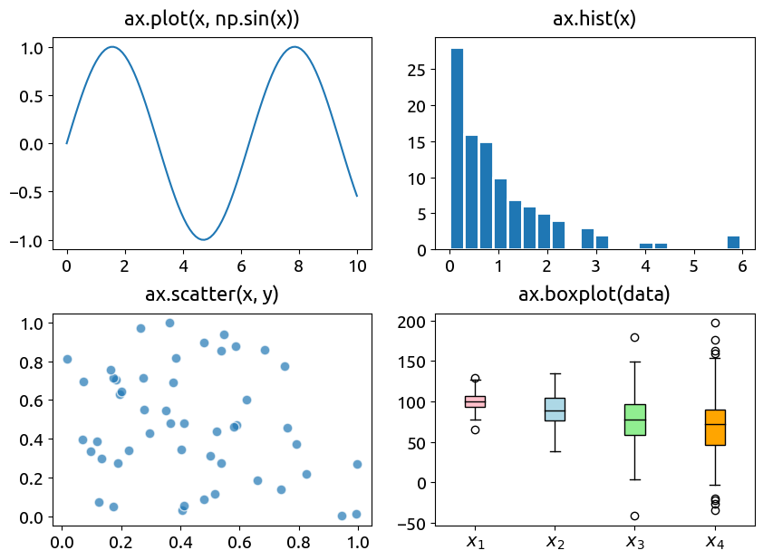{#fig-matplotlib width=500}

The **_Grammar of Graphics_** [@wilkinson05] shifts the focus from how to draw a
visualization to **what to draw**. Instead of describing the sequence of drawing
operations, it **describes the relationships between the data and their visual
representation**. A visualization is expressed as the composition of a few
independent concepts: a dataset, mappings from variables to visual properties,
geometric objects, statistical transformations, scales, coordinate systems, and
styling; which can be combined to produce a wide variety of graphics. By
separating what should be represented from how it is ultimately rendered, this
declarative approach provides a consistent and extensible framework for building
expressive visualizations.

Hadley Wickham later reformulated it as a *layered grammar* [@wickham10], which
became the foundation of `ggplot2` in R [@ggplot2].
[Vega-Lite](https://vega.github.io/vega-lite/) [@satyanarayan_etal17], then
[Altair](https://altair-viz.github.io/) [@vanderplas_etal18] brought the same
approach to the web and Python, after the rise of Jupyter and browser-based
notebooks. [Observable Plot](https://observablehq.com/@observablehq/plot) and
[seaborn](https://seaborn.pydata.org/) occupy neighbouring positions: both
expose semantic mappings between data and visual properties, but make different
compromises between a formal grammar, statistical convenience and direct
control.

In this page, we go through this paradigm with four libraries, using the same dataset and the same intended graphics.

- [Observable Plot](https://observablehq.com/plot/) is a concise JavaScript
library designed for exploratory graphics and explanatory web pages. It works
directly with arrays of objects, typed arrays and iterables. It is the most
natural option here for live browser interaction and Observable-style
narratives, and the rendering engine of this website embeds these graphics
particularly well.

- [Altair](https://altair-viz.github.io/) is a Python interface to Vega-Lite. It
is fully declarative, and its syntax is the closest to the original grammar. It
is particularly suited to concise charts, linked views and selections. It
complements matplotlib, which is better for low-level control of static figures,
and for raster-based output when the amount of data exceeds what vector graphics
can handle. It is designed to work with tidy dataframes, and can also read from
JSON or CSV files.

- [Seaborn](https://seaborn.pydata.org/) is a high-level Python interface built
on matplotlib.  Seaborn is less fully declarative than Altair or ggplot2.
Aggregations and reshaping are often performed first with pandas or Polars,
while fine control returns to the underlying matplotlib `Axes`. That combination
is valuable for static scientific figures: seaborn handles statistical semantics
and visual defaults; matplotlib handles layout, annotation and publication
details.

- [`ggplot2`](https://ggplot2.tidyverse.org/) is the clearest direct
implementation of Wickham's layered grammar. A plot begins with data and
shared aesthetic mappings in `ggplot(data, aes(...))`; layers add geometric
objects and statistical transformations; scales translate data values into
positions, colours or sizes; coordinates, facets and themes complete the
specification. The `+` operator makes this composition visible in the code.

::: {.callout-tip}
### No library is universally best

There are also more libraries out there that may better suit your needs and
tastes. Observable Plot is the shortest path to a reactive browser figure;
Altair and ggplot2 expose the grammar most explicitly; seaborn is often the
fastest route from a Python dataframe to a statistically informed static chart.
The examples below deliberately keep the data and intended graphic constant so
the syntax and design trade-offs remain visible.

:::


## The dataset

Every example reuses the dataset made famous by Hans Rosling: one row per
country and per year, with population, life expectancy and GDP per capita. The
table is [*tidy*](../work/tidy-data.qmd), i.e. one observation per row, one
variable per column, which is the shape every grammar-of-graphics tool expects.
A more recent yearly version of the same comparison is available from [Our World
in Data](https://ourworldindata.org/grapher/life-expectancy-vs-gdp-per-capita).

Rosling's talk *Let my dataset change your mindset* is a particularly clear
demonstration of why encodings and interaction matter. Position communicates
wealth and health, area communicates population, colour identifies regions,
and animation turns year into a visible trajectory rather than another table
column.

<div class="ratio ratio-16x9">
<iframe
  src="https://embed.ted.com/talks/hans_rosling_let_my_dataset_change_your_mindset"
  title="Hans Rosling: Let my dataset change your mindset"
  loading="lazy"
  allow="autoplay; fullscreen; picture-in-picture"
  allowfullscreen>
</iframe>
</div>

If the embedded player is unavailable, [watch the talk directly on
TED](https://www.ted.com/talks/hans_rosling_let_my_dataset_change_your_mindset).


```{ojs}
//| echo: false
//| code-copy: false
Inputs.table(gap, {
  columns: [
    "country",
    "continent",
    "year",
    "life_expectancy",
    "population",
    "gdp_per_capita",
  ],
  header: {
    country: "Country",
    continent: "Continent",
    year: "Year",
    life_expectancy: "Life expectancy",
    population: "Population",
    gdp_per_capita: "GDP per capita",
  },
  format: {
    year: d3.format("d"),
    life_expectancy: (d) => d.toFixed(1),
    population: d3.format(","),
    gdp_per_capita: d3.format(",.0f"),
  },
  width: {
    country: 160,
    continent: 110,
    year: 70,
    life_expectancy: 130,
    population: 120,
    gdp_per_capita: 130,
  },
})
```

The dataset is available on this website, as a [CSV file](/data/gapminder.csv) for Python and R, and as a [JSON file](/data/gapminder.json) for Observable Plot.


::: panel-tabset

### <span class="icon"></span> Observable Plot

The JSON file loaded by the `FileAttachment` helper is a copy of the CSV file, converted to an array of objects. Each object has the same keys as the CSV column names.

```{ojs}
gap = FileAttachment("/data/gapminder.json").json()
g2007 = gap.filter((d) => d.year === 2007)
```


### <span class="icon"></span> Python

Most libraries expect a `pandas.DataFrame` or `polars.DataFrame`, and can handle both formats.

```python
import pandas as pd

gap = pd.read_csv("data/gapminder.csv")
g2007 = gap.query("year == 2007")
```

```python
import polars as pl

gap = pl.read_csv("data/gapminder.csv")
g2007 = gap.filter(pl.col("year") == 2007)
```


### <span class="icon"></span> R

R natively reads CSV files into a `data.frame`, and the `dplyr` package provides a convenient `filter()` function to select rows. The `ggplot2` package is the grammar implementation.

```r
library(dplyr)
library(ggplot2)

gap <- read.csv("data/gapminder.csv")
g2007 <- gap |> filter(year == 2007)
```
:::

The first example translates the idea from Rosling's video into a common graphical specification. We select the 2007 observations from the dataset, then describe the intended graphic through a small set of components:

- the **data** are the rows in `g2007`;
- the **mark** (or geometry) is a point or circle for each country;
- the **channels** (also called aesthetics) map variables to visual properties: GDP per capita to horizontal position, life expectancy to vertical position, continent to colour, and population to size;
- the **scales** translate those values into positions, colours and areas, including a logarithmic scale for GDP per capita;
- the **guides**, axes, legends and tooltips, help the reader decode the graphic.

The four tabs express this same specification in different vocabularies. The result is the same intended graphic in every case: a scatter plot of life expectancy against GDP per capita in 2007, coloured by continent and sized by population.

::: panel-tabset

### <span class="icon"></span> Observable Plot

Observable Plot declares the graphic through a `Plot.plot()` specification.

The `Plot.dot()` **mark** receives the data, while named options map columns to **channels**: `x`, `y`, `fill`, `r` and `tooltip` correspond to horizontal position, vertical position, colour, radius and tooltip for each country.

The surrounding `x`, `y` and `color` options configure **scales** and guides.

```{ojs}
Plot.plot({
  x: { type: "log", label: "GDP per capita" },
  y: { label: "life expectancy" },
  color: { legend: true },
  marks: [
    Plot.dot(g2007, {
      x: "gdp_per_capita",
      y: "life_expectancy",
      fill: "continent",
      r: "population",
      title: (d) => `${d.country}: ${d.population.toLocaleString()} hab.`,
    }),
  ],
})
```

### <span class="icon"></span> Altair

Altair separates the **mark** from its **encodings**.

`alt.Chart(g2007)` supplies the data, `.encode()` maps columns to **channels** (`x`, `y`, `color`, `size`, `tooltip`), and `.mark_circle()` selects the geometric mark. The `:Q` and `:N` suffixes identify quantitative and nominal fields. They are optional when the library can infer the types.

The explicit scale and legend settings complete the specification.

```python
alt.Chart(g2007).encode(
    x=alt.X("gdp_per_capita:Q", scale=alt.Scale(type="log")),
    y="life_expectancy:Q",
    color="continent:N",
    size=alt.Size("population:Q", legend=None),
    tooltip=["country:N", "population:Q"],
).mark_circle()
```

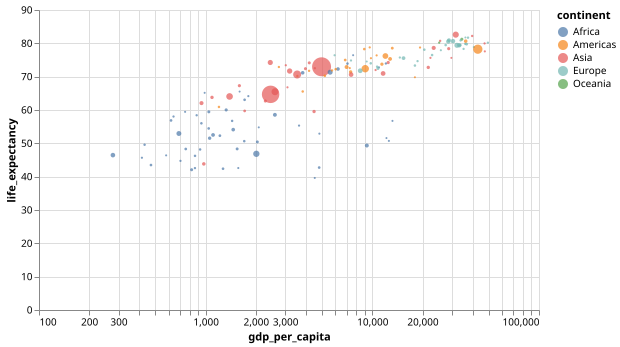{fig-alt="Life expectancy against GDP per capita in 2007; colour represents continent and circle area population."}

### <span class="icon"></span> Seaborn

Seaborn expresses the same **mappings** through a high-level plotting function.
The dataframe is passed to `sns.scatterplot()`, whose `x`, `y`, `hue` and `size` arguments bind columns to **visual channels**.

Seaborn supplies statistical defaults and a colour legend, but the settings for the logarithmic x scale are deferred to the underlying matplotlib `Axes`.

```python
g2007 = gap.query("year == 2007")
fig, ax = plt.subplots(figsize=(6.4, 4.2))
sns.scatterplot(
    data=g2007,
    x="gdp_per_capita",
    y="life_expectancy",
    hue="continent",
    size="population",
    sizes=(20, 500),
    ax=ax,
)
ax.set_xscale("log")
fig
```

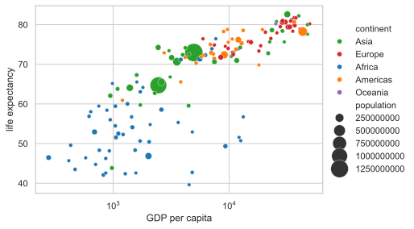{fig-alt="Seaborn scatter plot of life expectancy against GDP per capita in 2007." width=600}

### <span class="icon"></span> ggplot2

In `ggplot2`, the data and shared aesthetic mappings are declared in `ggplot()` and `aes()`. `geom_point()` adds the point layer, while scales and labels refine the specification. The mapping names are familiar, but `colour` and `size` are aesthetics rather than separate plotting arguments, and the `+` operator composes the layers and settings.

```r
library(ggplot2)

ggplot(g2007, aes(
  gdp_per_capita, life_expectancy,
  colour = continent, size = population
)) +
  geom_point(alpha = 0.85) +
  scale_x_log10(labels = label_number(scale_cut = cut_short_scale())) +
  scale_size_continuous(range = c(1.5, 14), guide = "none") +
  labs(x = "GDP per capita", y = "life expectancy")
```

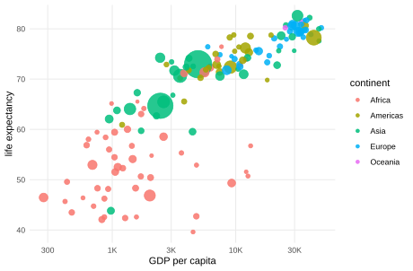{fig-alt="ggplot2 scatter plot of life expectancy against GDP per capita in 2007." width=600}
:::

## Marks and encodings

A chart specification has two essential ingredients:

- a **mark** (here a point): the geometric object used to represent each
  observation;
- **encodings** that map columns of the table to visual channels: GDP per
  capita to `x`, life expectancy to `y`, the continent to `color`, and the
  population to `size`.

Each library then chooses scales, axes and a colour palette on its own:

- Mark names are explicit and barely need comment: `point`, `circle`, `square`,
`tick`, `line`, `area`, `bar`, `box`, ...
- The most common encoding channels are
`x`, `y`, `color`, `opacity`, `shape`, `size`, `facet` and `tooltip`.

A mark can also be placed without mapping data to every channel.

The next example maps the nominal `continent` field to the vertical position and
colour, but deliberately leaves the horizontal position unencoded. Because the
continents are categories, each one receives its own row; repeated country rows
overlap, leaving one coloured square per continent.

The tabs show an important library-specific detail: some APIs need an explicit
constant x position to keep the marks in one column, while Altair can leave the
channel out and centre the marks automatically.

::: panel-tabset
### <span class="icon"></span> Observable Plot

Observable Plot does not infer a useful constant horizontal position when the
`x` channel is omitted here. We therefore map `x` to the constant value `0`
with `x: () => 0`; this keeps every square in one vertical column while `y`
and `fill` carry the meaningful continent mapping.

```{ojs}
Plot.plot({
  marginLeft: 110,
  color: { legend: false },
  marks: [
    Plot.dot(g2007, {
      x: () => 0,
      y: "continent",
      fill: "continent",
      symbol: "square",
      r: 6,
    }),
  ],
})
```

### <span class="icon"></span> Altair

Altair can omit the `x` channel: Vega-Lite places the squares at a common
central position when no horizontal field is encoded. Only `y` and `color` are
needed to show the continent categories and distinguish them visually.

```python
alt.Chart(g2007).encode(
    y=alt.Y("continent:N", title=None),
    color=alt.Color("continent:N", legend=None),
).mark_square(size=100)
```

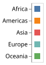{fig-alt="A separate coloured square for each continent."}

### <span class="icon"></span> Seaborn

Seaborn requires a positional variable for this scatter plot, so we add a
constant `x` column. It has no analytical meaning: its only purpose is to
place every country in the same vertical column while `y` and `hue` carry the
meaningful mappings. Countries within each continent then overlap.

```python
fig, ax = plt.subplots(figsize=(5.4, 2.8))
sns.scatterplot(
    data=g2007.assign(x=0),
    x="x",
    y="continent",
    hue="continent",
    marker="s",
    s=110,
    legend=False,
    ax=ax,
)
ax.set(xlabel=None, ylabel=None, xticks=[])
fig
```

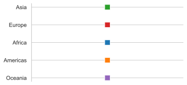{fig-alt="A coloured seaborn square for each continent."}

### <span class="icon"></span> ggplot2

As with seaborn, `ggplot2` needs a positional variable for this point layer.
The constant `x` column is therefore a layout device rather than a data
encoding; `continent` supplies the meaningful vertical and colour mappings.

```r
ggplot(g2007 |> mutate(x = 0), aes(x, continent, colour = continent)) +
  geom_point(shape = 15, size = 6) +
  scale_colour_manual(
    values = setNames(hue_pal()(length(continents)), continents),
    guide = "none"
  ) +
  scale_x_continuous(breaks = NULL) +
  labs(x = NULL, y = NULL)
```

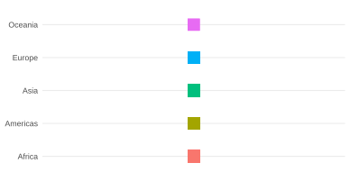{fig-alt="A coloured ggplot2 square for each continent."}
:::

## Scales and data types

A column reaches a channel through a **scale**, and the scale depends on the
**type** of the data. Grammar tools work with four families:

- **Q** *quantitative*: continuous numbers (an altitude, a temperature);
- **N** *nominal*: categories with no order (a country name);
- **O** *ordinal*: ordered categories or ranks;
- **T** *temporal*: dates and times.

When Altair reads a `pandas.DataFrame` it infers these types from the
`dtype`; when the data reaches it as a file or URL, the type must be stated
explicitly (the `:Q`, `:N`, `:T` suffixes below). The same idea shows up in
Observable Plot through typed channels and scale options. The defaults are not
identical across libraries: axis limits, zero baselines, tick formats, colour
palettes and even the interpretation of a column can vary. Explicit scale
settings are therefore important when the goal is a comparable graphic.

The line chart below traces the population of France across the years. It
illustrates three scale decisions:

- a quantitative `x` axis for the year, so gaps between observations preserve their actual size;
- a `zero=False` `y` axis, because a population baseline of 0 (default in some libraries) wastes half the plot;
- an SI **format** (`~s`) that prints `60.4M` instead of `60400000.0`.

::: panel-tabset
### <span class="icon"></span> Observable Plot

Observable Plot treats the numeric `year` values as a continuous horizontal
scale. The `tickFormat: "~s"` delegates SI-style formatting to Observable Plot's
axis formatter.

```{ojs}
fr = gap.filter((d) => d.country === "France")
Plot.plot({
  x: { label: "year" },
  y: { zero: false, tickFormat: "~s", label: "population" },
  marks: [Plot.line(fr, { x: "year", y: "population" })],
})
```

### <span class="icon"></span> Altair

Altair configures the labels on the x scale as integers, a non-zero y scale and
SI tick format explicitly.

```python
fr = gap.query('country == "France"')
alt.Chart(fr).encode(
    x=alt.X("year:Q", title="year", axis=alt.Axis(format="d")),
    y=alt.Y(
        "population:Q",
        scale=alt.Scale(zero=False),
        axis=alt.Axis(format="~s"),
    ),
).mark_line()
```

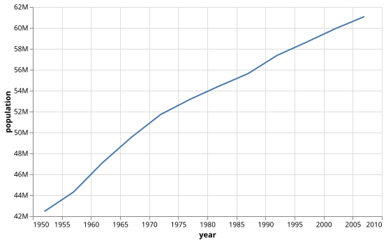{fig-alt="Population of France from 1952 to 2007."}

### <span class="icon"></span> Seaborn

Seaborn delegates the scale implementation to matplotlib. Seaborn draws the
line, while the matplotlib `Axes` controls the y-axis baseline and
`EngFormatter` supplies the SI-style tick labels.

```python
france = gap.query('country == "France"')
fig, ax = plt.subplots(figsize=(6.2, 3.6))
sns.lineplot(data=france, x="year", y="population", ax=ax)
ax.yaxis.set_major_formatter(EngFormatter(sep=""))
fig
```

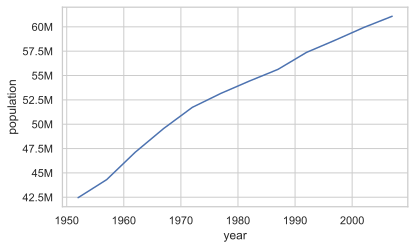{fig-alt="Seaborn line chart of France's population."}

### <span class="icon"></span> ggplot2

`ggplot2` treats the numeric years as a continuous x scale. The y-axis
baseline remains non-zero by default here, and `scale_y_continuous()` receives
a label formatter from the `scales` package to produce SI-style values.

```r
ggplot(france) +
  aes(year, population) +
  geom_line() +
  scale_y_continuous(
    labels = label_number(scale_cut = cut_short_scale())
  ) +
  labs(x = "year", y = "population")
```

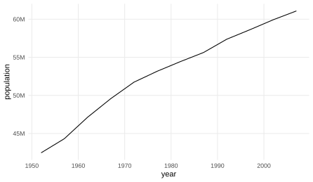{fig-alt="ggplot2 line chart of France's population."}
:::

## Aggregation


Aggregation is the `groupby` of the grammar: rows are partitioned by one or
more keys, and a summary is computed independently for each group. The result
is a smaller table with one row per group, which can then be plotted like any
other data. The diagram below shows the idea for the 2007 data: countries are
grouped by continent, and the GDP-per-capita values in each group are reduced
to one median.


```{ojs}
//| echo: false
//| code-copy: false
//| fig-cap: "Rows are grouped by continent before GDP per capita is summarized with one median per group."
groupbyDiagram = {
  const ns = "http://www.w3.org/2000/svg";
  const width = 900;
  const groups = Array.from(d3.group(g2007, (d) => d.continent).entries())
    .map(([continent, rows]) => ({
      continent,
      rows: rows.slice(0, 2),
      total: rows.length,
      median: d3.median(rows, (d) => d.gdp_per_capita),
    }))
    .sort((a, b) => d3.descending(a.median, b.median));
  const height = 46 + groups.length * 98;
  const element = (name, attributes = {}, text = null) => {
    const node = document.createElementNS(ns, name);
    for (const [key, value] of Object.entries(attributes)) node.setAttribute(key, value);
    if (text !== null) node.textContent = text;
    return node;
  };
  const format = d3.format(",.0f");
  const svg = element("svg", {
    viewBox: `0 0 ${width} ${height}`,
    role: "img",
    "aria-label": "Grouping countries by continent and computing one median GDP per capita per group",
    class: "groupby-svg",
  });
  svg.append(element("title", {}, "Group rows, then summarize each group"));
  svg.append(element("desc", {}, "Country rows are grouped by continent before GDP per capita is reduced to one median value per continent."));
  const style = element("style");
  style.textContent = `
    .groupby-svg { width: 100%; height: auto; display: block; font-family: IBM Plex Sans, system-ui, sans-serif; }
    .groupby-background, .groupby-card { fill: var(--bs-body-bg, #fff); stroke: var(--bs-border-color, #d0d7de); }
    .groupby-background { stroke-width: 1; }
    .groupby-title { fill: var(--bs-body-color, #20242a); font-size: 21px; font-weight: 600; }
    .groupby-subtitle, .groupby-label { fill: var(--bs-secondary-color, #68717d); }
    .groupby-subtitle { font-size: 12px; }
    .groupby-label { font: Inconsolata; font-size: 12px; font-weight: 600; letter-spacing: .08em; }
    .groupby-value { fill: var(--bs-body-color, #20242a); font: 600 12px Inconsolata, SFMono-Regular, Menlo, Consolas, monospace; }
    .groupby-summary-title { fill: var(--bs-secondary-color, #68717d); font-size: 11px; font-weight: 600; }
    .groupby-summary-continent { fill: var(--bs-body-color, #20242a); font-size: 15px; font-weight: 600; }
    .groupby-summary-value { fill: var(--bs-body-color, #20242a); font: 700 18px Inconsolata, SFMono-Regular, Menlo, Consolas, monospace; }
    .groupby-group { fill: color-mix(in srgb, var(--bs-primary, #18bc9c) 10%, var(--bs-body-bg, #fff)); stroke: var(--bs-border-color, #d0d7de); }
    .groupby-ellipsis { fill: var(--bs-secondary-color, #68717d); font-size: 20px; font-weight: 600; }
    .groupby-arrow { stroke: var(--bs-secondary-color, #68717d); stroke-width: 1.5; fill: none; marker-end: url(#groupby-arrowhead); }
  `;
  svg.append(style);
  const defs = element("defs");
  defs.append(element("marker", {
    id: "groupby-arrowhead", markerWidth: 8, markerHeight: 8, refX: 7, refY: 4, orient: "auto"
  }));
  svg.append(defs);
  const marker = svg.querySelector("marker");
  marker.append(element("path", {
    d: "M0,0 L8,4 L0,8 Z",
    fill: "var(--bs-secondary-color, #68717d)",
    stroke: "var(--bs-secondary-color, #68717d)",
  }));
  svg.append(element("rect", { x: 0.5, y: 0.5, width: width - 1, height: height - 1, rx: 13, class: "groupby-background" }));
  svg.append(element("text", { x: 20, y: 30, class: "groupby-label" }, "GROUPED ROWS"));
  svg.append(element("text", { x: 620, y: 30, class: "groupby-summary-title" }, "Summary: Median GDP per capita"));
  groups.forEach(({ continent, rows, total, median }, index) => {
    const y = 46 + index * 98;
    svg.append(element("rect", { x: 20, y, width: 450, height: 76, rx: 9, class: "groupby-group" }));
    svg.append(element("text", { x: 35, y: y + 18, class: "groupby-label" }, `${continent.toUpperCase()} · ${total} ROWS`));
    rows.forEach((row, rowIndex) => {
      const x = 35 + rowIndex * 145;
      svg.append(element("rect", { x, y: y + 27, width: 132, height: 40, rx: 6, class: "groupby-card" }));
      svg.append(element("text", { x: x + 8, y: y + 44, class: "groupby-value" }, row.country));
      svg.append(element("text", { x: x + 8, y: y + 61, class: "groupby-subtitle" }, format(row.gdp_per_capita)));
    });
    if (total > rows.length) {
      svg.append(element("text", { x: 35 + rows.length * 145, y: y + 52, class: "groupby-ellipsis" }, "…"));
    }
    svg.append(element("text", { x: 537, y: y + 27, "text-anchor": "middle", class: "groupby-label" }, "median"));
    svg.append(element("line", { x1: 470, y1: y + 38, x2: 605, y2: y + 38, class: "groupby-arrow" }));
    svg.append(element("rect", { x: 620, y, width: 250, height: 76, rx: 9, class: "groupby-card" }));
    svg.append(element("text", { x: 638, y: y + 38, class: "groupby-summary-continent" }, continent));
    svg.append(element("text", { x: 850, y: y + 62, "text-anchor": "end", class: "groupby-summary-value" }, format(median)));
  });
  return htl.html`<div class="groupby-svg-output">${svg}</div>`;
}
```

Each library can perform this grouping while it builds the chart; a separate
summary table is _usually_ not required.


::: panel-tabset

### <span class="icon"></span> Observable Plot

Observable Plot groups the rows by the `y` channel inside `Plot.groupY()` and
computes the median for the `x` channel. The `sort` option orders those groups
by the resulting median values.

```{ojs}
Plot.plot({
  marginLeft: 110,
  x: { tickFormat: "~s", label: "median GDP per capita" },
  marks: [
    Plot.barX(
      g2007,
      Plot.groupY({ x: "median" }, {
        x: "gdp_per_capita",
        y: "continent",
        fill: "continent",
        sort: { y: "-x" },
      })
    ),
  ],
})
```

### <span class="icon"></span> Altair

Altair performs the aggregation in the channel definition:
`median(gdp_per_capita):Q` means “group by the other encoded fields and compute
the median GDP per capita”. The `Q` annotation is here necessary due to technical limitations of the library which cannot infer the type of the aggregate. Sorting by `-x` then orders the resulting groups by that aggregate.

```python
alt.Chart(g2007).encode(
    x=alt.X(
        "median(gdp_per_capita):Q",
        title="median GDP per capita",
        axis=alt.Axis(format="~s"),
    ),
    y=alt.Y("continent:N", sort="-x"),
    color="continent:N",
).mark_bar()
```

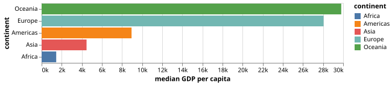{fig-alt="Median GDP per capita by continent in 2007."}

### <span class="icon"></span> Seaborn

Seaborn can compute the bar heights directly from the raw rows with
`estimator="median"`.

However, we need a small `median_order` helper (here with Pandas) to impose a
category order as implemented on the other tabs.

```python
median_order = (
    g2007.groupby("continent")["gdp_per_capita"]
    .median()
    .sort_values()
    .index
)
fig, ax = plt.subplots(figsize=(6.2, 3.8))
sns.barplot(
    data=g2007,
    x="gdp_per_capita",
    y="continent",
    hue="continent",
    estimator="median",
    errorbar=None,
    order=median_order,
    legend=False,
    ax=ax,
)
fig
```

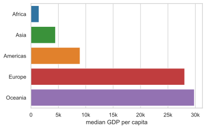{fig-alt="Median GDP per capita by continent rendered with seaborn."}

### <span class="icon"></span> ggplot2

`ggplot2` also performs the aggregation inside the plot. `stat_summary()`
computes one median per continent and draws the bars, while `reorder()` uses
the same median to determine their order.

```r
ggplot(g2007) +
  aes(
    gdp_per_capita,
    reorder(continent, gdp_per_capita, FUN = median),
    fill = continent
  ) +
  stat_summary(fun = median, geom = "bar", orientation = "y") +
  scale_fill_manual(values = palette, guide = "none") +
  scale_x_continuous(labels = label_number(scale_cut = cut_short_scale())) +
  labs(x = "median GDP per capita", y = NULL)
```

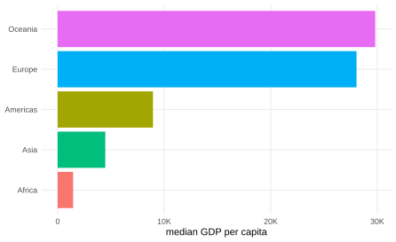{fig-alt="Median GDP per capita by continent rendered with ggplot2."}
:::

Most grammar libraries implement a common set of aggregators, including:

- **count**;
- **sum**, **mean** and **median**;
- **minimum** and **maximum**;
- **variance** and **standard deviation**;
- **quantiles** and other percentile summaries.

The exact names and syntax differ, and some aggregators are not available as
built-in chart operations in every library.

For example, the distinct-count aggregation is a useful example because it
accounts for repeated observations. Every country occurs once per year, but
`distinct(country)` counts it only once. In pandas, the corresponding grouped
operation is `nunique()`; in dplyr, it is `n_distinct()`; Altair exposes
`distinct(...)` directly but not the other plotting libraries.

When an aggregator is not available as a built-in chart operation, the fallback
is always to compute the grouped summary explicitly, and pass the resulting
small table to the chart. The graphic does not depend on whether the
aggregation happened inside or outside the plotting declaration.

::: panel-tabset
### <span class="icon"></span> Observable Plot

Here, we delegate this distinct count to a manual `d3.rollups` operation, the
groupby operation in [d3.js](https://d3js.org/). The grouping key is
`continent`; inside each group, a `Set` removes duplicate country names before
its size is counted. The resulting summary table is then passed to
`Plot.barX()`.

```{ojs}
countriesByContinent = d3.rollups(
  gap,
  (rows) => new Set(rows.map((d) => d.country)).size,
  (d) => d.continent,
).map(([continent, countries]) => ({ continent, countries }))
```

```{ojs}
Plot.plot({
  marginLeft: 110,
  x: { label: "number of countries" },
  marks: [
    Plot.barX(countriesByContinent, {
      x: "countries",
      y: "continent",
      fill: "continent",
    }),
  ],
})
```

### <span class="icon"></span> Altair

Altair exposes distinct count as a built-in aggregate, so the operation stays
inside the encoding: `distinct(country):Q` asks Vega-Lite to count unique
countries within each continent group.

```python
alt.Chart(gap).encode(
    x=alt.X("distinct(country):Q", title="number of countries"),
    y=alt.Y("continent:N", sort="-x"),
    color=alt.Color("continent:N", legend=None),
).mark_bar()
```

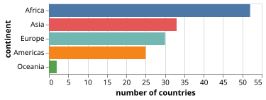{fig-alt="Number of distinct countries per continent."}

### <span class="icon"></span> Seaborn

Seaborn does not provide a distinct-count estimator for `barplot`. We use
pandas to group by continent and call `nunique()`, then give the resulting
summary table to seaborn.

```python
country_count = (
    gap.groupby("continent", as_index=False)
    .agg(countries=("country", "nunique"))
    .sort_values("countries")
)
fig, ax = plt.subplots(figsize=(6.2, 3.8))
sns.barplot(
    data=country_count,
    x="countries",
    y="continent",
    hue="continent",
    legend=False,
    ax=ax,
)
fig
```

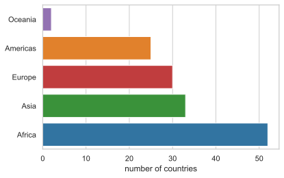{fig-alt="Distinct country count by continent rendered with seaborn."}

### <span class="icon"></span> ggplot2

Here the distinct count is computed explicitly with dplyr's `n_distinct()`
after grouping by continent. The resulting table is then plotted with
`geom_col()`.

```r
country_count <- gap |>
  group_by(continent) |>
  summarise(countries = n_distinct(country), .groups = "drop") |>
  mutate(continent = reorder(continent, countries))

ggplot(country_count) +
  aes(countries, continent, fill = continent) +
  geom_col() +
  scale_fill_manual(values = palette, guide = "none") +
  labs(x = "number of countries", y = NULL)
```

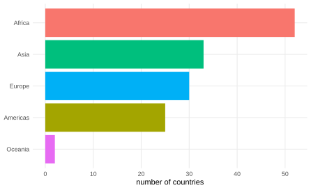{fig-alt="Distinct country count by continent rendered with ggplot2."}
:::

An aggregate may drive any channel. Here bar length encodes mean GDP per
capita while colour encodes its standard deviation. Ordering by bar length
makes comparison easier than alphabetical continent order. The same grouping
produces two summaries, so the libraries must either express both aggregations
inside the chart or create a summary table containing both values. All four
plots use the same quantitative `blues` colour scale, fixed to the domain
0--20,000, so their colours are comparable.

::: panel-tabset
### <span class="icon"></span> Observable Plot

Observable Plot uses `d3.rollups` to create one row per continent with both
the mean and standard deviation. `Plot.barX` then maps `mean` to `x` and
`stdev` to the quantitative colour channel. The explicit blues scheme and fixed domain keep the colour meaning
consistent with the other tabs.

```{ojs}
gdpByContinent = d3.rollups(
  g2007,
  (rows) => ({
    mean: d3.mean(rows, (d) => d.gdp_per_capita),
    stdev: d3.deviation(rows, (d) => d.gdp_per_capita),
  }),
  (d) => d.continent,
).map(([continent, values]) => ({ continent, ...values }))
```

```{ojs}
Plot.plot({
  marginLeft: 110,
  x: { tickFormat: "~s", label: "mean GDP per capita" },
  color: { type: "linear", domain: [0, 20000], scheme: "blues", legend: true },
  marks: [
    Plot.barX(gdpByContinent, {
      x: "mean",
      y: "continent",
      fill: "stdev",
      sort: { y: "-x" },
    }),
  ],
})
```

### <span class="icon"></span> Altair

Altair can express both aggregations directly in the encoding: `mean(...)`
drives the bar length and `stdev(...)` drives its quantitative colour. The
other encoded fields define the continent groups, so no intermediate table is
needed. The colour scheme and domain are set explicitly for comparison.

```python
alt.Chart(g2007).encode(
    x=alt.X(
        "mean(gdp_per_capita):Q",
        axis=alt.Axis(format="~s"),
        title="mean GDP per capita",
    ),
    y=alt.Y("continent:N", sort="-x"),
    color=alt.Color(
        "stdev(gdp_per_capita):Q",
        title="standard deviation",
        scale=alt.Scale(domain=(0, 20_000), scheme="blues"),
    ),
).mark_bar()
```

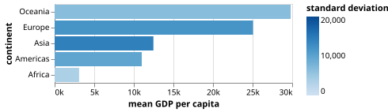{fig-alt="Mean GDP per capita by continent, coloured by standard deviation."}

### <span class="icon"></span> Seaborn

Seaborn's `barplot` can estimate one quantity for the bar height, but it cannot
simultaneously use a second group-level estimate as the colour value.  We
therefore create one summary table with both `mean` and `stdev`, then use a
blues colour map with the same fixed normalization as the other tabs. Many
adjustments are just done with Matplotlib.

```python
dispersion = (
    g2007.groupby("continent", as_index=False)["gdp_per_capita"]
    .agg(mean="mean", stdev="std")
    .sort_values("mean")
)
norm = Normalize(0, 20_000)
cmap = plt.get_cmap("Blues")
palette = {
    row.continent: cmap(norm(row.stdev))
    for row in dispersion.itertuples()
}
fig, ax = plt.subplots(figsize=(6.8, 4.0))
sns.barplot(
    data=dispersion,
    x="mean",
    y="continent",
    hue="continent",
    palette=palette,
    legend=False,
    ax=ax,
)
fig.colorbar(ScalarMappable(norm=norm, cmap=cmap), ax=ax)
fig
```

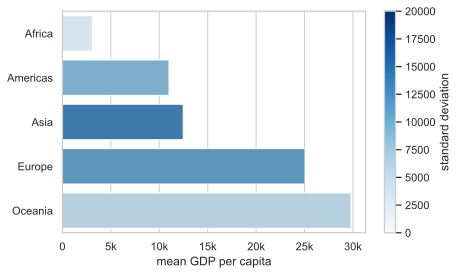{fig-alt="Mean GDP per capita coloured by standard deviation in seaborn."}

### <span class="icon"></span> ggplot2

`ggplot2` needs one row per bar when both position and fill come from group-level
summaries. We therefore use dplyr to compute `mean` and `stdev` together, then
map them to `x` and `fill`. `scale_fill_distiller(palette = "Blues")` applies the same fixed
quantitative colour scale as the other libraries.

```r
dispersion <- g2007 |>
  group_by(continent) |>
  summarise(
    mean = mean(gdp_per_capita),
    stdev = sd(gdp_per_capita),
    .groups = "drop"
  ) |>
  mutate(continent = reorder(continent, mean))

ggplot(dispersion) +
  aes(mean, continent, fill = stdev) +
  geom_col() +
  scale_fill_distiller(
    palette = "Blues",
    direction = 1,
    limits = c(0, 20000)
  ) +
  scale_x_continuous(labels = label_number(scale_cut = cut_short_scale())) +
  labs(
    x = "mean GDP per capita",
    y = NULL,
    fill = "standard deviation"
  )
```

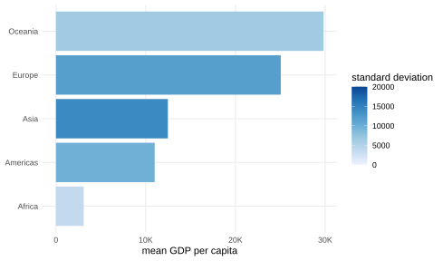{fig-alt="Mean GDP per capita coloured by standard deviation in ggplot2."}
:::

A box-and-whisker plot summarizes the distribution of GDP per capita within
each continent rather than reducing it to one aggregate value:

- the line inside the box is the **median**;
- the box spans the first to the third quartile, or the **interquartile range**;
- the **whiskers** extend to the most extreme values within the usual 1.5-IQR
  rule;
- observations beyond the whiskers are plotted as **outliers**.

The exact defaults for quartiles, whiskers and outlier markers can differ
slightly between libraries, but the four tabs express the same distribution.
Qatar in Asia and Norway in Europe, for instance, stand well above their
neighbours. Altair also attaches the country field as a tooltip to the
underlying observations.

::: panel-tabset
### <span class="icon"></span> Observable Plot

Observable Plot computes one box-and-whisker summary for each `continent`
from the raw `gdp_per_capita` values. `Plot.boxX()` places the quantitative
distribution on the x axis and the continent categories on the y axis.

```{ojs}
Plot.plot({
  marginLeft: 110,
  x: { tickFormat: "~s", label: "GDP per capita" },
  marks: [
    Plot.boxX(g2007, { x: "gdp_per_capita", y: "continent" }),
  ],
})
```

### <span class="icon"></span> Altair

Altair delegates the summary to the `boxplot` mark. The chart groups the raw
observations by continent, computes the quartiles and whiskers, and preserves
the country field for the tooltip.

```python
alt.Chart(g2007).encode(
    x=alt.X("gdp_per_capita:Q", axis=alt.Axis(format="~s"), title="GDP per capita"),
    y="continent:N",
    tooltip="country:N",
).mark_boxplot()
```

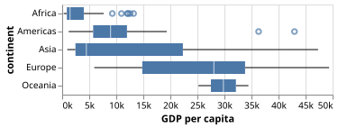{fig-alt="Distribution of GDP per capita by continent in 2007."}

### <span class="icon"></span> Seaborn

Seaborn delegates the statistical computation to matplotlib's boxplot
implementation. The dataframe columns define the values and groups; seaborn
then draws the median, quartiles, whiskers and outlier markers on the axes.

```python
fig, ax = plt.subplots(figsize=(6.4, 4.0))
sns.boxplot(
    data=g2007,
    x="gdp_per_capita",
    y="continent",
    ax=ax,
)
fig
```

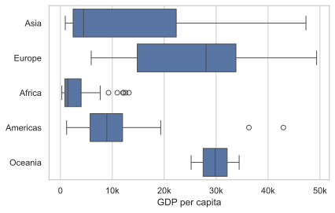{fig-alt="GDP-per-capita box plots by continent rendered with seaborn."}

### <span class="icon"></span> ggplot2

`geom_boxplot()` computes the distribution summary within each continent and
renders it as a layer. As in the other libraries, the raw observations remain
available to the statistical transformation; no summary table is required.

```r
ggplot(g2007) +
  aes(gdp_per_capita, continent) +
  geom_boxplot() +
  scale_x_continuous(labels = label_number(scale_cut = cut_short_scale())) +
  labs(x = "GDP per capita", y = NULL)
```

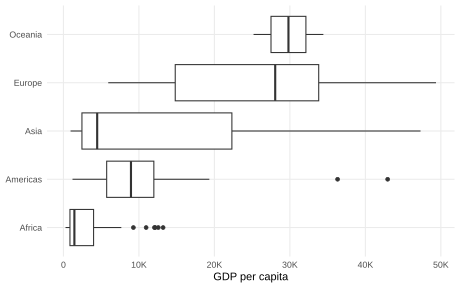{fig-alt="GDP-per-capita box plots by continent rendered with ggplot2."}
:::

## Transformation

Altair and Vega-Lite go beyond marks and encodings by allowing **data
transformations** to remain inside the chart specification. This is a specific
strength of that ecosystem rather than a feature shared uniformly by the four
libraries. It avoids falling back to pandas or dplyr when a chart needs to, for example:

- compute a derived field with `calculate`;
- aggregate a value and join it back to the original rows with `joinaggregate`;
- select observations with `filter`;
- compute ranks or moving values with `window`.

Keeping these operations in the specification **makes the complete data-to-graphic
pipeline declarative and portable**. Observable Plot, seaborn and `ggplot2` can
produce the same graphics, but the corresponding operations generally happen
before plotting, in JavaScript/D3, pandas or dplyr.

For the first example, we want a stacked area chart showing how the population
of Europe's largest countries changes over time. We define a large country as
one whose mean population across all observed years exceeds 50 million, and we
use that same mean to order the stacked areas. This requires a country-level
summary for selection and ordering while retaining the original yearly rows
for the chart.

The transform chain remains part of the Vega-Lite specification.

- `.transform_joinaggregate()` computes each country's mean population and joins it back to every yearly row;
- `.transform_filter()` then keeps only the large European countries. The resulting `mean_pop` field also controls the stacking order.

```python
(
    alt.Chart(gap)
    .encode(
        x=alt.X("year:T", title="year"),
        y=alt.Y("population:Q", axis=alt.Axis(format="~s")),
        color=alt.Color("country:N", title="country"),
        order=alt.Order("mean_pop:Q", sort="descending"),
    )
    .mark_area()
    .transform_joinaggregate(
        mean_pop="mean(population)", groupby=["country"]
    )
    .transform_filter(
        "datum.continent == 'Europe' && datum.mean_pop > 50000000"
    )
    .properties(width=480, height=240)
)
```

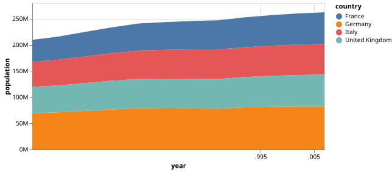{fig-alt="Stacked population history of large European countries."}

::: {.callout-note}
### Preprocessing alternatives

The following tabs reproduce the chart by preparing the data before plotting.
The operations are equivalent, but they do not remain inside the chart grammar.

::: panel-tabset
### <span class="icon"></span> Observable Plot

Observable Plot receives data prepared with ordinary JavaScript and D3. `d3.rollup()` computes the country means, and `filter()` selects the rows before they are passed to `Plot.areaY()`.
```{ojs}
meanPopulation = d3.rollup(
  gap,
  (rows) => d3.mean(rows, (d) => d.population),
  (d) => d.country,
)
largeEurope = gap.filter((d) =>
  d.continent === "Europe" && meanPopulation.get(d.country) > 50000000
)
```

```{ojs}
Plot.plot({
  width: 520,
  y: { tickFormat: "~s", label: "population" },
  color: { legend: true },
  marks: [
    Plot.areaY(largeEurope, {
      x: "year",
      y: "population",
      fill: "country",
      order: (d) => -meanPopulation.get(d.country),
    }),
  ],
})
```

### <span class="icon"></span> Seaborn

The equivalent preparation happens in pandas. `groupby().transform()` broadcasts each country mean back to the original rows, the boolean mask filters them, and `pivot()` reshapes the result for matplotlib's `stackplot()`.
```python
mean_population = gap.groupby("country")["population"].transform("mean")
large_europe = gap[
    (gap["continent"] == "Europe") & (mean_population > 50e6)
]
wide = large_europe.pivot(
    index="year", columns="country", values="population"
)
fig, ax = plt.subplots(figsize=(7.6, 4.2))
ax.stackplot(
    wide.index,
    *[wide[column] for column in wide.columns],
    labels=wide.columns,
    colors=sns.color_palette("tab10", wide.shape[1]),
)
ax.legend(loc="center left", bbox_to_anchor=(1, 0.5))
fig
```

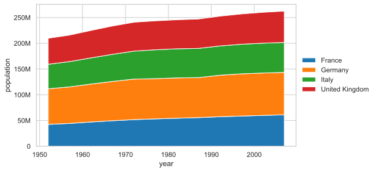{fig-alt="Stacked area chart of large European populations using seaborn's palette."}

### <span class="icon"></span> ggplot2

The equivalent preparation happens in dplyr. `mutate()` creates the grouped mean, `filter()` selects the countries, and `reorder()` fixes the stacking order before the data reaches `ggplot()`.
```r
large_europe <- gap |>
  filter(continent == "Europe") |>
  group_by(country) |>
  mutate(mean_pop = mean(population)) |>
  ungroup() |>
  filter(mean_pop > 5e7) |>
  mutate(country = reorder(country, -mean_pop))

ggplot(large_europe) +
  aes(year, population, fill = country) +
  geom_area() +
  scale_fill_manual(values = hue_pal()(n_distinct(large_europe$country))) +
  scale_y_continuous(labels = label_number(scale_cut = cut_short_scale())) +
  labs(x = "year", y = "population", fill = "country")
```

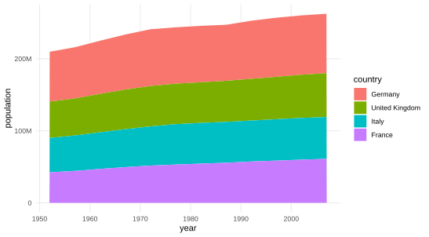{fig-alt="Stacked area chart of large European populations in ggplot2."}
:::
:::


For the second example, we want two side-by-side rankings of the 2007 snapshot:
the ten most populous countries and the ten countries with the highest GDP per
capita. Both views share the same bar and colour encodings, but each must rank
and select countries according to a different variable.

Two `.transform_window()` operations compute population and GDP-per-capita ranks inside the Vega-Lite specification. Each derived view then applies its own `.transform_filter()` to retain the first ten rows, while both reuse the same base chart.
```python
ranking_base = (
    alt.Chart(g2007)
    .mark_bar(size=10)
    .encode(
        y=alt.Y("country:N", sort="-x", title="country"),
        color=alt.Color("continent:N", legend=None),
    )
    .transform_window(
        rank_pop="rank(population)",
        sort=[alt.SortField("population", order="descending")],
    )
    .transform_window(
        rank_gdp="rank(gdp_per_capita)",
        sort=[alt.SortField("gdp_per_capita", order="descending")],
    )
    .properties(width=300, height=220)
)
(
    ranking_base.encode(
        x=alt.X("population:Q", axis=alt.Axis(format="~s"))
    ).transform_filter("datum.rank_pop <= 10")
    | ranking_base.encode(
        x=alt.X(
            "gdp_per_capita:Q",
            axis=alt.Axis(format="~s"),
            title="GDP per capita",
        )
    ).transform_filter("datum.rank_gdp <= 10")
)
```

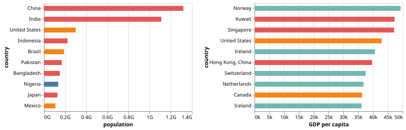{fig-alt="Top ten countries by population and GDP per capita in 2007."}

::: {.callout-note}
### Preprocessing alternatives

In the other libraries, ranking and selection are performed before the chart
is declared.

::: panel-tabset
### <span class="icon"></span> Observable Plot

Here the ranking is ordinary JavaScript preprocessing: each array is copied, sorted and sliced before it is passed to Observable Plot.
```{ojs}
topPopulation = g2007.slice()
  .sort((a, b) => b.population - a.population)
  .slice(0, 10)
topGdp = g2007.slice()
  .sort((a, b) => b.gdp_per_capita - a.gdp_per_capita)
  .slice(0, 10)
```

```{ojs}
htl.html`<div style="display:flex; flex-wrap:wrap; gap:1rem">
  ${Plot.plot({
    width: 340,
    marginLeft: 120,
    x: { tickFormat: "~s", label: "population" },
    marks: [Plot.barX(topPopulation, {
      x: "population", y: "country", fill: "continent",
      sort: { y: "-x" },
    })],
  })}
  ${Plot.plot({
    width: 340,
    marginLeft: 120,
    x: { tickFormat: "~s", label: "GDP per capita" },
    marks: [Plot.barX(topGdp, {
      x: "gdp_per_capita", y: "country", fill: "continent",
      sort: { y: "-x" },
    })],
  })}
</div>`
```

### <span class="icon"></span> Seaborn

Pandas prepares the two top-ten tables with `nlargest()` and `sort_values()` before seaborn draws them on separate matplotlib axes.
```python
top_population = g2007.nlargest(10, "population").sort_values("population")
top_gdp = g2007.nlargest(10, "gdp_per_capita").sort_values("gdp_per_capita")
fig, axes = plt.subplots(1, 2, figsize=(11, 4.8))
sns.barplot(
    data=top_population,
    x="population",
    y="country",
    hue="continent",
    legend=False,
    ax=axes[0],
)
sns.barplot(
    data=top_gdp,
    x="gdp_per_capita",
    y="country",
    hue="continent",
    legend=False,
    ax=axes[1],
)
fig
```

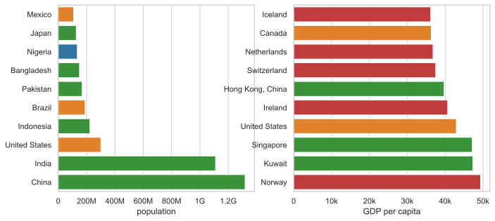{fig-alt="Seaborn top-ten rankings for population and GDP per capita."}

### <span class="icon"></span> ggplot2

Dplyr prepares the two tables with `slice_max()` and `reorder()` before the two ggplot objects are composed with patchwork.
```r
top_pop <- g2007 |>
  slice_max(population, n = 10) |>
  mutate(country = reorder(country, population))

top_gdp <- g2007 |>
  slice_max(gdp_per_capita, n = 10) |>
  mutate(country = reorder(country, gdp_per_capita))

p_top_pop <- ggplot(top_pop) +
  aes(population, country, fill = continent) +
  geom_col() +
  scale_fill_manual(values = palette, guide = "none") +
  scale_x_continuous(labels = label_number(scale_cut = cut_short_scale())) +
  labs(x = "population", y = NULL)

p_top_gdp <- ggplot(top_gdp) +
  aes(gdp_per_capita, country, fill = continent) +
  geom_col() +
  scale_fill_manual(values = palette, guide = "none") +
  scale_x_continuous(labels = label_number(scale_cut = cut_short_scale())) +
  labs(x = "GDP per capita", y = NULL)

p_top_pop | p_top_gdp
```

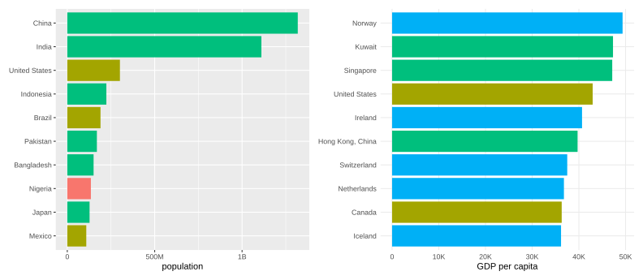{fig-alt="ggplot2 top-ten rankings for population and GDP per capita."}
:::
:::

## Interactivity

Observable Plot is particularly well suited to interactivity on a web page:
controls and charts are reactive, so changing a value immediately recomputes
the marks in the browser. The classic Hans Rosling bubble chart uses this to
turn year into animation rather than another static encoding. Each frame shows
one bubble per country, positioned by GDP per capita and life expectancy,
coloured by continent and sized by population.

The control below starts in play mode (The actual automation is hidden to keep
the page simple). It advances through the observed years, returns to the first
year after the last frame, and can be paused, resumed or moved manually.

```js
viewof year = Inputs.range(
  [1952, 2007],
  { step: 5, value: 2007, label: "year" }
)
```

::: {.scrollable-code}

```{ojs}
//| label: fig-rosling
//| fig-cap: "Animation in the style of Hans Rosling"
{
  const labelledCountries = new Set([
    "China", "India", "United States", "Brazil", "South Africa", "Australia"
  ])
  const currentYear = gap.filter((d) => d.year === year)

  return Plot.plot({
    x: { type: "log", domain: [300, 1e5], label: "GDP per capita" },
    y: { domain: [20, 90], label: "life expectancy" },
    color: { legend: true },
    marks: [
      Plot.dot(currentYear, {
        x: "gdp_per_capita",
        y: "life_expectancy",
        fill: "continent",
        r: "population",
        title: (d) => d.country,
      }),
      Plot.text(
        currentYear.filter((d) => labelledCountries.has(d.country)),
        {
          x: "gdp_per_capita",
          y: "life_expectancy",
          text: "country",
          dy: -10,
          fontSize: 11,
          paintOrder: "stroke",
        }
      ),
      Plot.text([year], {
        text: (d) => String(d),
        frameAnchor: "bottom-right",
        dx: -12,
        dy: -12,
        fontSize: 40,
        fontWeight: 700,
        fill: "currentColor",
        fillOpacity: 0.25,
      }),
    ],
  })
}
```

:::

```{ojs}
//| echo: false
//| code-copy: false
viewof year = {
  const years = Array.from(new Set(gap.map((d) => d.year))).sort(d3.ascending)
  const form = htl.html`<form style="display:flex; align-items:center; gap:.75rem; max-width:600px">
    <button type="button" class="btn btn-primary btn-sm" aria-pressed="true">⏸ Pause</button>
    <input type="range" class="form-range" min="0" max=${years.length - 1} step="1" value="0" aria-label="year">
    <output style="min-width:4ch; font-variant-numeric:tabular-nums"></output>
  </form>`
  const button = form.querySelector("button")
  const slider = form.querySelector("input")
  const output = form.querySelector("output")
  let playing = true

  Object.defineProperty(form, "value", {
    get: () => years[Number(slider.value)],
  })

  const update = () => {
    output.value = years[Number(slider.value)]
  }
  const emit = () => {
    form.dispatchEvent(new Event("input", { bubbles: true }))
  }

  button.addEventListener("click", () => {
    playing = !playing
    button.textContent = playing ? "⏸ Pause" : "▶ Play"
    button.setAttribute("aria-pressed", String(playing))
  })
  slider.addEventListener("input", update)

  update()
  const timer = setInterval(() => {
    if (!playing) return
    slider.value = (Number(slider.value) + 1) % years.length
    update()
    emit()
  }, 800)
  invalidation.then(() => clearInterval(timer))

  return form
}
```

::: {.callout-note}
### Altair in a notebook

Altair can bind a range input to a selection and filter a chart declaratively.
The code below is not executed or rendered on this page; in a notebook, it
produces an interactive slider rather than an automatically playing animation.

::: {.scrollable-code}
```python
year_slider = alt.binding_range(min=1952, max=2007, step=5, name="year:")
year_selector = alt.selection_point(
    name="year_selection",
    fields=["year"],
    bind=year_slider,
    value=[{"year": 2007}],
)
base = (
    alt.Chart(gap)
    .encode(
        x=alt.X(
            "gdp_per_capita:Q",
            scale=alt.Scale(type="log", domain=(300, 1e5)),
            title="GDP per capita",
        ),
        y=alt.Y(
            "life_expectancy:Q",
            scale=alt.Scale(domain=(20, 90)),
            title="life expectancy",
        ),
        color="continent:N",
        size=alt.Size(
            "population:Q",
            scale=alt.Scale(domain=(2e5, 1.4e9), type="log"),
            legend=None,
        ),
        tooltip="country:N",
    )
    .transform_filter(year_selector)
    .properties(width=420, height=320)
)
base.mark_circle().add_params(year_selector)
```
:::

:::

## Configuration

**Every visualisation library must choose defaults**: a typeface, a palette, line
weights, margins, tick positions, grid lines and dozens of other details. These
choices are meant to produce a "reasonable" first figure across many unknown
datasets. They cannot produce the right figure in every situation. A default
records decisions made by a library's authors at a particular time; it is not a
rule that the finished visualisation must follow.

**A useful visualisation therefore requires judgment**. Some decisions can be
checked directly: text must be legible, values must not be clipped, and the
encoding must represent the data faithfully. **Other decisions have no single
objective answer**. Spacing, typographic rhythm, colour intensity and the amount
of visual structure all **involve taste**. Developing that taste means comparing
alternatives, understanding why one feels more coherent in context, and making
those qualitative choices consistently: It also entails to overcome your
own biases. **The library supplies the mechanisms**;
the author remains responsible for the result.

Here, we return to the population figure introduced in [Scales and data
types](#scales-and-data-types). The purpose is now to make that line chart
belong on this page and to show that the same design can be implemented in all
four libraries. We use the following (questionable?) specification:

- a 576 by 346 pixel figure set in IBM Plex Sans;
- a left-aligned title, with no redundant axis titles;
- dark grey tick labels and no axis lines or tick marks;
- a light grey reference grid, every five years on the x-axis and every five
  million people on the y-axis;
- fixed domains of 1949--2011 and 41M--62M, so every implementation frames the
  data identically;
- one green line, with the same colour and apparent weight throughout.

Note that the code here is not meant to be a model of best practice. It is a bit
verbose and sometimes use weird hacks (e.g., the title is drawn separately in
Observable Plot to control its position and typography). The goal is only to
show that **the same design can be implemented in all four libraries**, with
consistent aesthetics and layout across output formats (embedded SVG for
Observable, standalone SVG for Altair and PNG for Seaborn and ggplot2).

::: panel-tabset
### <span class="icon"></span> Observable Plot

::: {.scrollable-code}

```{ojs}
// Choose the reference lines rather than accepting inferred ticks.
xTicks = d3.range(1950, 2011, 5)
yTicks = [45e6, 50e6, 55e6, 60e6]

// Draw the title separately to control its position and typography exactly.
htl.html`<div style="position:relative; width:576px; height:346px;
  background:white; font-family:'IBM Plex Sans'">
  <div style="position:absolute; left:39px; top:0; z-index:1;
    color:#000; font-size:18px; font-weight:600; line-height:22px">
    Population of France
  </div>
  ${Plot.plot({
    // Fix the outer dimensions and the plotting margins.
    width: 576,
    height: 346,
    marginLeft: 39,
    marginRight: 16,
    marginTop: 31,
    marginBottom: 23,

    // Match the book typography and the shared text colour.
    style: {
      background: "white",
      color: "#4D4D4D",
      fontFamily: "IBM Plex Sans",
      fontSize: "12px",
    },

    // Fix both domains, remove axis furniture and show chosen ticks only.
    x: {
      domain: [1949, 2011],
      ticks: xTicks,
      tickFormat: "d",
      tickSize: 0,
      tickPadding: 7,
      label: null,
      line: false,
      nice: false,
    },
    y: {
      domain: [41e6, 62e6],
      ticks: yTicks,
      tickFormat: "~s",
      tickSize: 0,
      tickPadding: 7,
      label: null,
      line: false,
      nice: false,
    },

    // Draw the grid first, then place the data line above it.
    marks: [
      Plot.ruleX(xTicks, { stroke: "#EBEBEB", strokeWidth: 1.43 }),
      Plot.ruleY(yTicks, { stroke: "#EBEBEB", strokeWidth: 1.43 }),
      Plot.line(fr, {
        x: "year",
        y: "population",
        stroke: "#008f6b",
        strokeWidth: 2.84,
      }),
    ],
  })}
</div>`
```

:::

### <span class="icon"></span> Altair

::: {.scrollable-code}

```python
alt.Chart(fr).encode(
    # Keep years quantitative and fix the horizontal frame and tick sequence.
    x=alt.X(
        "year:Q",
        scale=alt.Scale(domain=(1949, 2011), nice=False),
        axis=alt.Axis(
            title=None,
            values=list(range(1950, 2011, 5)),
            format="d",
            # Match the shared grid and remove the domain and tick marks.
            grid=True,
            gridColor="#EBEBEB",
            gridWidth=1.43,
            domain=False,
            ticks=False,
            # Match the shared typography and keep every five-year label.
            labelColor="#4D4D4D",
            labelFont="IBM Plex Sans",
            labelFontSize=12,
            labelFlush=True,
            labelOverlap=False,
            labelPadding=7,
        ),
    ),
    # Apply the same decisions independently to the population scale.
    y=alt.Y(
        "population:Q",
        scale=alt.Scale(domain=(41e6, 62e6), nice=False),
        axis=alt.Axis(
            title=None,
            values=[45e6, 50e6, 55e6, 60e6],
            format="~s",
            grid=True,
            gridColor="#EBEBEB",
            gridWidth=1.43,
            domain=False,
            ticks=False,
            labelColor="#4D4D4D",
            labelFont="IBM Plex Sans",
            labelFontSize=12,
            labelPadding=0,
        ),
    ),
).mark_line(
    # Fix the colour and apparent line weight.
    color="#008f6b",
    strokeWidth=2.84,
).properties(
    # Make width and height include axes, labels and padding.
    title="Population of France",
    width=576,
    height=346,
    autosize=alt.AutoSizeParams(type="fit", contains="padding"),
).configure_title(
    # Reproduce the title alignment and typography.
    anchor="start",
    color="#000000",
    font="IBM Plex Sans",
    fontSize=18,
    fontWeight=600,
    dx=33.4,
    offset=8,
).configure_view(
    # Remove the default border around the plotting area.
    stroke=None,
)
```

:::

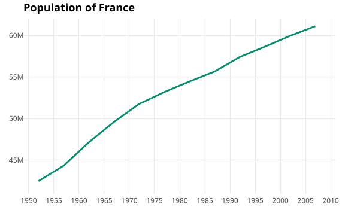{fig-alt="Population of France, styled consistently in Altair."}

### <span class="icon"></span> Seaborn

::: {.scrollable-code}

```python
from matplotlib import font_manager

# Register the book fonts before matplotlib resolves family names.
font_manager.fontManager.addfont("media/fonts/IBMPlexSans-Regular.ttf")
font_manager.fontManager.addfont("media/fonts/IBMPlexSans-SemiBold.ttf")

# Apply typography and text colours locally rather than changing every figure.
with plt.rc_context({
    "font.family": "IBM Plex Sans",
    "font.size": 8.8,
    "axes.titlesize": 13.2,
    "axes.titleweight": 600,
    "axes.titlecolor": "#000000",
    "xtick.color": "#4D4D4D",
    "ytick.color": "#4D4D4D",
}):
    # Fix the outer size and the exact plotting rectangle within it.
    fig, ax = plt.subplots(figsize=(6, 3.6))
    fig.subplots_adjust(
        left=29.25 / 432,
        right=420 / 432,
        bottom=(259.2 - 242.25) / 259.2,
        top=(259.2 - 23.25) / 259.2,
    )

    # Match the colour, weight and square ends of the shared line.
    sns.lineplot(
        data=france,
        x="year",
        y="population",
        color="#008f6b",
        linewidth=2.13,
        solid_capstyle="butt",
        ax=ax,
    )

    # Fix the title, domains and reference values on both axes.
    ax.set_title("Population of France", loc="left", pad=8.5)
    ax.set(
        xlabel=None,
        ylabel=None,
        xlim=(1949, 2011),
        ylim=(41e6, 62e6),
        xticks=range(1950, 2011, 5),
        yticks=[45e6, 50e6, 55e6, 60e6],
    )
    ax.yaxis.set_major_formatter(EngFormatter(sep=""))

    # Match the grid, remove tick marks, and discard all axis spines.
    ax.grid(True, color="#EBEBEB", linewidth=1.07)
    for gridline in (*ax.get_xgridlines(), *ax.get_ygridlines()):
        gridline.set_solid_capstyle("butt")
    ax.tick_params(axis="both", length=0, labelsize=8.8, pad=5)
    sns.despine(ax=ax, left=True, bottom=True)
fig
```

:::

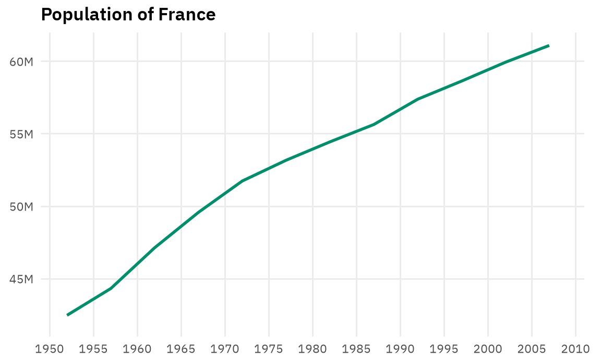{fig-alt="Population of France, styled consistently in seaborn." width=576}

### <span class="icon"></span> ggplot2

::: {.scrollable-code}

```r
# Register the same local typeface used by the book.
systemfonts::register_font(
  "IBM Plex Sans",
  plain = "media/fonts/IBMPlexSans-Regular.ttf",
  bold = "media/fonts/IBMPlexSans-SemiBold.ttf"
)

ggplot(france, aes(year, population)) +
  # Fix the line colour and apparent weight.
  geom_line(colour = "#008f6b", linewidth = 1) +
  # Choose the horizontal frame and place a reference every five years.
  scale_x_continuous(
    breaks = seq(1950, 2010, by = 5),
    limits = c(1949, 2011),
    expand = expansion(mult = 0)
  ) +
  # Choose the population frame, labels and horizontal references.
  scale_y_continuous(
    breaks = c(45e6, 50e6, 55e6, 60e6),
    limits = c(41e6, 62e6),
    labels = label_number(scale_cut = cut_short_scale()),
    expand = expansion(mult = 0)
  ) +
  # Add the title and remove the redundant axis titles.
  labs(title = "Population of France", x = NULL, y = NULL) +
  # Start from a quiet grid-based theme with the book typeface.
  theme_minimal(base_family = "IBM Plex Sans", base_size = 11) +
  theme(
    # Match the title and tick-label typography.
    plot.title = element_text(
      face = "bold", size = 13.2, hjust = 0, margin = margin(b = 6)
    ),
    axis.text = element_text(colour = "#4D4D4D", size = 8.8),
    # Keep major references only; remove tick marks and minor grid lines.
    axis.ticks = element_blank(),
    panel.grid.major = element_line(colour = "#EBEBEB", linewidth = 0.5),
    panel.grid.minor = element_blank(),
    # Match the plotting rectangle within the fixed output size.
    plot.margin = margin(t = 5.29, r = 12.02, b = 4.03, l = 6.64)
  )
```

:::

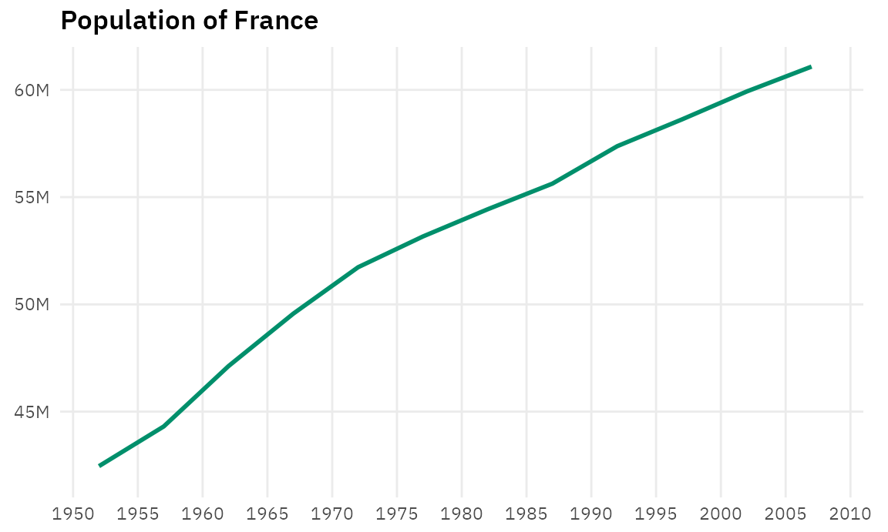{fig-alt="Population of France, styled consistently in ggplot2." width=576}
:::

::: {.callout-note}
### Going further

- Leland Wilkinson, *The Grammar of Graphics*, Springer, 2005 [@wilkinson05]
- Hadley Wickham, *A layered grammar of graphics*, *Journal of Computational
  and Graphical Statistics*, 2010 [@wickham10].
- Claus O. Wilke, *Fundamentals of Data Visualization*,
  <https://clauswilke.com/dataviz/>, 2019 [@wilke2019]].
:::
